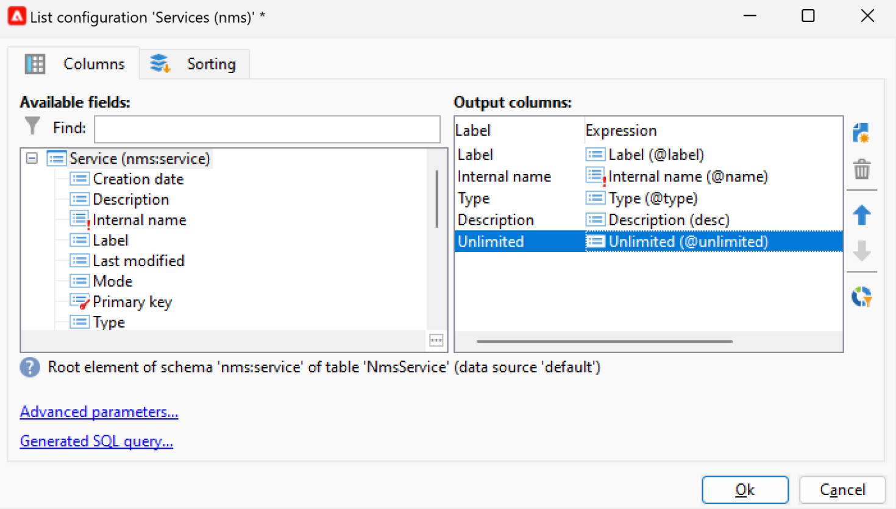

# Campaign使用者介面設定 {#ui-settings}

## 預設單位 {#default-units}

在Adobe Campaign中，對於表示持續時間的欄位（例如資源的有效期、任務的核准期限等），值可以以下列方式表示 **單位**:

* **[!UICONTROL s]** 秒
* **[!UICONTROL mn]** 幾分鐘
* **[!UICONTROL h]** 小時
* **[!UICONTROL d]** 天

## 自訂促銷活動總管{#customize-explorer}

您可以將資料夾新增至Campaign Explorer、建立檢視並指派權限。

了解如何在 [本頁](../audiences/folders-and-views.md)

## 管理和自訂清單{#customize-lists}

在Campaign用戶端主控台中，資料會顯示在清單中。 您可以根據自己的需求調整這些清單。 例如，您可以新增欄、篩選資料、計算記錄、儲存及共用您的設定。

此外，您可以建立和儲存篩選器。  進一步了解中的篩選器 [本頁](../audiences/create-filters.md).

### 記錄數 {#number-of-records}

根據預設，Adobe Campaign 會載入清單中的前 200 條記錄。這意味著將不一定顯示您正在檢視之表格中的所有記錄。您可以統計清單中的記錄計數，並載入更多記錄。

在清單畫面右下角，**counter** 會顯示已載入的記錄數，以及資料庫中的記錄總數 (套用任何篩選器之後)：

如果出現問號而非右側的數字，例如 `240/?`，按一下計數器以啟動計算。

要載入並顯示其他記錄，請按一下 **[!UICONTROL Continue loading]**. 預設會載入200筆記錄。 若要變更要載入的預設記錄數，請使用 **[!UICONTROL Configure list]** 表徵圖。 在清單配置窗口中，按一下 **[!UICONTROL Advanced parameters]** （左下），並變更要擷取的行數。

若要載入所有記錄，請以滑鼠右鍵按一下清單，然後選取 **[!UICONTROL Load all]**。

>[!CAUTION]
>
>當清單包含大量記錄時，完全載入可能需要一些時間。

### 新增和移除欄 {#add-columns}

對於每個清單，內建的列配置可以適合顯示更多資訊或隱藏未使用的列。

在記錄的詳細資訊中顯示資料時，按一下右鍵欄位並選擇 **[!UICONTROL Add in the list]**.

該欄會新增至現有欄的右邊。

您也可以使用清單配置螢幕來添加和刪除列：

1. 在記錄清單中，按一下 **[!UICONTROL Configure list]** 圖示。
1. 連按兩下要在 **[!UICONTROL Available fields]** 清單：它們會新增至 **[!UICONTROL Output columns]** 清單。

   

   >[!NOTE]
   >
   >預設情況下，不會顯示進階欄位。若要顯示，請按一下 **顯示進階欄位** 表徵圖，位於可用欄位清單的右下部。
   >
   >欄位採用特定圖示加以標識：SQL 欄位、連結的資料表、計算欄位等。可用欄位的清單下將顯示所選取的每個欄位的說明。

1. 使用向上/向下箭頭來修改 **顯示順序**.

1. 按一下 **[!UICONTROL OK]** 確認設定並顯示結果。

如果需要移除欄，請選取該欄，然後按一下 **垃圾** 表徵圖。

您可以使用 **[!UICONTROL Distribution of values]** 表徵圖，查看當前資料夾中選定欄位的值的重新分區。

### 新建欄 {#create-a-new-column}

您可以建立新的欄來顯示清單中的其他欄位。

要建立列，請執行以下步驟：

1. 在記錄清單中，按一下 **[!UICONTROL Configure list]** 圖示。
1. 按一下 **[!UICONTROL Add]** 圖示來顯示清單中的新欄位。
1. 設定欄位以新增至欄。

### 在子資料夾中顯示資料 {#display-sub-folders-records}

清單可顯示：

* 所選資料夾中包含的所有記錄（預設）
* 所選資料夾及其子資料夾中包含的所有記錄

要從一個顯示模式切換到另一個顯示模式，請按一下 **[!UICONTROL Display sub-levels]** （在Campaign工具列中）。

### 儲存清單設定 {#saving-a-list-configuration}

清單設定是針對每個使用者在本機定義。 清除本機快取時，會停用本機設定。

預設情況下，設定參數將應用於具有相應資料夾類型的所有清單。 修改資料夾中收件者清單的顯示方式時，此設定會套用至所有其他收件者資料夾。

您可以儲存多個要套用至相同類型之不同資料夾的設定。 該設定會隨包含資料的資料夾屬性一起儲存，並可重新套用。

要保存清單配置以便其可重複使用，請執行以下步驟：

1. 在瀏覽器中，以滑鼠右鍵按一下包含顯示資料的資料夾。
1. 選取 **[!UICONTROL Properties]**。
1. 按一下 **[!UICONTROL Advanced settings]** ，然後在 **[!UICONTROL Configuration]** 欄位。
1. 按一下 **[!UICONTROL OK]** 然後按一下 **[!UICONTROL Save]**.

然後，您可以將此配置應用於同類型的任何其他資料夾。 進一步了解資料夾，位於 [本頁](../audiences/folders-and-views.md).

### 匯出清單 {#exporting-a-list}

若要匯出清單資料，您必須使用匯出精靈。若要使用此精靈，請從清單選取要匯出的元素，以滑鼠右鍵按一下後選取 **[!UICONTROL Export...]**。

<!--The use of the import and export functions is explained in [Generic imports and exports](../../platform/using/about-generic-imports-exports.md).-->

>[!CAUTION]
>
>不可使用 [複製/貼上] 功能匯出清單中的元素。

### 排序清單 {#sorting-a-list}

清單中可包含大量資料。您可以對這些資料進行排序或套用簡單、進階篩選器。透過排序，您設定以遞增或遞減順序顯示資料。透過篩選，您可以定義和合併準則以僅顯示所選資料。

按一下欄標題，套用遞增或遞減排序，或是取消資料排序。作用中的排序狀態和排序順序會在欄標籤前方以藍色箭頭表示。欄位標籤前方的紅色破折號表示該排序已套用至資料庫中索引的資料。此排序方法用於最佳化排序工作。

您也可以設定排序或合併排序準則。要執行此操作，請遵循下列步驟：

1. **[!UICONTROL Configure list]** 清單右邊。
1. 在清單設定視窗中，按一下 **[!UICONTROL Sorting]** 索引標籤。
1. 選取要排序的欄位以及排序方向 (遞增或遞減)。
1. 排序優先順序透過排序欄的順序定義。若要變更優先順序，請使用適當的圖示來變更欄的順序。

   排序優先順序不會影響清單中欄的顯示情況。

1. 按一下 **[!UICONTROL Ok]** 確認此設定，並在清單中呈現結果。

## 使用列舉 {#enumerations}

列舉（也稱為「分項清單」）是系統建議填入欄位的值清單。 使用枚舉來標準化這些欄位的值，幫助輸入資料或在查詢內使用。

值清單會顯示為下拉式清單，您可從中選取要在欄位中輸入的值。 下拉式清單也會啟用預測性輸入：輸入第一個字母，應用程式填入其餘字母。

會定義此類型欄位的值，並透過 **[!UICONTROL Administration > Platform > Enumerations]** 樹的節點。

### 枚舉類型 {#types-of-enum}

枚舉儲存在 **[!UICONTROL Administration > Platform > Enumerations]** 檔案總管的資料夾。

可以是：開啟、系統、表情符號或關閉。

* 安 **開啟** 分項清單可讓使用者根據這項分項清單，直接在欄位中新增值。
* A **已關閉** 枚舉具有固定的值清單，只能從 **[!UICONTROL Administration > Platform > Enumerations]** 檔案總管的資料夾。
* 安 **表情符號** 枚舉用於更新表情符號清單。 了解更多
* A **系統** 枚舉與系統欄位相關聯，且具有內部名稱。

針對 **開啟** 和 **已關閉** 列舉，可使用特定選項：

* **簡單枚舉** 是預設的標準類型。
* **別名清除** 枚舉用於協調儲存在資料庫中的枚舉值。 [了解更多](#alias-cleansing)
* **保留為綁定** 是一個選項，可讓您將多維資料集值連結到此枚舉。 [了解更多](../reporting/gs-cubes.md)

### 別名清除 {#alias-cleansing}

在列舉欄位中，您可以選取值，或輸入下拉式清單中無法使用的自訂值。 可將自訂值新增至現有的列舉值，作為新的值 — 在此例中， **[!UICONTROL Open]** 選項。 可以使用別名清除功能來清除這些自訂值。 例如，如果使用者輸入 `Adob` 而非 `Adobe`，別名清除程式可以自動以正確的詞取代。

>[!CAUTION]
>
>資料清理是影響資料庫中資料的關鍵過程。 Adobe Campaign會執行大量資料更新，而可能導致某些值遭刪除。 因此，此操作將保留給專家用戶。

啟用 **[!UICONTROL Alias cleansing]** 選項來對分項清單使用資料清除功能。 選取此選項時， **[!UICONTROL Alias]** 頁簽。

當用戶輸入別名清除枚舉中不存在的值時，該值將添加到 **值** 清單。 您可以 [從這些值建立別名](#convert-to-alias)，或 [從頭建立新別名](#create-alias).

#### 建立別名{#create-alias}

要建立別名，請執行以下步驟：

1. 按一下 **[!UICONTROL Add]** 按鈕 **[!UICONTROL Alias]** 標籤。
1. 輸入要轉換的別名，然後在下拉式清單中選取要套用的值。

   

1. 按一下 **[!UICONTROL Ok]** 並確認。

1. 儲存您的變更。值的取代由 **別名清除** 每晚執行的工作流程。 請參閱 [執行資料清理](#running-data-cleansing).

針對此列舉的所有欄位，當使用者輸入值時 **Adobe** 在「公司」欄位(在Adobe Campaign主控台中，在Web表單中)中，會自動取代為值 **Adobe**.

#### 將錯誤的值轉換為別名{#convert-to-alias}

您也可以將現有的分項清單值轉換為別名。 若要執行此動作：

1. 在枚舉的值清單中，按一下右鍵並瀏覽到 **[!UICONTROL Actions... > Convert values into aliases...]**.

   

1. 選擇要以別名轉換的值，然後按一下 **[!UICONTROL Next]**.
1. 按一下 **[!UICONTROL Start]** 來執行轉換。

   執行完成後，別名會新增至清單，位於 **別名** 標籤。 您可以關聯正確值以替換錯誤的條目。 若要執行此動作：

1. 選取要清除的值。
1. 按一下 **細節……** 按鈕。
1. 在下拉式清單中選取新值。

   

>[!NOTE]
>
>您可以在 **[!UICONTROL Hits]** 欄中 **[!UICONTROL Alias]** 頁簽。 它可顯示輸入此值的次數。  [了解更多資訊](#calculate-entry-occurrences)。

#### 執行資料清理 {#running-data-cleansing}

資料清除由 **[!UICONTROL Alias cleansing]** 技術工作流程。 預設會每天執行。

清除也可透過 **[!UICONTROL Cleanse values...]** 連結。

此 **[!UICONTROL Advanced parameters...]** 連結可讓您設定從開始將收集的值納入考量的日期。

按一下 **[!UICONTROL Start]** 按鈕來執行資料清除。

##### 監視發生次數 {#calculate-entry-occurrences}

此 **[!UICONTROL Alias]** 枚舉的子頁簽可以顯示輸入的所有值中別名的發生次數。 此資訊為預估值，將顯示在 **[!UICONTROL Hits]** 欄。

>[!CAUTION]
>
>計算別名條目發生次數可能需要很長時間。

您可以透過 **[!UICONTROL Cleanse values...]** 連結。 若要這麼做，請按一下 **[!UICONTROL Advanced parameters...]** 連結並選取選項。

* **[!UICONTROL Update the number of alias hits]**:這可讓您根據輸入的日期更新已計算的點擊。
* **[!UICONTROL Recalculate the number of alias hits from the start]**:可讓您在整個Adobe Campaign平台上執行計算。

您也可以建立專用的工作流程，以便計算在指定期間自動執行，例如每週執行一次。

若要這麼做，請建立 **[!UICONTROL Alias cleansing]** 工作流程，請變更排程器，並在 **[!UICONTROL Enumeration value cleansing]** 活動：

* **-updateHits** 若要更新別名點擊數，
* **-updateHits:full** 重新計算所有別名點擊。
