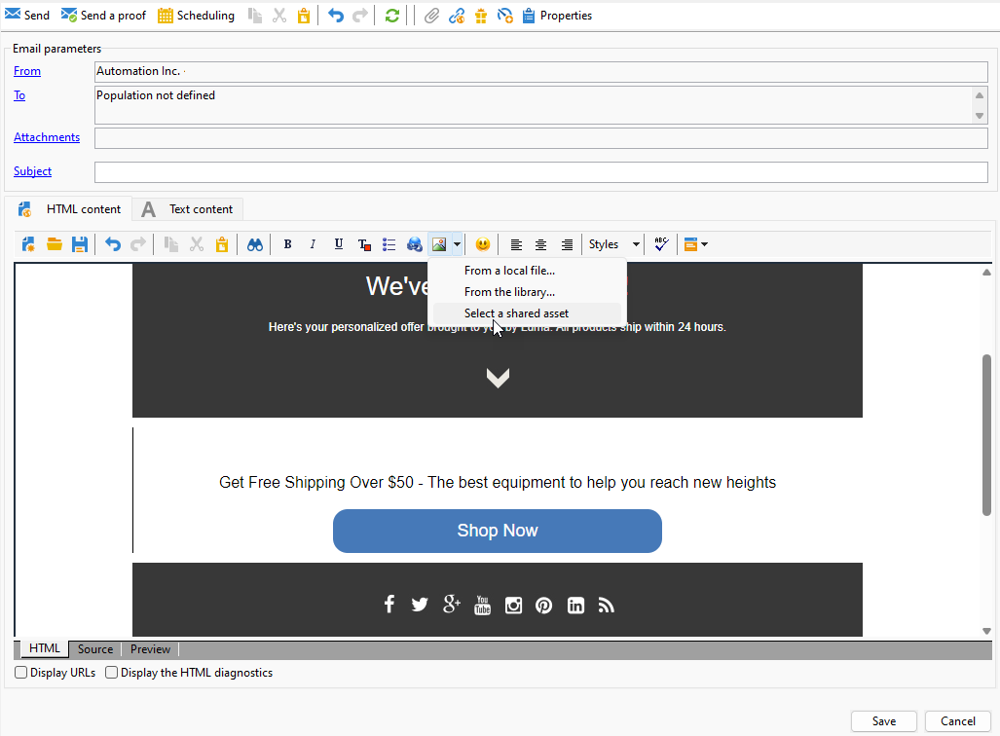
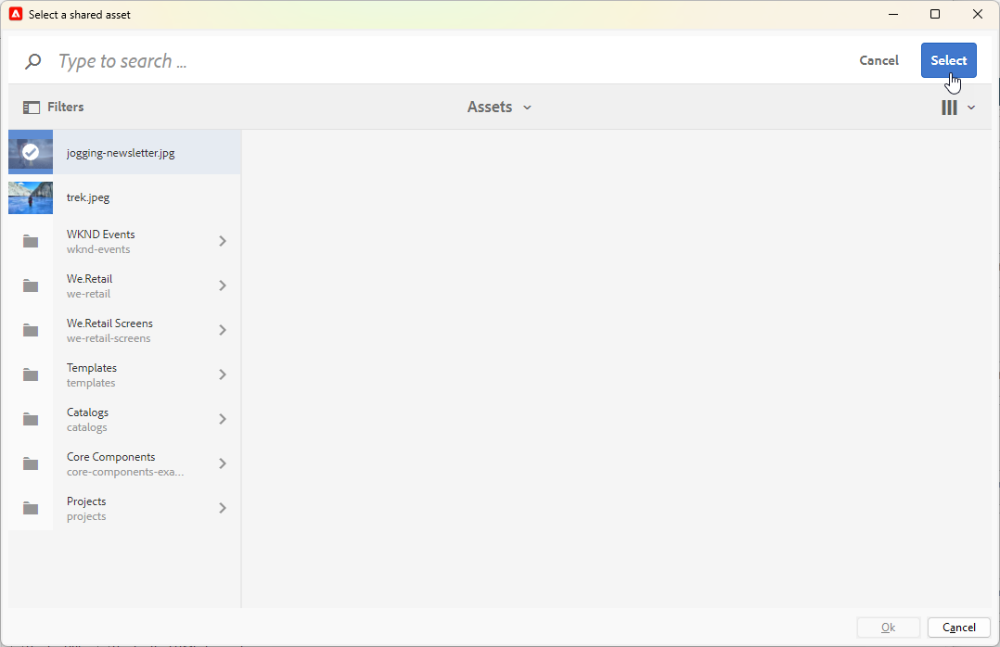

# 合作使用Campaign與Adobe Experience Manager {#ac-aem}

Adobe Campaign與Adobe Experience Manager的整合可讓您直接在Adobe Experience Manager中管理電子郵件傳送的內容及表單。

[探索如何在Campaign網頁介面中編輯您的Adobe Experience Manager as Cloud Service內容](https://experienceleague.adobe.com/docs/campaign-web/v8/integrations/aem-content.html?lang=zh-Hant){target="_blank"}。

[在本檔案中進一步瞭解Adobe Experience Manager](https://experienceleague.adobe.com/docs/experience-manager-65/administering/integration/campaignonpremise.html?lang=zh-Hant#aem-and-adobe-campaign-integration-workflow){target="_blank"}。

>[!NOTE]
>
>作為Managed Cloud Services使用者，[請聯絡Adobe](../start/campaign-faq.md#support)以將Adobe Experience Manager與Campaign整合。

## 從Adobe Experience Manager匯入內容 {#integrating-with-aem}

例如，這項整合可用於在Adobe Experience Manager中建立電子報，接著在Adobe Campaign中作為電子郵件促銷活動的一部分使用。

來自Adobe Experience Manager的&#x200B;**：**

1. 導覽至您的[!DNL Adobe Experience Manager]作者執行個體，然後按一下頁面左上角的Adobe Experience 。 從功能表選擇&#x200B;**[!UICONTROL Sites]**。

   

1. 存取&#x200B;**[!UICONTROL Campaigns > Name of your brand (here we.Shopping) > Main Area > Email]**。

1. 按一下&#x200B;**[!UICONTROL Create]**，然後從下拉式功能表中選取&#x200B;**[!UICONTROL Page]**。

   

1. 選取&#x200B;**[!UICONTROL Adobe Campaign Email]**&#x200B;範本並命名您的Newsletter。

1. 建立頁面之後，存取&#x200B;**[!UICONTROL Page information]**&#x200B;功能表並按一下&#x200B;**[!UICONTROL Open Properties]**。

   

1. 透過新增元件來自訂您的電子郵件內容，例如Adobe Campaign的個人化欄位。 進一步瞭解[Adobe Experience Manager檔案](https://experienceleague.adobe.com/docs/experience-manager-65/content/sites/authoring/aem-adobe-campaign/campaign.html?lang=zh-Hant#editing-email-content){target="_blank"}。

1. 電子郵件準備就緒後，請瀏覽至&#x200B;**[!UICONTROL Page information]**&#x200B;功能表並按一下&#x200B;**[!UICONTROL Start workflow]**。

   

1. 從第一個下拉式清單中，選取&#x200B;**[!UICONTROL Approve Adobe Campaign]**&#x200B;作為工作流程模型，然後按一下&#x200B;**[!UICONTROL Start workflow]**。

   

1. 免責宣告會顯示在您的頁面頂端，顯示`This page is subject to the workflow Approve for Adobe Campaign`。 按一下免責宣告旁的&#x200B;**[!UICONTROL Complete]**&#x200B;以確認檢閱，然後按一下&#x200B;**[!UICONTROL Ok]**。

1. 再按一下&#x200B;**[!UICONTROL Complete]**&#x200B;並在&#x200B;**[!UICONTROL Next Step]**&#x200B;下拉式清單中選取&#x200B;**[!UICONTROL Newsletter approval]**。

   

您的Newsletter現已準備就緒，並已在Adobe Campaign中同步。

來自Adobe Campaign的&#x200B;**：**

1. 從&#x200B;**[!UICONTROL Campaigns]**&#x200B;索引標籤，按一下&#x200B;**[!UICONTROL Deliveries]**&#x200B;然後&#x200B;**[!UICONTROL Create]**。

1. 從&#x200B;**[!UICONTROL Delivery template]**&#x200B;下拉式功能表中選擇&#x200B;**[!UICONTROL Email delivery with AEM content (mailAEMContent)]**&#x200B;範本。

   

1. 新增&#x200B;**[!UICONTROL Label]**&#x200B;至您的傳遞，然後按一下&#x200B;**[!UICONTROL Continue]**。

1. 按一下&#x200B;**[!UICONTROL Synchronize]**&#x200B;以存取您的AEM傳遞。

   如果您的介面中看不到該按鈕，請瀏覽至&#x200B;**[!UICONTROL Properties]**&#x200B;按鈕並存取&#x200B;**[!UICONTROL Advanced]**&#x200B;標籤。 請確定&#x200B;**[!UICONTROL Content editing mode]**&#x200B;欄位已設定為&#x200B;**[!UICONTROL AEM]**，並在&#x200B;**[!UICONTROL AEM account]**&#x200B;欄位中輸入您的AEM執行個體詳細資料。

   

1. 選取先前在[!DNL Adobe Experience Manager]中建立的AEM傳遞，並按一下&#x200B;**[!UICONTROL Ok]**&#x200B;確認。

   

1. 請確保在對AEM傳遞進行修改時按一下&#x200B;**[!UICONTROL Refresh content]**&#x200B;按鈕。

   

1. 若要移除Experience Manager與Campaign之間的連結，請按一下&#x200B;**[!UICONTROL Desynchronize]**。

您的電子郵件現在已準備好傳送給您的對象。

## 從Adobe Experience Manager Assets資料庫匯入資產 {#assets-library}

您也可以在Adobe Campaign中編輯電子郵件或登入頁面時，直接從[!DNL Adobe Experience Manager Assets Library]插入資產。 [Adobe Experience Manager Assets檔案](https://experienceleague.adobe.com/docs/experience-manager-65/content/assets/managing/manage-assets.html?lang=zh-Hant){target="_blank"}中會詳細說明此功能。

來自Adobe Experience Manager的&#x200B;**：**

1. 導覽至您的[!DNL Adobe Experience Manager]作者執行個體，然後按一下頁面左上角的Adobe Experience 。 從功能表選擇&#x200B;**[!UICONTROL Assets]** `>` **[!UICONTROL Files]**。

   

1. 按一下&#x200B;**「建立」**，然後按&#x200B;**「檔案」**，將您的資產匯入至&#x200B;**Adobe Experience Manager Assets資料庫**。 在[Adobe Experience Manager檔案](https://experienceleague.adobe.com/docs/experience-manager-65/content/assets/managing/manage-assets.html?lang=zh-Hant#uploading-assets){target="_blank"}中進一步瞭解。

   

1. 視需要重新命名您的資產，並選取&#x200B;**上傳**。

您的資產現已上傳至&#x200B;**Adobe Experience Manager Assets資料庫**。

來自Adobe Campaign的&#x200B;**：**

1. 在Adobe Campaign中，瀏覽至&#x200B;**行銷活動**&#x200B;索引標籤，按一下&#x200B;**傳遞**，然後按一下現有傳遞清單上方的&#x200B;**建立**&#x200B;按鈕，以建立新的傳遞。

   

1. 選取&#x200B;**傳遞範本**，然後為您的傳遞命名。

1. 定義及個人化訊息內容。 [了解更多](../send/email.md)

1. 若要使用您的&#x200B;**Adobe Experience Manager Assets資料庫**，請存取AEM傳遞的&#x200B;**[!UICONTROL Properties]**&#x200B;並選取&#x200B;**[!UICONTROL Advanced]**&#x200B;索引標籤。

   選擇您的&#x200B;**AEM帳戶**&#x200B;並啟用&#x200B;**[!UICONTROL Use above AEM instance as shared asset library]**&#x200B;選項。

   

1. 從&#x200B;**影像**&#x200B;圖示，存取&#x200B;**[!UICONTROL Select a shared asset]**&#x200B;功能表。

   

1. 從選取視窗中，從&#x200B;**Adobe Experience Manager Assets資料庫**&#x200B;選取影像，然後選取&#x200B;**選取**。

   

您的資產現在已上傳至您的電子郵件傳送。 您現在可以指定目標對象、確認傳送，然後繼續傳送。
