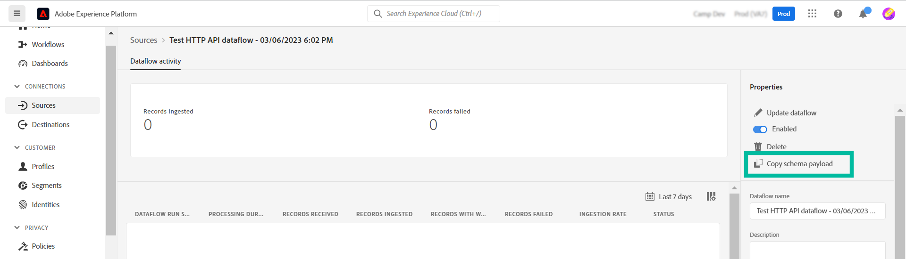

# 從Adobe Campaign登陸頁面更新Adobe Experience Platform設定檔

Adobe Campaign與Adobe Experience Platform的整合可讓您在Adobe Campaign登陸頁面與Adobe Experience Platform之間順暢地同步資料。 透過這項整合，您可以：

* 擷取Adobe Experience Platform設定檔屬性，以便在Adobe Campaign登陸頁面中顯示更新的資訊。
* 將更新的設定檔屬性傳回至Adobe Experience Platform，以根據登入頁面中已填寫和提交的內容來更新對應的屬性。

設定這項整合的主要步驟如下：

<table>
<tr>
<td><p><a href="#oauth">設定OAuth連線</a></p></td>
<td><p><a href="#source">建立HTTP API來源連線</a></p></td>
<td><p><a href="#xtk">在Campaign新增驗證選項</a></p></td>
<td><p><a href="#javascript">在Campaign中新增JavaScript程式碼</a></p></td>
<td><p><a href="#script">設定登入頁面工作流程</a></p></td>
</table>

## 設定Oauth連線 {#oauth}

Adobe Cloud Platform API使用OAuth 2.0通訊協定進行驗證和授權。 若要使用API呼叫將Adobe Experience Platform連線至Adobe Campaign，您需要使用在Adobe Developer主控台中建立的OAuth整合來產生存取權杖。

要執行此操作，請依照下列步驟執行：

1. 存取Adobe Developer Console。
1. 使用Adobe Experience Platform API產品建立新的API連線。 如需有關如何取得OAuth 2.0存取權杖的詳細步驟，請參閱 [Adobe Developer Console檔案](https://developer.adobe.com/developer-console/docs/guides/authentication/Tools/OAuthPlayground/).
1. 建立連線後，導覽至 **[!UICONTROL OAuth Server-to-Server]** 功能表並複製下列詳細資料（Campaign中需要這些詳細資料以進行驗證）：

   * 使用者端ID
   * 使用者端密碼
   * 組織ID

   {width="70%"}

現在您的Oauth連線已設定完畢，請建立和設定新的 **[!UICONTROL HTTP API]** 將Adobe Campaign與Adobe Experience Platform連結的來源連線。

## 建立HTTP API來源連線 {#source}

OAuth連線就緒後，下一步就是建立 **[!UICONTROL HTTP API]** Adobe Experience Platform中的來源連線。 此連線可讓您使用API將資料串流到Adobe Experience Platform。 請依照下列步驟操作：

1. 導覽至Adobe Experience Platform **[!UICONTROL Sources]**，搜尋 **[!UICONTROL HTTP API]** 來源，然後按一下 **[!UICONTROL Add data]**.

   {width="70%"}

1. 視需要設定連線。 有關如何設定HTTP API連線的詳細資訊，請參閱 [Adobe Experience Platform來原始檔](https://experienceleague.adobe.com/docs/experience-platform/sources/ui-tutorials/create/streaming/http.html).

   在 **[!UICONTROL Authentication]** 步驟，開啟 **[!UICONTROL Enable authentication]** 使用透過OAuth整合產生的存取權杖進行驗證的選項。

   {width="70%"}

1. 設定來源連線後，串流端點就會顯示。 需要此端點才能將資料內嵌至Adobe Experience Platform。

   {width="70%"}

   您也可以從以下位置開啟新建立的資料流，以存取內嵌至Adobe Experience Platform的資料格式範例： **[!UICONTROL Dataflows]** 標籤。

   {width="70%"}

現在已設定HTTP API來源連線，您需要在Adobe Campaign中新增特定選項，才能啟用與Adobe Experience Platform的連線。

## 在Adobe Campaign中新增驗證選項 {#xtk}

設定HTTP API來源連線後，您需要在Adobe Campaign中新增特定選項，以啟用與Adobe Experience Platform的連線。 您可以在Campaign「管理」功能表中或透過新增特定專案來執行登入頁面工作流程時執行此操作 **[!UICONTROL JavaScript code]** 活動。

瀏覽下列索引標籤，以探索下列兩種方法：

>[!BEGINTABS]

>[!TAB 從管理功能表新增選項]

1. 導覽至 **[!UICONTROL Administration]** > **[!UICONTROL Platform]** > **[!UICONTROL Options]**  功能表。
1. 從Adobe Developer主控台將以下選項與對應值新增：

   * IMS_CLIENT_ID = cryptString（使用者端ID）
   * IMS_CLIENT_SECRET = cryptString（使用者端密碼）
   * IMS_ORG_ID =組織識別碼
   * IMS_CLIENT_API_KEY = cryptString（使用者端ID）

   {width="70%"}

   >[!NOTE]
   >
   >cryptString()函式用於加密您的驗證資料。

>[!TAB 使用JavaScript程式碼活動新增選項]

若要在執行登入頁面工作流程時自動設定這些選項，請新增 **[!UICONTROL JavaScript code]** 使用下列程式碼將活動新增至您的工作流程。 [瞭解如何設定JavaScript程式碼活動](https://experienceleague.adobe.com/docs/campaign/automation/workflows/wf-activities/action-activities/sql-code-and-JavaScript-code.html#JavaScript-code).

在執行工作流程時，系統會自動在Campaign主控台中使用提供的值建立選項。

    ```
    loadLibrary(&quot;xtk：shared/nl.js&quot;)；
    loadLibrary(&quot;xtk：shared/xtk.js&quot;)；
    loadLibrary(&quot;xtk：shared/json2.js&quot;)；
    loadLibrary(&quot;xtk：common.js&quot;)；
    
    函式setAuthCredentials()
    {
    setOption(&quot;IMS_CLIENT_ID&quot;， cryptString(&#39;CLIENT ID&#39;))；
    setOption(&quot;IMS_CLIENT_SECRET&quot;， cryptString(&#39;CLIENT SECRET&#39;))；
    setOption(&quot;IMS_ORG_ID&quot;， cryptString(&#39;ORGANIZATION ID&#39;))；
    setOption(&quot;IMS_CLIENT_API_KEY&quot;， cryptString(&#39;CLIENT ID&#39;))；
    }
    ```

>[!ENDTABS]

現在Campaign中已設定驗證選項，您需要建立自訂JavaScript程式碼，以允許從您的登陸頁面在Campaign和Adobe Experience Platform之間同步資料。

## 在工作流程執行時新增選項 {#javacript}

若要讓登入頁面與Adobe Experience Platform之間的資料同步，必須將自訂JavaScript程式碼新增至Adobe Campaign。 請依照下列步驟操作：

1. 導覽至 **[!UICONTROL Administration]** > **[!UICONTROL Configuration]** > **[!UICONTROL JavaScript codes]** 功能表。
1. 建立新的JavaScript程式碼並複製貼上以下程式碼片段。

   >[!NOTE]
   >
   >存取權杖和驗證資料會從先前設定的選項中自動擷取。

   {width="70%"}

+++  指令碼1 — 從Experience Platform載入設定檔屬性

   此程式碼會在載入登陸頁面之前，先檢查設定檔是否存在Adobe Experience Platform中。 它會擷取設定檔屬性，並在登入頁面的對應欄位中顯示這些屬性。

   ```
   // API implementation to read profile from AEP
   function getProfileInfo(email)
   {
   var accessToken = getAccessToken();
   var request = new HttpClientRequest(('https://platform-stage.adobe.io/data/core/ups/access/entities?schema.name=_xdm.context.profile&entityId=' + email + '&entityIdNS=email&fields=identities,consents.marketing'));
   request.method = 'GET';
   request.header["Content-Type"] = "application/json";
   request.header["sandbox-name"] = "prod";
   request.header["x-gw-ims-org-id"] = getOption('IMS_ORG_ID');
   request.header["x-api-key"] = getOption('IMS_CLIENT_API_KEY');
   request.header["Authorization"] = "Bearer " + accessToken;
   request.execute();
   return request.response;
   }
   ```

+++

+++ 指令碼2 — 更新Experience Platform設定檔屬性

   此程式碼會使用登陸頁面中提交的值更新Adobe Experience Platform中的設定檔屬性。

   ```
   // API implementation to update profile in AEP
   loadLibrary("xtk:shared/nl.js");
   loadLibrary("xtk:shared/xtk.js");
   loadLibrary("xtk:shared/json2.js");
   loadLibrary("xtk:common.js");
   
   function updateProfileInAEP(profileUpdatePayload)
   {
   var accessToken = getAccessToken();
   var request = new HttpClientRequest('https://dcs-stg.adobedc.net/collection/64a300b84d61c0bcea4f0cd4ecaaa224a19477026d14f7e08b5408ffaf5e6162?syncValidation=false');
   request.method = 'POST';
   request.header["Content-Type"] = "application/json";
   request.header["sandbox-name"] = "prod";
   request.header["Authorization"] = "Bearer " + accessToken;
   var body = '{"header":{"schemaRef":{"id":"https://ns.adobe.com/campdev/schemas/35d8e567772e1a1093ed6cf9e41d2c1fec22eeb3a89583e1","contentType":"application/vnd.adobe.xed-full+json;version=1.0"},"imsOrgId":"A1F66F0D5C47D1950A494133@AdobeOrg","datasetId":"63c7fa2a20cce11b98cccb41","source":{"name":"testHTTPSourcesVinay - 03/06/2023 5:43 PM"}},"body":{"xdmMeta":{"schemaRef":{"id":"https://ns.adobe.com/campdev/schemas/35d8e567772e1a1093ed6cf9e41d2c1fec22eeb3a89583e1","contentType":"application/vnd.adobe.xed-full+json;version=1.0"}},"xdmEntity":' + profileUpdatePayload +'}}';
   request.body = body;
   request.execute();
   return request.response;
   }
   
   
   // Get Access token from OAuth-Server-to-server API call
   function getAccessToken() {
   var clientId = decryptString(getOption('IMS_CLIENT_ID'));
   var clientSecret = decryptString(getOption('IMS_CLIENT_SECRET'));
   var request = new HttpClientRequest(('https://ims-na1-stg1.adobelogin.com/ims/token/v2?grant_type=client_credentials' + '&client_id=' + clientId + '&client_secret=' + clientSecret + '&scope=openid,session,AdobeID,read_organizations,additional_info.projectedProductContext'));
   request.method = 'POST';
   request.execute();
   var response = request.response;
   if(response.code != 200){
   logError('GetAccessToken failed,', response.code, response.body);
   return;
   }
   var body = ''+response.body;
   var parsedResponse = JSON.parse(body);
   var accessToken = parsedResponse.access_token;
   logInfo("Access token generated successfully");
   return accessToken;
   }
   ```

+++

現在，自訂JavaScript程式碼已建立到Adobe Campaign中，您可以設定包含登入頁面的工作流程，以使用這些JavaScript程式碼進行資料同步。

## 設定登入頁面工作流程 {#script}

新增JavaScript程式碼至Adobe Campaign後，您可使用將其運用至登陸頁面工作流程 **[!UICONTROL JavaScript code]** 活動：

* 若要在載入登入頁面之前從Experience Platform載入資料，請新增 **[!UICONTROL JavaScript code]** 活動，並複製貼上指令碼1。

+++ 指令碼1 — 從Experience Platform載入設定檔屬性

  ```
  // Script code to read profile from AEP.
  
  logInfo("Loading profile from AEP");
  loadLibrary("cus:aepAPI");
  var recipient=ctx.recipient;
  var email = recipient.@email;
  var response = getProfileInfo(email);
  ctx.isAEPProfileExists = 1;
  
  if(response.code == 404){
  ctx.isAEPProfileExists = 0
  logInfo("Profile with email" + email + " not found in AEP, ignoring the update activity");
  }
  else if(response.code == 200){
  var body = ''+response.body;
  var parsedResponse = JSON.parse(body);
  for (var key in parsedResponse) {
      var value =  parsedResponse[key];
      var marketing = value.entity.consents.marketing;
      logInfo("User Consent Details : " + JSON.stringify(marketing));   
      if(marketing.hasOwnProperty('email')&&marketing.email.hasOwnProperty('val')&&marketing.email.val=='n'){
      ctx.recipient.@blackListEmail = 1;
      }
      if(marketing.hasOwnProperty('sms')&&marketing.sms.hasOwnProperty('val')&&marketing.sms.val=='n'){
      ctx.recipient.@blackListMobile = 1;
      }
      if(marketing.hasOwnProperty('push')&&marketing.push.hasOwnProperty('val')&&marketing.push.val=='n'){
      ctx.recipient.@blackListPostalMail = 1;
      }
  } 
  }
  ```

+++

* 若要使用在登入頁面中提交的資料更新Experience Platform設定檔屬性，請新增 **[!UICONTROL JavaScript code]** 活動，並複製貼上指令碼2。

+++ 指令碼2 — 更新Experience Platform設定檔屬性

  ```
  // Script code to update profile in AEP and ACC.
  
  logInfo("Executing script to update AEP profile.");
  
  // Loading aepAPI library JS code
  loadLibrary("cus:aepAPI");
  
  var recipient=ctx.recipient
  
  // Update profile only if it exists in AEP
  if(ctx.isAEPProfileExists==1){
  
  var email = recipient.@email
  logInfo(email);
  logInfo(recipient.@blackListEmail);
  logInfo(recipient.@blackListMobile);
  logInfo(recipient.@blackListPostalMail);
  
  var optOutPayload = new Array();
  
  if(recipient.@blackListEmail==1){
      optOutPayload.push('"email":{"val":"n"}');
  }
  else
      optOutPayload.push('"email":{"val":"y"}');
  
  if(recipient.@blackListMobile==1){
      optOutPayload.push('"sms":{"val":"n"}');
  }
  else
      optOutPayload.push('"sms":{"val":"y"}');
  
  if(recipient.@blackListPostalMail==1){
      optOutPayload.push('"push":{"val":"n"}');
  }
  else
      optOutPayload.push('"push":{"val":"y"}');
  
  var profileUpdatePayload = '{'+ '"personalEmail":{"address":' + '\"' + email + '\"' + '},' +'"consents":{"marketing":{' + optOutPayload.toString() + '}}}';
  
  var response = updateProfileInAEP(profileUpdatePayload);
  if(response.code == 200){
  var body = '' + response.body;
  logInfo("AEP Profile Updated successfully, Response " + body);
  // Update ACC profile 
  recipient.@xtkschema = "nms:recipient";
  recipient.@_operation = "update";
  recipient.@_key="@id";
  xtk.session.Write(recipient);
  logInfo("ACC Profile Updated successfully");
  }
  else{
      logError('Server Error: ', response.code, response.body);
  } 
  }
  else {
  logInfo("Ignoring AEP profile update as profile doesn't exists.");
  
  // Update ACC profile   
  recipient.@xtkschema = "nms:recipient";
  recipient.@_operation = "update";
  recipient.@_key="@id";  
  xtk.session.Write(recipient);
  logInfo("ACC Profile Updated successfully");
  }
  ```

+++

>[!CAUTION]
>
>請確定您根據特定需求，自訂每個指令碼中的裝載。
>
>如果您在登入頁面活動之前未新增任何指令碼，則不會在Adobe Experience Platform中執行任何設定檔存在性檢查。 提交登入頁面且設定檔不存在時，將會使用登入頁面的屬性在Adobe Experience Platform中建立。

以下是登陸頁面前後使用JavaScript程式碼活動的範例工作流程：

{width="70%"}

以下是登入頁面和JavaScript程式碼活動的範例，其設定是用來更新Adobe Experience Platform中的設定檔屬性：

{width="70%"}

{width="70%" zoomable="yes"}

### 更多資訊

* [設定JavaScript程式碼活動](../../automation/workflow/sql-code-and-javascript-code.md#javascript-code)
* [設定登陸頁面](https://experienceleague.adobe.com/docs/campaign-classic/using/designing-content/editing-html-content/creating-a-landing-page.html)
* [管理訂閱和取消訂閱](../start/subscriptions.md)
