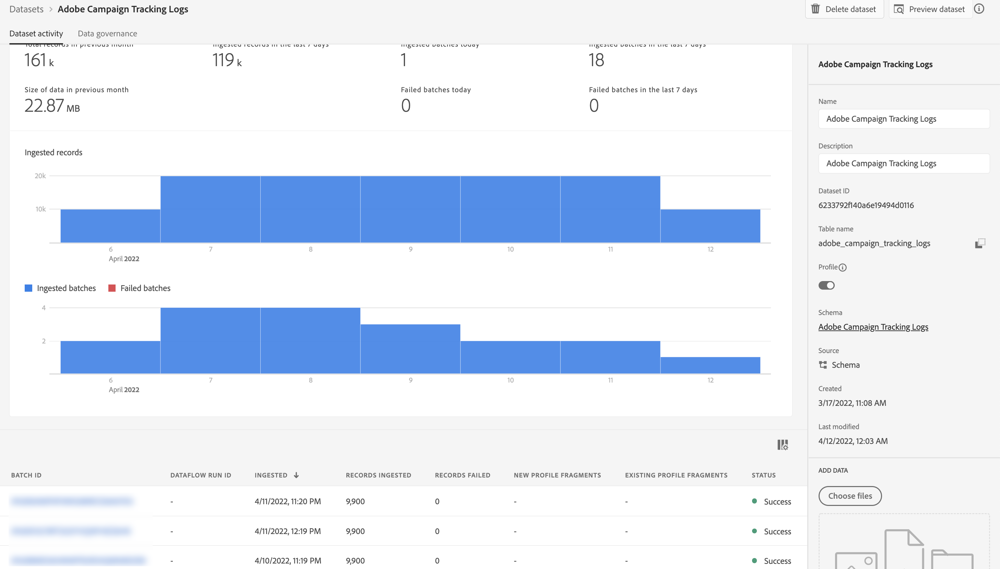

# 使用Campaign和Adobe Experience Platform

Adobe Campaign受管理的Cloud Service目標和來源聯結器可讓Adobe Campaign與Adobe Experience Platform之間無縫整合。 透過這項整合，您可以：

* 將Adobe Experience Platform對象傳送至Adobe Campaign，並將傳遞和追蹤記錄傳回至Adobe Experience Platform進行分析，
* 將Adobe Experience Platform設定檔屬性帶入Adobe Campaign並建立同步程式，以便定期更新。

## 將Adobe Experience Platform對象傳送至Campaign {#audiences}

將Adobe Experience Platform對象傳送至Adobe Campaign並傳回傳送和追蹤記錄的主要步驟如下：

* 使用Adobe Campaign Managed Cloud Services **目的地連線** 若要將Experience Platform區段傳送至Adobe Campaign：

   1. 存取Adobe Experience Platform目標目錄並建立新的 **[!UICONTROL Adobe Campaign Managed Cloud Services]** 連線。
   1. 提供要使用的Campaign執行個體的詳細資訊，並選擇 **[!UICONTROL Audience sync]** 做為同步型別。

      {width="800" align="center"}

   1. 選取要傳送至Adobe Campaign的區段。
   1. 設定您要在對象中匯出的屬性。
   1. 設定好流量後，即可將選取的對象啟動至Adobe Campaign。

      {width="800" align="center"}

  有關如何設定目的地的詳細資訊，請參閱 [Adobe Campaign Managed Cloud Services連線檔案](https://www.adobe.com/go/destinations-adobe-campaign-managed-cloud-services-en){target="_blank"}

* 使用Adobe Campaign Managed Cloud Services **來源連線** 若要將Adobe Campaign傳送和追蹤記錄傳送至Adobe Experience Platform：

  若要這麼做，請設定新的Adobe Campaign Managed Cloud Services **來源連線** 將Campaign事件擷取至Adobe Experience Platform。 提供要使用的Campaign執行個體和結構描述的詳細資訊、選取應擷取資料的資料集，然後設定要擷取的欄位。 [瞭解如何建立Adobe Campaign Managed Cloud Services來源連線](https://www.adobe.com/go/sources-campaign-ui-en)

  {width="800" align="center"}

## 在Adobe Experience Platform和Adobe Campaign之間同步設定檔屬性 {#profile}

藉由將Adobe Campaign與Adobe Experience Platform連線，您可以引進其他設定檔屬性，這些屬性會繫結至Adobe Experience Platform上的設定檔，並設定同步程式，以便在Adobe Campaign資料庫中更新。

例如，假設您擷取Adobe Experience Platform中的選擇加入和選擇退出值。 透過此連線，您可以將這些值帶入Adobe Campaign並建立同步程式，以便定期更新。

>[!NOTE]
>
>設定檔屬性同步可用於Adobe Campaign資料庫中已存在的設定檔。

將Adobe Experience Platform設定檔屬性與Adobe Campaign同步的主要步驟如下：

1. 存取Adobe Experience Platform目標目錄並建立新的 **[!UICONTROL Adobe Campaign Managed Cloud Services]** 連線。
1. 提供要使用的Campaign執行個體的詳細資訊，並選擇 **[!UICONTROL Profile sync (Update only)]** 做為同步型別。

   {width="800" align="center"}

1. 選取以設定檔為目標的區段，以更新至Adobe Campaign資料庫。
1. 設定您要更新至Adobe Campaign的設定檔屬性。
1. 設定流量後，選取的設定檔屬性將與Adobe Campaign同步，並針對目的地中設定的區段鎖定的所有設定檔進行更新。

有關如何設定目的地的詳細資訊，請參閱 [Adobe Campaign Managed Cloud Services連線檔案](https://www.adobe.com/go/destinations-adobe-campaign-managed-cloud-services-en){target="_blank"}