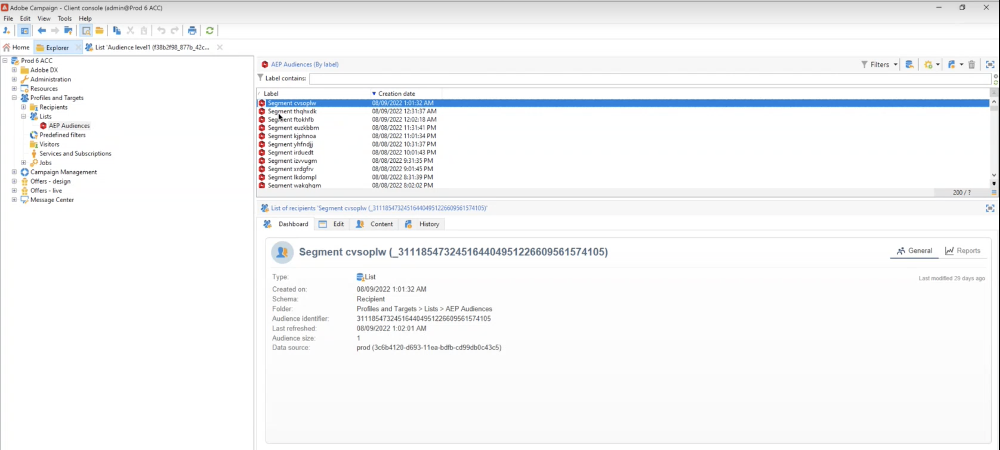

# 與運動和Adobe Experience Platform合作

Adobe Campaign管理的Cloud Service目的地和源介面使Adobe Campaign和Adobe Experience Platform之間能夠無縫整合。

* 使用 **Adobe Campaign Managed Cloud Services目的地** 連接將Experience Platform段發送到Adobe Campaign以激活

   

* 使用 **Adobe Campaign Managed Cloud Services源** 將Adobe Campaign交付和跟蹤日誌發送到Adobe Experience Platform

   

在Adobe Experience Platform配置此整合的步驟如下：

1. 配置新的Adobe Campaign Managed Cloud Services目標連接以激活段/受眾並將該資料發送到Adobe Campaign。

   提供要使用的市場活動實例的詳細資訊，選擇要為目標激活的段，然後配置要導出到市場活動的屬性。

   [瞭解如何建立Adobe Campaign Managed Cloud Services目標連接](https://www.adobe.com/go/destinations-adobe-campaign-managed-cloud-services-en)

1. 配置新的Adobe Campaign Managed Cloud Services源連接，以將市場活動事件接收到Adobe Experience Platform。

   提供有關市場活動實例和要使用的架構的詳細資訊，選擇應在其中接收資料的資料集，然後配置要檢索的欄位。

   [瞭解如何建立Adobe Campaign Managed Cloud Services源連接](https://www.adobe.com/go/sources-campaign-ui-en)
