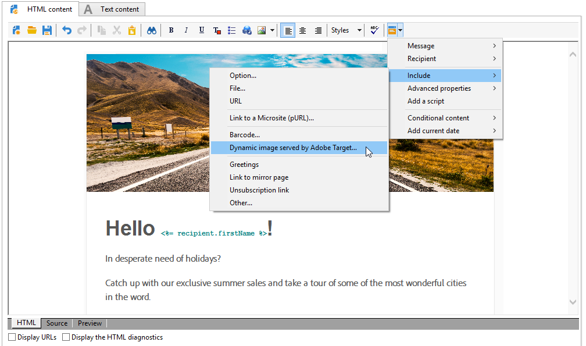

# 與Campaign和Adobe Target合作

Connect Campaign和Target，將Adobe Target的選件加入Adobe Campaign電子郵件傳送。

此整合可協助您實施下列使用案例：當收件者開啟透過Adobe Campaign傳送的電子郵件時，透過Adobe Target來電可讓您顯示動態版的內容。 根據建立電子郵件時預先指定的規則，計算此動態版本。

>[!NOTE]
>整合僅支援靜態影像。 其他內容無法個人化。

:speech_balloon:身為受管理的Cloud Services使用者，[連絡Adobe](../start/support.md#support)以使用促銷活動實施Experience Cloud觸發。

Adobe Target可使用下列類型的資料：

* Adobe Campaign資料庫
* 連結至Adobe Target地區訪客ID的區段（如果使用的資料不受法律限制）
* Adobe Target資料：用戶代理， IP地址，地理本地化資料

## 插入動態內容

在下列範例中，您將學習如何將Adobe Target的動態優惠整合至Adobe Campaign的電子郵件。

我們想要建立包含影像的訊息，該影像會根據收件者的國家／地區動態變更。 資料會隨每個mbox請求傳送，並視訪客的IP位址而定。

在這封電子郵件中，我們希望其中一張影像會根據下列使用者體驗動態變更：

* 電子郵件在法國開啟。
* 電子郵件在美國開啟。
* 如果這些條件都不適用，則會顯示預設影像。

Adobe Campaign和Adobe Target需要採取以下步驟：

1. [在電子郵件中插入動態選件](#inserting-dynamic-offer)
1. [建立重新導向選件](#create-redirect-offers)
1. [建立觀眾](#audiences-target)
1. [建立體驗定位活動](#creating-targeting-activity)
1. [預覽並傳送訊息](#preview-send-email)

### 在電子郵件{#inserting-dynamic-offer}中插入動態選件

在Adobe Campaign，定義您電子郵件的目標和內容。 您可以插入來自Adobe Target的動態影像。

若要這麼做，請指定預設影像的URL、位置名稱，以及您要傳輸至Adobe Target的欄位。

在Adobe Campaign，有兩種方式可將Target的動態影像插入電子郵件：

* 如果您使用數位內容編輯器，請選擇現有影像，然後從工具列中選取&#x200B;**[!UICONTROL Insert]** > **[!UICONTROL Dynamic image served by Adobe Target]**。

   

* 如果您使用標準編輯器，請將游標置於要插入影像的位置，然後從個人化下拉式選單中選取&#x200B;**[!UICONTROL Include]** > **[!UICONTROL Dynamic image served by Adobe Target...]**。

   

然後，您可以定義影像參數：

* **[!UICONTROL Default image]**&#x200B;的URL是當未滿足任何條件時將顯示的影像。 您也可以從資產庫中選取影像。
* **[!UICONTROL Target location]**&#x200B;是動態選件位置的名稱。 您必須在Adobe Target活動中選擇此位置。
* **[!UICONTROL Landing Page]**&#x200B;可讓您將預設影像重新導向至預設登陸頁面。 此URL僅適用於在最終電子郵件中顯示預設影像時。 這是可選的。
* **[!UICONTROL Additional decision parameters]**&#x200B;定義了在Adobe Target段中定義的欄位與Adobe Campaign欄位之間的映射。 使用的Adobe Campaign欄位必須已在rawbox中指定。 在我們的範例中，我們新增了「國家」欄位。

如果您在Adobe Target的設定中使用「企業版」權限，請在此欄位中新增對應的屬性。 進一步瞭解[本頁](https://experienceleague.adobe.com/docs/target/using/administer/manage-users/enterprise/properties-overview.html?lang=en#administer)中的Target Enterprise權限。

### 建立重新導向選件{#create-redirect-offers}

在Adobe Target，您可以建立不同版本的選件。 視每個使用者體驗而定，您可以建立重新導向選件，並指定要顯示的影像。

在我們的案例中，我們需要兩個重新導向選件，第三個（預設）選件在Adobe Campaign定義。

1. 若要在Target Standard中建立新的重新導向選件，請從&#x200B;**[!UICONTROL Content]**&#x200B;標籤按一下&#x200B;**[!UICONTROL Code offers]**。

1. 按一下 **[!UICONTROL Create]**，之後 **[!UICONTROL Redirect Offer]**。

   

1. 輸入選件的名稱和影像的URL。

   

1. 請依照相同的程式，處理剩餘的重新導向選件。 如需關於此項目的詳細資訊，請參閱此[頁面](https://experienceleague.adobe.com/docs/target/using/experiences/offers/offer-redirect.html?lang=en#experiences)。

### 建立觀眾{#audiences-target}

在Adobe Target，您需要建立兩個對象，造訪您選件的訪客將會依不同的內容分類。 針對每個對象，新增規則以定義誰將能夠看見選件。

1. 若要在Target中建立新對象，請從&#x200B;**[!UICONTROL Audiences]**&#x200B;標籤按一下&#x200B;**[!UICONTROL Create Audience]**。

   

1. 新增名稱至您的觀眾。

   

1. 按一下&#x200B;**[!UICONTROL Add a rule]**&#x200B;並選擇類別。 規則使用特定條件來定位訪客。 您可以新增條件或在其他類別中建立新規則，以調整規則。

1. 請依照相同的程式處理其餘的觀眾。

### 建立體驗定位活動{#creating-targeting-activity}

在Adobe Target，我們需要建立「體驗定位」活動、定義不同的體驗，並將它們與對應的選件建立關聯。

首先，您需要定義對象：

1. 若要建立「體驗定位」活動，請從&#x200B;**[!UICONTROL Activities]**&#x200B;標籤中，按一下&#x200B;**[!UICONTROL Create Activity]**，然後按一下&#x200B;**[!UICONTROL Experience Targeting]**。

   

1. 選擇&#x200B;**[!UICONTROL Form]**&#x200B;作為&#x200B;**[!UICONTROL Experience Composer]**。

1. 按一下&#x200B;**[!UICONTROL Change audience]**&#x200B;按鈕以選擇對象。

   

1. 選取在先前步驟中建立的對象。

   

1. 按一下&#x200B;**[!UICONTROL Add Experience Targeting]**&#x200B;以建立其他體驗。

然後為每個觀眾新增內容：

1. 在Adobe Campaign插入動態選件時，選取您選擇的位置名稱。

   

1. 按一下下拉式按鈕，然後選取&#x200B;**[!UICONTROL Change Redirect Offer]**。

   

1. 選取您先前建立的重新導向選件。

   

1. 請依照相同的步驟進行第二個體驗。

**[!UICONTROL Target]**&#x200B;視窗會摘要您的活動。 如有需要，您可以新增其他體驗。

**[!UICONTROL Goal & Settings]**&#x200B;視窗可讓您設定優先順序、目標或持續時間，以個人化您的活動。

**[!UICONTROL Reporting Settings]**&#x200B;區段可讓您選取動作並編輯將決定何時達到目標的參數。

## 預覽並傳送訊息{#preview-send-email}

在Adobe Campaign，您現在可以預覽電子郵件，並在不同的收件者上測試其轉換效果。

您會注意到，影像會根據建立的不同體驗而改變。

您現在已準備好傳送電子郵件，包括Target提供的動態選件。

