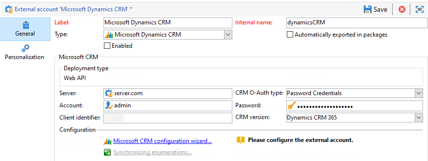

# 與Campign和MicrosoftDynamics合作365{#crm-ms-dynamics}

在跨通道通信中激活CRM資料：瞭解如何通過 **Microsoft動力365** 與Adobe Campaign共用市場活動績效資料（發送、開啟、點擊和回落），從Adobe Campaign返回到MicrosoftDynamics 365。

一旦完成配置，則通過專用工作流活動在系統之間執行資料同步。 [了解更多資訊](crm-data-sync.md)。

>[!NOTE]
>
>市場活動中詳細介紹了支援的MicrosoftDynamics版本 [相容性矩陣](../start/compatibility-matrix.md)。

按照以下步驟配置專用外部帳戶，以將MicrosoftDynamics 365資料導入和導出到Adobe Campaign。

對於每個系統，這些步驟需要由管理員執行。

>[!CAUTION]
> 本文檔中的步驟將指導您建立涉及分配權限和/或管理員訪問的整合/註冊。 您有責任確保這些步驟在執行之前符合您的公司政策，並認真執行。

## 設定 Microsoft Dynamics 365 {#config-crm-microsoft}

將MicrosoftDynamics 365連接到Adobe Campaign **Web API**，登錄 [MicrosoftAzure目錄](https://portal.azure.com) 使用 **全局管理員** ，並執行以下步驟：

1. 獲取Dynamics 365應用程式（客戶端）ID。 [了解更多](#get-client-id-microsoft)
1. 生成MicrosoftDynamics證書密鑰標識符和密鑰ID。 [了解更多](#config-certificate-key-id)
1. 配置權限。 [了解更多](#config-permissions-microsoft)
1. 建立應用用戶。 [了解更多](#create-app-user-microsoft)
1. 對私鑰進行編碼。 [了解更多](#configure-acc-for-microsoftt)


### 獲取Dynamics 365客戶端ID {#get-client-id-microsoft}

要獲取應用程式（客戶端）ID，您需要在Azure Active Directory中註冊應用程式。

1. 瀏覽到 **Azure Active Directory >應用程式註冊**，然後選擇 **新建註冊**。
1. 輸入可幫助標識實例的唯一名稱，如 **阿多貝卡姆`<instance identifier>`**。

保存後，MicrosoftAzure目錄將分配一個唯一 **應用程式（客戶端）ID** 你的應用。 您以後在Adobe Campaign配置Dynamics 365時需要此ID。

瞭解詳情 [MicrosoftDynamics 365文檔](https://docs.microsoft.com/powerapps/developer/common-data-service/walkthrough-register-app-azure-active-directory)。

### 生成MicrosoftDynamics證書密鑰標識符和密鑰ID {#config-certificate-key-id}

獲取 **證書密鑰標識符(customKeyIdentifier)** 和 **密鑰ID(keyId)**，您必須上載證書。 在請求令牌時，證書可用作機密來證明應用程式的身份。 也可以稱為公鑰。

請遵循以下步驟：

1. 瀏覽到 **Azure Active Directory >應用程式註冊** 並選擇之前建立的應用程式。
1. 選擇時間 **證書和密碼**。
1. 從 **證書** 按鈕 **上載證書**
1. 上載公共證書。
1. 瀏覽到 **清單** 連結以獲取 **證書密鑰標識符(customKeyIdentifier)** 和 **密鑰ID(keyId)**。

的 **證書密鑰標識符(customKeyIdentifier)** 和 **密鑰ID(keyId)** 使用證書配置您的MicrosoftDynamics 365 CRM外部帳戶 **[!UICONTROL CRM O-Auth type]**。

+++ 如何生成公共證書

要生成證書，可以使用openssl。

例如：

```
- openssl req -x509 -sha256 -nodes -days 365 -newkey rsa:2048 -keyout '<'private key name'>' -out '<'public certificate name'>
```

>[!NOTE]
>
>您可以更改天數，此處 `-days 365`，在代碼樣本中顯示較長的證書有效期。

然後，必須用base64對證書進行編碼。 為此，可以使用Base64編碼器的幫助或使用命令行 `base64 -w0 private.key` Linux。

+++

### 配置權限 {#config-permissions-microsoft}

**步驟1**:配置 **所需權限** 建立的應用。

1. 導航到 **Azure Active Directory >應用程式註冊** 並選擇之前建立的應用程式。
1. 按一下 **設定** 左上角。
1. 開 **所需權限**&#x200B;按一下 **添加** 和 **選擇API > Dynamics CRM Online**。
1. 按一下 **選擇**&#x200B;啟用 **以組織用戶身份訪問Dynamics 365** 複選框，然後按一下 **選擇**。
1. 然後，從您的應用中，選擇 **清單** 下 **管理** 的子菜單。
1. 從 **清單** 編輯器，設定 `allowPublicClient` 屬性 `null` 至 `true` 按一下 **保存**。

**步驟2**:授予管理員許可

1. 導航到 **Azure Active Directory >企業應用程式**。
1. 選擇要向其授予租戶範圍管理員許可的應用程式。
1. 從左窗格菜單中，選擇 **權限** 在 **安全**。
1. 按一下 **授予管理員許可**。

有關此項的詳細資訊，請參閱 [Azure文檔](https://docs.microsoft.com/azure/active-directory/manage-apps/grant-admin-consent#grant-admin-consent-from-the-azure-portal)。

### 建立應用用戶 {#create-app-user-microsoft}

>[!NOTE]
>
> 此步驟是可選的 **[!UICONTROL Password credentials]** 驗證。

App用戶是上面註冊的應用程式將使用的用戶。 使用上述註冊的應用對Microsoft動態進行的任何更改都將通過此用戶完成。

**步驟1**:在azure active directory上建立非互動式用戶

1. 按一下 **Azure Active Directory >用戶** 按一下 **新用戶**。
1. 指定要使用的正確名稱，用戶名應為電子郵件格式。
1. 選擇 **Dynamics 365管理員** 的 **目錄角色**。

**步驟2**:為建立的用戶分配適當的許可證

1. 從 [MicrosoftAzure](https://portal.azure.com)，按一下 **管理應用**。
1. 轉到 **用戶>活動用戶** 並按一下新建立的用戶。
1. 按一下 **編輯產品許可證** 的 **Dynamics 365客戶接洽計畫**。
1. 按一下 **關閉**。

**步驟3**:在Dynamics CRM上建立應用程式用戶

1. 從 [MicrosoftAzure](https://portal.azure.com)，導航 **設定>安全性>用戶**。
1. 按一下下拉框，選擇 **應用程式用戶**，然後按一下 **新建**。
1. 使用與上面在Active Directory上建立的用戶相同的用戶名。
1. 分配 **應用程式ID** 為 [您之前建立的應用程式](#get-client-id-microsoft)。
1. 按一下 **管理角色** 選擇 **系統管理員** 角色。

## 設定 Campaign {#configure-acc-for-microsoft}

### 建立連接{#new-ms-dyn-external-account}

首先，必須建立MicrosoftDynamics 365外部帳戶。

1. 瀏覽 **[!UICONTROL Administration > Platform > External accounts]** 活動瀏覽器的節點，並建立外部帳戶。
1. 選擇 **[!UICONTROL Microsoft Dynamics CRM]** 外部帳戶 **類型** 的子菜單。
1. 在中選擇驗證方法 **[!UICONTROL CRM O-Auth type]** 的子菜單。

   

   1. 配置MicrosoftDynamics CRM外部帳戶以與Adobe Campaign連接 **密碼憑據**，提供以下詳細資訊：

      * **伺服器**:您的MicrosoftCRM伺服器的URL。 要查找您的MicrosoftCRM伺服器URL，請訪問您的MicrosoftDynamics CRM帳戶，然後按一下Dynamics 365並選擇您的應用。 然後，您可以在瀏覽器的地址欄中找到您的伺服器URL，例如https://myserver.crm.dynamics.com/。
      * **帳戶**:用於登錄MicrosoftCRM的帳戶。
      * **密碼**:用於登錄MicrosoftCRM的帳戶。
      * **客戶端標識符**:應用程式（客戶端）ID，可在「更新您的代碼類別」「客戶端ID」欄位的MicrosoftAzure管理門戶中找到。
      * **CRM版本**:選擇Dynamics CRM 365 CRM版本。
   1. 將MicrosoftDynamics CRM外部帳戶配置為與Adobe Campaign連接， **證書**，提供以下詳細資訊：

      * **伺服器**:您的MicrosoftCRM伺服器的URL。 要查找您的MicrosoftCRM伺服器URL，請訪問您的MicrosoftDynamics CRM帳戶，然後按一下Dynamics 365並選擇您的應用。 然後，您可以在瀏覽器的地址欄中找到您的伺服器URL，例如https://myserver.crm.dynamics.com/。
      * **私鑰**:複製/貼上私鑰，如中所述，編碼base64 [此部分](#config-certificate-key-id)。
      * **密鑰ID**:在 **清單** 頁籤，如 [此部分](#config-certificate-key-id)。
      * **自定義密鑰標識符**:可用的標識符 **清單** 頁籤，如 [此部分](#config-certificate-key-id)。
      * **客戶端標識符**:可以從MicrosoftAzure管理門戶找到的應用程式（客戶端）ID，如中所述 [此部分](#get-client-id-microsoft)。
      * **CRM版本**:選擇Dynamics CRM 365 CRM版本。


1. 選擇 **啟用** 選項以激活市場活動中的帳戶。

>[!NOTE]
>
>要批准設定，請註銷並重新登錄到Adobe Campaign控制台。

### 選擇要同步的表{#ms-dyn-create-tables}

現在可以配置表以進行同步。

1. 按一下 **[!UICONTROL Microsoft CRM configuration wizard...]**。
1. 選擇要同步並啟動進程的表。
1. 檢查在中的Adobe Campaign中生成的架構 **[!UICONTROL Administration > Configuration > Data schemas]** 的下界。

>[!NOTE]
>
>確保添加到允許清單中的兩個URL:伺服器URL和 `login.microsoftonline.com`。 要執行此操作，請與Adobe代表聯繫。

## 同步枚舉{#sfdc-enum-sync}

建立架構後，可以自動將枚舉從Dynamics 365同步到Adobe Campaign。

1. 從  **[!UICONTROL Synchronizing enumerations...]** 的子菜單。
1. 選擇與Dynamics 365枚舉匹配的Adobe Campaign枚舉。
可以將Adobe Campaign枚舉的所有值替換為CRM的值：要執行此操作，請選擇 **[!UICONTROL Yes]** 的 **[!UICONTROL Replace]** 的雙曲餘切值。
1. 按一下 **[!UICONTROL Next]** 然後 **[!UICONTROL Start]** 開始導入枚舉。
1. 瀏覽 **[!UICONTROL Administration > Platform > Enumerations]** 節點以檢查導入的值。

Adobe Campaign和Microsoft動力365已經連接。 可以設定兩個系統之間的資料同步。

要在Adobe Campaign資料和MicrosoftCRM之間同步資料，請建立工作流並使用 **[!UICONTROL CRM connector]** 的子菜單。

瞭解有關資料同步的詳細資訊 [此頁](crm-data-sync.md)。

### 支援的欄位資料類型 {#ms-dyn-supported-types}

對於MicrosoftDynamics 365，下面列出了支援/不支援的屬性類型：


| 屬性類型 | 支援 |
| --------------------------------------------------------------------------------- | --------- |
| 基本類型：boolean，日期時間， decimal，浮點， double，雙精度， integer, bigint，字串 | 是 |
| 貨幣（雙倍） | 是 |
| memo、entityname、primarykey、uniqueidentifier（作為字串） | 是 |
| 狀態、選擇清單（我們將可能的值儲存在枚舉中）、狀態（字串） | 是 |
| owner（字串） | 是 |
| 查找（僅單個實體引用查找） | 是 |
| 客戶 | 否 |
| 關於 | 否 |
| 交易方清單 | 否 |
| 托管屬性 | 否 |
