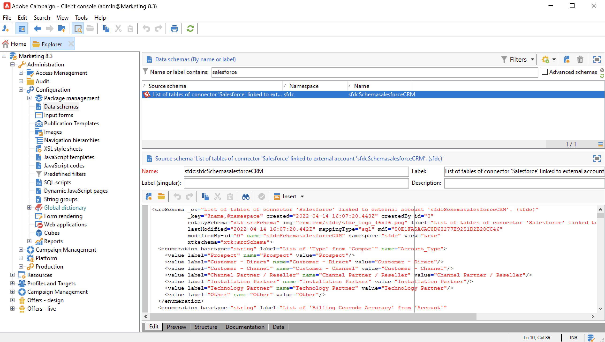
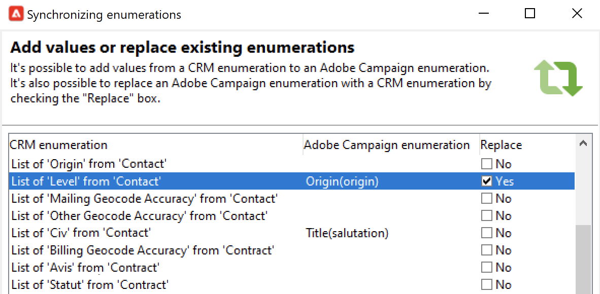

# 使用 Campaign 及 SFDC{#crm-sfdc}

瞭解如何設定Campaign CRM聯結器，將Campaign v8連線至&#x200B;**Salesforce.com**。

完成設定後，會透過專用工作流程活動在系統之間執行資料同步。 [了解更多資訊](crm-data-sync.md)。

>[!NOTE]
>
>支援的SFDC版本在Campaign [相容性矩陣](../start/compatibility-matrix.md)中詳細說明。

請依照下列步驟，設定專用的外部帳戶，將Salesforce資料匯入並匯出至Adobe Campaign。

## 建立連線{#new-sfdc-external-account}

首先，您必須建立Salesforce外部帳戶。

1. 瀏覽Campaign檔案總管的&#x200B;**[!UICONTROL Administration > Platform > External accounts]**&#x200B;節點並建立外部帳戶。
1. 在&#x200B;**型別**&#x200B;區段中選取&#x200B;**[!UICONTROL Salesforce.com]**&#x200B;外部帳戶。
1. 輸入設定以啟用連線。

   

   若要設定Salesforce CRM外部帳戶以搭配Adobe Campaign使用，您必須提供下列詳細資料：

   * 在「**[!UICONTROL Account]**」欄位中輸入您的Salesforce登入資訊。
   * 輸入您的Salesforce密碼。
   * 您可以忽略&#x200B;**[!UICONTROL Client identifier]**&#x200B;欄位。
   * 複製/貼上您的Salesforce **[!UICONTROL Security token]**
   * 選取您的&#x200B;**[!UICONTROL API version]**。 支援的SFDC API版本列於Campaign [相容性矩陣](../start/compatibility-matrix.md)。

1. 選取&#x200B;**啟用**&#x200B;選項，以在Campaign中啟用帳戶。

>[!NOTE]
>
>若要核准此設定，您必須登出並重新登入Adobe Campaign使用者端主控台。

## 選取要同步的資料表{#sfdc-create-tables}

您現在可以設定要同步處理的表格。

1. 按一下&#x200B;**[!UICONTROL Salesforce CRM configuration wizard...]**。
1. 選取要同步處理的資料表並啟動程式。
1. 檢查&#x200B;**[!UICONTROL Administration > Configuration > Data schemas]**&#x200B;節點中Adobe Campaign產生的結構描述。

   在Campaign中匯入的&#x200B;**Salesforce**&#x200B;結構描述範例：

   

## 同步分項清單{#sfdc-enum-sync}

建立結構描述後，您就可以從Salesforce自動將分項清單同步到Adobe Campaign。

1. 從&#x200B;**[!UICONTROL Synchronizing enumerations...]**&#x200B;連結開啟助理。
1. 選取符合Adobe Campaign分項清單的Salesforce分項清單。
您可以將Adobe Campaign列舉的所有值取代為CRM的值：若要這麼做，請在&#x200B;**[!UICONTROL Replace]**&#x200B;欄中選取&#x200B;**[!UICONTROL Yes]**。

   

1. 按一下&#x200B;**[!UICONTROL Next]**，然後按&#x200B;**[!UICONTROL Start]**&#x200B;開始匯入分項清單。

1. 瀏覽&#x200B;**[!UICONTROL Administration > Platform > Enumerations]**&#x200B;節點以檢查匯入的值。 在[此頁面](../config/ui-settings.md#enumerations)中進一步瞭解列舉。

Adobe Campaign和Salesforce.com現已連線。 您可以設定兩個系統之間的資料同步。

若要在Adobe Campaign資料和SFDC之間同步資料，請建立工作流程並使用&#x200B;**[!UICONTROL CRM connector]**&#x200B;活動。

在此頁面[&#128279;](crm-data-sync.md)中進一步瞭解資料同步處理。

在此頁面[&#128279;](../config/enumerations.md)中進一步瞭解Campaign 中的列舉管理。
