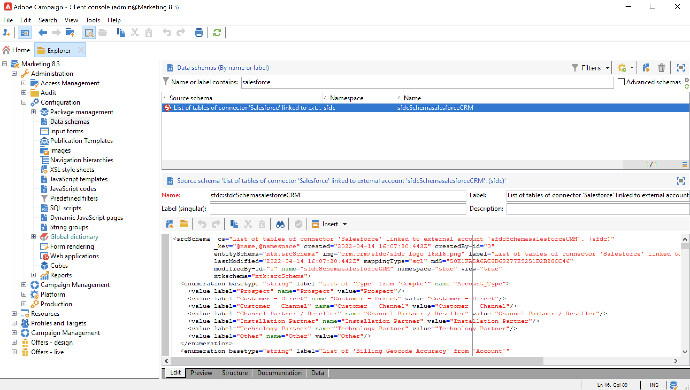

# 使用 Campaign 及 SFDC{#crm-sfdc}

瞭解如何設定Campaign CRM聯結器以將Campaign v8連線至 **Salesforce.com**.

完成設定後，會透過專用工作流程活動在系統之間執行資料同步。 [了解更多](crm-data-sync.md)。

>[!NOTE]
>
>支援的SFDC版本會在Campaign中詳細說明 [相容性矩陣](../start/compatibility-matrix.md).

請依照下列步驟，設定專用的外部帳戶，將Salesforce資料匯入和匯出至Adobe Campaign。

## 建立連線{#new-sfdc-external-account}

首先，您必須建立Salesforce外部帳戶。

1. 瀏覽 **[!UICONTROL Administration > Platform > External accounts]** 節點，並建立外部帳戶。
1. 選取 **[!UICONTROL Salesforce.com]** 中的外部帳戶 **型別** 區段。
1. 輸入設定以啟用連線。

   

   若要設定Salesforce CRM外部帳戶以搭配Adobe Campaign使用，您必須提供下列詳細資料：

   * 在「 」中輸入您的Salesforce登入資訊 **[!UICONTROL Account]** 欄位。
   * 輸入您的Salesforce密碼。
   * 您可以忽略 **[!UICONTROL Client identifier]** 欄位。
   * 複製/貼上您的Salesforce **[!UICONTROL Security token]**
   * 選取您的 **[!UICONTROL API version]**. 支援的SFDC API版本列於Campaign [相容性矩陣](../start/compatibility-matrix.md).

1. 選取 **啟用** 在Campaign中啟用帳戶的選項。

>[!NOTE]
>
>若要核准此設定，您必須登出並重新登入Adobe Campaign使用者端主控台。

## 選取要同步的資料表{#sfdc-create-tables}

您現在可以設定要同步處理的表格。

1. 按一下 **[!UICONTROL Salesforce CRM configuration wizard...]**.
1. 選取要同步處理的資料表並啟動程式。
1. 檢查中Adobe Campaign產生的結構描述 **[!UICONTROL Administration > Configuration > Data schemas]** 節點。

   範例 **Salesforce** 在Campaign中匯入的結構描述：

   

## 同步分項清單{#sfdc-enum-sync}

建立結構描述後，您就可以從Salesforce自動將分項清單同步到Adobe Campaign。

1. 從以下位置開啟助理：  **[!UICONTROL Synchronizing enumerations...]** 連結。
1. 選取符合Salesforce分項清單的Adobe Campaign分項清單。
您可以將Adobe Campaign分項清單的所有值取代為CRM的值：若要這麼做，請選取 **[!UICONTROL Yes]** 在 **[!UICONTROL Replace]** 欄。

   

1. 按一下 **[!UICONTROL Next]** 然後 **[!UICONTROL Start]** 以開始匯入分項清單。

1. 瀏覽 **[!UICONTROL Administration > Platform > Enumerations]** 節點，以檢查匯入的值。 進一步瞭解中的分項清單 [此頁面](../config/ui-settings.md#enumerations).

Adobe Campaign和Salesforce.com現已連線。 您可以設定兩個系統之間的資料同步。

若要在Adobe Campaign資料和SFDC之間同步資料，請建立工作流程並使用 **[!UICONTROL CRM connector]** 活動。

進一步瞭解資料同步 [在此頁面中](crm-data-sync.md).
