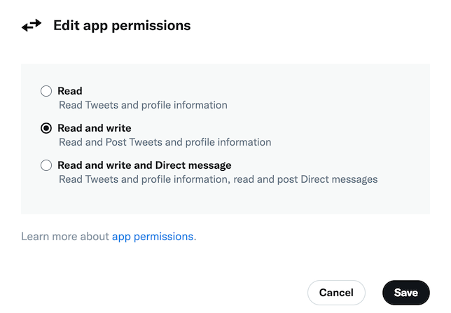

# 與運動和Twitter合作{#tw-ac-ovv}

的 **管理社交網路（社會營銷）** 模組允許您通過Twitter與客戶進行交流。 使用此功能可以：

* 發送消息 — 使用Adobe Campaign社會營銷在Twitter上發佈消息。 您還可以向所有關注者發送直接消息。

* 收集新聯繫人 — Adobe Campaign社會營銷還使得獲得新聯繫人變得容易：聯繫用戶並詢問他們是否想共用其個人資料資訊。 如果他們接受，Adobe Campaign會自動恢復資料，這使您能夠開展針對性活動，並在可能的情況下實施跨渠道策略。

  作為托管Cloud Services用戶， [聯繫人Adobe](../start/campaign-faq.md#support) 將競選活動與Twitter聯繫起來。 的  **管理社交網路（社會營銷）** 必須通過專用軟體包在您的環境中安裝模組。

要配置Adobe Campaign將推文發佈到Twitter帳戶，請為這些帳戶委派對Adobe Campaign的寫權限。 操作步驟：

1. 建立Twitter帳戶
1. 建立testTwitter帳戶以發送校樣
1. 建立Twitter應用程式(每個Twitter帳戶一個應用程式)
1. 為 **[!UICONTROL Twitter]** (每個Twitter帳戶一次服務)

## 在Twitter建立test帳戶 {#tw-test-account}

除Twitter帳戶外，建立可用於發送的Twitter私人帳戶 [推特證明](../send/twitter.md#send-tw-proofs)。 要執行此操作，請遵循下列步驟：

1. 新建Twitter帳戶。
1. 訪問帳戶  **設定**。
1. 瀏覽到 **隱私和安全** 和 **受眾和標籤** 檢查 **Protect你的推文** 的雙曲餘切值。 您的Tweets和其他帳戶資訊僅對關注您的人可見。

## 在Twitter建立應用程式 {#create-an-app-on-twitter}

建立Twitter應用程式，使Adobe Campaign能夠將推文發佈到你的Twitter帳戶。  要執行此操作，請遵循下列步驟：

1. 登錄你的Twitter帳戶。
1. 連接到 [Twitter開發商門戶](https://developer.twitter.com/en/apps)。
1. 選擇 **建立應用**。
1. 讓Twitter助理指導你完成這個過程。

   要允許Adobe Campaign將推文發佈到您的帳戶，請編輯到 **權限** 頁籤，然後選擇 **讀寫** 為 **訪問** 的子菜單。 在 **設定** 的 **回調URL** 欄位為空。

   

>[!NOTE]
>
>每個Twitter帳戶需要一個應用程式。 因此，您必須建立另一個test應用程式，以向test帳戶發送證據。

## 在市場活動中建立Twitter服務 {#create-tw-service}

要將您的活動實例與您的Twitter帳戶連結，請建立 **Twitter** 服務和委派市場活動的寫權限。

要輸入設定，必須同時訪問您的Adobe Campaign控制台和Twitter帳戶：

1. 開啟 **Twitter**，從 [「項目和應用」頁](https://developer.twitter.com/en/portal/projects-and-apps)，選擇以前建立的應用。 訪問 **應用權限**。

   

   編輯 **密鑰和令牌** 頁籤以訪問您的應用詳細資訊。

1. 在 **Adobe Campaign**，瀏覽至 **[!UICONTROL Profiles and targets]** ，然後選擇 **[!UICONTROL Services and Subscriptions]** 連結
1. 建立新服務。
1. 選擇 **[!UICONTROL Twitter]** 的雙曲餘切值。

   >[!NOTE]
   >
   >的 **[!UICONTROL Synchronize subscriptions]** 選項預設啟用：此選項可自動恢復您的Twitter關注者清單，以便您 [發送直接消息](../send/twitter.md#direct-tw-messages)。 同步由 [專用技術工作流](#synchro-tw-accounts)。

1. 輸入服務的標籤和內部名稱。

   >[!CAUTION]
   >
   >的 **[!UICONTROL Internal name]** 必須與你的Twitter賬戶同名。

   要檢查設定，您可以：

   * 按一下 **[!UICONTROL Save]** 按鈕。
   * 在服務概述中，選擇 **Twitter** 服務。
   * 瀏覽 **[!UICONTROL Twitter page]** 頁籤：你的Twitter帳戶應該顯示。

1. 預設情況下，跟隨者將保存在 **[!UICONTROL Visitors]** 的子菜單。 可以從 **[!UICONTROL Visitor folder]** 的子菜單。 [了解更多](../send/twitter.md#direct-tw-messages)

1. 從你的Twitter應用，複製 **[!UICONTROL Consumer Key (API Key)]** 和 **[!UICONTROL Consumer Secret (API Secret)]** 將其貼上到 **[!UICONTROL Consumer key]** 和 **[!UICONTROL Consumer secret]** 活動欄位 **Twitter** 服務。

1. 從你的Twitter應用，複製 **[!UICONTROL Access Token]** 和 **[!UICONTROL Access Token Secret]** 將其貼上到 **[!UICONTROL Access token]** 和 **[!UICONTROL Access token secret]** 活動欄位 **Twitter** 服務。

1. 在市場活動客戶端控制台中，按一下 **[!UICONTROL Save]**。 您現在已將寫權限授予Adobe Campaign。

>[!NOTE]
>
>建立一個 **Twitter** 每個Twitter帳戶的服務。 因此，您必須建立另一個test服務，以向test帳戶發送證據。

## 同步您的Twitter帳戶 {#synchro-tw-accounts}

市場活動和Twitter之間的同步通過專用的技術工作流進行管理。 這些工作流儲存在 **[!UICONTROL Administration > Production > Technical workflows > Managing social networks]** 的子菜單。

預設情況下，它們會停止：您必須在開始使用 **社會營銷** 中。

的 **[!UICONTROL Twitter account synchronization]** 技術工作流使TwitterAdobe Campaign帳戶同步。 此工作流恢復Twitter關注者清單，以便您可以直接向他們發送消息。 [了解更多](../send/twitter.md#direct-tw-messages)

預設情況下，此工作流會在每週四的早上7:30觸發。 您可以使用 **[!UICONTROL Execute pending task(s) now]** 選項，以隨時啟動此整合。  您還可以編輯調度程式以更改工作流觸發頻率。 在 [Campaign Classic v7 文件](https://experienceleague.adobe.com/docs/campaign-classic/using/automating-with-workflows/flow-control-activities/scheduler.html){target=&quot;_blank&quot;} 深入瞭解。

>[!CAUTION]
>
>要恢復Twitter訂戶清單， **[!UICONTROL Twitter account synchronization]** 必須選中連結到帳戶的服務。 [了解更多](#create-tw-service)

跟隨者儲存在特定表中：來賓桌。 要顯示Twitter關注者清單，請瀏覽至 **[!UICONTROL Profiles and Targets > Visitors]**。

對於每個追隨者，Adobe Campaign儲存以下資訊：

* **[!UICONTROL Origin]**:社交網路名稱(Twitter)
* **[!UICONTROL External ID]**:用戶標識符
* **[!UICONTROL User name]**:用戶的帳戶名
* **[!UICONTROL Full name]**:用戶名稱
* **[!UICONTROL Language]**:用戶語言
* **[!UICONTROL Number of friends]**:關注者數
* **[!UICONTROL Time zone]**:用戶時區
* **[!UICONTROL Verified]**:此欄位指示用戶是否具有已驗證的Twitter帳戶

完成此配置後，您可以將tweets發佈到您的Twitter帳戶，並將直接消息發送給您的關注者。 [了解更多](../send/twitter.md)
