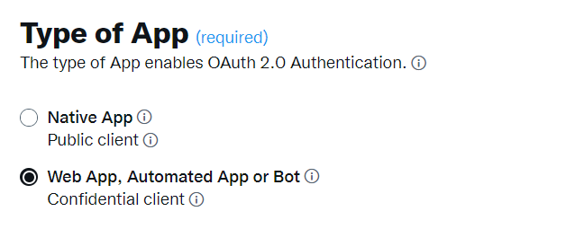
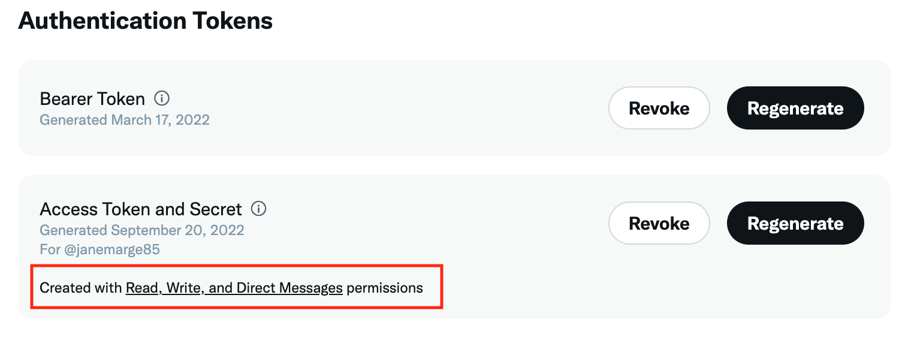
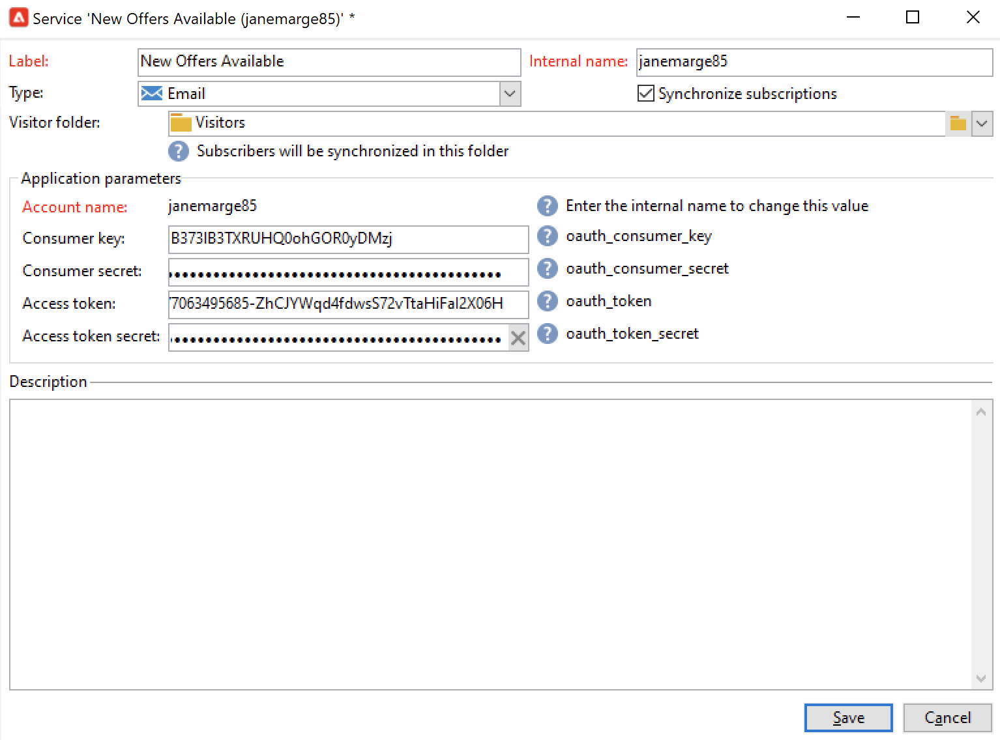

# 合作使用行銷活動與Twitter{#tw-ac-ovv}

此 **管理社交網路（社交行銷）** 模組可讓您透過Twitter與客戶互動。 此功能可用於：

* 張貼訊息及傳送DM — 使用Adobe Campaign社交行銷在Twitter上張貼訊息。 您也可以傳送直接訊息給所有追隨者。

* 收集新連絡人 — Adobe Campaign社交行銷也可讓您輕鬆取得新連絡人：聯絡使用者並詢問他們是否要分享其設定檔資訊。 如果他們接受，Adobe Campaign會自動復原資料，讓您能夠執行目標定位行銷活動，並儘可能實施跨管道策略。

 作為「受管理的Cloud Service」使用者， [連絡人Adobe](../start/campaign-faq.md#support) 以連結Campaign與Twitter。 此  **管理社交網路（社交行銷）** 附加元件必須透過專用套件安裝在您的環境中，且必須設定Twitter外部帳戶。

若要設定Adobe Campaign將推文張貼至您的Twitter帳戶，請委派這些帳戶的Adobe Campaign寫入許可權。 若要這麼做，您必須：

1. 建立Twitter帳戶並註冊開發人員帳戶。 [了解更多](#dev-account)
1. （選用）建立測試Twitter帳戶以傳送校樣。 [了解更多](#tw-test-account)
1. 建立Twitter應用程式(每個Twitter帳戶一個應用程式)。 [了解更多](#create-an-app-on-twitter)
1. 建立新的服務 **[!UICONTROL Twitter]** (每個Twitter帳戶一個服務)。 [了解更多](#create-tw-service)
1. 將您的Twitter帳戶與Campaign同步。 [了解更多](#synchro-tw-accounts)

## twitter開發人員帳戶 {#dev-account}

若要開始進行此整合，您必須註冊 [twitter開發人員帳戶](https://developer.twitter.com){target="_blank"}.

Campaign使用Twitter API 1.1版。 若要使用它，您必須透過開發人員入口網站套用提升的存取權。 深入瞭解Twitter已提升的存取權 [在此頁面中](https://developer.twitter.com/en/portal/products/elevated){target="_blank"}.

## 在Twitter上建立應用程式 {#create-an-app-on-twitter}

在您獲得提升存取權的核准後，請建立Twitter應用程式，以讓Adobe Campaign將推文張貼至您的Twitter帳戶。 要執行此操作，請遵循下列步驟：

1. 登入您的Twitter帳戶。
1. 連線到 [twitter開發人員入口網站](https://developer.twitter.com/en/apps).
1. 選取 **建立應用程式**.
1. 讓Twitter助理引導您完成程式。
1. 若要允許Adobe Campaign將推文張貼至您的帳戶，請編輯至 **應用程式許可權** 從應用程式的「使用者驗證設定」區段。 選取 **讀取、寫入和直接訊息**.

   

1. 在 **應用程式型別** 區段，選取 **網頁應用程式、自動化應用程式或機器人**. 您可以離開 **回呼URL** 欄位空白，並儲存您的設定。

   

1. 返回您的應用程式控制面板，選取您的應用程式並瀏覽至 **金鑰和權杖** 標籤。 在 **存取權杖和密碼**，如果 **讀取、寫入和直接訊息** 未提及許可權，您必須重新產生應用程式的權杖和密碼。 請注意，所有金鑰和權杖在建立後即必須儲存。 您需要他們來設定您的CampaignTwitter服務。

   

>[!NOTE]
>
>每個Twitter帳戶需要一個應用程式。 因此，您必須建立另一個測試應用程式，以將校樣傳送至您的測試帳戶。
>

## 在Campaign中建立Twitter服務 {#create-tw-service}

若要將Campaign執行個體與Twitter帳戶連結，請建立 **twitter** 服務並委派對Campaign的寫入許可權。

>[!CAUTION]
>
>建立一個 **twitter** 每個Twitter帳戶的服務。 因此，您必須建立其他測試服務以傳送校樣給您的 [測試帳戶](#tw-test-account).
>
>每個 **twitter** 服務也必須在您的MID執行個體上由Adobe建立。 請聯絡您的Adobe代表來設定您的環境。
>

若要輸入設定，您必須同時存取Adobe Campaign使用者端主控台和Twitter應用程式許可權。

1. 在 **Adobe Campaign**，瀏覽至 **[!UICONTROL Profiles and targets]** 標籤，然後選取 **[!UICONTROL Services and Subscriptions]** 連結
1. 建立新的服務。
1. 選取 **[!UICONTROL Twitter]** 型別。
1. 輸入服務的標籤和內部名稱。

   >[!CAUTION]
   >
   >此 **[!UICONTROL Internal name]** 服務的名稱必須與您的Twitter帳戶完全相同。
   >

1. 依預設，跟隨者會儲存在 **[!UICONTROL Visitors]** 資料夾。 您可以從以下位置選擇其他位置： **[!UICONTROL Visitor folder]** 欄位。 [了解更多](../send/twitter.md#direct-tw-messages)

   

   >[!NOTE]
   >
   >此 **[!UICONTROL Synchronize subscriptions]** 選項預設為啟用：此選項會自動復原Twitter跟隨者清單，讓您可以 [傳送直接訊息給他們](../send/twitter.md#direct-tw-messages). 同步作業是由 [專屬技術工作流程](#synchro-tw-accounts).

1. 從您的Twitter應用程式，複製 **API金鑰** 和 **[API金鑰機密]** 欄位並貼到 **[!UICONTROL Consumer key]** 和 **[!UICONTROL Consumer secret]** 行銷活動的欄位 **twitter** 服務。

1. 從您的Twitter應用程式，複製 **存取權杖** 和 **存取權杖密碼** 欄位並貼到 **[!UICONTROL Access token]** 和 **[!UICONTROL Access token secret]** 行銷活動的欄位 **twitter** 服務。

1. 在Campaign使用者端主控台中，按一下 **[!UICONTROL Save]**. 您現在已委派Adobe Campaign的寫入許可權。

若要檢查您的設定，您可以：

* 編輯 **twitter** 您剛剛建立的服務。
* 瀏覽 **[!UICONTROL Twitter page]** 標籤：您的Twitter帳戶應會顯示。
  

## 同步您的Twitter帳戶 {#synchro-tw-accounts}

Campaign與Twitter之間的同步是透過專屬的技術工作流程來管理。 這些工作流程會儲存在 **[!UICONTROL Administration > Production > Technical workflows > Managing social networks]** 資料夾。

預設會停止：當您開始使用時，必須手動啟動這些專案 **社交行銷** 模組。

此 **[!UICONTROL Synchronization of Twitter accounts]** 技術工作流程會在Adobe Campaign中同步Twitter帳戶。 此工作流程會復原Twitter追隨者清單，以便您向其傳送直接訊息。 [了解更多](../send/twitter.md#direct-tw-messages)

預設會每星期四早上7:30觸發此工作流程。 您可以使用 **[!UICONTROL Execute pending task(s) now]** 可在您實作此整合時隨時啟動工作流程的選項。  您也可以編輯排程器以變更工作流程觸發頻率。 在[本頁](../../automation/workflow/scheduler.md)中瞭解更多。

>[!CAUTION]
>
>若要復原Twitter訂閱者清單，請 **[!UICONTROL Twitter account synchronization]** 對於連結至帳戶的服務，必須核取選項。 [了解更多](#create-tw-service)

跟隨者儲存在特定表格中：訪客表格。 若要顯示Twitter跟隨者清單，請瀏覽至 **[!UICONTROL Profiles and Targets > Visitors]**.

Adobe Campaign會針對每位追隨者儲存下列資訊：

* **[!UICONTROL Origin]**: Twitter
* **[!UICONTROL External ID]**：使用者識別碼
* **[!UICONTROL Username]**：使用者的帳戶名稱
* **[!UICONTROL Full name]**：使用者名稱
* **[!UICONTROL Number of friends]**：跟隨者數
* **[!UICONTROL Checked]**：此欄位會指出使用者是否擁有已驗證的Twitter帳戶

完成此設定後，您就可以將推文張貼至您的Twitter帳戶，並將直接訊息傳送給您的追隨者。 [了解更多](../send/twitter.md)

## 在Twitter上建立測試帳戶 {#tw-test-account}

除了Twitter帳戶，請建立私人Twitter帳戶，以便用於傳送 [推文校樣](../send/twitter.md#send-tw-proofs). 要執行此操作，請遵循下列步驟：

1. 建立新的Twitter帳戶。
1. 存取帳戶  **設定**.
1. 瀏覽至 **隱私權與安全性** 和 **對象與標籤** 並檢視 **Protect您的推文** 選項。 您的推文和其他帳戶資訊只會顯示給關注您的人。

如上所述，設定您的Twitter應用程式和Campaign服務以搭配此測試帳戶使用。
