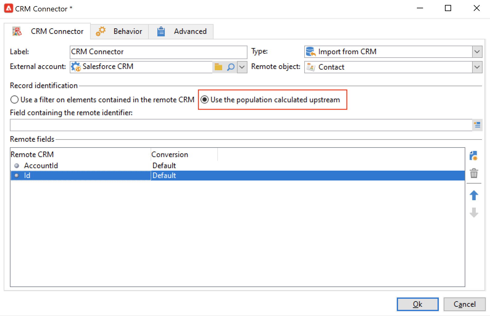
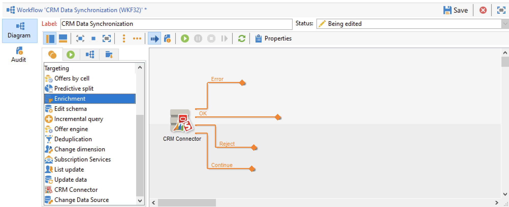

# 在市場活動和您的CRM之間同步資料 {#data-synchronization}

Adobe Campaign與您的CRM之間的資料同步由 **CRM連接器** 工作流活動。

例如，要將MicrosoftDynamics資料導入Adobe Campaign，請建立以下類型的工作流：

此工作流通過Microsoft動態導入聯繫人，將其與現有Adobe Campaign資料同步，刪除重複的聯繫人，並更新Adobe Campaign資料庫。

的 **[!UICONTROL CRM Connector]** 需要配置活動以同步資料。

通過此活動，您可以：

* 從CRM導入 —  [瞭解更多資訊](#importing-from-the-crm)
* 導出到CRM - [瞭解更多資訊](#exporting-to-the-crm)
* 導入CRM中刪除的對象 —  [瞭解更多資訊](#importing-objects-deleted-in-the-crm)
* 刪除CRM中的對象 —  [瞭解更多資訊](#deleting-objects-in-the-crm)

選擇與要配置同步的CRM匹配的外部帳戶，然後選擇要同步的對象：客戶、機會、線索、聯繫人等。

此活動的配置取決於要執行的進程。 下面詳細介紹了各種配置。

## 從CRM導入 {#importing-from-the-crm}

要通過Adobe Campaign的CRM導入資料，您需要建立以下類型的工作流：

1. 選擇 **[!UICONTROL Import from the CRM]** 的下界。
1. 在 **[!UICONTROL Remote object]** 下拉清單中，選擇要導入的對象。 此對象與連接器配置期間在Adobe Campaign建立的表之一匹配。
1. 在 **[!UICONTROL Remote fields]** 的子菜單。

   要添加欄位，請按一下 **[!UICONTROL Add]** 按鈕 **[!UICONTROL Edit expression]** 表徵圖

   如有必要，請使用 **[!UICONTROL Conversion]** 的子菜單。 有關可能的轉換類型的詳細資訊，請參閱 [此部分](#data-format)。

   >[!CAUTION]
   >
   >CRM中記錄的標識符對於連結CRM和Adobe Campaign中的對象是必需的。 當箱被批准時，系統會自動添加它。
   >
   >對於增量資料導入，CRM端上的最後修改日期也是必需的。

1. 您可以根據需要篩選要導入的資料。 要執行此操作，請按一下 **[!UICONTROL Edit the filter...]** 的子菜單。

   在以下示例中，Adobe Campaign將只導入自2021年11月1日以來記錄了某些活動的聯繫人。

   

   >[!CAUTION]
   >
   >有關資料篩選模式的限制，請參見 [此部分](#filtering-data)。

1. 選擇 **[!UICONTROL Use automatic index...]** 選項，根據日期和上次修改日期自動管理CRM和Adobe Campaign之間的增量對象同步。

   如需詳細資訊，請參閱[本章節](#variable-management)。

### 管理變數 {#variable-management}

激活 **[!UICONTROL Automatic index]** 選項，以僅收集自上次導入後修改的對象。

預設情況下，上次同步的日期儲存在配置窗口中指定的選項中： **LASTIMPORT_&lt;%=instance.internalName%>_&lt;%=activityName%>**。

>[!NOTE]
>
>此注釋僅適用於類屬 **[!UICONTROL CRM Connector]** 的子菜單。 對於其他CRM活動，流程是自動的。
>
>必須手動建立並填充此選項 **[!UICONTROL Administration]** > **[!UICONTROL Platform]** > **[!UICONTROL Options]**。 它必須是文本選項，其值需要與以下格式匹配： **yyyy/MM/dd hh:mm:ss**。
> 
>需要手動更新此選項才能進一步導入。

您可以指定要考慮的遠程CRM欄位，以標識最近的更改。

預設情況下，使用以下欄位（按指定順序）:

* Microsoft動力： **修改**。
* 對於Salesforce.com: **上次修改日期**。 **SystemModstamp**。

激活 **[!UICONTROL Automatic index]** 選項生成三個變數，這些變數可通過 **[!UICONTROL JavaScript code]** 鍵入活動。 這些活動包括：

* **vars.crmOptionName**:包含上次導入日期的選項的名稱。
* **vars.crmStartImport**:上次資料導入的開始日期（包括）。
* **vars.crmEndDate**:上次資料導入的結束日期（排除）。

   >[!NOTE]
   >
   >這些日期以下列格式顯示： **yyyy/MM/dd hh:mm:ss**。

### 篩選資料 {#filtering-data}

為確保各種CRM的有效操作，需要使用以下規則建立篩選器：

* 每個篩選級別只能使用一種類型的運算子。
* 不支援AND NOT運算子。
* 比較可能只涉及空值(&#39;is empty&#39;/&#39;is not empty&#39; type)或數字。 這意味著值（右欄）將被評估，此評估的結果必須是數字。 因此不支援JOIN類型比較。
* 右側列中包含的值將在JavaScript中評估。
* 不支援JOIN比較。
* 左側列中的表達式必須是欄位。 它不能是多個表達式、數字等的組合。

### 排序依據 {#order-by}

在MicrosoftDynamics和Salesforce.com中，您可以按升序或降序對要導入的遠程欄位進行排序。

要執行此操作，請按一下 **[!UICONTROL Order by]** 連結並將列添加到清單中。

清單中列的順序是排序順序：

### 記錄標識 {#record-identification}

您可以使用在工作流中預先計算的填充，而不是導入CRM中包含的（或可能過濾的）元素。

要執行此操作，請選擇 **[!UICONTROL Use the population calculated upstream]** 選項並指定包含遠程標識符的欄位。

然後選擇要導入的入站人口欄位，如下所示：

## 導出到CRM {#exporting-to-the-crm}

將Adobe Campaign資料導出到CRM中，以將其整個內容複製到CRM資料庫。

要將資料導出到CRM，請建立以下類型的工作流：

1. 選擇 **[!UICONTROL Export to CRM]** 的下界。
1. 轉到 **[!UICONTROL Remote object]** 下拉清單，然後選擇要導出的對象。 此對象與連接器配置期間在Adobe Campaign建立的一個表匹配。

   >[!CAUTION]
   >
   >的導出函式 **[!UICONTROL CRM Connector]** 活動可以在CRM上插入或更新欄位。 要在CRM中啟用欄位更新，請指定遠程表的主鍵。 如果缺少密鑰，則將插入資料，而不是更新資料。

1. 如果需要執行更快的導出，請檢查  **[!UICONTROL Export in Batches]** 的雙曲餘切值。

   

1. 在 **[!UICONTROL Mapping]** ，按一下 **[!UICONTROL New]** 指定要導出的欄位及其在CRM中的映射。

   要添加欄位，請按一下 **[!UICONTROL Add]** 按鈕 **[!UICONTROL Edit expression]** 表徵圖

   >[!NOTE]
   >
   >如果沒有為欄位定義匹配項，則無法更新這些值：它們直接插入到您的CRM中。

   如有必要，請使用 **[!UICONTROL Conversion]** 的子菜單。 有關可能的轉換類型的詳細資訊，請參閱 [此部分](#data-format)。

   >[!NOTE]
   >
   >要導出的記錄清單和導出結果將保存在臨時檔案中，該臨時檔案在工作流完成或重新啟動之前仍可訪問。 這樣，您就可以在發生錯誤時安全地啟動進程。

## 其他設定 {#additional-configurations}

### 資料格式 {#data-format}

在將資料格式導入到CRM或從CRM中時，可以即時轉換資料格式。

為此，請選擇要在匹配列中應用的轉換。

的 **[!UICONTROL Default]** 模式應用自動資料轉換，在大多數情況下，這等於資料的複製/貼上。 但是，應用了時區管理。

其他可能的轉換包括：

* **[!UICONTROL Date only]**:刪除日期+時間類型欄位。
* **[!UICONTROL Without time offset]**:取消在預設模式下應用的時區管理。
* **[!UICONTROL Copy/Paste]**:使用原始資料，如字串（無轉換）。

### 處理錯誤 {#error-processing}

在資料導入或導出的框架中，您可以對錯誤和拒絕應用特定流程。 要執行此操作，請選擇 **[!UICONTROL Keep the rejections in a file]** 和 **[!UICONTROL Process errors]** 的 **[!UICONTROL Behavior]** 頁籤。

這些選項將添加相關的輸出過渡。

然後插入相關活動以處理資料。 例如，添加 **等待** 活動和計畫重試錯誤。

的 **[!UICONTROL Reject]** 輸出轉換允許您訪問包含與錯誤消息和代碼相關的特定列的輸出方案。 對於Salesforce.com，此列為 **錯誤符號** （錯誤符號，與錯誤代碼不同）, **錯誤消息** （錯誤上下文的說明）。

## 導入在CRM中刪除的對象 {#importing-objects-deleted-in-the-crm}

您可以將CRM中刪除的對象導入Adobe Campaign。

1. 選擇 **[!UICONTROL Import objects deleted in the CRM]** 的下界。
1. 轉到 **[!UICONTROL Remote object]** 下拉清單，然後選擇進程所關注的對象。 此對象與連接器配置期間在Adobe Campaign建立的一個表匹配。
1. 指定要在 **[!UICONTROL Start date]** 和 **[!UICONTROL End date]** 欄位（包括日期）。

   >[!CAUTION]
   >
   >刪除期間必須與CRM特定限制一致。 例如，對於Salesforce.com，無法恢復30天前刪除的元素。

## 刪除CRM中的對象 {#deleting-objects-in-the-crm}

要刪除CRM上的對象，請指定要刪除的遠程元素的主鍵。

的 **[!UICONTROL Behavior]** 頁籤中，您可以啟用拒絕處理。 此選項為 **[!UICONTROL CRM connector]** 的子菜單。 有關此內容的詳細資訊，請參閱 [處理錯誤](#error-processing)。
