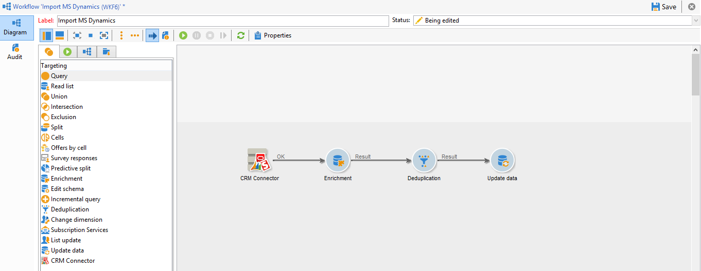

# 在Campaign與您的CRM之間同步資料 {#data-synchronization}

Adobe Campaign與您的CRM之間的資料同步是由 **CRM聯結器** 工作流程活動。

例如，若要將Microsoft Dynamics資料匯入Adobe Campaign，請建立下列型別的工作流程：

此工作流程會透過Microsoft Dynamics匯入連絡人、將其與現有Adobe Campaign資料同步、刪除重複的連絡人，以及更新Adobe Campaign資料庫。

此 **[!UICONTROL CRM Connector]** 活動必須設定為同步資料。

透過此活動，您可以：

* 從CRM匯入 —  [瞭解更多](#importing-from-the-crm)
* 匯出至CRM - [瞭解更多](#exporting-to-the-crm)
* 匯入在CRM中刪除的物件 —  [瞭解更多](#importing-objects-deleted-in-the-crm)
* 刪除CRM中的物件 —  [瞭解更多](#deleting-objects-in-the-crm)

選取符合您要設定同步化之CRM的外部帳戶，然後選取要同步的物件：帳戶、商機、潛在客戶、聯絡人等。

此活動的設定取決於要執行的程式。 各種設定詳見下文。

## 從CRM匯入 {#importing-from-the-crm}

若要透過Adobe Campaign中的CRM匯入資料，您需要建立以下型別的工作流程：

1. 選取 **[!UICONTROL Import from the CRM]** 作業。
1. 在 **[!UICONTROL Remote object]** 下拉式清單，選取要匯入的物件。 此物件與聯結器設定期間在Adobe Campaign中建立的其中一個表格相符。
1. 在 **[!UICONTROL Remote fields]** 區段，輸入要匯入的欄位。

   若要新增欄位，請按一下 **[!UICONTROL Add]** 按鈕，然後按一下 **[!UICONTROL Edit expression]** 圖示。

   如有需要，請使用 **[!UICONTROL Conversion]** 欄。 中會詳細說明可能的轉換型別 [本節](#data-format).

   >[!CAUTION]
   >
   >CRM中記錄的識別碼在CRM和Adobe Campaign中連結物件時是必要的。 該方塊獲核准後會自動新增。
   >
   >增量資料匯入也必須遵守CRM端的最後修改日期。

1. 您可以根據需求篩選要匯入的資料。 若要這麼做，請按一下 **[!UICONTROL Edit the filter...]** 連結。

   在下列範例中，Adobe Campaign只會匯入自2021年11月1日起已記錄某些活動的聯絡人。

   

   >[!CAUTION]
   >
   >與資料篩選模式相關的限制詳見 [本節](#filtering-data).

1. 選取 **[!UICONTROL Use automatic index...]** 根據日期和上次修改時間，自動管理CRM與Adobe Campaign之間的增量物件同步選項。

   如需詳細資訊，請參閱[本章節](#variable-management)。

### 管理變數 {#variable-management}

啟動 **[!UICONTROL Automatic index]** 僅收集自上次匯入後修改之物件的選項。

依照預設，上次同步化的日期會儲存在組態視窗中指定的選項中： **LASTIMPORT_&lt;%=instance.internalName%>_&lt;%=activityName%>**.

>[!NOTE]
>
>此附註僅適用於類屬 **[!UICONTROL CRM Connector]** 活動。 對於其他CRM活動，此程式是自動的。
>
>此選項必須手動建立並填入 **[!UICONTROL Administration]** > **[!UICONTROL Platform]** > **[!UICONTROL Options]**. 它必須是文字選項，其值必須符合以下格式： **yyyy/MM/dd hh:mm:ss**.
> 
>您必須手動更新此選項才能進一步匯入。

您可以指定要考慮的遠端CRM欄位，以識別最近的變更。

依預設，會使用下列欄位（依指定順序）：

* 若為Microsoft Dynamics： **modifiedon**，
* 若為Salesforce.com： **LastModifieddate**， **SystemModstamp**.

啟用 **[!UICONTROL Automatic index]** 選項會產生三個變數，這些變數可以透過用於同步工作流程的 **[!UICONTROL JavaScript code]** 型別活動。 這些活動包括：

* **vars.crmOptionName**：包含上次匯入日期的選項名稱。
* **vars.crmStartImport**：上次匯入資料的開始日期（含）。
* **vars.crmEndDate**：上次匯入資料的結束日期（已排除）。

   >[!NOTE]
   >
   >這些日期會以下列格式顯示： **yyyy/MM/dd hh:mm:ss**.

### 篩選資料 {#filtering-data}

為確保各種CRM的有效運作，篩選器需要使用下列規則建立：

* 每個篩選層級只能使用一種型別的運運算元。
* 不支援AND NOT運運算元。
* 比較可能只涉及null值（&#39;is empty&#39;/&#39;is not empty&#39;型別）或數字。 這表示會評估值（右側欄），且此評估的結果必須是數字。 因此，不支援JOIN型別比較。
* 右側欄中包含的值是在JavaScript中評估。
* 不支援JOIN比較。
* 左側欄中的運算式必須是欄位。 不能是多個運算式、數字等的組合。

### 排序方式 {#order-by}

在Microsoft Dynamics和Salesforce.com中，您可以依遞增或遞減順序排序要匯入的遠端欄位。

若要這麼做，請按一下 **[!UICONTROL Order by]** 連結並新增欄至清單。

清單中的欄順序是排序順序：

### 記錄識別 {#record-identification}

您可以使用工作流程中預先計算的母體，不必匯入CRM中包含（並可能經過篩選）的元素。

若要這麼做，請選取 **[!UICONTROL Use the population calculated upstream]** 選項並指定包含遠端識別碼的欄位。

然後選取您要匯入之入站母體的欄位，如下所示：

## 匯出至CRM {#exporting-to-the-crm}

將Adobe Campaign資料匯出至您的CRM，以將其整個內容複製到您的CRM資料庫。

若要將資料匯出至您的CRM，請建立以下工作流程型別：

1. 選取 **[!UICONTROL Export to CRM]** 作業。
1. 前往 **[!UICONTROL Remote object]** 下拉式清單，並選取要匯出的物件。 此物件符合聯結器設定期間在Adobe Campaign中建立的其中一個表格。

   >[!CAUTION]
   >
   >的匯出函式 **[!UICONTROL CRM Connector]** 活動可在您的CRM上插入或更新欄位。 若要在CRM中啟用欄位更新，請指定遠端表格的主索引鍵。 如果缺少索引鍵，則會插入資料，而不會更新。

1. 如果您需要執行更快速的匯出，請檢查  **[!UICONTROL Export in Batches]** 選項。

   

1. 在 **[!UICONTROL Mapping]** 區段，按一下 **[!UICONTROL New]** 以指定要匯出的欄位及其在CRM中的對應。

   若要新增欄位，請按一下 **[!UICONTROL Add]** 按鈕，然後按一下 **[!UICONTROL Edit expression]** 圖示。

   >[!NOTE]
   >
   >如果沒有為欄位定義相符專案，則無法更新值：這些值會直接插入您的CRM。

   如有需要，請使用 **[!UICONTROL Conversion]** 欄。 中會詳細說明可能的轉換型別 [本節](#data-format).

   >[!NOTE]
   >
   >要匯出的記錄清單和匯出的結果會儲存在暫存檔中，在工作流程完成或重新啟動之前，該暫存檔保持可存取狀態。 這可讓您在出現錯誤時安全地啟動程式。

## 其他設定 {#additional-configurations}

### 資料格式 {#data-format}

將資料格式匯入或匯出您的CRM時，您可以即時轉換資料格式。

要執行此操作，請選取要在比對欄中套用的轉換。

此 **[!UICONTROL Default]** 模式會套用自動資料轉換，在大多數情況下等於複製/貼上資料。 不過，會套用時區管理。

其他可能的轉換包括：

* **[!UICONTROL Date only]**：刪除日期+時間型別欄位。
* **[!UICONTROL Without time offset]**：取消在預設模式中套用的時區管理。
* **[!UICONTROL Copy/Paste]**：使用原始資料，例如字串（無轉換）。

### 錯誤處理 {#error-processing}

在資料匯入或匯出的架構中，您可以將特定程式套用至錯誤和拒絕。 若要這麼做，請選取 **[!UICONTROL Keep the rejections in a file]** 和 **[!UICONTROL Process errors]** 中的選項 **[!UICONTROL Behavior]** 標籤。

這些選項會新增相關的輸出轉變。

然後插入相關活動以處理資料。 例如，新增 **等待** 活動與排程錯誤重試。

此 **[!UICONTROL Reject]** 輸出轉變可讓您存取包含與錯誤訊息和程式碼相關之特定欄的輸出結構描述。 若為Salesforce.com，此欄為 **errorSymbol** （錯誤符號，與錯誤碼不同）、 **errorMessage** （錯誤內容的說明）。

## 匯入CRM中刪除的物件 {#importing-objects-deleted-in-the-crm}

您可以將CRM中刪除的物件匯入Adobe Campaign。

1. 選取 **[!UICONTROL Import objects deleted in the CRM]** 作業。
1. 前往 **[!UICONTROL Remote object]** 下拉式清單，並選取流程涉及的物件。 此物件符合聯結器設定期間在Adobe Campaign中建立的其中一個表格。
1. 指定要在中考慮的刪除期間 **[!UICONTROL Start date]** 和 **[!UICONTROL End date]** 欄位（包含日期）。

   >[!CAUTION]
   >
   >刪除期間必須與您的CRM特定限制一致。 例如Salesforce.com，30天前刪除的元素無法復原。

## 刪除 CRM 中的物件 {#deleting-objects-in-the-crm}

若要刪除CRM上的物件，請指定要刪除的遠端元素的主索引鍵。

此 **[!UICONTROL Behavior]** 索引標籤可讓您啟用拒絕處理。 此選項會為產生第二個輸出轉變 **[!UICONTROL CRM connector]** 活動。 有關詳細資訊，請參閱 [處理時發生錯誤](#error-processing).
