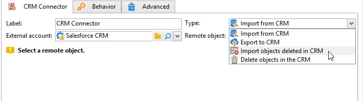

# 在Campaign和您的CRM之間同步資料 {#data-synchronization}

Adobe Campaign與您的CRM之間的資料同步是由&#x200B;**CRM Connector**&#x200B;工作流程活動所管理。

例如，若要將Microsoft Dynamics資料匯入Adobe Campaign，請建立下列型別的工作流程：

此工作流程會透過Microsoft Dynamics匯入連絡人、將其與現有的Adobe Campaign資料同步、刪除重複的連絡人，以及更新Adobe Campaign資料庫。

需要設定&#x200B;**[!UICONTROL CRM Connector]**&#x200B;活動以同步資料。

使用此活動，您可以：

* 從CRM匯入 — [深入瞭解](#importing-from-the-crm)
* 匯出至CRM - [深入瞭解](#exporting-to-the-crm)
* 匯入CRM中刪除的物件 — [深入瞭解](#importing-objects-deleted-in-the-crm)
* 刪除CRM中的物件 — [深入瞭解](#deleting-objects-in-the-crm)

選取與您要設定同步的CRM相符的外部帳戶，然後選取要同步的物件：帳戶、商機、銷售機會、聯絡人等。

此活動的設定取決於要執行的程式。 各種設定詳見下文。

## 從CRM匯入 {#importing-from-the-crm}

若要透過Adobe Campaign中的CRM匯入資料，您需要建立以下型別的工作流程：

1. 選取&#x200B;**[!UICONTROL Import from the CRM]**&#x200B;作業。
1. 在&#x200B;**[!UICONTROL Remote object]**&#x200B;下拉式清單中，選取要匯入的物件。 此物件符合聯結器設定期間在Adobe Campaign中建立的其中一個表格。
1. 在&#x200B;**[!UICONTROL Remote fields]**&#x200B;區段中，輸入要匯入的欄位。

   若要新增欄位，請按一下工具列中的&#x200B;**[!UICONTROL Add]**&#x200B;按鈕，然後按一下&#x200B;**[!UICONTROL Edit expression]**&#x200B;圖示。

   如有必要，請使用&#x200B;**[!UICONTROL Conversion]**&#x200B;欄的下拉式清單來變更資料格式。 在[此區段](#data-format)中詳細說明可能的轉換型別。

   >[!CAUTION]
   >
   >CRM中記錄的識別碼在CRM和Adobe Campaign中連結物件時是強制性的。 在核准此方塊時自動新增。
   >
   >增量資料匯入也必須遵守CRM端的最後修改日期。

1. 您可以根據自己的需求，篩選要匯入的資料。 若要這麼做，請按一下&#x200B;**[!UICONTROL Edit the filter...]**&#x200B;連結。

   在下列範例中，Adobe Campaign將僅匯入自2021年11月1日以來已記錄某些活動的聯絡人。

   

   >[!CAUTION]
   >
   >與資料篩選模式相關的限制在[此區段](#filtering-data)中有詳細說明。

1. 選取&#x200B;**[!UICONTROL Use automatic index...]**&#x200B;選項，根據日期及上次修改時間，自動管理CRM與Adobe Campaign之間的增量物件同步。

   如需詳細資訊，請參閱[本章節](#variable-management)。

### 管理變數 {#variable-management}

啟動&#x200B;**[!UICONTROL Automatic index]**&#x200B;選項，僅收集自上次匯入後修改的物件。

上次同步化的日期儲存在組態視窗中指定的選項中，預設為： **LASTIMPORT_&lt;%=instance.internalName%>_&lt;%=activityName%>**。

>[!NOTE]
>
>此附註僅適用於一般&#x200B;**[!UICONTROL CRM Connector]**&#x200B;活動。 對於其他CRM活動，此程式是自動的。
>
>此選項必須手動建立並填入&#x200B;**[!UICONTROL Administration]** > **[!UICONTROL Platform]** > **[!UICONTROL Options]**&#x200B;下。 它必須是文字選項，其值必須符合下列格式： **`yyyy/MM/dd hh:mm:ss`**。
> 
>您必須手動更新此選項才能進行進一步的匯入。

您可以指定要考慮的遠端CRM欄位，以識別最近的變更。

依預設，會使用下列欄位（依指定順序）：

* 對於Microsoft Dynamics： **modifiedon**，
* 針對Salesforce.com： **LastModifiedDate**，**SystemModstamp**。

啟用&#x200B;**[!UICONTROL Automatic index]**&#x200B;選項會產生三個變數，這些變數可以透過&#x200B;**[!UICONTROL JavaScript code]**&#x200B;型別活動用於同步工作流程中。 這些活動包括：

* **vars.crmOptionName**：包含上次匯入日期的選項名稱。
* **vars.crmStartImport**：上次資料匯入的開始日期（包含）。
* **vars.crmEndDate**：上次資料匯入的結束日期（已排除）。

  >[!NOTE]
  >
  >這些日期會以下列格式顯示： **`yyyy/MM/dd hh:mm:ss`**。

### 篩選資料 {#filtering-data}

為確保各種CRM的有效運作，需要使用下列規則建立篩選器：

* 每個篩選層級只能使用一種運運算元型別。
* 不支援AND NOT運運算元。
* 比較可能只涉及null值（&#39;is empty&#39;/&#39;is not empty&#39;型別）或數字。 這表示會評估值（右側欄），且此評估的結果必須是數字。 因此，不支援JOIN型別比較。
* 右側欄中包含的值是在JavaScript中評估。
* 不支援JOIN比較。
* 左側欄中的運算式必須是欄位。 不可由數個運算式、數字等組成。

### 排序依據 {#order-by}

在Microsoft Dynamics和Salesforce.com中，您可以依照遞增或遞減順序來排序要匯入的遠端欄位。

若要這麼做，請按一下&#x200B;**[!UICONTROL Order by]**&#x200B;連結，並將欄新增至清單。

清單中的欄順序是排序順序：

### 記錄識別 {#record-identification}

您可以使用工作流程中預先計算的母體，不必匯入CRM中包含（並可能經過篩選）的元素。

若要這麼做，請選取&#x200B;**[!UICONTROL Use the population calculated upstream]**&#x200B;選項，並指定包含遠端識別碼的欄位。

然後選取您要匯入之入站母體的欄位，如下所示：

## 匯出至CRM {#exporting-to-the-crm}

將Adobe Campaign資料匯出至您的CRM，以將其整個內容複製到您的CRM資料庫。

若要將資料匯出至您的CRM，請建立以下型別的工作流程：

1. 選取&#x200B;**[!UICONTROL Export to CRM]**&#x200B;作業。
1. 移至&#x200B;**[!UICONTROL Remote object]**&#x200B;下拉式清單，並選取要匯出的物件。 此物件在聯結器設定期間與Adobe Campaign中建立的其中一個表格相符。

   >[!CAUTION]
   >
   >**[!UICONTROL CRM Connector]**&#x200B;活動的匯出函式可以在您的CRM上插入或更新欄位。 若要在CRM中啟用欄位更新，請指定遠端表格的主索引鍵。 如果索引鍵遺失，則會插入資料，而非更新資料。

1. 如果您需要執行更快速的匯出，請核取&#x200B;**[!UICONTROL Export in Batches]**&#x200B;選項。

   

1. 在&#x200B;**[!UICONTROL Mapping]**&#x200B;區段中，按一下&#x200B;**[!UICONTROL New]**&#x200B;以指定要匯出的欄位及其在您CRM中的對應。

   若要新增欄位，請按一下工具列中的&#x200B;**[!UICONTROL Add]**&#x200B;按鈕，然後按一下&#x200B;**[!UICONTROL Edit expression]**&#x200B;圖示。

   >[!NOTE]
   >
   >如果欄位未定義相符專案，則無法更新值：這些值會直接插入您的CRM。

   如有必要，請使用&#x200B;**[!UICONTROL Conversion]**&#x200B;欄的下拉式清單來變更資料格式。 在[此區段](#data-format)中詳細說明可能的轉換型別。

   >[!NOTE]
   >
   >要匯出的記錄清單和匯出的結果會儲存在暫存檔案中，在工作流程完成或重新啟動之前，該暫存檔案保持可存取狀態。 這可讓您在出現錯誤時安全地啟動程式。

## 其他設定 {#additional-configurations}

### 資料格式 {#data-format}

將資料格式匯入或匯出您的CRM時，您可以即時轉換資料格式。

要執行此操作，請選取要在相符欄中套用的轉換。

**[!UICONTROL Default]**&#x200B;模式會套用自動資料轉換，在大多數情況下等於複製/貼上資料。 但是，會套用時區管理。

其他可能的轉換包括：

* **[!UICONTROL Date only]**：刪除日期+時間型別欄位。
* **[!UICONTROL Without time offset]**：取消在預設模式中套用的時區管理。
* **[!UICONTROL Copy/Paste]**：使用原始資料，例如字串（無轉換）。

### 錯誤處理 {#error-processing}

在資料匯入或匯出的架構中，您可以將特定程式套用至錯誤和拒絕。 若要這麼做，請在&#x200B;**[!UICONTROL Behavior]**&#x200B;索引標籤中選取&#x200B;**[!UICONTROL Keep the rejections in a file]**&#x200B;和&#x200B;**[!UICONTROL Process errors]**&#x200B;選項。

這些選項會新增相關的輸出轉變。

然後插入相關活動以處理資料。 例如，新增&#x200B;**等待**&#x200B;活動並排程錯誤重試。

**[!UICONTROL Reject]**&#x200B;輸出轉換可讓您存取輸出結構描述，該結構描述包含與錯誤訊息和程式碼相關的特定欄。 對於Salesforce.com，此資料行是&#x200B;**errorSymbol** （錯誤符號，與錯誤碼不同）、**errorMessage** （錯誤內容的描述）。

## 匯入CRM中刪除的物件 {#importing-objects-deleted-in-the-crm}

您可以將在CRM中刪除的物件匯入Adobe Campaign。

1. 選取&#x200B;**[!UICONTROL Import objects deleted in the CRM]**&#x200B;作業。
1. 移至&#x200B;**[!UICONTROL Remote object]**&#x200B;下拉式清單，並選取處理程式涉及的物件。 此物件在聯結器設定期間與Adobe Campaign中建立的其中一個表格相符。
1. 指定要在&#x200B;**[!UICONTROL Start date]**&#x200B;和&#x200B;**[!UICONTROL End date]**&#x200B;欄位中考慮的刪除期間（包含日期）。

   >[!CAUTION]
   >
   >刪除期間必須符合您的CRM特定限制。 例如Salesforce.com，超過30天前刪除的元素無法復原。

## 刪除 CRM 中的物件 {#deleting-objects-in-the-crm}

若要刪除CRM上的物件，請指定要刪除之遠端元素的主索引鍵。

**[!UICONTROL Behavior]**&#x200B;索引標籤可讓您啟用拒絕處理。 此選項會為&#x200B;**[!UICONTROL CRM connector]**&#x200B;活動產生第二個輸出轉換。 如需詳細資訊，請參閱[處理錯誤](#error-processing)。
