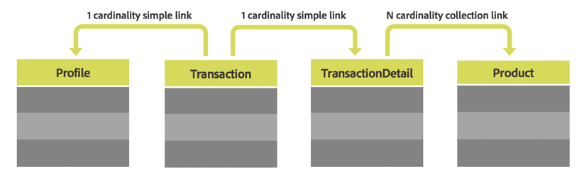

# 自訂資源 {#custom-resources}

Adobe Campaign隨附預先定義的資料模型，其中資料會透過不同資源加以定義。 您可以擴充資源，以新增自訂欄位或自訂表格，例如購買或產品表格，藉此擴充資料模型。

可使用&#x200B;**/profileAndServicesExt**&#x200B;端點以及自訂資源名稱，透過API存取自訂資源。

`https://mc.adobe.io/<ORGANIZATION>/campaign/profileAndServicesExt/<resourceName>/`

>[!NOTE]
>
>對於非現成可用的資源，請一律在資源名稱前使用<b>&quot;cus&quot;</b>首碼。

只要自訂資源連結至設定檔表格，您就可以使用自訂資源執行任何作業。 例如，讓我們考慮下方的表格結構：



在這種情況下，只要連結到&#x200B;**設定檔**&#x200B;資料表，就可以使用&#x200B;**Transaction**、**TransactionDetails**&#x200B;和&#x200B;**Product**&#x200B;資料表的所有資源。

<br/>

***範例要求***

存取延伸profileAndServicesExt資源的範例GET要求。

```
-X GET https://mc.adobe.io/<ORGANIZATION>/campaign/profileAndServicesExt/\
-H 'Content-Type: application/json' \
-H 'Authorization: Bearer <ACCESS_TOKEN>' \
-H 'Cache-Control: no-cache' \
-H 'X-Api-Key: <API_KEY>' \
```

它會傳回所有連結的自訂資源清單。 然後，您可以使用資源URL來執行本檔案中描述的任何API工作。

```
{
"apiName": "resourceType",
"cusProduct": {
        "content": ...,
        "data": "/profileAndServicesExt/cusProduct/",
        "help": "Product",
        "href": "https://mc.adobe.io/<ORGANIZATION>/campaign/profileAndServicesExt/cusProduct/metadata",
        "name": "cusProduct",
        "type": "collection"
    },
"cusTransaction": {
        "content": ...,
        "data": "/profileAndServicesExt/cusTransaction/",
        "help": "Product",
        "href": "https://mc.adobe.io/<ORGANIZATION>/campaign/profileAndServicesExt/cusTransaction/metadata",
        "name": "cusProduct",
        "type": "collection"
    },
    ...
}
```
