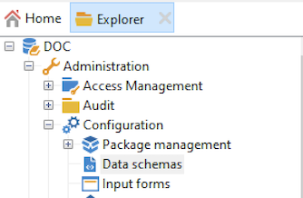
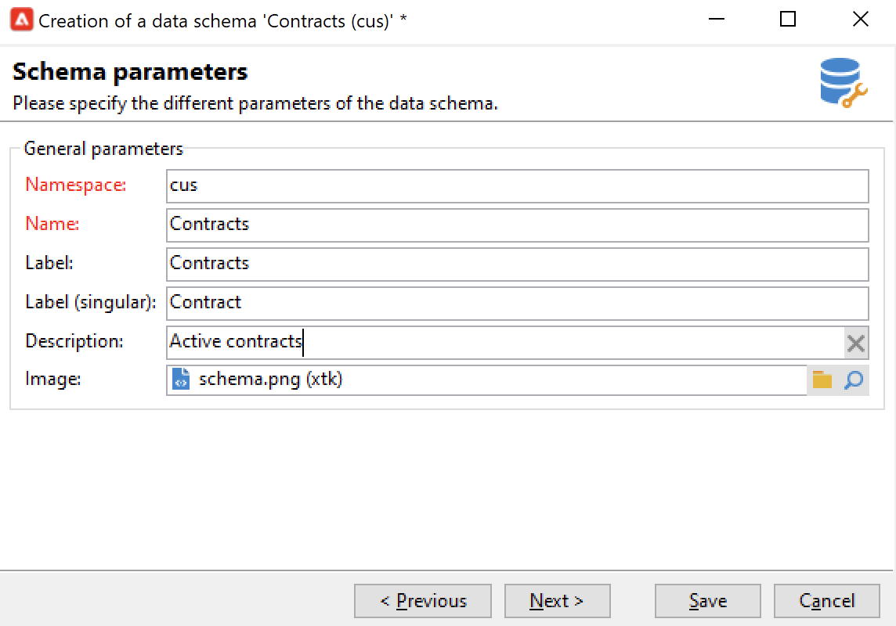

# 建立新架構{#create-new-schema}

要編輯、建立和配置方案，請按一下 **[!UICONTROL Administration > Configuration > Data schemas]** Adobe Campaign客戶端控制台的節點。

>[!NOTE]
>
>內置資料架構只能由Adobe Campaign控制台的管理員刪除。



的 **[!UICONTROL Edit]** 頁籤顯示架構的XML內容：


>[!NOTE]
>
>使用「名稱」編輯控制項可以輸入由名稱和命名空間組成的架構密鑰。 在架構的XML編輯區域中，將自動更新架構的根元素的&quot;name&quot;和&quot;namespace&quot;屬性。 請注意，某些命名空間僅是內部的。 [了解更多](schemas.md#reserved-namespaces)

的 **[!UICONTROL Preview]** 頁籤自動生成擴展模式：


>[!NOTE]
>
>保存源架構後，將自動啟動擴展架構的生成。

如果需要檢查架構的完整結構，可以使用 **[!UICONTROL Preview]** 頁籤。 如果已擴展了架構，則可以直觀顯示其所有擴展。 作為補充， **[!UICONTROL Documentation]** 頁籤顯示所有架構屬性和元素及其屬性（SQL欄位、類型/長度、標籤和說明）。 的 **[!UICONTROL Documentation]** 頁籤僅適用於生成的架構。

## 用例：建立合同表 {#example--creating-a-contract-table}

在以下示例中，為 **合同** 的子菜單。 此表允許您為每個合同儲存持有者和共同持有者的名字和姓氏以及電子郵件地址。

為此，需要建立表的模式並更新資料庫結構以生成相應的表。 下面列出了詳細步驟。

1. 編輯 **[!UICONTROL Administration > Configuration > Data schemas]** ，然後按一下 **[!UICONTROL New]**。
1. 選擇 **[!UICONTROL Create a new table in the data template]** 選項 **[!UICONTROL Next]** 。

   

1. 為表和命名空間指定名稱。

   

   >[!NOTE]
   >
   >預設情況下，由用戶建立的架構儲存在「cus」命名空間中。 有關此內容的詳細資訊，請參閱 [模式的標識](extend-schema.md#identification-of-a-schema)。

1. 建立表的內容。 我們建議使用專用助理來確保不丟失任何設定。 要執行此操作，請按一下 **[!UICONTROL Insert]** 按鈕，選擇要添加的設定類型。

   

1. 定義合同表的設定。

   作為最佳做法，通過添加 `dataSource="nms:extAccount:ffda"` 屬性。 建立新表時，預設情況下會添加此屬性。

   ```
   <srcSchema created="YYYY-MM-DD HH:MM:SS.TZ" desc="Active contracts" img="crm:crm/mscrm/mscrm_account_16x16.png"
           label="Contracts" labelSingular="Contract" lastModified="YYYY-MM-DD HH:MM:SS.TZ"
           mappingType="sql" name="Contracts" namespace="cus" xtkschema="xtk:srcSchema">
      <element dataSource="nms:extAccount:ffda" desc="Active contracts" img="crm:crm/mscrm/mscrm_account_16x16.png"
           label="Contracts" labelSingular="Contract" name="Contracts">
           <attribute name="holderName" label="Holder last name" type="string"/>
           <attribute name="holderFirstName" label="Holder first name" type="string"/>
           <attribute name="holderEmail" label="Holder email" type="string"/>
           <attribute name="co-holderName" label="Co-holder last name" type="string"/>           
           <attribute name="co-holderFirstName" label="Co-holder first name" type="string"/>           
           <attribute name="co-holderEmail" label="Co-holder email" type="string"/>    
           <attribute name="date" label="Subscription date" type="date"/>     
           <attribute name="noContract" label="Contract number" type="long"/> 
      </element>
   </srcSchema>
   ```

   添加合同枚舉的類型。

   ```
   <srcSchema created="AA-MM-DD HH:MM:SS.TZ" desc="Active contracts" img="crm:crm/mscrm/mscrm_account_16x16.png" label="Contracts" labelSingular="Contract" AA-MM-DD HH:MM:SS.TZ"mappingType="sql" name="Contracts" namespace="cus" xtkschema="xtk:srcSchema">
      <enumeration basetype="byte" name="typeContract">
         <value label="Home" name="home" value="0"/>
         <value label="Car" name="car" value="1"/>
         <value label="Health" name="health" value="2"/>
         <value label="Pension fund" name="pension fund" value="2"/>
      </enumeration>
      <element dataSource="nms:extAccount:ffda" desc="Active contracts" img="crm:crm/mscrm/mscrm_account_16x16.png"
           label="Contracts" labelSingular="Contract" name="Contracts">
           <attribute name="holderName" label="Holder last name" type="string"/>
           <attribute name="holderFirstName" label="Holder first name" type="string"/>
           <attribute name="holderEmail" label="Holder email" type="string"/>
           <attribute name="co-holderName" label="Co-holder last name" type="string"/>           
           <attribute name="co-holderFirstName" label="Co-holder first name" type="string"/>           
           <attribute name="co-holderEmail" label="Co-holder email" type="string"/>    
           <attribute name="date" label="Subscription date" type="date"/>     
           <attribute name="noContract" label="Contract number" type="long"/> 
      </element>
   </srcSchema>
   ```

1. 保存架構，然後按一下 **[!UICONTROL Structure]** 的子菜單：

   

1. 更新資料庫結構以建立模式將連結到的表。 如需詳細資訊，請參閱[本章節](update-database-structure.md)。
