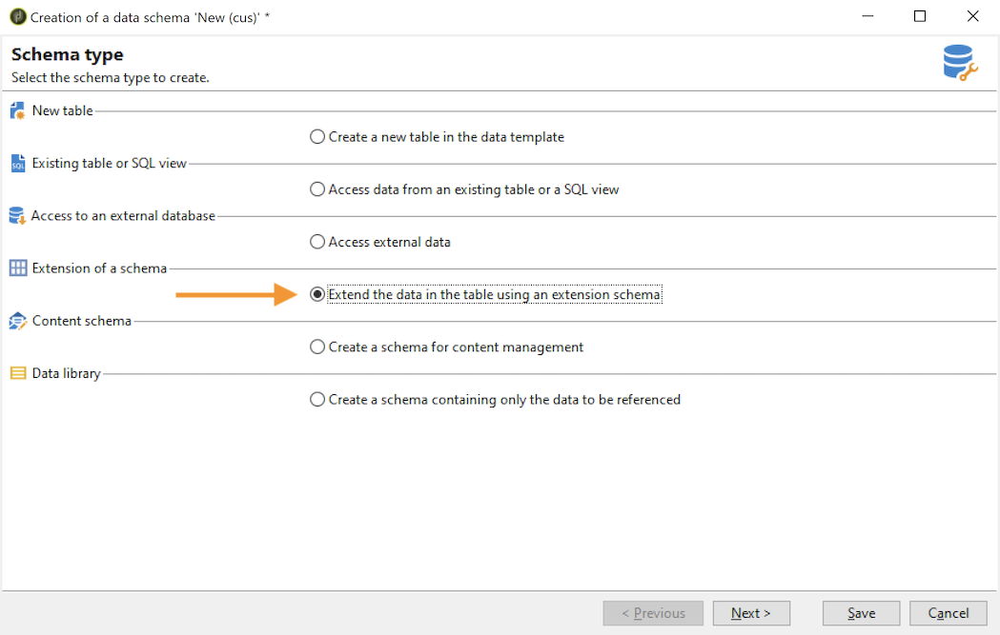

# 擴充結構{#extend-schemas}

身為技術使用者，您可以自訂Campaign資料模型，以符合實作的需求：將元素新增至現有架構、修改架構中的元素或刪除元素。

自訂Campaign資料模型的關鍵步驟為：

1. 建立擴充功能結構
1. 更新Campaign資料庫
1. 調整輸入表單

>[!CAUTION]
>內建架構不能直接修改。 如果您需要調整內建結構，則必須擴充它。

 如需深入了解Campaign內建表格及其互動，請參閱 [本頁](datamodel.md). 另請參閱在中建立新結構時的建議 [本頁](create-schema.md).

若要擴充結構，請遵循下列步驟：

1. 導覽至 **[!UICONTROL Administration > Configuration > Data schemas]** 檔案夾。
1. 按一下 **新增** 按鈕並選取 **[!UICONTROL Extend the data in a table using an extension schema]**.

   

1. 識別要擴充的內建架構，並加以選取。

   

   根據慣例，將擴充功能架構命名為與內建架構相同的架構，並使用自訂命名空間。  請注意，有些命名空間僅為內部。 [了解更多](schemas.md#reserved-namespaces)

   

1. 進入結構編輯器後，使用內容功能表新增您需要的元素並儲存。

   

   在以下範例中，我們新增 **MembershYear** 屬性，請設定姓氏的長度限制（此限制將覆寫預設限制），並從內建架構中移除出生日期。

   

   ```
   <srcSchema created="YYYY-MM-DD" desc="Recipient table" extendedSchema="nms:recipient"
           img="nms:recipient.png" label="Recipients" labelSingular="Recipient" lastModified="YYYY-MM-DD"
           mappingType="sql" name="recipient" namespace="cus" xtkschema="xtk:srcSchema">
    <element desc="Recipient table" img="nms:recipient.png" label="Recipients" labelSingular="Recipient" name="recipient">
       <attribute label="Member since" name="MembershipYear" type="long"/>
       <attribute length="50" name="lastName"/>
       <attribute _operation="delete" name="birthDate"/>
   </element>
   </srcSchema>
   ```

1. 斷開連線並重新連線至Campaign，以檢查 **[!UICONTROL Structure]** 標籤。

   

1. 更新資料庫結構以應用更改。 [了解更多](update-database-structure.md)

1. 在資料庫中實作變更後，您可以調整收件者輸入表單，讓變更可見。 [了解更多](forms.md)
