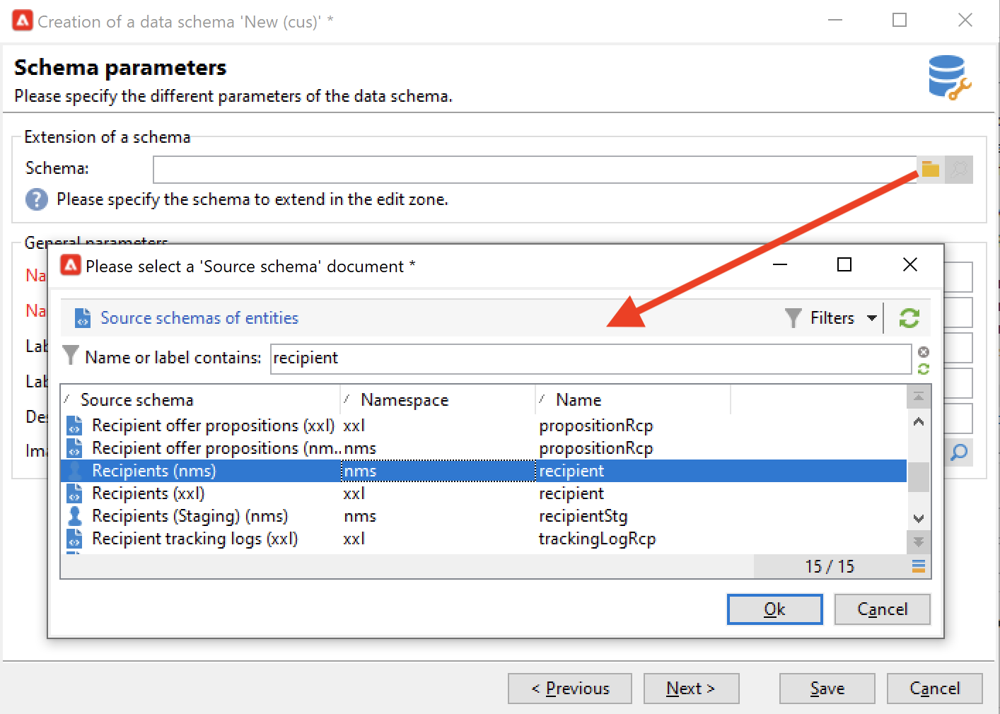

# 擴展模式{#extend-schemas}

身為技術使用者，您可以自訂Campaign資料模型，以符合您實作的需求：將元素添加到現有模式、修改模式中的元素或刪除元素。

自訂促銷活動資料模型的主要步驟為：

1. 建立擴展架構
1. 更新促銷活動資料庫
1. 調整輸入表單

>[!CAUTION]
>內建架構不能直接修改。 如果您需要調整內建結構，則必須加以擴充。

：球：如需深入瞭解促銷活動內建表格及其互動，請參閱[本頁](datamodel.md)。

要擴展模式，請執行以下步驟：

1. 導覽至檔案總管中的&#x200B;**[!UICONTROL Administration > Configuration > Data schemas]**&#x200B;資料夾。
1. 按一下&#x200B;**新建**&#x200B;按鈕並選擇&#x200B;**[!UICONTROL Extend the data in a table using an extension schema]**。

   

1. 識別要擴充的內建架構並加以選取。

   

   根據慣例，將擴充功能架構命名為與內建架構相同，並使用自訂命名空間。

   

1. 進入架構編輯器後，使用內容相關選單新增所需元素，然後儲存。

   

   在以下範例中，我們新增「會籍年」屬性，為姓氏加上長度限制（此限制將覆寫預設的限制），並從內建結構中移除出生日期。

   ```
   <srcSchema created="YY-MM-DD" desc="Recipient table" extendedSchema="nms:recipient"
           img="nms:recipient.png" label="Recipients" labelSingular="Recipient" lastModified="YY-MM-DD"
           mappingType="sql" name="recipient" namespace="cus" xtkschema="xtk:srcSchema">
   <element desc="Recipient table" img="nms:recipient.png" label="Recipients" labelSingular="Recipient"
           name="recipient">
   <attribute name="Membership Year" label="memberYear" type="long"/>
   <attribute length="50" name="lastName"/>
   <attribute _operation="delete" name="birthDate"/>
   </element>
   </srcSchema> 
   ```

1. 更新資料庫結構以應用更改。 [了解更多](update-database-structure.md)
1. 在資料庫中實作變更後，您就可以調整收件者輸入表單，讓變更可見。 [了解更多](forms.md)