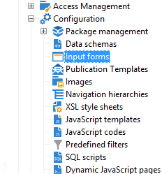

# 開始使用輸入表單{#gs-ac-forms}

在建立或擴展架構時，需要建立或修改關聯的輸入表單以使這些更改對最終用戶可見。

通過輸入表單，可以編輯與Adobe Campaign客戶端控制台中的資料模式關聯的實例。 表單由其名稱和命名空間標識。

表單的標識鍵是由命名空間和名稱以冒號分隔的字串，例如：&quot;cus:contact&quot;。

## 編輯輸入表單

從 **[!UICONTROL Administration]> [!UICONTROL Configuration] >[!UICONTROL Input forms]** 客戶端控制台的資料夾：



編輯區域允許您輸入輸入表單的XML內容：


預覽將生成輸入表單的顯示：


## 表單結構

表單的描述是一個結構化XML文檔，它觀察表單模式的語法 **xtk：格式**。

輸入表單的XML文檔必須包含 `<form>` 根元素  **名稱** 和  **命名空間** 屬性，以填充表單名稱和命名空間。

```
<form name="form_name" namespace="name_space">
...
</form>
```

預設情況下，表單與具有相同名稱和命名空間的資料架構相關聯。 要將表單與其他名稱關聯，請設定 **實體模式** 屬性 `<form>` 元素到架構鍵的名稱。 要說明輸入表單的結構，讓我們使用「cus:recipient」示例架構描述介面：

```
<srcSchema name="recipient" namespace="cus">
  <enumeration name="gender" basetype="byte">    
    <value name="unknown" label="Not specified" value="0"/>    
    <value name="male" label="Male" value="1"/>   
    <value name="female" label="Female" value="2"/>   
  </enumeration>

  <element name="recipient">
    <attribute name="email" type="string" length="80" label="Email" desc="E-mail address of recipient"/>
    <attribute name="birthDate" type="datetime" label="Date"/>
    <attribute name="gender" type="byte" label="Gender" enum="gender"/>
  </element>
</srcSchema>
```

基於示例架構的輸入表單：


```
<form name="recipient" namespace="cus">
  <input xpath="@gender"/>
  <input xpath="@birthDate"/>
  <input xpath="@email"/>
</form>
```

編輯控制項的說明從 `<form>` 根元素。 在 **`<input>`** 元素 **xpath** 屬性包含其架構中欄位的路徑。

編輯控制項會自動適應相應的資料類型並使用在架構中定義的標籤。

>[!NOTE]
>
>通過添加 **標籤** 屬性 `<input>` 元素：\
>`<input label="E-mail address" xpath="@name" />`

預設情況下，每個欄位都顯示在一行上，並根據資料類型佔用所有可用空間。

 所有表單屬性都列在 [Campaign Classicv7文檔](https://experienceleague.adobe.com/developer/campaign-api/api/control-Button.html)。

## 格式 {#formatting}

控制項的佈局類似於在HTML表中使用的佈局，可將控制項分為幾列、交錯元素或指定可用空間的佔用。 但是，請記住，格式設定只允許您按比例將區域向上分割；不能為對象指定固定維。

要在兩列中顯示上述示例的控制項：


```
<form name="recipient" namespace="cus">
  <container colcount="2">
    <input xpath="@gender"/>
    <input xpath="@birthDate"/>
    <input xpath="@email"/>
  </container>
</form>
```

的 **`<container>`** 元素 **計數** 屬性用於將子控制項的顯示強制到兩列。

的 **共** 控制項上的屬性將控制項擴展為在其值中輸入的列數：


```
<form name="recipient" namespace="cus">
  <container colcount="2">
    <input xpath="@gender"/>
    <input xpath="@birthDate"/>
    <input xpath="@email" colspan="2"/>
  </container>
</form> 
```

通過填充 **type=&quot;frame&quot;** 屬性，容器在子控制項周圍添加框架，標籤包含在 **標籤** 屬性：


```
<form name="recipient" namespace="cus">
  <container colcount="2" type="frame" label="General">
    <input xpath="@gender"/>
    <input xpath="@birthDate"/>
    <input xpath="@email" colspan="2"/>
  </container>
</form>
```

A **`<static>`** 元素可用於格式化輸入表單：


```
<form name="recipient" namespace="cus">
  <static type="separator" colspan="2" label="General"/>
  <input xpath="@gender"/>
  <input xpath="@birthDate"/>
  <input xpath="@email" colspan="2"/>
  <static type="help" label="General information about recipient with date of birth, gender, and e-mail address." colspan="2"/>
</form>
```

的 **`<static>`** 標籤 **分離器** 「類型」(Type)，用於添加包含標籤的分隔條 **標籤** 屬性。

使用 `<static>` 帶幫助類型的標籤。 文本的內容在 **標籤** 屬性。

## 使用容器 {#containers}

使用 **容器** 組。 由 **`<container>`** 的子菜單。 上面使用它們來格式化對若干列的控制。

的 **xpath** 屬性 `<container>` 用於簡化子控制項的引用。 然後，控制項的引用相對於父項 `<container>` 父項。

沒有「xpath」的容器示例：

```
<container colcount="2">
  <input xpath="location/@zipCode"/>
  <input xpath="location/@city"/>
</container>
```

在名為&quot;location&quot;的元素中添加&quot;xpath&quot;示例：

```
<container colcount="2" xpath="location">
  <input xpath="@zipCode"/>
  <input xpath="@city"/>
</container>
```

容器用於使用在頁面中格式化的一組欄位來構造複雜控制項。

### 添加頁籤（筆記本） {#tab-container}

使用 **筆記本** 容器，以在可從頁籤訪問的頁面中格式化資料。


```
<container type="notebook">
  <container colcount="2" label="General">
    <input xpath="@gender"/>
    <input xpath="@birthDate"/>
    <input xpath="@email" colspan="2"/>
  </container>
  <container colcount="2" label="Location">
    ...
  </container>
</container>
```

主容器由 **type=&quot;筆記本&quot;** 屬性。 標籤在子容器中聲明，標籤從 **標籤** 屬性。

添加 **style=&quot;down&quot;** 屬性，以強制在控制項下方垂直定位標籤。 此屬性是可選的。 預設值為 **&quot;上&quot;**。


`<container style="down" type="notebook">  ... </container>`

### 添加表徵圖（表徵圖框） {#icon-list}

使用此容器可顯示垂直表徵圖欄，以選擇要顯示的頁面。


```
<container type="iconbox">
  <container colcount="2" label="General" img="xtk:properties.png">
    <input xpath="@gender"/>
    <input xpath="@birthDate"/>
    <input xpath="@email" colspan="2"/>
  </container>
  <container colcount="2" label="Location" img="nms:msgfolder.png">
    ...
  </container>
</container>
```

主容器由 **type=&quot;iconbox&quot;** 屬性。 與表徵圖關聯的頁面在子容器中聲明。 表徵圖的標籤將從 **標籤** 屬性。

頁面的表徵圖將從 `img="<image>"` 屬性，其中 `<image>` 是與其由名稱和命名空間組成的鍵相對應的影像的名稱（例如，&quot;xtk:properties.png&quot;）。

可從 **[!UICONTROL Administration > Configuration > Images]** 的下界。

### 隱藏容器(visibleGroup) {#visibility-container}

可以通過動態條件隱藏一組控制項。

此示例說明了對「性別」欄位值的控制的可見性：

```
<container type="visibleGroup" visibleIf="@gender=1">
  ...
</container>
<container type="visibleGroup" visibleIf="@gender=2">
  ...
</container>
```

可見性容器由屬性定義 **type=&quot;visibleGroup&quot;**。 的 **可見If** 屬性包含可見性條件。

條件語法示例：

* **visibleIf=&quot;@email=&#39;peter.martinezATneeolane.net&#39;&quot;**:test字串類型資料的等式。 比較值必須用引號表示。
* **visibleIf=&quot;@gender >= 1和@gender != 2&quot;**:的子菜單。
* **visibleIf=&quot;@boolean1=true或@boolean2=false&quot;**:test布爾欄位。

### 條件顯示(enabledGroup) {#enabling-container}

此容器允許您啟用或禁用動態條件中的一組資料。 禁用控制項可阻止編輯它。 下例說明了從&quot;Gedern&quot;欄位的值啟用控制：

```
<container type="enabledGroup" enabledIf="@gender=1">
  ...
</container>
<container type="enabledGroup" enabledIf="@gender=2">
  ...
</container>
```

啟用容器由 **type=&quot;enabledGroup&quot;** 屬性。 的 **enabledIf** 屬性包含激活條件。

## 編輯連結 {#editing-a-link}

請記住，連結在資料架構中聲明如下：

```
<element label="Company" name="company" target="cus:company" type="link"/>
```

其輸入表單中連結的編輯控制項如下：


```
<input xpath="company"/>
```

可通過編輯欄位訪問目標選擇。 通過預鍵入輔助輸入，以便從輸入的前幾個字元中容易地找到目標元素。 然後，根據 **計算字串** 在目標架構中定義。 如果在控制項中驗證後該架構不存在，則會顯示即時目標建立的確認消息。 確認在目標表中建立新記錄，並將其與連結關聯。

下拉清單用於從已建立的記錄清單中選擇目標元素。

的 **[!UICONTROL Modify the link]** （資料夾）表徵圖啟動包含目標元素清單和篩選器區域的選擇表單。

的 **[!UICONTROL Edit link]** （放大鏡）表徵圖將啟動連結元素的編輯窗體。 預設情況下，在目標模式的鍵上推導所用格式。 的 **表格** 屬性用於強制編輯表單的名稱(例如&quot;cus:company2&quot;)。

通過添加 **`<sysfilter>`** 元素：

```
<input xpath="company">
  <sysFilter>
    <condition expr="[location/@city] =  'Newton"/>
  </sysFilter>
</input>
```

您也可以使用 **`<orderby>`** 元素：

```
<input xpath="company">
  <orderBy>
    <node expr="[location/@zipCode]"/>
  </orderBy>
</input>
```

## 控制項屬性 {#control-properties}

* **無自動完成**:禁用超前類型（使用值&quot;true&quot;）
* **建立模式**:如果連結不存在，則即時建立該連結。 可能的值為：

   * **無**:禁用建立。 如果連結不存在，則顯示錯誤消息
   * **內**:建立與編輯欄位中的內容的連結
   * **版本**:顯示連結上的編輯窗體。 驗證表單後，將保存資料（預設模式）

* **noZoom**:連結上沒有編輯窗體（值為&quot;true&quot;）
* **表格**:重載目標元素的編輯窗體

## 添加連結清單（未綁定） {#list-of-links}

作為收集元素(unbond=&quot;true&quot;)在資料架構中輸入的連結必須通過清單才能查看與其關聯的所有元素。

其原理是通過優化的資料載入（通過資料批下載，只有在清單可見時才執行）來顯示連結元素清單。

架構中集合連結的示例：

```
<element label="Events" name="rcpEvent" target="cus:event" type="link" unbound="true">
...
</element>
```

其輸入表單中的清單：

```
 <input xpath="rcpEvent" type="linklist">
  <input xpath="@label"/>
  <input xpath="@date"/>
</input>
```

清單控制項由 **type=&quot;linklist&quot;** 屬性。 清單路徑必須引用集合連結。

列通過 **`<input>`** 清單中的元素。 的 **xpath** 屬性指目標架構中欄位的路徑。

帶有標籤（在架構中的連結上定義）的工具欄將自動置於清單上方。

可通過 **[!UICONTROL Filters]** 按鈕並配置為添加和排序列。

的 **[!UICONTROL Add]** 和 **[!UICONTROL Delete]** 按鈕，您可以在連結上添加和刪除集合元素。 預設情況下，添加元素將啟動目標架構的編輯表單。

的 **[!UICONTROL Detail]** 按鈕 **zoom=&quot;true&quot;** 屬性在上完成 **`<input>`** 清單的標籤：它允許您啟動選定行的編輯窗體。

在載入清單時，可以應用篩選和排序：

```
 <input xpath="rcpEvent" type="linklist">
  <input xpath="@label"/>
  <input xpath="@date"/>
  <sysFilter>
    <condition expr="@type = 1"/>
  </sysFilter>
  <orderBy>
    <node expr="@date" sortDesc="true"/>
  </orderBy>
</input>
```

## 定義關係表 {#relationship-table}

使用關係表可以連結兩個具有N-N基數的表。 關係表只包含到兩個表的連結。

因此，將元素添加到清單中應該允許您從關係表中的兩個連結之一完成清單。

架構中關係表的示例：

```
<srcSchema name="subscription" namespace="cus">
  <element name="recipient" type="link" target="cus:recipient" label="Recipient"/>
  <element name="service" type="link" target="cus:service" label="Subscription service"/>
</srcSchema>
```

例如，我們從&quot;cus:recipient&quot;架構的輸入形式開始。 該清單必須顯示與服務訂閱的關聯，並且必須允許您通過選擇現有服務來添加訂閱。


```
<input type="linklist" xpath="subscription" xpathChoiceTarget="service" xpathEditTarget="service" zoom="true">
  <input xpath="recipient"/>
  <input xpath="service"/>
</input>
```

的 **xpathChoiceTarget** 屬性允許您從輸入的連結啟動選擇表單。 建立關係表記錄將自動更新指向當前收件人和所選服務的連結。

>[!NOTE]
>
>的 **xpathEditTarget** 屬性用於在輸入的連結上強制編輯選定行。

### 清單屬性 {#list-properties}

* **無工具欄**:隱藏工具欄（值為&quot;true&quot;）
* **工具欄標題**:重載工具欄標籤
* **工具欄對齊**:修改工具欄的垂直或水準幾何(可能的值：&quot;垂直&quot;|&quot;水準&quot;
* **img**:顯示與清單關聯的影像
* **表格**:重載目標元素的編輯窗體
* **縮放**:添加 **[!UICONTROL Zoom]** 按鈕以編輯目標元素
* **xpathEditTarget**:設定輸入的連結的編輯
* **xpathChoiceTarget**:另外，在輸入的連結上啟動選擇表單

## 添加記憶體清單控制項 {#memory-list-controls}

記憶體清單允許您使用清單資料預載入來編輯集合元素。 無法篩選或配置此清單。

這些清單用於XML映射的集合元素或低卷連結。

## 添加列清單 {#column-list}

此控制項顯示一個可編輯的列清單，其工具欄包含「添加」和「刪除」按鈕。

```
<input xpath="rcpEvent" type="list">
  <input xpath="@label"/>
  <input xpath="@date"/>
</input>
```

必須用 **type=&quot;list&quot;** 屬性，並且清單的路徑必須引用集合元素。

列在子項中聲明 **`<input>`** 清單的標籤。 可以強制使用 **標籤** 和 **列大小** 屬性。

>[!NOTE]
>
>排序順序箭頭在 **訂購=&quot;true&quot;** 屬性將添加到資料架構中的集合元素。

工具欄按鈕可以水準對齊：

```
<input nolabel="true" toolbarCaption="List of events" type="list" xpath="rcpEvent" zoom="true">
  <input xpath="@label"/>
  <input xpath="@date"/>
</input>
```

的 **工具欄標題** 屬性強制工具欄的水準對齊方式並輸入清單上方的標題。

### 啟用放大清單 {#zoom-in-a-list}

在清單中插入和編輯資料可以以單獨的編輯表單輸入。

```
<input nolabel="true" toolbarCaption="List of events" type="list" xpath="rcpEvent" zoom="true" zoomOnAdd="true">
  <input xpath="@label"/>
  <input xpath="@date"/>

  <form colcount="2" label="Event">
    <input xpath="@label"/>
    <input xpath="@date"/>
  </form>
</input>
```

編輯表單從 `<form>`  清單定義下的元素。 其結構與輸入形式相同。 的 **[!UICONTROL Detail]** 按鈕 **zoom=&quot;true&quot;** 屬性在上完成 **`<input>`** 清單的標籤。 此屬性用於啟動選定行的編輯表單。

>[!NOTE]
>
>添加 **zoomOnAdd=&quot;true&quot;** 屬性強制在插入清單元素時調用編輯表單。

### 清單屬性 {#list-properties-1}

* **無工具欄**:隱藏工具欄（值為&quot;true&quot;）
* **工具欄標題**:重載工具欄標籤
* **工具欄對齊**:修改工具欄的位置(可能的值：&quot;垂直&quot;|&quot;水準&quot;
* **img**:顯示與清單關聯的影像
* **表格**:重載目標元素的編輯窗體
* **縮放**:添加 **[!UICONTROL Zoom]** 按鈕以編輯目標元素
* **縮放OnAdd**:在添加項上啟動編輯窗體
* **xpathChoiceTarget**:另外，在輸入的連結上啟動選擇表單

## 添加不可編輯的欄位 {#non-editable-fields}

要顯示欄位並防止其編輯，請使用 **`<value>`** 標籤或完成 **readOnly=&quot;true&quot;** 屬性 **`<input>`** 標籤。

&quot;性別&quot;欄位示例：


```
<value value="@gender"/>
<input xpath="@gender" readOnly="true"/>
```

## 添加單選按鈕 {#radio-button}

單選按鈕允許您從多個選項中進行選擇。 的 **`<input>`** 標籤用於列出可能的選項， **checkedValue** attribute指定與選項關聯的值。

&quot;性別&quot;欄位示例：

```
<input type="RadioButton" xpath="@gender" checkedValue="0" label="Choice 1"/>
<input type="RadioButton" xpath="@gender" checkedValue="1" label="Choice 2"/>
<input type="RadioButton" xpath="@gender" checkedValue="2" label="Choice 3"/>
```


## 添加複選框 {#checkbox}

複選框反映布爾狀態（選定或未選定）。 預設情況下，此控制項由「布爾」(true/false)欄位使用。 預設值為0或1的變數可與此按鈕關聯。 此值可以通過 **checkValue** 屬性。

```
<input xpath="@boolean1"/>
<input xpath="@field1" type="checkbox" checkedValue="Y"/>
```


## 編輯導航層次結構 {#navigation-hierarchy-edit}

此控制項在一組要編輯的欄位上生成樹。

要編輯的控制項將分組在 **`<container>`** 的 **`<input>`** 樹控制項的標籤：

```
<input nolabel="true" type="treeEdit">
  <container label="Text fields">
    <input xpath="@text1"/>
    <input xpath="@text2"/>
  </container>
  <container label="Boolean fields">
    <input xpath="@boolean1"/>
    <input xpath="@boolean2"/>
  </container>
</input>
```


## 添加表達式欄位 {#expression-field}

表達式欄位從表達式動態更新欄位；這樣 **`<input>`** 標籤與 **xpath** 屬性，以輸入要更新的欄位的路徑 **EXPR** 包含更新表達式的屬性。

```
<!-- Example: updating the boolean1 field from the value contained in the field with path /tmp/@flag -->
<input expr="Iif([/tmp/@flag]=='On', true, false)" type="expr" xpath="@boolean1"/>
<input expr="[/ignored/@action] == 'FCP'" type="expr" xpath="@launchFCP"/>
```

## 表單上下文 {#context-of-forms}

輸入表單的執行初始化包含被編輯實體的資料的XML文檔。 此文檔表示表單的上下文，可用作工作區。

### 更新上下文 {#updating-the-context}

要修改窗體的上下文，請使用 `<set expr="<value>" xpath="<field>"/>` 標籤，其中 `<field>` 是目標欄位， `<value>` 是更新表達式或值。

使用示例 `<set>` 標籤：

* **`<set expr="'Test'" xpath="/tmp/@test" />`**:將「Test」值定位在臨時位置/tmp/@test1
* **`<set expr="'Test'" xpath="@lastName" />`**:使用「Test」值更新「lastName」屬性上的實體
* **`<set expr="true" xpath="@boolean1" />`**:將&quot;boolean1&quot;欄位的值設定為&quot;true&quot;
* **`<set expr="@lastName" xpath="/tmp/@test" />`**:更新&quot;lastName&quot;屬性的內容

在通過 **`<enter>`** 和 **`<leave>`** 標籤。

```
<form name="recipient" namespace="cus">
  <enter>
    <set...
  </enter>
  ...
  <leave>
    <set...
  </leave>
</form>
```

>[!NOTE]
>
>的 `<enter>`  和  `<leave>`   標籤可用於 `<container>` 頁（「筆記本」和「表徵圖框」類型）。

### 表達語言 {#expression-language-}

可以在表單定義中使用宏語言以執行條件test。

的 **`<if expr="<expression>" />`** 如果驗證了表達式，則標籤將執行標籤下指定的指令：

```
<if expr="([/tmp/@test] == 'Test' or @lastName != 'Doe') and @boolean2 == true">
  <set xpath="@boolean1" expr="true"/>
</if>
```

的 **`<check expr="<condition>" />`** 與 **`<error>`** 標籤會阻止對表單的驗證，並在條件不滿足時顯示錯誤消息：

```
<leave>
  <check expr="/tmp/@test != ''">
    <error>You must populate the 'Test' field!</error> 
  </check>
</leave>
```

## 助理（嚮導） {#wizards}

助理將引導您完成以頁面形式顯示的一組資料輸入步驟。 在驗證表單時將保存輸入的資料。

要添加助理，請使用以下類型的結構：

```
<form type="wizard" name="example" namespace="cus" img="nms:rcpgroup32.png" label="Wizard example" entity-schema="nms:recipient">
  <container title="Title of page 1" desc="Long description of page 1">
    <input xpath="@lastName"/>
    <input xpath="comment"/>
  </container>
  <container title="Title of page 2" desc="Long description of page 2">
    ...
  </container>
  ...
</form>
```

存在 **type=&quot;嚮導&quot;** 屬性 `<form>` 元素用於在窗體構造中定義嚮導模式。 這些頁面是從 `<container>` 元素，這些元素是 `<form>` 的子菜單。 的 `<container>` 頁面的元素填充有標題的標題屬性，並且desc在頁面標題下顯示說明。 的 **[!UICONTROL Previous]** 和 **[!UICONTROL Next]** 按鈕會自動添加，以允許在頁面之間瀏覽。

的 **[!UICONTROL Finish]** 按鈕保存輸入的資料並關閉窗體。

### SOAP方法 {#soap-methods}

可從填充的 **`<leave>`** 標籤。

的 **`<soapcall>`** tag包含對具有以下輸入參數的方法的調用：

```
<soapCall name="<name>" service="<schema>">
  <param type="<type>" exprIn="<xpath>"/>  
  ...
</soapCall>
```

服務的名稱及其實現架構通過 **名稱** 和 **服務** 屬性 **`<soapcall>`** 標籤。

在 **`<param>`** 元素 **`<soapcall>`** 標籤。

必須通過 **類型** 屬性。 可能的類型如下：

* **字串**:字串
* **布爾**:布爾型
* **位元組**:8位整數
* **短**:16位整數
* **長**:32位整數
* **短**:16位整數
* **雙**:雙精度浮點數
* **DOMElement**:元素型節點

的 **exprIn** 屬性包含要作為參數傳遞的資料的位置。

**範例**:

```
<leave>
  <soapCall name="RegisterGroup" service="nms:recipient">         
    <param type="DOMElement" exprIn="/tmp/entityList"/>         
    <param type="DOMElement" exprIn="/tmp/choiceList"/>         
    <param type="boolean"    exprIn="true"/>       
  </soapCall>
</leave>
```
