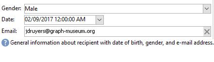

# 開始使用輸入表單{#gs-ac-forms}

建立或擴展架構時，您需要建立或修改相關的輸入表單，以便讓最終用戶能夠看到這些更改。

輸入表單可讓您從Adobe Campaign用戶端主控台編輯與資料結構關聯的例項。 表單以名稱和命名空間識別。

表單的識別索引鍵是由命名空間和以冒號分隔的名稱所組成的字串，例如：&quot;cus:contact&quot;。

## 編輯輸入表單

從客戶端控制台的&#x200B;**[!UICONTROL Administration]> [!UICONTROL Configuration] >[!UICONTROL Input forms]**&#x200B;資料夾建立和配置輸入表單：


編輯區域可讓您輸入輸入表單的XML內容：


預覽會產生輸入表單的顯示：


## 表單結構

表單的描述是一種結構化XML文檔，它觀察表單架構&#x200B;**xtk:form**&#x200B;的語法。

輸入表單的XML文檔必須包含&#x200B;**name**&#x200B;和&#x200B;**namespace**&#x200B;屬性的`<form>`根元素，以填充表單名稱和命名空間。

```
<form name="form_name" namespace="name_space">
...
</form>
```

依預設，表單會與具有相同名稱和命名空間的資料架構相關聯。 要將表單與不同名稱關聯，請將`<form>`元素的&#x200B;**entity-schema**&#x200B;屬性設定為架構鍵的名稱。 若要說明輸入表單的結構，請讓我們使用「cus:recipient」範例結構來說明介面：

```
<srcSchema name="recipient" namespace="cus">
  <enumeration name="gender" basetype="byte">    
    <value name="unknown" label="Not specified" value="0"/>    
    <value name="male" label="Male" value="1"/>   
    <value name="female" label="Female" value="2"/>   
  </enumeration>

  <element name="recipient">
    <attribute name="email" type="string" length="80" label="Email" desc="E-mail address of recipient"/>
    <attribute name="birthDate" type="datetime" label="Date"/>
    <attribute name="gender" type="byte" label="Gender" enum="gender"/>
  </element>
</srcSchema>
```

以範例結構為基礎的輸入表單：


```
<form name="recipient" namespace="cus">
  <input xpath="@gender"/>
  <input xpath="@birthDate"/>
  <input xpath="@email"/>
</form>
```

編輯控制項的說明從`<form>`根元素開始。 在&#x200B;**`<input>`**&#x200B;元素中輸入編輯控制項，該元素具有&#x200B;**xpath**&#x200B;屬性，該屬性包含其架構中欄位的路徑。

編輯控制項會自動適應對應的資料類型，並使用架構中定義的標籤。

>[!NOTE]
>
>您可以將&#x200B;**label**&#x200B;屬性新增至`<input>`元素，以覆寫其資料架構中定義的標籤：\
>`<input label="E-mail address" xpath="@name" />`

依預設，每個欄位會顯示在單一行上，並根據資料類型佔據所有可用空間。

[!DNL :arrow_upper_right:] 所有表單屬性都列 [在Campaign Classicv7檔案中](https://docs.adobe.com/content/help/en/campaign-classic/technicalresources/api/control-Button.html)。

## 格式 {#formatting}

控制項的佈局類似於在HTML表中使用的佈局，可以將控制項劃分為多列、交錯元素或指定可用空間的佔用。 但請記住，格式設定只能讓您將區域按比例劃分；不能為對象指定固定維。

要以兩列顯示上述示例的控制項：


```
<form name="recipient" namespace="cus">
  <container colcount="2">
    <input xpath="@gender"/>
    <input xpath="@birthDate"/>
    <input xpath="@email"/>
  </container>
</form>
```

具有&#x200B;**colcount**&#x200B;屬性的&#x200B;**`<container>`**&#x200B;元素可讓您將子控制項的顯示強制到兩列。

控制項上的&#x200B;**colspan**&#x200B;屬性將控制項擴展為在其值中輸入的列數：


```
<form name="recipient" namespace="cus">
  <container colcount="2">
    <input xpath="@gender"/>
    <input xpath="@birthDate"/>
    <input xpath="@email" colspan="2"/>
  </container>
</form> 
```

通過填入&#x200B;**type=&quot;frame&quot;**&#x200B;屬性，容器在子控制項周圍添加一個幀，該幀包含&#x200B;**label**&#x200B;屬性中的標籤：


```
<form name="recipient" namespace="cus">
  <container colcount="2" type="frame" label="General">
    <input xpath="@gender"/>
    <input xpath="@birthDate"/>
    <input xpath="@email" colspan="2"/>
  </container>
</form>
```

**`<static>`**&#x200B;元素可用來設定輸入表單的格式：



```
<form name="recipient" namespace="cus">
  <static type="separator" colspan="2" label="General"/>
  <input xpath="@gender"/>
  <input xpath="@birthDate"/>
  <input xpath="@email" colspan="2"/>
  <static type="help" label="General information about recipient with date of birth, gender, and e-mail address." colspan="2"/>
</form>
```

具有&#x200B;**separator**&#x200B;類型的&#x200B;**`<static>`**&#x200B;標籤可讓您新增分隔符條，其中標籤包含在&#x200B;**label**&#x200B;屬性中。

已使用`<static>`標籤和幫助類型添加幫助文本。 文本的內容在&#x200B;**label**&#x200B;屬性中輸入。

## 使用容器 {#containers}

使用&#x200B;**容器**&#x200B;將一組控制項分組。 它們由&#x200B;**`<container>`**&#x200B;元素表示。 上方用來設定數欄之控制項的格式。

`<container>`上的&#x200B;**xpath**&#x200B;屬性可讓您簡化子控制項的引用。 然後，控制項的引用相對於父`<container>`父項。

不含「xpath」的容器範例：

```
<container colcount="2">
  <input xpath="location/@zipCode"/>
  <input xpath="location/@city"/>
</container>
```

在名為「location」的元素中新增「xpath」的範例：

```
<container colcount="2" xpath="location">
  <input xpath="@zipCode"/>
  <input xpath="@city"/>
</container>
```

容器可用來使用頁面格式的一組欄位來建構複雜的控制項。

### 添加頁簽（筆記本）{#tab-container}

使用&#x200B;**筆記本**&#x200B;容器，在可從頁簽訪問的頁面中設定資料格式。


```
<container type="notebook">
  <container colcount="2" label="General">
    <input xpath="@gender"/>
    <input xpath="@birthDate"/>
    <input xpath="@email" colspan="2"/>
  </container>
  <container colcount="2" label="Location">
    ...
  </container>
</container>
```

主容器由&#x200B;**type=&quot;notebook&quot;**&#x200B;屬性定義。 標籤在子容器中聲明，標籤的標籤從&#x200B;**label**&#x200B;屬性中填充。

新增&#x200B;**style=&quot;down&quot;**&#x200B;屬性，以強制在控制項下定位標籤。 此屬性為選用。 預設值為&#x200B;**&quot;up&quot;**。


`<container style="down" type="notebook">  ... </container>`

### 添加表徵圖(iconbox){#icon-list}

使用此容器可顯示一個垂直表徵圖欄，該表徵圖欄允許您選擇要顯示的頁面。


```
<container type="iconbox">
  <container colcount="2" label="General" img="xtk:properties.png">
    <input xpath="@gender"/>
    <input xpath="@birthDate"/>
    <input xpath="@email" colspan="2"/>
  </container>
  <container colcount="2" label="Location" img="nms:msgfolder.png">
    ...
  </container>
</container>
```

主容器由&#x200B;**type=&quot;iconbox&quot;**&#x200B;屬性定義。 與表徵圖關聯的頁面在子容器中聲明。 表徵圖的標籤從&#x200B;**label**&#x200B;屬性填充。

頁面的圖示會從`img="<image>"`屬性填入，其中`<image>`是與影像的索引鍵對應的名稱，該索引鍵由名稱和命名空間組成（例如&quot;xtk:properties.png&quot;）。

這些影像可從&#x200B;**[!UICONTROL Administration > Configuration > Images]**&#x200B;節點取得。

### 隱藏容器(visibleGroup){#visibility-container}

您可以透過動態條件隱藏一組控制項。

此示例說明對「性別」欄位值的控制的可見性：

```
<container type="visibleGroup" visibleIf="@gender=1">
  ...
</container>
<container type="visibleGroup" visibleIf="@gender=2">
  ...
</container>
```

可見性容器由屬性&#x200B;**type=&quot;visibleGroup&quot;**&#x200B;定義。 **visibleIf**&#x200B;屬性包含可見性條件。

條件語法的範例：

* **visibleIf=&quot;@email=&#39;peter.martinezATneeolane.net&#39;&quot;**:測試字串類型資料上的相等。比較值必須以引號括住。
* **visibleIf=&quot;@gender >= 1和@gender!= 2&quot;**:條件。
* **visibleIf=&quot;@boolean1=true或@boolean2=false&quot;**:測試布林欄位。

### 條件顯示(enabledGroup){#enabling-container}

此容器可讓您啟用或停用動態條件中的資料集。 禁用控制項會阻止其編輯。 以下範例說明如何從「性別」欄位的值啟用控制：

```
<container type="enabledGroup" enabledIf="@gender=1">
  ...
</container>
<container type="enabledGroup" enabledIf="@gender=2">
  ...
</container>
```

啟用容器由&#x200B;**type=&quot;enabledGroup&quot;**&#x200B;屬性定義。 **enabledIf**&#x200B;屬性包含啟用條件。

## 編輯連結{#editing-a-link}

請記住，資料結構中已宣告連結，如下所示：

```
<element label="Company" name="company" target="cus:company" type="link"/>
```

輸入表單中連結的編輯控制項如下：


```
<input xpath="company"/>
```

可透過編輯欄位存取目標選取項目。 輸入由預先輸入輔助，以便從輸入的前幾個字元中輕鬆找到目標元素。 然後，搜尋會以目標架構中定義的&#x200B;**計算字串**&#x200B;為基礎。 如果控制項中驗證後架構不存在，則會顯示即時建立目標的確認訊息。 確認會在目標表格中建立新記錄，並將其與連結關聯。

下拉式清單可用於從已建立的記錄清單中選取目標元素。

**[!UICONTROL Modify the link]**（資料夾）圖示會啟動選取表單，其中包含目標元素清單和篩選區域。

**[!UICONTROL Edit link]**（放大鏡）表徵圖將啟動連結元素的編輯表單。 預設會針對目標架構的索引鍵推導使用的形式。 **form**&#x200B;屬性可讓您強制編輯表單的名稱(例如&quot;cus:company2&quot;)。

您可以在輸入表單中新增連結定義的&#x200B;**`<sysfilter>`**&#x200B;元素，以限制目標元素的選擇：

```
<input xpath="company">
  <sysFilter>
    <condition expr="[location/@city] =  'Newton"/>
  </sysFilter>
</input>
```

您也可以使用&#x200B;**`<orderby>`**&#x200B;元素來排序清單：

```
<input xpath="company">
  <orderBy>
    <node expr="[location/@zipCode]"/>
  </orderBy>
</input>
```

## 控制屬性{#control-properties}

* **noAutoComplete**:停用預先類型（值為「true」）
* **createMode**:如果連結不存在，則會即時建立連結。可能的值包括：

   * **無**:禁用建立。如果連結不存在，則會顯示錯誤訊息
   * **內嵌**:在編輯欄位中建立與內容的連結
   * **版本**:顯示連結上的編輯表單。驗證表單時，會儲存資料（預設模式）

* **無縮放**:連結上沒有編輯表單（且值為「true」）
* **表單**:覆寫目標元素的編輯表單

## 添加連結清單（未綁定）{#list-of-links}

在資料結構中以收集元素形式輸入的連結(unbound=&quot;true&quot;)必須瀏覽清單，才能檢視與其相關聯的所有元素。

該原則包括顯示具有最佳化資料載入的連結元素清單（由資料批次下載，只有在清單可見時才執行）。

結構中的集合連結範例：

```
<element label="Events" name="rcpEvent" target="cus:event" type="link" unbound="true">
...
</element>
```

其輸入形式的清單：

```
 <input xpath="rcpEvent" type="linklist">
  <input xpath="@label"/>
  <input xpath="@date"/>
</input>
```

清單控制項由&#x200B;**type=&quot;linklist&quot;**&#x200B;屬性定義。 清單路徑必須參考集合連結。

欄是透過清單的&#x200B;**`<input>`**&#x200B;元素宣告。 **xpath**&#x200B;屬性引用目標架構中欄位的路徑。

具有標籤的工具列（在架構的連結上定義）會自動放在清單上方。

清單可透過&#x200B;**[!UICONTROL Filters]**&#x200B;按鈕進行篩選，並設定為新增欄及排序欄。

**[!UICONTROL Add]**&#x200B;和&#x200B;**[!UICONTROL Delete]**&#x200B;按鈕可讓您新增和刪除連結上的集合元素。 依預設，新增元素會啟動目標架構的編輯表單。

在清單的&#x200B;**`<input>`**&#x200B;標籤上完成&#x200B;**zoom=&quot;true&quot;**&#x200B;屬性時，會自動新增&#x200B;**[!UICONTROL Detail]**&#x200B;按鈕：它可讓您啟動所選行的編輯表單。

載入清單時，可套用篩選和排序：

```
 <input xpath="rcpEvent" type="linklist">
  <input xpath="@label"/>
  <input xpath="@date"/>
  <sysFilter>
    <condition expr="@type = 1"/>
  </sysFilter>
  <orderBy>
    <node expr="@date" sortDesc="true"/>
  </orderBy>
</input>
```

## 定義關係表{#relationship-table}

關係表允許您將兩個表連結為N-N基數。 關係表僅包含指向兩個表的連結。

因此，將元素新增至清單，應可讓您從關係表格中的兩個連結之一完成清單。

架構中的關係表示例：

```
<srcSchema name="subscription" namespace="cus">
  <element name="recipient" type="link" target="cus:recipient" label="Recipient"/>
  <element name="service" type="link" target="cus:service" label="Subscription service"/>
</srcSchema>
```

例如，我們從「cus:recipient」架構的輸入形式開始。 清單必須顯示與服務訂閱的關聯，並且必須允許您通過選擇現有服務來添加訂閱。


```
<input type="linklist" xpath="subscription" xpathChoiceTarget="service" xpathEditTarget="service" zoom="true">
  <input xpath="recipient"/>
  <input xpath="service"/>
</input>
```

**xpathChoiceTarget**&#x200B;屬性可讓您從輸入的連結啟動選擇表單。 建立關係表記錄將自動更新指向當前收件人和所選服務的連結。

>[!NOTE]
>
>**xpathEditTarget**&#x200B;屬性可讓您在輸入的連結上強制編輯所選行。

### 清單屬性{#list-properties}

* **noToolbar**:隱藏工具列（含「true」值）
* **工具欄標題**:重新載入工具列標籤
* **工具欄對齊**:修改工具列的垂直或水準幾何(可能的值：&quot;vertical&quot;|&quot;horizontal&quot;)
* **img**:顯示與清單關聯的影像
* **表單**:覆寫目標元素的編輯表單
* **縮放**:新增按 **[!UICONTROL Zoom]** 鈕以編輯目標元素
* **xpathEditTarget**:在輸入的連結上設定編輯
* **xpathChoiceTarget**:此外，在輸入的連結上啟動選擇表單

## 添加記憶體清單控制項{#memory-list-controls}

記憶體清單可讓您使用清單資料預先載入來編輯收集元素。 無法篩選或設定此清單。

這些清單用於XML映射的集合元素或低卷連結。

## 添加列清單{#column-list}

此控制項顯示可編輯的列清單，其工具欄包含「添加」和「刪除」按鈕。

```
<input xpath="rcpEvent" type="list">
  <input xpath="@label"/>
  <input xpath="@date"/>
</input>
```

清單控制項必須填入&#x200B;**type=&quot;list&quot;**&#x200B;屬性，清單的路徑必須參考集合元素。

列在清單的子&#x200B;**`<input>`**&#x200B;標籤中聲明。 列標籤和大小可以使用&#x200B;**label**&#x200B;和&#x200B;**colSize**&#x200B;屬性強制執行。

>[!NOTE]
>
>將&#x200B;**ordered=&quot;true&quot;**&#x200B;屬性新增至資料架構中的收集元素時，會自動新增排序順序箭頭。

工具欄按鈕可以水準對齊：

```
<input nolabel="true" toolbarCaption="List of events" type="list" xpath="rcpEvent" zoom="true">
  <input xpath="@label"/>
  <input xpath="@date"/>
</input>
```

**toolbarCaption**&#x200B;屬性強制工具欄的水準對齊方式並在清單上方輸入標題。

### 啟用清單{#zoom-in-a-list}的縮放

在單獨的編輯表單中可以輸入資料的插入和編輯。

```
<input nolabel="true" toolbarCaption="List of events" type="list" xpath="rcpEvent" zoom="true" zoomOnAdd="true">
  <input xpath="@label"/>
  <input xpath="@date"/>

  <form colcount="2" label="Event">
    <input xpath="@label"/>
    <input xpath="@date"/>
  </form>
</input>
```

從清單定義下的`<form>`元素完成編輯表單。 其結構與輸入形式相同。 當清單的&#x200B;**`<input>`**&#x200B;標籤上&#x200B;**zoom=&quot;true&quot;**&#x200B;屬性完成時，會自動新增&#x200B;**[!UICONTROL Detail]**&#x200B;按鈕。 此屬性可讓您啟動所選行的編輯表單。

>[!NOTE]
>
>新增&#x200B;**zoomOnAdd=&quot;true&quot;**&#x200B;屬性會強制在插入清單元素時呼叫編輯表單。

### 清單屬性{#list-properties-1}

* **noToolbar**:隱藏工具列（含「true」值）
* **工具欄標題**:重新載入工具列標籤
* **工具欄對齊**:修改工具列的位置(可能的值：&quot;vertical&quot;|&quot;horizontal&quot;)
* **img**:顯示與清單關聯的影像
* **表單**:覆寫目標元素的編輯表單
* **縮放**:新增按 **[!UICONTROL Zoom]** 鈕以編輯目標元素
* **zoomOnAdd**:在新增項目上啟動編輯表單
* **xpathChoiceTarget**:此外，在輸入的連結上啟動選擇表單

## 添加不可編輯的欄位{#non-editable-fields}

若要顯示欄位並防止其編輯，請使用&#x200B;**`<value>`**&#x200B;標籤，或在&#x200B;**`<input>`**&#x200B;標籤上填入&#x200B;**readOnly=&quot;true&quot;**&#x200B;屬性。

「性別」欄位範例：


```
<value value="@gender"/>
<input xpath="@gender" readOnly="true"/>
```

## 添加單選按鈕{#radio-button}

選項按鈕可讓您從數個選項中選擇。 **`<input>`**&#x200B;標籤用於列出可能的選項，而&#x200B;**checkedValue**&#x200B;屬性指定與選項關聯的值。

「性別」欄位範例：

```
<input type="RadioButton" xpath="@gender" checkedValue="0" label="Choice 1"/>
<input type="RadioButton" xpath="@gender" checkedValue="1" label="Choice 2"/>
<input type="RadioButton" xpath="@gender" checkedValue="2" label="Choice 3"/>
```


## 新增核取方塊 {#checkbox}

核取方塊會反映布林值狀態（選取與否）。 依預設，此控制項由「布林值」(true/false)欄位使用。 採用預設值0或1的變數可與此按鈕相關聯。 此值可以透過&#x200B;**checkValue**&#x200B;屬性而多載。

```
<input xpath="@boolean1"/>
<input xpath="@field1" type="checkbox" checkedValue="Y"/>
```


## 編輯導航層次結構{#navigation-hierarchy-edit}

此控制項會在要編輯的一組欄位上建立樹狀結構。

要編輯的控制項將分組在樹控制項的&#x200B;**`<input>`**&#x200B;標籤下輸入的&#x200B;**`<container>`**&#x200B;中：

```
<input nolabel="true" type="treeEdit">
  <container label="Text fields">
    <input xpath="@text1"/>
    <input xpath="@text2"/>
  </container>
  <container label="Boolean fields">
    <input xpath="@boolean1"/>
    <input xpath="@boolean2"/>
  </container>
</input>
```


## 新增運算式欄位{#expression-field}

運算式欄位會從運算式動態更新欄位；**`<input>`**&#x200B;標籤與&#x200B;**xpath**&#x200B;屬性一起使用，以輸入要更新的欄位的路徑，以及包含更新表達式的&#x200B;**expr**&#x200B;屬性。

```
<!-- Example: updating the boolean1 field from the value contained in the field with path /tmp/@flag -->
<input expr="Iif([/tmp/@flag]=='On', true, false)" type="expr" xpath="@boolean1"/>
<input expr="[/ignored/@action] == 'FCP'" type="expr" xpath="@launchFCP"/>
```

## 表單內容{#context-of-forms}

輸入表單的執行初始化包含被編輯實體的資料的XML文檔。 本檔案代表表單的內容，可作為工作區使用。

### 更新上下文{#updating-the-context}

要修改表單的上下文，請使用`<set expr="<value>" xpath="<field>"/>`標籤，其中`<field>`是目標欄位，`<value>`是更新表達式或值。

`<set>`標籤的使用範例：

* **`<set expr="'Test'" xpath="/tmp/@test" />`**:將「測試」值置於臨時位置/tmp/@test1
* **`<set expr="'Test'" xpath="@lastName" />`**:使用「測試」值更新「lastName」屬性上的實體
* **`<set expr="true" xpath="@boolean1" />`**:將「boolean1」欄位的值設為「true」
* **`<set expr="@lastName" xpath="/tmp/@test" />`**:使用「lastName」屬性的內容更新

透過&#x200B;**`<enter>`**&#x200B;和&#x200B;**`<leave>`**&#x200B;標籤初始化和關閉表單時，可更新表單的內容。

```
<form name="recipient" namespace="cus">
  <enter>
    <set...
  </enter>
  ...
  <leave>
    <set...
  </leave>
</form>
```

>[!NOTE]
>
>`<enter>`和`<leave>`   標籤可用於`<container>`的頁面（「notebook」和「iconbox」類型）。

### 表達式語言{#expression-language-}

可在表單定義中使用宏語言，以執行條件式測試。

如果運算式已驗證， **`<if expr="<expression>" />`**&#x200B;標籤會執行標籤下指定的指令：

```
<if expr="([/tmp/@test] == 'Test' or @lastName != 'Doe') and @boolean2 == true">
  <set xpath="@boolean1" expr="true"/>
</if>
```

與&#x200B;**`<error>`**&#x200B;標籤結合的&#x200B;**`<check expr="<condition>" />`**&#x200B;標籤會防止表單驗證，並在不符合條件時顯示錯誤訊息：

```
<leave>
  <check expr="/tmp/@test != ''">
    <error>You must populate the 'Test' field!</error> 
  </check>
</leave>
```

## 助理（嚮導） {#wizards}

助理會引導您以頁面形式完成一組資料輸入步驟。 驗證表單時，輸入的資料會儲存。

要添加助理，請使用以下類型的結構：

```
<form type="wizard" name="example" namespace="cus" img="nms:rcpgroup32.png" label="Wizard example" entity-schema="nms:recipient">
  <container title="Title of page 1" desc="Long description of page 1">
    <input xpath="@lastName"/>
    <input xpath="comment"/>
  </container>
  <container title="Title of page 2" desc="Long description of page 2">
    ...
  </container>
  ...
</form>
```

`<form>`元素上存在&#x200B;**type=&quot;wizard&quot;**&#x200B;屬性，允許您在表單的建構中定義嚮導模式。 頁面由`<container>`元素完成，這些元素是`<form>`元素的子項。 頁面的`<container>`元素會填入標題的標題屬性，而desc會在頁面標題下顯示說明。 會自動新增&#x200B;**[!UICONTROL Previous]**&#x200B;和&#x200B;**[!UICONTROL Next]**&#x200B;按鈕，以允許在頁面之間瀏覽。

**[!UICONTROL Finish]**&#x200B;按鈕保存輸入的資料並關閉表單。

### SOAP方法{#soap-methods}

可從頁面結尾的填入&#x200B;**`<leave>`**&#x200B;標籤中啟動SOAP方法執行。

**`<soapcall>`**&#x200B;標籤包含對方法的呼叫，並包含下列輸入參數：

```
<soapCall name="<name>" service="<schema>">
  <param type="<type>" exprIn="<xpath>"/>  
  ...
</soapCall>
```

服務的名稱及其實施架構是透過&#x200B;**`<soapcall>`**&#x200B;標籤的&#x200B;**name**&#x200B;和&#x200B;**service**&#x200B;屬性輸入。

在&#x200B;**`<soapcall>`**&#x200B;標籤下的&#x200B;**`<param>`**&#x200B;元素上描述輸入參數。

必須透過&#x200B;**type**&#x200B;屬性指定參數類型。 可能的類型如下：

* **字串**:字串
* **布林值**:布林值
* **位元組**:8位整數
* **簡短**:16位整數
* **長**:32位整數
* **簡短**:16位整數
* **雙**:雙精度浮點數
* **DOMElement**:元素類型節點

**exprIn**&#x200B;屬性包含要作為參數傳遞的資料的位置。

**範例**:

```
<leave>
  <soapCall name="RegisterGroup" service="nms:recipient">         
    <param type="DOMElement" exprIn="/tmp/entityList"/>         
    <param type="DOMElement" exprIn="/tmp/choiceList"/>         
    <param type="boolean"    exprIn="true"/>       
  </soapCall>
</leave>
```

