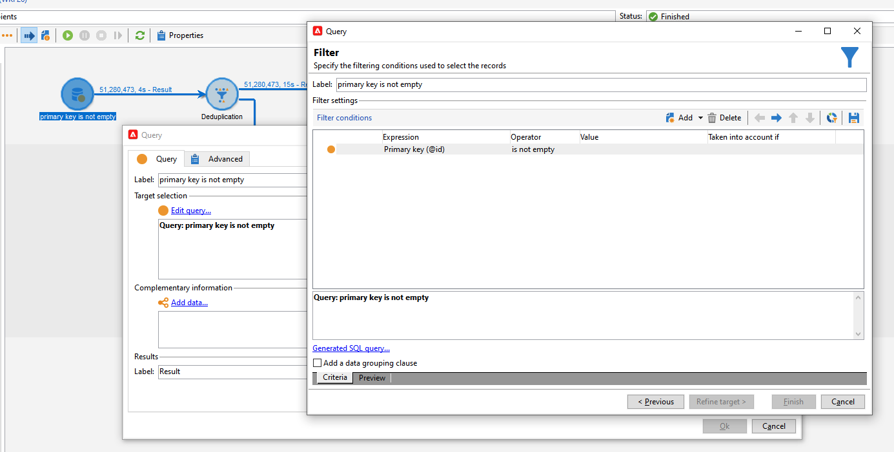
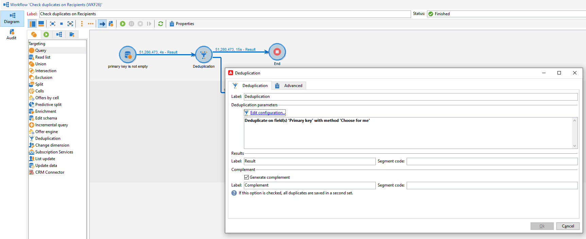
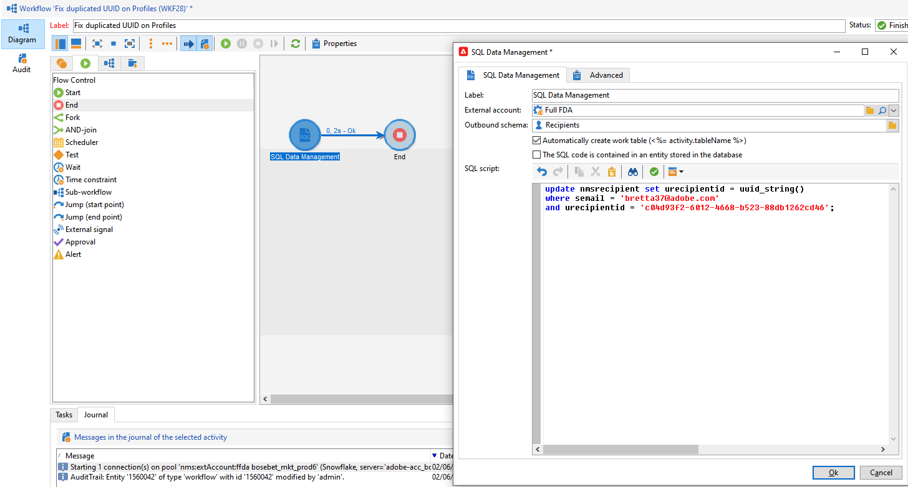

# 密鑰管理和唯一性{#key-management}

在Campaign v8中，主要索引鍵是通用唯一IDentifier(UUID)，此為字元字串。 若要建立此UUID，架構的主要元素必須包含設為&#x200B;**true**&#x200B;的&#x200B;**autopk**&#x200B;屬性。****

Adobe促銷活動v8以Snowflake為核心資料庫。 Snowflake資料庫的分佈式體系結構不提供管理表中密鑰的唯一性的機制：一般使用者負責確保Adobe Campaign資料庫內金鑰的一致性。

要保持關係資料庫的一致性，必須避免對密鑰（尤其是主密鑰）重複。 主要金鑰上的重複項目會導致資料管理工作流程活動發生問題，例如&#x200B;**Query**、**調解**、**更新資料**&#x200B;等。

作為最佳作法，Adobe建議在資料庫中載入重複的鍵值時，在整體資料管理流程中採用[Detect](#detect-duplicates)和[Correct](#correct-duplicates)策略。

## 檢測重複項{#detect-duplicates}

Campaign隨附新的護欄，在準備傳送期間會自動移除對象中任何重複的UUID。 這個新機制可防止在準備傳送時發生任何錯誤。

身為一般使用者，您可以在傳送記錄檔中檢查此資訊：由於重複的金鑰，某些收件者可能會從主要目標中排除。 在這種情況下，會顯示下列警告：`Exclusion of duplicates (based on the primary key or targeted records)`。


發生此情況時，您可以建立工作流程以識別重複金鑰。 然後您就能修正這些金鑰。 若要執行此作業，請遵循下列步驟：

1. 建立新的工作流程。

   

1. 新增&#x200B;**Query**&#x200B;活動
1. 選擇&#x200B;**Recipient**&#x200B;表

   

1. 新增&#x200B;**重複資料刪除**&#x200B;活動，並對主要索引鍵(UUID)進行重複資料刪除。 請僅保留一個重複項，並勾選「產生補充項&#x200B;**」選項，為重複項建立出站轉變。**

   

1. 使用清單更新活動將重複項目儲存至清單。

   

現在，您可以直接從清單存取重複的收件者。 即使轉變僅包含其中一個重複列，所有重複項目也會記錄到清單中。


## 更正重複項{#correct-duplicates}

更正重複項目需要客戶更新Campaign資料。 動作類型與重複項目和實作的性質緊密結合。 我們可能會面臨多個需要不同緩解策略（移除、合併或更新）的案例。

>[!IMPORTANT]
>
>重複的主鍵阻止您使用內置的工作流活動來選擇或更新特定行。 由於重複的UUID，重複資料刪除將會失敗，並且可能影響資料庫的完整性。 因此，強烈建議更正重複項目。

例如：

* **案例1**  — 具有相同UUID和相同設定檔資訊（相同電子郵件、名字等）的重複收件者:收件者看起來像是「真正」的重複項目，緩解措施可能只是移除其中一個重複項目。
另一種方法是將一個收件人的資訊合併到另一個收件人。

* **案例2**  — 以相同UUID但不同設定檔資訊（不同電子郵件、名字等）重複的收件者:
這次，似乎有不同的設定檔，而您可能想要將兩者保留在Campaign資料庫中，這表示我們可能偏好只更新其中一個重複項目，以產生新的UUID。 [深入了解此範例](#deduplicate-sample)。

根據您的緩解策略，您一律可以從其他工作流程查詢清單，然後視需要套用更新。 如需詳細指引，請連絡Adobe。

### 重複資料刪除示例{#deduplicate-sample}

如果收件者重複，您可以在Campaign資料庫中保留這兩項記錄。 在這種情況下，您需要使用新的UUID來更新其中一個UUID。

因此，要在雲資料庫上運行SQL更新查詢，可以使用&#x200B;**SQL資料管理**&#x200B;工作流活動並執行以下SQL更新：

```sql
update nmsrecipient set urecipientid = uuid_string()
where semail = 'bretta37@adobe.com'
and urecipientid = 'c04d93f2-6012-4668-b523-88db1262cd46';
```



使用新的UUID更新選取的列後，您就可以從介面檢查更新的列，並注意UUID已如預期般更新。 您也可以執行&#x200B;**偵測重複項目**&#x200B;工作流程[，如此處](#detect-duplicates)所述，以偵測資料庫中的重複項目。
