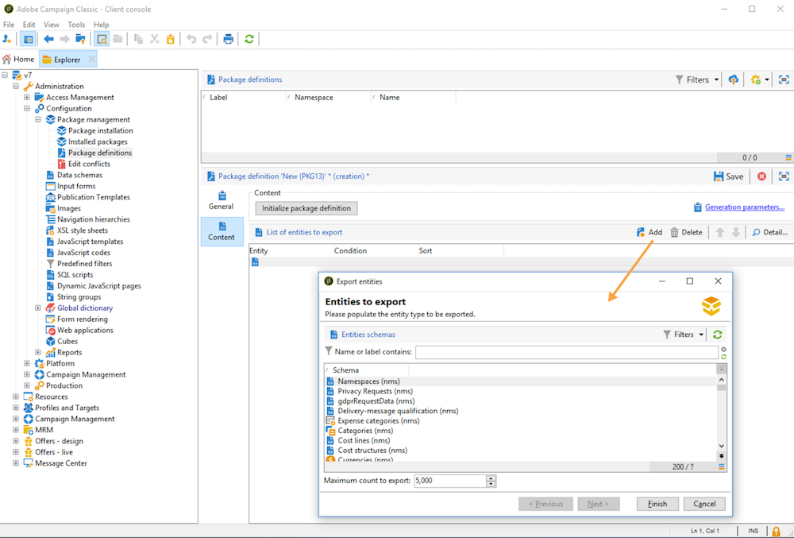

# 使用資料包{#data-packages}

## 開始使用封裝 {#gs-data-packages}

您可以使用資料包來匯出和匯入平台自訂設定和資料。 套件可包含不同型別的設定和元件，不論是否經過篩選。

在Campaign資料套件中，Adobe Campaign資料庫的實體會顯示為XML檔案。 在套件中，每個實體由其所有資料表示。

的原則 **資料套件** 是匯出資料設定，並將其整合至另一個Adobe Campaign環境。 在此瞭解如何維持一組一致的資料包 [區段](#data-package-best-practices).

### 封裝型別 {#types-of-packages}

您可以在Adobe Campaign中使用三種型別的套件：使用者套件、平台套件和管理套件。

* A **使用者套件** 可讓您選取要匯出的實體清單。 這種型別的套件管理相依性並檢查錯誤。
* A **平台套件** 包括所有新增的技術資源（非標準）：結構描述、JavaScript程式碼等。
* 一個 **管理套件** 包括所有新增的範本和業務物件（非標準）：範本、物件庫等。

>[!CAUTION]
>
>此 **平台** 和 **管理員** 套件包含要匯出的預先定義實體清單。 每個實體都會連結至篩選條件，可讓您移除已建立封裝的現成資源。

## 資料結構 {#data-structure}

資料封裝的描述是符合 **xrk：navtree** 資料結構，如下列範例所示：

```xml
<package>
  <entities schema="nms:recipient">
    <recipient email="john.smith@adobe.com" lastName="Smith" firstName="John">      
      <folder _operation="none" name="nmsRootFolder"/>      
      <company _operation="none" name="Adobe"/>
    </recipient>
  </entities>
  <entities schema="sfa:company">
    <company name="Adobe">
      <location city="London" zipCode="W11 2BQ"/>
    </company>
  </entities>
</package>
```

XML檔案的開始和結尾必須是 `<package>` 元素。 任何 `<entities>` 後續的元素會依檔案型別分配資料。 一個 `<entities>` 元素包含套件的資料，其格式為在中輸入的資料結構描述 **綱要** 屬性。 套件中的資料不得包含基底之間不相容的內部索引鍵，例如自動產生的索引鍵(**autopk** 選項)。

在我們的範例中， `folder` 和 `company` 連結已被目的地表格上所謂的「高階」索引鍵取代：

```xml
<recipient>
  <folder _operation="none" name="nmsRootFolder"/>
  <company _operation="none" name="Adobe"/>
</recipient>
```

此 `operation` 屬性值為的屬性 `none` 會定義調解連結。

您可以從任何文字編輯器手動建立資料套件。 您必須確保XML檔案的結構符合 `xtk:navtree` 資料結構描述。 使用者端主控台具有資料包匯出與匯入模組。

## 匯出套件 {#export-packages}

套件可以三種不同的方式匯出：

* 使用 **[!UICONTROL Package Export]** 「助理」，匯出單一封裝中的一組物件。 [了解更多](#export-a-set-of-objects-in-a-package)
* 匯出 **單一物件**，以滑鼠右鍵按一下並選取「 」 **[!UICONTROL Actions > Export in a package]**.
* 使用 **套件定義** 建立封裝結構，您可在其中新增物件，以便稍後在封裝中匯出。 [了解更多](#manage-package-definitions)

套件匯出後，您可以將它和所有新增的實體匯入另一個Campaign執行個體。

### 匯出封裝中的一組物件 {#export-a-set-of-objects-in-a-package}

若要匯出資料封裝中的物件集，請遵循下列步驟：

1. 透過，瀏覽至套件匯出小幫手 **[!UICONTROL Tools > Advanced > Export package...]** 檔案總管的功能表。
1. 選取 [封裝型別](#types-of-packages).

   

1. 按一下 **新增** 按鈕以選取要匯出為封裝的實體。

   >[!CAUTION]
   >
   >如果您匯出 **[!UICONTROL Offer category]**， **[!UICONTROL Offer environment]**， **[!UICONTROL Program]** 或 **[!UICONTROL Plan]** 輸入資料夾，請勿選取 **xtk：folder** 因為您可能會遺失部分資料。 選取與資料夾對應的實體： **nms：offerCategory** 若為優惠方案類別， **nms：offerEnv** 若為優惠方案環境， **nms：program** 適用於計畫，以及 **nms：plan** 適用於計畫。

   相依性機制會控制實體匯出順序。 有關詳細資訊，請參閱 [管理相依性](#manage-dependencies).

1. 按一下 **[!UICONTROL Next]** 和定義要擷取之檔案型別的篩選查詢。 您必須設定資料擷取的篩選子句。

   >[!NOTE]
   >
   >查詢編輯器的顯示位置為 [本節](../../automation/workflow/query.md).

1. 按一下 **[!UICONTROL Next]** 並選取匯出資料的排序順序。

1. 預覽要擷取的資料，以檢查您的設定。

1. 封裝匯出助理的最後一頁可讓您開始匯出。 資料將會儲存在 **[!UICONTROL File]** 欄位。

### 管理相依性 {#manage-dependencies}

匯出程式會追蹤各種匯出元素之間的連結。 此機制由兩個規則定義：

* 連結至連結的物件，具有 `own` 或 `owncopy` 型別完整性會匯出到與匯出物件相同的封裝中。
* 連結至連結的物件 `neutral` 或 `define` 型別完整性（定義的連結）必須單獨匯出。

>[!NOTE]
>
>連結到結構描述元素的完整性型別定義於 [此頁面](database-links.md).

#### 匯出行銷活動 {#export-a-campaign}

以下是如何匯出行銷活動的範例。 要匯出的行銷活動包含：
* a `MyTask`任務
* a `campaignWorkflow` 工作流程於下列資料夾： **[!UICONTROL Administration > Production > Technical workflows > Campaign processes > MyWorkflow]**.

任務和工作流程會匯出到與行銷活動相同的套件中，因為相符的結構描述是由連結連結連結的，連結帶有 `own` 型別完整性。

封裝內容為：

```xml
<?xml version='1.0'?>
<package author="Administrator (admin)" buildNumber="7974" buildVersion="7.1" img=""
label="" name="" namespace="" vendor="">
 <desc></desc>
 <version buildDate="2013-01-09 10:30:18.954Z"/>
 <entities schema="nms:operation">
  <operation duration="432000" end="2013-01-14" internalName="OP1" label="MyCampaign"
  modelName="opEmpty" start="2013-01-09">
   <controlGroup>
    <where filteringSchema=""/>
   </controlGroup>
   <seedList>
    <where filteringSchema="nms:seedMember"></where>
    <seedMember internalName="SDM1"></seedMember>
   </seedList>
   <parameter useAsset="1" useBudget="1" useControlGroup="1" useDeliveryOutline="1"
   useDocument="1" useFCPValidation="0" useSeedMember="1" useTask="1"
   useValidation="1" useWorkflow="1"></parameter>
   <fcpSeed>
    <where filteringSchema="nms:seedMember"></where>
   </fcpSeed>
   <owner _operation="none" name="admin" type="0"/>
   <program _operation="none" name="nmsOperations"/>
   <task end="2013-01-17 10:07:51.000Z" label="MyTask" name="TSK2" start="2013-01-16 10:07:51.000Z"
   status="1">
    <owner _operation="none" name="admin" type="0"/>
    <operation _operation="none" internalName="OP1"/>
    <folder _operation="none" name="nmsTask"/>
   </task>
   <workflow internalName="WKF12" label="CampaignWorkflow" modelName="newOpEmpty"
   order="8982" scenario-cs="Notification of the workflow supervisor (notifySupervisor)"
   schema="nms:recipient">
    <scenario internalName="notifySupervisor"/>
    <desc></desc>
    <folder _operation="none" name="Folder4"/>
    <operation _operation="none" internalName="OP1"/>
   </workflow>
  </operation>
 </entities>
</package>   
```

套裝軟體型別的附屬關係是在架構中使用以下定義： `@pkgAdmin and @pkgPlatform` 屬性。 這兩個屬性都會接收定義套裝軟體附屬關係條件的XTK運算式。

```xml
<element name="offerEnv" img="nms:offerEnv.png" 
template="xtk:folder" pkgAdmin="@id != 0">
```

最後， `@pkgStatus` 屬性可讓您定義這些元素或屬性的匯出規則。 根據屬性的值，可在匯出的封裝中找到元素或屬性。 此屬性的三個可能值包括：

* `never`：不會匯出欄位/連結
* `always`：強制匯出此欄位
* `preCreate`：授權建立連結的實體

>[!NOTE]
>
>此 `preCreate` 值僅允許用於連結型別事件。 它可讓您建立或指向尚未載入匯出封裝中的實體。

## 管理封裝定義 {#manage-package-definitions}

封裝定義可讓您建立封裝結構，在其中新增稍後將在單一封裝中匯出的實體。 然後，您就可以將此套件和所有新增的實體匯入另一個Campaign執行個體。

### 建立套件定義 {#create-a-package-definition}

套件定義可從以下位置存取： **[!UICONTROL Administration > Configuration > Package management > Package definitions]** 功能表。

若要建立封裝定義，請按一下 **[!UICONTROL New]** 按鈕，然後填寫封裝定義一般資訊。


然後，您可以將實體加入封裝定義中，並將其匯出至XML檔案封裝。

**相關主題：**

* [將實體新增至封裝定義](#add-entities-to-a-package-definition)
* [設定封裝定義產生](#configure-package-definitions-generation)
* [從封裝定義匯出封裝](#export-packages-from-a-package-definition)

### 將實體新增至封裝定義 {#add-entities-to-a-package-definition}

在 **[!UICONTROL Content]** 索引標籤，按一下 **[!UICONTROL Add]** 按鈕以選取要與封裝一起匯出的圖元。 選取實體時的最佳實務會顯示在中 [本節](#export-a-set-of-objects-in-a-package).



實體可以直接從其在執行個體中的位置新增到套件定義中。 要執行此操作，請遵循下列步驟：

1. 以滑鼠右鍵按一下所需的實體，然後選取 **[!UICONTROL Actions > Export in a package]**.

1. 選取 **[!UICONTROL Add to a package definition]**，然後選取您要新增實體的套件定義。

1. 實體會新增至封裝定義，隨封裝一併匯出(請參閱 [本節](#export-packages-from-a-package-definition))。

### 設定封裝定義產生 {#configure-package-definitions-generation}

套件產生可從套件定義進行設定 **[!UICONTROL Content]** 標籤。 若要這麼做，請按一下 **[!UICONTROL Generation parameters]** 連結。


* 使用 **[!UICONTROL Include the definition]** 選項以包含封裝定義中目前使用的定義。
* 使用 **[!UICONTROL Include an installation script]** 選項來新增javascript指令碼，以便在套件匯入時執行。 選取時， **[!UICONTROL Script]** 索引標籤會新增到封裝定義畫面中。
* 使用 **[!UICONTROL Include default values]** 用於將所有實體屬性的值新增至封裝的選項。

  為了避免長的匯出時間，預設不會選取此選項。 這表示在預設情況下，具有預設值（「空字串」、「0」和「false」，如果未在結構描述中另外定義）的實體屬性不會新增到封裝中，因此不會匯出。

  >[!CAUTION]
  >
  >如果匯入封裝的執行個體包含與封裝相同的實體（例如具有相同的外部ID），則其屬性不會更新。 如果前一個執行處理的屬性具有預設值，則可能會發生這種情況，因為它們未包含在封裝中。 在該情況下，選取 **[!UICONTROL Include default values]** 選項會防止版本合併，因為先前執行個體中的所有屬性都會隨套件匯出。

### 從封裝定義匯出封裝 {#export-packages-from-a-package-definition}

若要從封裝定義匯出封裝，請遵循下列步驟：

1. 選取要匯出的封裝定義，按一下 **[!UICONTROL Actions]** 按鈕，然後選取 **[!UICONTROL Export the package]**.
1. 檢查匯出檔案的名稱和位置。
1. 按一下 **[!UICONTROL Start]** 按鈕以啟動匯出。

## 匯入套件 {#import-packages}

套件匯入助理可從主功能表存取 **[!UICONTROL Tools > Advanced > Import package]** 使用者端主控台的。

### 從檔案安裝套件 {#install-a-package-from-a-file}

若要匯入現有的資料套件，請執行下列步驟：

1. 透過主功能表存取匯入助理 **[!UICONTROL Tools > Advanced > Import package]** 使用者端主控台的。
1. 選取XML檔案並按一下 **[!UICONTROL Open]**.

然後，要匯入的封裝內容會顯示在編輯器的中間區段中。

按一下 **[!UICONTROL Next]** 和 **[!UICONTROL Start]** 以啟動匯入。

### 安裝內建套件 {#install-a-standard-package}

內建套件(亦稱為 標準套件)會在設定Adobe Campaign時安裝。 您可以匯入新的標準套件，具體取決於您的許可權、部署模式和產品。

請參閱您的授權合約，以檢查您可以安裝哪些套件。

## 資料套件最佳實務 {#data-package-best-practices}

本節說明如何在專案的整個生命週期中，以一致的方式組織資料套件。


### 版本

您必須一律匯入相同版本的平台。 您必須檢查是否要在具有相同組建的兩個執行個體之間部署套件。 切勿強制匯入，並一律先更新平台（如果組建不同）。

>[!IMPORTANT]
>
>Adobe不支援在不同版本之間匯入。

請留意結構描述和資料庫結構。 匯入具有結構描述的套件後必須產生結構描述。

### 封裝型別 {#package-types}

從定義不同型別的封裝開始。 僅使用四種型別：

**實體**

* Adobe Campaign中的所有「xtk」和「nms」特定元素，例如結構描述、表單、資料夾、傳遞範本等，
* 您可以將實體同時視為「管理員」和「平台」元素。
* 在Campaign執行個體上傳時，封裝中不應包含多個實體。

如果您需要在新執行個體上部署設定，可以匯入所有實體套件。

**功能**

此型別的封裝：
* 回答使用者端需求/規格。
* 包含一或多個功能。
* 應該包含所有相依性，才能在不使用任何其他封裝的情況下執行功能。

**行銷活動**

此封裝不是強制性的。 有時候，為所有行銷活動建立特定型別會很有用，即使行銷活動可視為一項功能。

**更新**

設定之後，功能就可以匯出至另一個環境。 例如，套件可從開發環境匯出至測試環境。 在此測試中，會顯示缺陷。 首先，它需要在開發環境中修正。 接著，應該將修補程式套用至測試平台。

第一個解決方案是再次匯出整個特徵。 但是，為避免任何風險（更新不需要的元素），僅包含更正的套件比較安全。

這就是我們建議建立「更新」封裝的原因，它只包含特徵的一個圖元型別。

更新不僅可以是修正，也可以是實體/功能/行銷活動封裝的新元素。 若要避免部署整個套件，您可以匯出更新套件。

### 命名慣例 {#data-package-naming}

現在已定義型別，我們應該指定命名慣例。 Adobe Campaign不允許根據套件規格建立子資料夾，這表示數字是保持井然有序的最佳解決方案。 數字前置碼封裝名稱。

例如，您可以使用以下慣例：

* 實體：從1到99
* 功能：從100到199
* 促銷活動：從200到299
* 更新：從5000到5999

#### 實體套件順序 {#entity-packages-order}

為協助匯入，實體套件應按照匯入順序排序。

例如：

* 001 — 結構描述
* 002 — 表單
* 003 — 影像
* 等等。

>[!NOTE]
>
>Forms僅供匯入 **晚於** 結構描述更新。


#### 套件檔案 {#package-documentation}

更新套件時，您應該一律在說明欄位中加上註解，以詳細說明任何修改和原因（例如「新增結構」或「修正缺陷」）。

最佳實務也是輸入更新日期。

>[!IMPORTANT]
>
>說明欄位最多只能包含2.000個字元。

