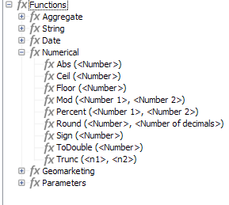

# 方案結構{#schema-structure}

`<srcschema>`的基本結構如下：

```
<srcSchema>
    <enumeration>
        ...          //definition of enumerations
    </enumeration>
   
    <element>         //definition of the root <element>    (mandatory)

        <compute-string/>  //definition of a compute-string
        <key>
            ...        //definition of keys
        </key>
        <sysFilter>
            ...           //definition of filters
        </sysFilter>
        <attribute>
            ...             //definition of fields
        </attribute>
    
            <element>           //definition of sub-<element> 
                  <attribute>           //(collection, links or XML)
                  ...                         //and additional fields
                  </attribute>
                ...
            </element>
      
    </element> 

        <methods>                 //definition of SOAP methods
            <method>
                ...
            </method>
            ...
    </methods>  
          
</srcSchema>
```

資料架構的XML文檔必須包含&#x200B;**name**&#x200B;和&#x200B;**namespace**&#x200B;屬性的&#x200B;**`<srcschema>`**&#x200B;根元素，以填充架構名稱及其命名空間。

```
<srcSchema name="schema_name" namespace="namespace">
...
</srcSchema>
```

讓我們使用以下XML內容來說明資料架構的結構：

```
<recipient email="John.doe@aol.com" created="AAAA/DD/MM" gender="1"> 
  <location city="London"/>
</recipient>
```

與其對應的資料結構：

```
<srcSchema name="recipient" namespace="cus">
  <element name="recipient">
    <attribute name="email"/>
    <attribute name="created"/>
    <attribute name="gender"/>
    <element name="location">
      <attribute name="city"/>
   </element>
  </element>
</srcSchema>
```

## 說明 {#description}

架構的進入點是其主要元素。 很容易識別，因為其名稱與結構相同，且應為根元素的子項。 內容的說明以此元素開頭。

在我們的範例中，主要元素以下列行表示：

```
<element name="recipient">
```

主要元素後面的元素&#x200B;**`<attribute>`**&#x200B;和&#x200B;**`<element>`**&#x200B;允許您定義XML結構中資料項的位置和名稱。

在我們的範例結構中，以下是：

```
<attribute name="email"/>
<attribute name="created"/>
<attribute name="gender"/>
<element name="location">
  <attribute name="city"/>
</element>
```

必須遵守下列規則：

* 每個&#x200B;**`<element>`**&#x200B;和&#x200B;**`<attribute>`**&#x200B;必須透過&#x200B;**name**&#x200B;屬性以名稱識別。

   >[!CAUTION]
   >
   >元素的名稱應簡明扼要，最好是英文，並且僅包括符合XML命名規則的授權字元。

* 在XML結構中，只有&#x200B;**`<element>`**&#x200B;元素可以包含&#x200B;**`<attribute>`**&#x200B;元素和&#x200B;**`<element>`**&#x200B;元素。
* **`<attribute>`**&#x200B;元素在&#x200B;**`<element>`**&#x200B;內必須具有唯一名稱。
* 建議在多行資料字串中使用&#x200B;**`<elements>`**。

## 資料類型 {#data-types}

資料類型是透過&#x200B;**`<attribute>`**&#x200B;和&#x200B;**`<element>`**&#x200B;元素中的&#x200B;**type**&#x200B;屬性輸入的。

[Campaign Classicv7檔案](https://experienceleague.adobe.com/docs/campaign-classic/using/configuring-campaign-classic/schema-reference/elements-attributes/schema-introduction.html?lang=en#configuring-campaign-classic)中提供詳細清單。

未填入此屬性時，除非元素包含子元素，否則&#x200B;**string**&#x200B;為預設資料類型。 若有，則僅用於以階層式結構元素（在本範例中為&#x200B;**`<location>`**&#x200B;元素）。

結構支援下列資料類型：

* **字串**:字串。範例：名字、城鎮等。

   可透過&#x200B;**length**&#x200B;屬性指定大小（選用，預設值「255」）。

* **布林值**:布林欄位。可能的值範例：true/false、0/1、yes/no等。
* **位元組**, **短**, **長**:整數（1個位元組、2個位元組、4個位元組）。範例：年齡、帳號、點數等。
* **雙**:雙精度浮點數。範例：價格、費率等。
* **date**,  **datetime**:日期和日期+時間。範例：出生日期、購買日期等。
* **datetimenotz**:日期+時間（不含時區資料）。
* **時間範圍**:持續時間。範例：資歷。
* **備忘錄**:長文本欄位（多行）。範例：說明、注釋等。
* **uuid**:&quot;uniqueidentifier&quot;欄位

   >[!NOTE]
   >
   >若要包含&#x200B;**uuid**&#x200B;欄位，必須新增&quot;newuuid()&quot;函式並以其預設值完成。

以下是輸入類型的範例結構：

```
<srcSchema name="recipient" namespace="cus">
  <element name="recipient">
    <attribute name="email" type="string" length="80"/>
    <attribute name="created" type="datetime"/>
    <attribute name="gender" type="byte"/>
    <element name="location">
      <attribute name="city" type="string" length="50"/>
   </element>
  </element>
</srcSchema>
```

## 屬性 {#properties}

資料架構的&#x200B;**`<elements>`**&#x200B;和&#x200B;**`<attributes>`**&#x200B;元素可以豐富各種屬性。 您可以填入標籤以說明目前的元素。

### 標籤和說明{#labels-and-descriptions}

* **label**&#x200B;屬性可讓您輸入簡短說明。

   >[!NOTE]
   >
   >標籤與實例的當前語言相關聯。

   **範例**:

   ```
   <attribute name="email" type="string" length="80" label="Email"/>
   ```

   您可從Adobe Campaign用戶端主控台輸入表單中查看標籤：

   

* **desc**&#x200B;屬性可讓您輸入長說明。

   您可從Adobe Campaign用戶端主控台主視窗狀態列的輸入表單中查看說明。

   >[!NOTE]
   >
   >說明與例項的目前語言相關聯。

   **範例**:

   ```
   <attribute name="email" type="string" length="80" label="Email" desc="Email of recipient"/>
   ```

### 預設值{#default-values}

**default**&#x200B;屬性可讓您定義在內容建立時傳回預設值的運算式。

該值必須是與XPath語言相容的表達式。 如需詳細資訊，請參閱[本章節](#reference-with-xpath)。

**範例**:

* 當前日期：**default=&quot;GetDate()&quot;**
* 計數器：**default=&quot;&#39;FRM&#39;+CounterValue(&#39;myCounter&#39;)&quot;**

   在此示例中，預設值是使用字串的串連來構建的，並使用自由計數器名稱調用&#x200B;**CounterValue**&#x200B;函式。 每次插入時，傳回的數字會增加一。

   >[!NOTE]
   >
   >在Adobe Campaign用戶端主控台中， **[!UICONTROL Administration>Counters]**&#x200B;節點用於管理計數器。

若要將預設值連結到欄位，可以使用`<default>  or  <sqldefault>   field.  </sqldefault> </default>`

`<default>` :可讓您在建立實體時，以預設值預先填入欄位。該值將不是預設SQL值。

`<sqldefault>` :可讓您在建立欄位時有新增值。此值將作為SQL結果顯示。 在結構更新期間，只有新記錄會受此值影響。

### 分項清單 {#enumerations}

#### 自由枚舉{#free-enumeration}

**userEnum**&#x200B;屬性可讓您定義自由枚舉，以記住並顯示通過此欄位輸入的值。 語法如下：

**userEnum=&quot;枚舉的名稱&quot;**

可以自由選擇給枚舉的名稱並與其他欄位共用。

這些值會顯示在輸入表單的下拉式清單中：


>[!NOTE]
>
>在Adobe Campaign用戶端主控台中， **[!UICONTROL Administration > Enumerations]**&#x200B;節點用於管理列舉。

#### 設定枚舉{#set-enumeration}

**enum**&#x200B;屬性可讓您定義預先知道可能值清單時所使用的固定分項清單。

**enum**&#x200B;屬性引用在主要元素之外的架構中填充的枚舉類的定義。

列舉可讓使用者從下拉式清單中選取值，而非在一般輸入欄位中輸入值：


資料結構中的列舉聲明範例：

```
<enumeration name="gender" basetype="byte" default="0">    
  <value name="unknown" label="Not specified" value="0"/>    
  <value name="male" label="male" value="1"/>   
  <value name="female" label="female" value="2"/>   
</enumeration>
```

會透過&#x200B;**`<enumeration>`**&#x200B;元素在主要元素外部宣告分項清單。

枚舉屬性如下：

* **baseType**:與值關聯的資料類型，
* **標籤**:枚舉的描述，
* **名稱**:枚舉的名稱，
* **預設**:枚舉的預設值。

枚舉值在&#x200B;**`<value>`**&#x200B;元素中聲明，具有以下屬性：

* **名稱**:內部儲存的值名稱，
* **標籤**:標籤。

#### dbenum枚舉{#dbenum-enumeration}

* **dbenum**&#x200B;屬性可讓您定義屬性與&#x200B;**enum**&#x200B;屬性相似的分項清單。

   但是，**name**&#x200B;屬性不會在內部儲存值，它會儲存一個代碼，該代碼允許您在不修改其架構的情況下擴展相關表。

   值是透過&#x200B;**[!UICONTROL Administration>Enumerations]**&#x200B;節點定義。

   例如，此分項清單用於指定促銷活動的性質。

   

### 範例 {#example}

以下是已填入屬性的範例結構：

```
<srcSchema name="recipient" namespace="cus">
  <enumeration name="gender" basetype="byte">    
    <value name="unknown" label="Not specified" value="0"/>    
    <value name="male" label="male" value="1"/>   
    <value name="female" label="female" value="2"/>   
  </enumeration>

  <element name="recipient">
    <attribute name="email" type="string" length="80" label="Email" desc="Email of recipient"/>
    <attribute name="created" type="datetime" label="Date of creation" default="GetDate()"/>
    <attribute name="gender" type="byte" label="gender" enum="gender"/>
    <element name="location" label="Location">
      <attribute name="city" type="string" length="50" label="City" userEnum="city"/>
   </element>
  </element>
</srcSchema>
```

## 集合 {#collections}

集合是具有相同名稱和相同階層層級的元素清單。

值為「true」的&#x200B;**unbound**&#x200B;屬性可讓您填入集合元素。

**範例**:架構中 **`<group>`** 集合元素的定義。

```
<element name="group" unbound="true" label="List of groups">
  <attribute name="label" type="string" label="Label"/>
</element>
```

對XML內容進行投影：

```
<group label="Group1"/>
<group label="Group2"/>
```

## XPath {#reference-with-xpath}的引用

Adobe Campaign中使用XPath語言來參考屬於資料架構的元素或屬性。

XPath是一種語法，用於在XML文檔的樹中查找節點。

元素由其名稱指定，屬性由名稱指定，名稱前面加上字元「@」。

**範例**:

* **@email**:選擇電子郵件，
* **location/@city**:在元素下選取「city」屬 **`<location>`** 性
* **../@email**:從當前元素的父元素中選擇電子郵件地址
* **群組`[1]/@label`**:選擇作為第一個集合元素的子項的「label」 **`<group>`** 屬性
* **群組`[@label='test1']`**:選取元素的子項「label」屬性， **`<group>`** 並包含「test1」值

>[!NOTE]
>
>當路徑跨過子元素時，會添加附加約束。 在此情況下，下列運算式必須放置在方括弧之間：
>
>* **location/@** city無效；請使用  **`[location/@city]`**
>* **`[@email]`** 和 **@** emailare對等

>


您也可以定義複雜的運算式，例如下列運算：

* **@gender+1**:將1新增至genderattribute的內 **** 容，
* **@email + &#39;(&#39;+@created+&#39;)&#39;**:通過取用添加到建立日期（括弧之間）的電子郵件地址的值（對於字串類型，以引號括住常數）來構建字串。

已在運算式中新增高階函式，以豐富此語言的潛力。

您可以透過Adobe Campaign用戶端主控台中的任何運算式編輯器來存取可用函式清單：



**範例**:

* **GetDate()**:傳回目前日期
* **年(@created)**:傳回「已建立」屬性中包含的日期年份。
* **GetEmailDomain(@email)**:返回電子郵件地址的域。

## 透過計算字串{#building-a-string-via-the-compute-string}建立字串

**計算字串**&#x200B;是XPath表達式，用於構造表示與架構相關聯的表中的記錄的字串。 **計** 算字串主要用於圖形介面，以顯示所選記錄的標籤。

**計算字串**&#x200B;是透過資料架構主要元素下的&#x200B;**`<compute-string>`**&#x200B;元素定義。 **expr**&#x200B;屬性包含用於計算顯示的XPath表達式。

**範例**:收件者表格的計算字串。

```
<srcSchema name="recipient" namespace="nms">  
  <element name="recipient">
    <compute-string expr="@lastName + ' ' + @firstName +' (' + @email + ')' "/>
    ...
  </element>
</srcSchema>
```

收件者的計算字串結果：**無名氏(john.doe@aol.com)**

>[!NOTE]
>
>如果架構不包含計算字串，預設情況下會填入計算字串，其中包含該架構的主鍵值。
