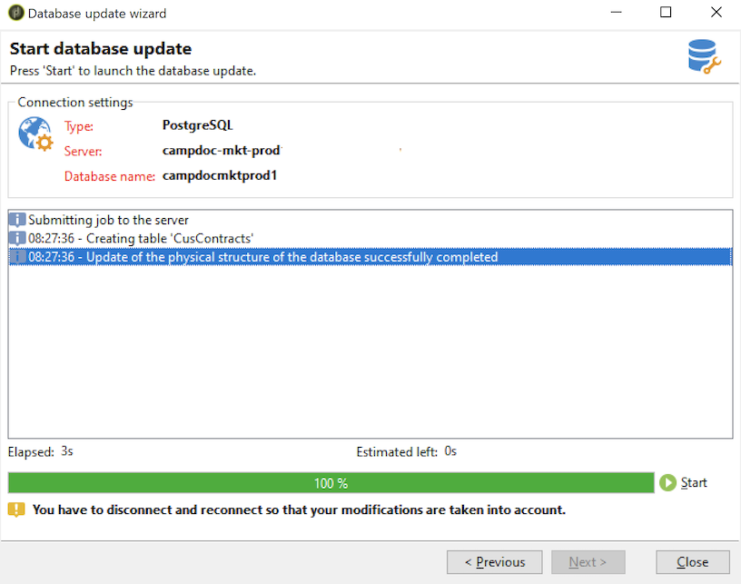

# 更新資料庫結構{#updating-the-database-structure}

要對方案應用修改，請啟動資料庫更新嚮導。 此助理可通過&#x200B;**[!UICONTROL Tools > Advanced > Update database structure]**&#x200B;訪問。 它檢查資料庫的物理結構是否與其邏輯說明匹配並執行SQL更新指令碼。

資料庫中的模組會自動填充和激活。

請按照以下步驟查看資料庫更新SQL指令碼：

>[!NOTE]
>
>這位於編輯欄位中，可加以修改以刪除或新增SQL程式碼。

接下來，啟動資料庫更新：

