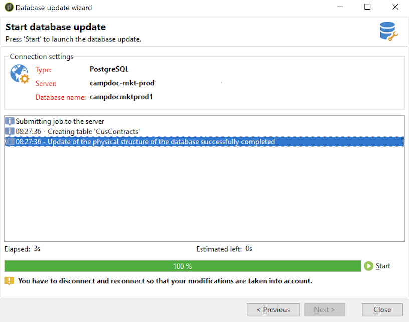

# 更新資料庫結構 {#updating-the-database-structure}

若要套用對結構描述所做的修改，請啟動資料庫更新精靈。 此助理可以透過&#x200B;**[!UICONTROL Tools > Advanced > Update database structure]**&#x200B;存取。 它會檢查資料庫的實體結構是否符合其邏輯描述，並執行SQL更新指令碼。

資料庫中的模組會自動填入並啟動。

請依照下列步驟操作，並檢視資料庫更新SQL指令碼：

>[!NOTE]
>
>這是編輯欄位，可以修改以刪除或新增SQL程式碼。

接下來，啟動資料庫更新：

