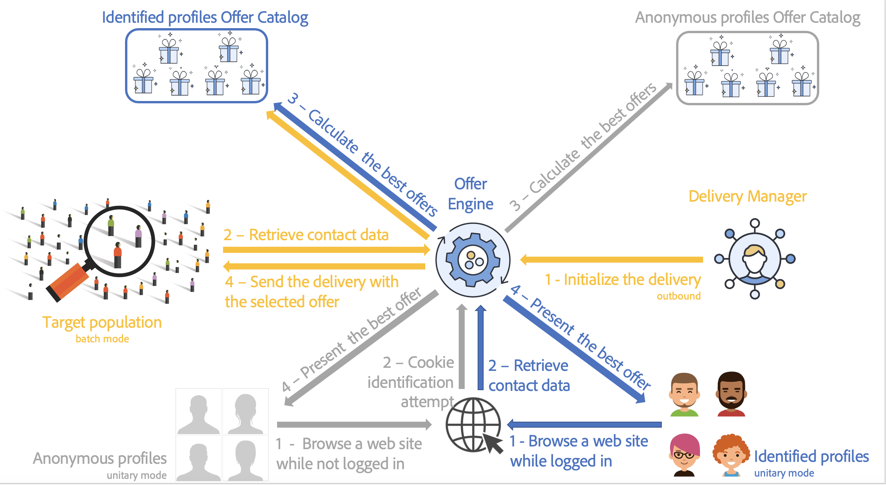
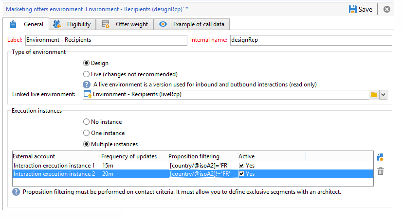

# 瞭解Campaign互動環境和架構

## 環境 {#environments}

管理優惠方案時，每個目標維度有兩個使用的環境：

* 一個&#x200B;**設計**&#x200B;環境，優惠方案管理員負責在其中建立和分類優惠方案、編輯優惠方案，以及開始核准程式以便使用。 此環境中也會定義每個類別的規則、可顯示優惠方案的優惠方案空間，以及用於定義優惠方案適用性的預先定義篩選器。

  類別也可以線上上環境中手動發佈。

  核准優惠方案的程式在此區段[中詳細說明](interaction-offer.md#approve-offers)。

* 您都可以找到&#x200B;**即時**&#x200B;環境，其中包含設計環境中的已核准優惠方案，以及在設計環境中設定的各種優惠方案空間、篩選器、類別和規則。 呼叫優惠方案引擎期間，引擎一律會使用即時環境中的優惠方案。

優惠方案只會部署在核准程式期間選取的優惠方案空間。 因此，選件可能是即時的，但無法用於也處於即時狀態的選件空間。

## 傳入和傳出的互動 {#interaction-types}

Adobe Campaign互動模組提出兩種互動：

* **傳入**&#x200B;互動，由連絡人起始。 [了解更多](interaction-present-offers.md)
* 由Campaign傳遞管理員起始的&#x200B;**傳出**&#x200B;互動。 [了解更多](interaction-send-offers.md)

這兩種互動型別可以在&#x200B;**單一模式** （單一連絡人的優惠方案已計算）或&#x200B;**批次模式** （一組連絡人的優惠方案已計算）中執行。 一般而言，傳入互動會以單一模式執行，而傳出互動則會以批次模式執行。 不過，對於[交易式訊息](../send/transactional.md)，可能會有一些例外，例如以單一模式執行輸出互動。

一旦可以或必須呈現優惠方案（根據執行的組態），優惠方案引擎就會扮演中介角色：它會結合所收到的連絡人相關資料以及可在應用程式中套用的不同規則，自動計算可用連絡人中可能的最佳優惠方案。



## 分散式架構

為了能夠支援擴充性並在傳入通道上提供全天候服務，**互動**&#x200B;模組在分散式架構中實作。 此型別的架構已與[訊息中心](../architecture/architecture.md#transac-msg-archi)搭配使用，而且由數個執行個體組成：

* 專用於傳出頻道並包含行銷和環境設計基礎的一個或多個控制例項
* 專用於傳入頻道的一或多個執行例項


控制例項專用於傳入頻道，並包含目錄的線上版本。 每個執行例項都是獨立的，並且專用於一個聯絡區段（例如，每個國家/地區一個執行例項）。 對選件引擎的呼叫必須直接在執行上執行（每個執行例項一個特定URL）。 由於執行個體之間的同步不是自動的，來自相同連絡人的互動必須透過相同執行個體傳送。

### 同步 {#synchronization}

選件同步會透過套件執行。 在執行例項上，所有目錄物件都以外部帳戶名稱為前置詞。 這表示在同一個執行例項上可以支援數個控制例項（例如開發和生產例項）。

>[!CAUTION]
>
>使用簡短且明確的內部名稱。

選件會自動部署，然後發佈在執行和控制執行個體上。

所有線上執行個體都會停用在設計環境中刪除的選件。 在清除期間（在每個執行個體的部署助理中指定）和滑動期間（在傳入主張的型別規則中指定）之後，所有執行個體上都會自動刪除過時的主張和優惠方案。


系統會為每個環境及外部帳戶建立工作流程，以進行主張同步。 同步頻率可以根據每個環境和外部帳戶進行調整。

您必須注意下列同步機制：

* 如果您從匿名環境使用回溯函式至已識別的環境，則這兩個環境必須在同一個執行例項上。
* 數個執行例項之間的同步不會即時執行。 相同連絡人的互動必須傳送至相同執行個體。 控制例項必須專用於傳出頻道（非即時）。
* 行銷資料庫不會自動同步。 權重和適用性規則中使用的行銷資料在執行例項上必須重複。 此程式並非標準流程，您必須在整合期間進行開發。
* 主張同步僅由FDA連線執行。
* 如果您在相同執行個體上使用互動和訊息中心，則在這兩種情況下都將透過FDA通訊協定進行同步。

### 套件設定 {#packages-configuration}

任何直接連結至&#x200B;**互動**&#x200B;的結構描述延伸模組（選件、主張、收件者等）都必須部署在執行例項上。

**Interaction**&#x200B;封裝已安裝在所有執行個體（控制項和執行）上。 另外兩個套件可供使用：一個套件用於控制執行個體，另一個用於每個執行執行個體。

>[!NOTE]
>
>安裝套件時，**nms**&#x200B;資料表的&#x200B;**long:proposition**&#x200B;型別欄位（例如主張識別碼）會變成&#x200B;**int64**&#x200B;型別欄位。 [Campaign Classic v7檔案](https://experienceleague.adobe.com/docs/campaign-classic/using/configuring-campaign-classic/schema-reference/schema-structure.html#mapping-the-types-of-adobe-campaign-dbms-data){target="_blank"}中會詳細說明此型別的資料。

在每個執行個體上設定資料保留期間（透過部署精靈中的&#x200B;**[!UICONTROL Data purge]**&#x200B;視窗）。 在執行例項上，此期間必須對應於要計算的型別規則（滑動期間）和適用性規則所需的歷史深度。

在控制例項上：

1. 為每個執行例項建立一個外部帳戶：

   

   * 完成標籤並新增簡短且明確的內部名稱。
   * 選取 **[!UICONTROL Execution instance]**。
   * 核取 **[!UICONTROL Enabled]** 選項。
   * 完成執行例項的連線引數。
   * 每個執行例項都必須連結至ID。 此ID是在您按一下&#x200B;**[!UICONTROL Initialize connection]**&#x200B;按鈕時指派。
   * 檢查使用的應用程式型別： **[!UICONTROL Message Center]**、**[!UICONTROL Interaction]**&#x200B;或兩者。
   * 輸入使用的FDA帳戶。 必須在執行例項上建立運運算元，且必須在相關例項的資料庫上擁有下列讀取和寫入許可權：

     ```
     grant SELECT ON nmspropositionrcp, nmsoffer, nmsofferspace, xtkoption, xtkfolder TO user;
     grant DELETE, INSERT, UPDATE ON nmspropositionrcp TO user;
     ```

   >[!NOTE]
   >
   >必須在執行例項上授權控制例項的IP位址。

1. 設定環境：

   

   * 新增執行個體清單。
   * 針對每一個專案，指定同步化期間和篩選條件（例如，依國家/地區）。

     >[!NOTE]
     >
     >如果發生錯誤，您可以參閱同步工作流程並提供通知。 您可在應用程式的技術工作流程中找到這些內容。

如果基於最佳化理由，只有部分行銷資料庫在執行例項上重複，您可以指定連結至環境的受限制綱要，以允許使用者僅使用執行例項上可用的資料。 您可以使用執行個體上無法取得的資料來建立選件。 若要這麼做，您必須藉由限制傳出頻道（**[!UICONTROL Taken into account if]**&#x200B;欄位）上的此規則，在其他頻道上停用該規則。


### 維護選項 {#maintenance-options}

以下是控制例項上可用的維護選項清單：

>[!CAUTION]
>
>這些選項只能用於特定的維護案例。

* **`NmsInteraction_LastOfferEnvSynch_<offerEnvId>_<executionInstanceId>`**：環境在指定執行個體上同步的最後日期。
* **`NmsInteraction_LastPropositionSynch_<propositionSchema>_<executionInstanceIdSource>_<executionInstanceIdTarget>`**：指定結構描述的建議從一個執行個體同步到另一個執行個體的上次日期。
* **`NmsInteraction_MapWorkflowId`**：包含所有已產生同步工作流程清單的選項。

以下選項可用於執行例項：

**NmsExecutionInstanceId**：包含執行個體識別碼的選項。

### 套件安裝 {#packages-installation}

如果您的執行個體先前沒有&#x200B;**互動**&#x200B;套件，則不需要進行移轉。 依預設，安裝套件後，主張表格將為64位元。

>[!CAUTION]
>
>根據您執行個體中現有主張的量，此操作可能需要一些時間。

* 如果您的執行個體只有很少的建議或沒有建議，就不需要手動修改建議表格。 修改會在安裝套件時完成。
* 如果您的執行個體有許多主張，最好在安裝控制套件並執行它們之前變更主張表結構。 我們建議在低活動期間執行查詢。

>[!NOTE]
>
>如果您在主張表中執行了特定配置，請相應地調整查詢。


方法有兩種：

**工作表** （建議）

```
CREATE TABLE NmsPropositionRcp_tmp AS SELECT * FROM nmspropositionrcp WHERE 0=1;
ALTER TABLE nmspropositionrcp_tmp
  ALTER COLUMN ipropositionid TYPE bigint,
  ALTER COLUMN iinteractionid TYPE bigint;
INSERT INTO nmspropositionrcp_tmp SELECT * FROM nmspropositionrcp;
DROP TABLE nmspropositionrcp;
CREATE INDEX proposition_id ON NmsPropositionRcp (ipropositionid);
CREATE INDEX nmspropositionrcp_deliveryid ON NmsPropositionRcp (ideliveryid);
CREATE INDEX nmspropositionrcp_lastmodified ON NmsPropositionRcp (tslastmodified);
CREATE INDEX nmspropositionrcp_offerid ON NmsPropositionRcp (iofferid);
CREATE INDEX nmspropositionrcp_offerspaceid ON NmsPropositionRcp (iofferspaceid);
CREATE INDEX nmspropositionrcp_recipientidid ON NmsPropositionRcp (irecipientid);
ALTER TABLE nmspropositionrcp_tmp RENAME TO nmspropositionrcp;
```

**變更資料表**

```
ALTER TABLE nmspropositionrcp
  ALTER COLUMN ipropositionid TYPE bigint,
  ALTER COLUMN iinteractionid TYPE bigint;
```
