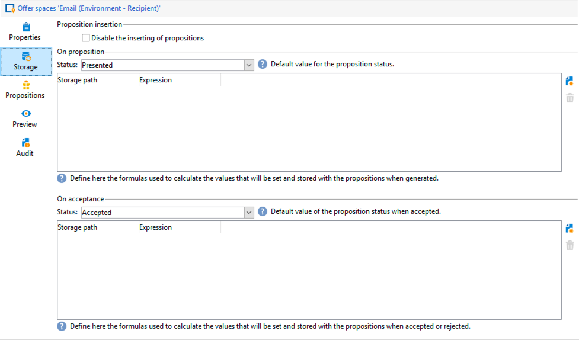

# 互動最佳實務{#interaction-best-practices}

## 一般性建議 {#general-recommendations}

管理Adobe Campaign的報價需要謹慎的管理才能高效地運作。 要避免出現任何問題，您必須在聯繫人數量與聘用類別和聘用數量之間找到平衡。

本節介紹管理 **交互** 模組，包括資格規則、預定義的篩選器、工作流活動和資料庫選項。

* 當 **實施和配置交互**，您必須瞭解以下建議：

   * 對於批處理引擎（通常用於出站通信，如電子郵件），吞吐量是主要考慮的問題，因為可以同時處理多個聯繫人。 典型的瓶頸是資料庫效能。
   * 單一引擎（通常用於入站通信，如網站上的橫幅）的主要約束是延遲，因為有人期望得到答案。 典型的瓶頸是CPU效能。
   * 產品目錄設計對Adobe Campaign的效能有著巨大影響。
   * 在處理許多產品時，最佳做法是將它們分成多個產品目錄。

* 下面列出了使用 **資格規則**:

   * 簡化規則。 規則複雜性在擴展查找時影響效能。 複雜規則是具有5個以上條件的規則。
   * 為了提高效能，可以在不同的預定義篩選器中分解規則，這些篩選器在多個產品中共用。
   * 將限制性最強的優惠類別規則置於樹中可能的最高位置。 這樣，他們會先過濾掉大多數聯繫人，減少目標數量，防止他們被更多規則處理。
   * 在樹的底部放置時間或處理方面最昂貴的規則。 執行此操作時，這些規則將僅在其餘目標受眾上運行。
   * 從特定類別開始，以避免掃描整個樹。
   * 為節省處理時間，請預計算聚合，而不是使用聯接構建複雜規則。 為此，請嘗試將客戶資料儲存在可在資格規則中查找的參考表中。
   * 使用最小權數來限制查詢數。
   * 建議每個服務空間有限數量的優惠。 這可確保在任何給定空間中更快地檢索產品。
   * 使用索引，尤其是常用查找列。

* 下面列出了關於 **命題表**:

   * 使用最少數量的規則使處理盡可能快。
   * 限制命題表中的記錄數：只保留跟蹤其狀態更新所需的記錄以及規則需要的內容，然後將它們存檔到另一個系統。
   * 對命題表執行密集的資料庫維護，如重建索引或重新建立表。
   * 限制每個目標所請求的建議數。 不要設定比實際使用的更多。
   * 在規則條件中盡量避免聯接。

## 管理優惠時的提示 {#tips-managing-offers}

本節包含有關管理優惠和使用Adobe Campaign互動模組的更詳細建議。

### 電子郵件中的多個服務空間 {#multiple-offer-spaces}

在交貨中包括聘用時，通常通過 **濃縮** 工作流活動（或另一個類似活動）。

在中選擇聘用時 **濃縮** 活動，您可以選擇要使用的空間。 但是，無論選擇的服務空間如何，交付定制菜單都取決於在交付中設定的服務空間。

在以下示例中，在交貨中選擇的服務空間是 **[!UICONTROL Email (Environment - Recipient)]**:


如果您在交貨中選擇的優惠空間沒有設定HTML呈現功能，則您將不會在交貨菜單中看到它，並且它將不可用於選擇。 這與在 **濃縮** 的子菜單。

在以下示例中，HTML呈現功能在下拉清單中可用，因為在傳遞中選擇的提供空間具有呈現功能：


此函式插入代碼，如： `<%@ include proposition="targetData.proposition" view="rendering/html" %>`。

當您選擇命題時， **[!UICONTROL view]** 屬性如下所示：
* &quot;rendering/html&quot;:html呈現。 它使用HTML渲染功能。
* 「提供/查看/html」：html內容。 它不使用HTML呈現功能。 它只包括HTML欄位。

如果在單個電子郵件傳遞中包含多個提供空間，並且其中有些具有呈現功能，而有些沒有，則必須記住哪些提供了空間，哪些提供了具有呈現功能的空間。

因此，為避免任何問題，建議所有提供空間都定義HTML呈現函式，即使您的提供空間僅需要HTML內容。

### 在命題日誌表中設定排名 {#rank-proposition-log-table}

在生成或接受命題時，提供空間能夠將資料儲存在命題表中：



但是，這僅適用於入站交互。

在使用出站交互時，以及在不使用交互模組的情況下使用出站優惠時，也可以在命題表中儲存其他資料。

將工作流臨時表中的名稱與命題表中的欄位名稱匹配的任何欄位複製到命題表中的同一欄位。

例如，在中手動選擇聘用（無交互）時 **濃縮** 工作流活動，標準欄位定義如下：


可以添加其他欄位，如 `@rank` 欄位：


因為命題表中有一個欄位名 `@rank`，將複製工作流臨時表中的值。

有關在命題表中儲存其他欄位的詳細資訊，請參閱 [此部分](interaction-send-offers.md#storing-offer-rankings-and-weights)。

對於具有交互功能的出站優惠，當選擇了多個優惠並且您想記錄它們在電子郵件中的顯示順序時，此選項非常有用。

您還可以直接將其他元資料儲存在命題表中，以保留有關生成優惠時所花費的歷史記錄。

使用出站交互時， `@rank` 可以添加欄位，如上例所示，但其值會根據Interaction返回的順序自動設定。 例如，如果您使用「交互」來選擇三個優惠， `@rank` 欄位將返回值1、2和3。

在使用交互和手動選擇優惠時，用戶可以將這兩種方法結合起來。 例如，用戶可以手動設定 `@rank` 為1的欄位，並使用表達式，如 `"1 + @rank"` Interaction返回的報價。 假設Interaction選擇三個優惠，兩種方法返回的優惠將分為1-4:


### 擴展nms:offer架構 {#extending-nms-offer-schema}

擴展nms:offer架構時，請確保遵循已設定的現成結構：
* 定義內容儲存的任何新欄位 `<element name="view">`。
* 每個新欄位需要定義兩次。 一次作為常規XML欄位，一次作為CDATA XML欄位，在名稱后附加「_jst」。 例如：

   ```
   <element label="Price" name="price" type="long" xml="true"/>
   <element advanced="true" label="Script price" name="price_jst" type="CDATA" xml="true"/>
   ```

* 必須將包含要跟蹤的URL的任何欄位置於 `<element name="trackedUrls">` 下 `<element name="view" >`。
