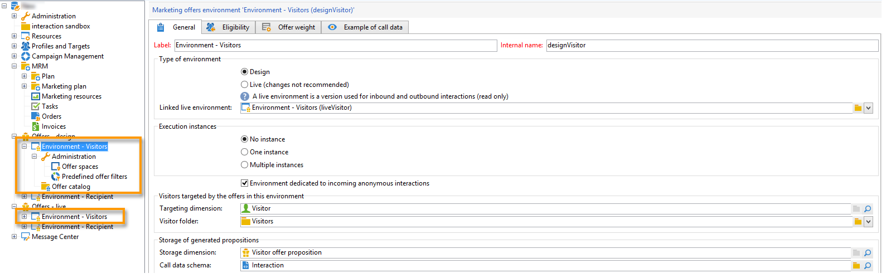

# 使用環境{#work-with-environments}

## 即時和設計環境{#live-design-environments}

互動適用於兩種型別的優惠方案環境：

* **[!UICONTROL Design]** 優惠方案環境包含正在編輯且可以變更的優惠方案。 這些優惠方案尚未經過核准週期，因此不會傳送給連絡人。
* **[!UICONTROL Live]** 優惠方案環境包含向連絡人展示的已核准優惠方案。 此環境中的選件是唯讀的。

每個 **[!UICONTROL Design]** 環境已連結至 **[!UICONTROL Live]** 環境。 當優惠方案完成時，其內容和適用性規則會受限於核准週期。 完成此週期後，系統會自動將相關選件部署至 **[!UICONTROL Live]** 環境。 從現在開始，該檔案將可供傳送。

依預設，Campaign會提供 **[!UICONTROL Design]** 環境和 **[!UICONTROL Live]** 連結的環境。 兩個環境都已預先設定為鎖定目標 [內建收件者表格](../dev/datamodel.md#ootb-profiles).

>[!NOTE]
>
>若要鎖定收件者表格，您必須使用目標對應助理員來建立環境。 [了解更多](#creating-an-offer-environment)。

傳遞管理員只能檢視 **[!UICONTROL Live]** 環境並運用選件來提供。 優惠方案管理員可檢視和使用 **[!UICONTROL Design]** 環境，並檢視 **[!UICONTROL Live]** 環境。 [了解更多](interaction-operators.md)

## 建立匿名互動的環境{#create-an-offer-environment}

依預設，Campaign附帶內建環境，可鎖定收件者表格（已識別的優惠）。 若要鎖定其他表格（例如造訪您網站進行傳入互動的匿名設定檔），您必須更新設定。

請遵循以下步驟：

1. 瀏覽至 **[!UICONTROL Administration]** > **[!UICONTROL Campaign management]** > **[!UICONTROL Target mappings]**，以滑鼠右鍵按一下您要使用的目標對應，然後選取 **[!UICONTROL Actions]** > **[!UICONTROL Modify the options of the targeting dimension]**.

   

1. 按一下 **[!UICONTROL Next]**，選取 **[!UICONTROL Generate a storage schema for propositions]** 選項並按一下 **[!UICONTROL Save]**.

   

   >[!NOTE]
   >
   >如果已核取選項，請取消核取該選項，然後重新核取它。

1. Adobe Campaign建立兩個環境 —  **[!UICONTROL Design]** 和 **[!UICONTROL Live]**  — 使用先前啟用目標對應的目標定位資訊。 環境已預先設定目標定位資訊。

如果您已啟用 **[!UICONTROL Visitor]** 對應， **[!UICONTROL Environment dedicated to incoming anonymous interactions]** 方塊會在環境的 **[!UICONTROL General]** 標籤。

此選項可讓您啟用匿名互動的特定功能，尤其是在設定環境優惠方案空間時。 您也可以設定選項來讓您從「已識別」環境切換至「匿名」環境。

例如，您可以將收件者環境優惠方案空間（已識別的連絡人）與符合訪客環境（未識別的連絡人）的優惠方案空間連結。 如此一來，聯絡人便可獲得不同的優惠方案，具體取決於是否識別此聯絡人。 有關詳細資訊，請參閱 [建立優惠方案空間](interaction-offer-spaces.md).

>[!NOTE]
>
>如需傳入頻道上匿名互動的詳細資訊，請參閱 [匿名互動](anonymous-interactions.md).
