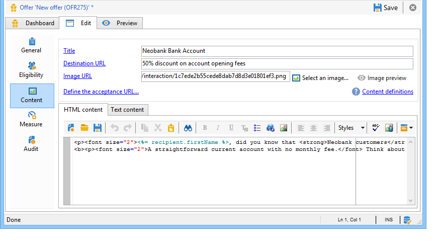

# 在網頁中新增優惠方案{#add-an-offer-in-web}

若要在網頁中呼叫優惠方案引擎，請直接將對JavaScript程式碼的呼叫插入頁面中。 此呼叫會傳回目標元素中的選件內容。

呼叫URL的指令碼看起來像這樣：

```
<script id="interactionProposalScript" src="https://<SERVER_URL>/nl/interactionProposal.js?env=" type="text/javascript"></script>
```

「**en**&quot;參數會接收專用於匿名互動之即時環境的內部名稱。

若要呈現選件，我們需要在Adobe Campaign中建立環境和選件空間，然後設定HTML頁面。

下列使用案例詳細說明透過JavaScript整合優惠方案的可能選項。

## 選項1:HTML模式 {#html-mode}

### 提供匿名選件 {#presenting-an-anonymous-offer}

**步驟1:準備優惠方案引擎**

1. 開啟Adobe Campaign介面並準備匿名環境。
1. 建立連結至匿名環境的優惠方案空間。
1. 建立連結至優惠方案空間的優惠方案及其表示法。

**步驟2:更新HTML頁面的內容**

HTML頁面必須包含具有@id屬性的元素，且該元素的值為已建立選件空間的內部名稱(「i_internal name space」)。 選件將透過互動插入到此元素中。

在本例中，@id屬性接收「i_SPC12」值，其中「SPC12」是先前建立的優惠方案空間的內部名稱：

```
<div id="i_SPC12"></div>
```

在我們的範例中，呼叫指令碼的URL如下（「OE3」是即時環境的內部名稱）:

```
<script id="interactionProposalScript" src="https://instance.adobe.org:8080/nl/interactionProposal.js?env=OE3" type="text/javascript"></script>
```

>[!CAUTION]
>
>此 `<script>` 標籤不得自行關閉。

此靜態呼叫會自動產生動態呼叫，其中包含優惠方案引擎所需的所有參數。

此行為可讓您在相同頁面上使用數個優惠方案空間，由對優惠方案引擎的單一呼叫管理。

**步驟3:在「HTML」頁面中顯示結果**

優惠方案表示的內容會由優惠方案引擎傳回至HTML頁面：

```
<div id="banner_header">
 <div id="i_SPC12">
   <table>
    <tbody>
        <tr>
            <td><h3>Fly to Japan!</h3></td>
        </tr>
        <tr>
            <td></td>
            <td>
            <p>Discover Japan for 2 weeks at an unbelievable price!!</p>
            <p><b>2345 Dollars - All inclusive</b></p>
        </td>
        </tr>
    </tbody>
    </table>
 </div>
<script src="https://instance.adobe.org:8080/nl/interactionProposal.js?env=OE3" id="interactionProposalScript" type="text/javascript"></script>
</div>
```

### 呈現已識別的選件 {#presenting-an-identified-offer}

若要向已識別的聯絡人呈現優惠方案，程式與詳細的程式類似 [在本節](#presenting-an-anonymous-offer).

在網頁的內容中，您需要新增下列指令碼，以在呼叫優惠方案引擎期間識別連絡人：

```
<script type="text/javascript">
  interactionTarget = <contact_identifier>;
</script>
```

1. 前往網頁將呼叫的優惠方案空間，按一下 **[!UICONTROL Advanced parameters]** 並添加一個或多個標識鍵。

   

   在此範例中，識別金鑰為複合金鑰，因為它同時以電子郵件和收件者名稱為基礎。

1. 在網頁顯示期間，指令碼評估可讓您將收件者ID傳遞至選件引擎。 如果ID是複合的，則會以與進階設定中使用相同的順序顯示索引鍵，並以 | 。

   在下列範例中，連絡人已登入網站，且在呼叫優惠方案引擎期間，由於其電子郵件和姓名而獲得識別。

   ```
   <script type="text/javascript">
     interactionTarget = myEmail|myName;
   </script>
   ```

### 使用HTML呈現函式 {#using-an-html-rendering-function}

若要自動產生HTML選件表示法，您可以使用呈現函式。

1. 前往優惠方案空間，然後按一下 **[!UICONTROL Edit functions]** 連結。
1. 選取 **[!UICONTROL Overload the HTML rendering function]**。
1. 前往 **[!UICONTROL HTML rendering]** 索引標籤，並插入符合在優惠方案空間中為優惠方案內容所定義欄位的變數。

   

   在此範例中，選件會以網頁中橫幅的形式顯示，由可點按的影像和標題組成，標題與選件內容中定義的欄位相符。

## 選項2:XML模式 {#xml-mode}

### 提供優惠方案 {#presenting-an-offer}

行銷活動 **互動** 模組可讓您將XML節點傳回至呼叫優惠方案引擎的HTML頁面。 此XML節點可由客戶端開發的函式進行處理。

對優惠方案引擎的呼叫如下所示：

```
<script type="text/javascript" id="interactionProposalScript" src="https://<SERVER_URL>/nl/interactionProposal.js?env=&cb="></script>
```

* 「**en**&quot;參數會接收即時環境的內部名稱。

* 「**cb**&quot;參數接收函式的名稱，該函式將讀取引擎返回的包含(callback)命題的XML節點。 此參數為選用。

* 「**t**「 」參數會接收目標的值，僅針對已識別的互動。 此參數也可與 **interactionTarget** 變數。 此參數為選用。

* 「**c**&quot;參數接收類別的內部名稱清單。 此參數為選用。

* 「**th**&quot;參數接收主題清單。 此參數為選用。

* 「**gctx**&quot;參數會接收整個頁面的呼叫資料全域（內容）。 此參數為選用。

傳回的XML節點如下所示：

```
<propositions>
 <proposition id="" offer-id="" weight="" rank="" space="" div=""> //proposition identifiers
   ...XML content defined in Adobe Campaign...
 </proposition>
 ...
</propositions>
```

以下的使用案例詳細說明在Adobe Campaign中執行以啟用XML模式的設定，然後在「HTML」頁面中顯示對引擎的呼叫結果。

1. **建立環境和優惠方案空間**

   如需建立環境的詳細資訊，請參閱 [本頁](interaction-env.md).

   如需建立優惠方案空間的詳細資訊，請參閱 [本頁](interaction-offer-spaces.md).

1. **擴充優惠方案結構以新增欄位**

   此架構將定義下列欄位：標題2和價格。

   範例中的架構名稱為 **cus:offer**

   ```
   <srcSchema _cs="Marketing offers (cus)" created="2013-01-18 17:14:20.762Z" createdBy-id="0"
              desc="" entitySchema="xtk:srcSchema" extendedSchema="nms:offer" img="nms:offer.png"
              label="Marketing offers" labelSingular="Marketing offers" lastModified="2013-01-18 15:20:18.373Z"
              mappingType="sql" md5="F14A7AA009AE1FCE31B0611E72866AC3" modifiedBy-id="0"
              name="offer" namespace="cus" xtkschema="xtk:srcSchema">
     <createdBy _cs="Administrator (admin)"/>
     <modifiedBy _cs="Administrator (admin)"/>
     <element img="nms:offer.png" label="Marketing offers" labelSingular="Marketing offer"
              name="offer">
       <element label="Content" name="view">
         <element label="Price" name="price" type="long" xml="true"/>
         <element label="Title 2" name="title2" type="string" xml="true"/>
   
         <element advanced="true" desc="Price calculation script." label="Script price"
                  name="price_jst" type="CDATA" xml="true"/>
         <element advanced="true" desc="Title calculation script." label="Script title"
                  name="title2_jst" type="CDATA" xml="true"/>
       </element>
     </element>
   </srcSchema>
   ```

   >[!CAUTION]
   >
   >每個元素都需定義兩次。 CDATA(「_jst」)類型元素可以包含個人化欄位。
   >
   >別忘了更新資料庫結構。

   您可以擴充選件結構，以批次和統一模式，以及任何格式(文字、HTML和XML)新增欄位。

1. **擴充優惠方案公式以編輯新欄位和修改現有欄位**

   編輯 **選件(nsm)** 輸入表單。

   在「檢視」區段中，插入兩個新欄位，並包含下列內容：

   ```
   <input label="Title 2" margin-right="5" prebuildSubForm="false" type="subFormLink" xpath="title2_jst">
        <form label="Edit title 2" name="editForm" nothingToSave="true">
            <input nolabel="true" toolbarAlign="horizontal" type="jstEdit" xpath="." xpathInsert="/ignored/customizeTitle2">
            <container>
                <input menuId="viewMenuBuilder" options="inbound" type="customizeBtn" xpath="/ignored/customizeTitle2"/>
            </container>
            </input>
        </form>
    </input>
    <input nolabel="true" type="edit" xpath="title2_jst"/>
    <input label="Price" margin-right="5" prebuildSubForm="false" type="subFormLink" xpath="price_jst">
        <form label="Edit price" name="editForm" nothingToSave="true">
        <input nolabel="true" toolbarAlign="horizontal" type="jstEdit" xpath="." xpathInsert="/ignored/customizePrice">
            <container>
                <input menuId="viewMenuBuilder" options="inbound" type="customizeBtn" xpath="/ignored/customizePrice"/>
            </container>
        </input>
        </form>
    </input>
    <input colspan="2" label="Prix" nolabel="true" type="number" xpath="price_jst"/>
   ```

   註解目標URL欄位：

   

   >[!CAUTION]
   >
   >( `<input>`)表單必須指向已建立架構中定義的CDATA類型元素。

   優惠方案表示表單中的呈現如下所示：

   

   此 **[!UICONTROL Title 2]** 和 **[!UICONTROL Price]** 欄位已新增，且 **[!UICONTROL Destination URL]** 欄位不再顯示。

1. **建立優惠方案**

   如需建立優惠方案的詳細資訊，請參閱 [本頁](interaction-offer.md).

   在下列使用案例中，選件的輸入方式如下：

   

1. **核准優惠方案**

   核准優惠方案或讓其他人核准優惠方案，然後在最後一個步驟建立的優惠方案空間上加以啟用，以便在連結的即時環境中使用。

1. **引擎呼叫和HTML頁面上的結果**

   HTML頁面中對選件引擎的呼叫如下所示：

   ```
   <script id="interactionProposalScript" src="https://<SERVER_URL>/nl/interactionProposal.js?env=OE7&cb=alert" type="text/javascript">
   ```

   「**en**&quot;參數是即時環境的內部名稱。

   「**cb**&quot;參數是函式的名稱，需要解譯引擎傳回的XML節點。 在我們的範例中，呼叫的函式會開啟一個模組視窗(alert()函式)。

   優惠方案引擎傳回的XML節點看起來像這樣：

   ```
   <propositions>
    <proposition id="a28002" offer-id="10322005" weight="1" rank="1" space="SPC14" div="i_SPC14">
     <xmlOfferView>
      <title>Travel to Russia</title>
      <price>3456</price>
      <description>Discover this vacation package!INCLUDES 10 nights. FEATURES buffet breakfast daily. BONUS 5th night free.</description>
      <image>
       <path>https://myinstance.com/res/Track/ae1d2113ed732d58a3beb441084e5960.jpg</path>
       <alt>Travel to Russia</alt>
      </image>
     </xmlOfferView>
    </proposition>
   </propositions>
   ```

### 使用呈現函式 {#using-a-rendering-function-}

可以使用XML呈現函式來建立優惠方案簡報。 此函式將修改在呼叫優惠方案引擎期間傳回至HTML頁面的XML節點。

1. 前往優惠方案空間，然後按一下 **[!UICONTROL Edit functions]** 連結。
1. 選取 **[!UICONTROL Overload the XML rendering function]**。
1. 前往 **[!UICONTROL XML rendering]** ，然後插入所需的函式。

   函式可能如下所示：

   ```
   function (proposition) {
     delete proposition.@id;
     proposition.@newAttribute = "newValue";
   } 
   ```


## 設定SOAP整合

為選件管理提供的SOAP Web服務與Adobe Campaign中通常使用的服務不同。 您可以透過前一節所述的互動URL來存取這些選件，並讓您為特定連絡人呈現或更新選件。

### 優惠方案主張 {#offer-proposition}

如需透過SOAP的優惠方案主張，請新增 **nms：主張#建議** 命令，後接下列參數：

* **targetId**:收件者的主要金鑰（可以是複合金鑰）。
* **maxCount**:指定聯繫人的優惠方案數。
* **內容**:可讓您在空間架構中新增內容資訊。 如果使用的架構為 **nms:interaction**, **`<empty>`** 應新增。
* **類別**:指定選件必須屬於的類別。
* **主題**:指定選件必須屬於的主題。
* **uid**:Adobe Campaign永久cookie的值(「uuid230」)。
* **nli**:Adobe Campaign工作階段cookie的值(「nlid」)。
* **noProp**:使用&quot;true&quot;值停用建議插入。

>[!NOTE]
>
>此 **targetId** 和 **maxCount** 必須進行設定。 其他則為選用。

響應查詢，SOAP服務將返回以下參數：

* **interactionId**:互動的ID。
* **主張**:XML元素，包含命題的清單，每個命題都有自己的ID和HTML表示。

### 選件更新 {#offer-update}

新增 **nms:interaction#UpdateStatus** 命令傳至URL，後接下列參數：

* **命題**:字元字串，其中包含在優惠方案主張期間以輸出形式提供的主張ID。 請參閱 [優惠方案主張](#offer-proposition).
* **狀態**:字串類型，它會指定選件的新狀態。 可能的值會列在 **主張狀態** 枚舉，在 **nms:common** 綱要。 例如，現成可用，數字3對應至 **已接受** 狀態。
* **內容**:XML元素，可讓您在空間架構中添加上下文資訊。 如果使用的架構為 **nms:interaction**, **`<empty>`** 應新增。

### 使用SOAP呼叫的範例 {#example-using-a-soap-call}

以下是SOAP呼叫的程式碼範例：

```
<%
  var space = request.parameters.sp
  var cnx = new HttpSoapConnection(
    "https://" + request.serverName + ":" + request.serverPort + "/interaction/" + env + "/" + space,
    "utf-8",
    HttpSoapConnection.SOAP_12)
  var session = new SoapService(cnx, "nms:interaction")
  var action = request.parameters.a
  if( action == undefined )
    action = 'propose'

  try
  {
    switch( action )
    {
    case "update":
      var proposition = request.parameters.p
      var status      = request.parameters.st
      session.addMethod("UpdateStatus", "nms:interaction#UpdateStatus",
       ["proposition", "string",
        "status",      "string",
        "context",     "NLElement"],
       [])
      session.UpdateStatus(proposition, status, <undef/>)
      var redirect = request.parameters.r
      if( redirect != undefined )
        response.sendRedirect(redirect)
      break;

    case "propose":
      var count = request.parameters.n
      var target = request.parameters.t
      var categorie = request.parameters.c
      var theme = request.parameters.th
      var layout = request.parameters.l
      if( count == undefined )
        count = 1
      session.addMethod("Propose", "nms:proposition#Propose",
       ["targetId",      "string",
        "maxCount",      "string",
         "categories",    "string",
         "themes",        "string",
        "context",       "NLElement"],
       ["interactionId", "string",
        "propositions",  "NLElement"])
      response.setContentType("text/html")
      var result = session.Propose(target, count, category, theme, <empty/>)
      var props = result[1]
  %><table><tr><%
      for each( var propHtml in props.proposition.*.mdSource )
      {
        %><td><%=propHtml%></td><%
      }
  %></tr></table><%
      break;
    }
  }
  catch( e )
  {
  }
  %>
```
