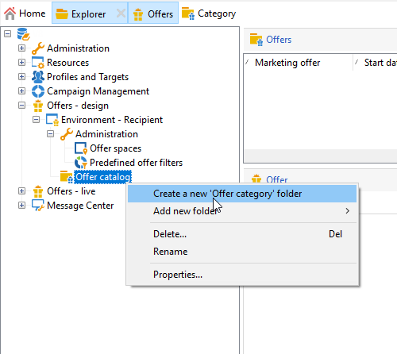

# 建立優惠方案目錄

作為 **服務經理**，您負責建立聘用目錄。

服務目錄與單個預先存在的環境相關聯。 此目錄中的優惠只能與在此環境中指定的空間關聯。

在建立聘用前，必須先指定 [環境](interaction-env.md) 它包含一組優惠的所有特徵（資格、目標約束、演示規則），按類別分類，以及其空格清單。

## 建立優惠類別{#creating-offer-categories}

服務分為類別/子類別。 類別在 **[!UICONTROL Design]** 並自動部署到 **[!UICONTROL Live]** 環境（即提供）。 的 **[!UICONTROL Design]** 環境包含預設類別以接收所有優惠。 可以建立子類別以將層次結構添加到目錄提供。

對於每個類別，您可以定義 **資格日期**&#x200B;在此期間，類別中包含的要約可以呈現給其目標。 您還可以調整類別的權重以排定優惠演示的優先順序。

要建立新類別，請執行以下步驟：

1. 瀏覽到 **[!UICONTROL Offer catalog]** 的子菜單。

   

1. 按一下右鍵並選擇 **[!UICONTROL Create a new "Offer category" folder]** 從下拉清單中。

   

1. 重新命名類別。 您以後可以使用 **[!UICONTROL General]** 頁籤。

   

   >[!NOTE]
   >
   >重複這些步驟以根據需要建立任意多個類別。

   此後，您可以根據需要：

   * 從 **[!UICONTROL Eligibility]** 頁籤。

      

   * **[!UICONTROL Edit query]** 將篩選器應用到提供目標。

   * 資格規則的回顧。要查看這些規則，請按一下 **[!UICONTROL Schedule and eligibility rules of the offer]** 的子菜單。

## 添加回退類別

為了確保所有接受者都收到一個建議，可以系統地在建議中添加一個或多個建議類別。

這些備用優惠必須具有低（但非空）重量，因此只有在沒有較高重量優惠符合條件時才考慮這些優惠。

此外，必須不對這些服務應用演示規則，以確保這些服務始終包含在建議中。 這意味著，在提議期間，如果沒有更高權重的報價，接收方將至少從此類別收到一份報價。

要在建議中包括回退類別，請執行以下步驟：

1. 瀏覽到您的優惠目錄。
1. 按一下 **[!UICONTROL Eligibility]** 的子菜單。 **[!UICONTROL Always include this category in the recommendations]** 的雙曲餘切值。
1. 按一下&#x200B;**[!UICONTROL Save]**。

   
