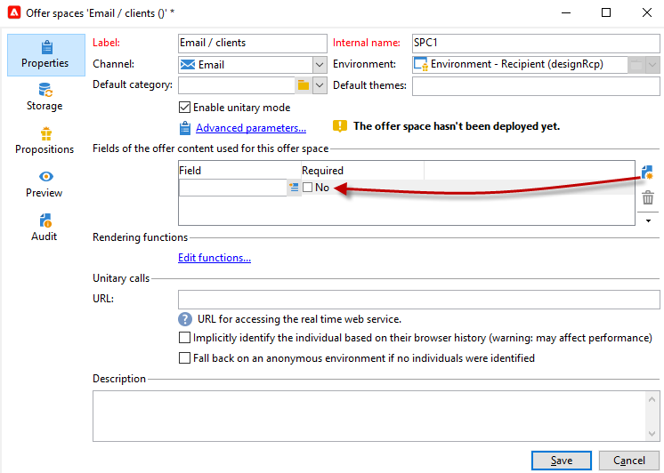

# 建立優惠方案空間{#creating-offer-spaces}

服務目錄的內容在服務空間中配置。 預設情況下，內容可以包括以下欄位： **[!UICONTROL Title]**。 **[!UICONTROL Destination URL]**。 **[!UICONTROL Image URL]**。 **[!UICONTROL HTML content]** 和 **[!UICONTROL Text content]**。 欄位序列在提供空間中配置。

作為 **技術管理員**，可在「設計」環境中建立提供空間。 您需要有權訪問聘用空間子資料夾。 一旦建立，這些服務空間將在服務審批期間自動複製到即時環境中。

HTML渲染通過渲染功能建立。 呈現函式中定義的欄位序列必須與內容中配置的序列相同。


要建立新的聘用空間，請執行以下步驟：

1. 在提供空間清單中，按一下 **[!UICONTROL New]**。

   

1. 選擇要使用的渠道並更改優惠空間的標籤。

   

1. 檢查 **[!UICONTROL Enable unitary mode]** 選項

1. 轉到 **[!UICONTROL Content field]** 的 **[!UICONTROL Add]**。

   

1. 轉到 **[!UICONTROL Content]** ，然後按以下順序選擇欄位： **[!UICONTROL Title]**，則 **[!UICONTROL Image URL]**，則 **[!UICONTROL HTML content]**，則 **[!UICONTROL Destination URL]**。

   

1. 檢查 **[!UICONTROL Required]** 的子菜單。

   >[!NOTE]
   >
   >此選項在預覽中使用，如果聘用中缺少一個強制欄位，則發佈時將聘用空間無效。 但是，如果某個報價已在某個報價空間上，則不會考慮這些標準。

   

1. 按一下 **[!UICONTROL Edit functions]** 的子菜單。

   這些函式用於在提供空間上生成提供表示。 有幾種可能的格式：HTML或文本。

   **注釋** - XML格式僅限於此版本產品中不可用的入站交互。 [了解更多](../start/v7-to-v8.md#gs-unavailable-features)

   _

1. 轉到 **[!UICONTROL HTML rendering]** 頁籤 **[!UICONTROL Overload the HTML rendering function]**。
1. 插入渲染函式。

   

## 提供命題狀態 {#offer-proposition-statuses}

根據與目標群體的互動情況，服務提議狀態會有所不同。 「活動交互」模組附帶了一組值，可在其整個生命週期內應用於產品建議。 您需要配置平台，以便在建立和接受服務建議時狀態發生變化。

>[!NOTE]
>
>狀態更新是 **非同步** 處理。 它由每小時觸發的跟蹤工作流執行。

### 聘用狀態清單 {#status-list}

可用的聘用狀態包括：

* **[!UICONTROL Accepted]**
* **[!UICONTROL Scheduled]**
* **[!UICONTROL Generated]**
* **[!UICONTROL Interested]**
* **[!UICONTROL Presented]**
* **[!UICONTROL Rejected]**

預設情況下不應用這些值：必須配置。

>[!NOTE]
>
>如果聘用連結到具有「已發送」狀態的交付，則聘用建議的狀態將自動更改為「已提交」。

### 建立提議時提供狀態 {#configuring-the-status-when-the-proposition-is-created}

當提議是 **建立**，其狀態將更新。

在 **[!UICONTROL Design]** 環境中，根據要在聘用報告中顯示的資訊，為每個聘用空間配置建立建議時要應用的狀態。

要執行此操作，請遵循下列步驟：

1. 轉到 **[!UICONTROL Storage]** 的子菜單。
1. 選擇建立命題時要應用的狀態。

   

### 接受提議時提供狀態 {#configuring-the-status-when-the-proposition-is-accepted}

一旦一個提議 **接受**，使用預設提供的值之一配置命題的新狀態。 當收件人按一下優惠中的連結時，將應用更新。

要執行此操作，請遵循下列步驟：

1. 轉到 **[!UICONTROL Storage]** 的子菜單。
1. 選擇在接受該提議時要應用於該建議的狀態。

   


**入站交互**

的 **[!UICONTROL Storage]** 頁籤，您可以定義狀態 **提議** 和 **接受** 僅提供建議。 對於入站交互，應直接在URL中指定聘用建議的狀態，以調用聘用引擎，而不是通過介面。 這樣，您就可以指定在其它情況下（例如，如果聘用建議被拒絕）應用的狀態。

```
<BASE_URL>?a=UpdateStatus&p=<PRIMARY_KEY_OF_THE_PROPOSITION>&st=<NEW_STATUS_OF_THE_PROPOSITION>&r=<REDIRECT_URL>
```

例如，提議（標識符） **40004**) **家庭保險** 顯示在 **尼奧班克** 站點包含以下URL:

```
<BASE_URL>?a=UpdateStatus&p=<40004>&st=<3>&r=<"http://www.neobank.com/insurance/subscribe.html">
```

只要訪問者按一下此服務，並因此按一下URL, **[!UICONTROL Accepted]** 狀態（值） **3**)，並將訪問者重定向到 **尼奧班克** 地點來簽保險合同。

>[!NOTE]
>
>如果要在url中指定其他狀態（例如，如果聘用建議被拒絕），請使用與所需狀態對應的值。 示例： **[!UICONTROL Rejected]** = &quot;5&quot;, **[!UICONTROL Presented]** =「1」等。
>
>可以在 **[!UICONTROL Offer propositions (nms)]** 資料架構。 如需詳細資訊，請參閱[此頁面](../dev/create-schema.md)。

**出站交互**

您可以自動應用 **[!UICONTROL Interested]** 當交貨包含連結時，提供建議的狀態。 只需添加 **_urlType=&quot;11&quot;** 連結的值：

```
<a _urlType="11" href="<DEST_URL>">Link inserted into the delivery</a>
```

## 按空間提供預覽 {#offer-preview-per-space}

在 **[!UICONTROL Preview]** 頁籤中，您可以通過選擇的方法查看收件人有資格的優惠。 在下面的示例中，收件人有資格通過郵件獲得三個優惠建議。


如果收件人不符合任何聘用條件，則預覽中會顯示此內容。


當上下文被限制到空間時，預覽可以忽略它們。 此時，交互模式已擴展為使用入站通道添加空間中引用的欄位。

  有關此內容的詳細資訊，請參閱中的此示例 [Campaign Classicv7文檔](https://experienceleague.adobe.com/docs/campaign-classic/using/managing-offers/advanced-parameters/extension-example.html){target=&quot;_blank&quot;}。