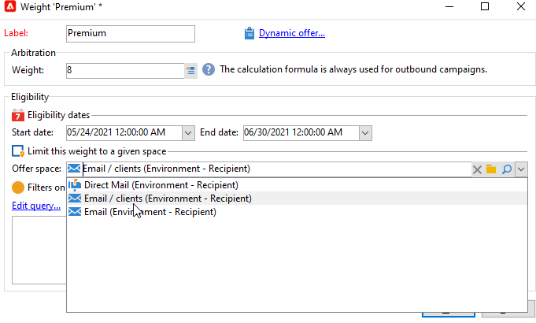

# 建立優惠優惠方案

若要建立選件，請遵循下列步驟：

1. 瀏覽至 **[!UICONTROL Campaigns]** 標籤並按一下 **[!UICONTROL Offers]** 連結。

1. 按一下 **[!UICONTROL Create]** 按鈕。

1. 變更標籤，並選取優惠應屬於的類別。

1. 按一下 **[!UICONTROL Save]** 以建立選件。

   此選件可在平台中使用，且可設定其內容。

## 資格設定

您現在可以使用 **[!UICONTROL Eligibility]** 標籤以定義：

* 優惠方案的資格期間。 [了解更多](#eligibility-period)
* 優惠目標母體上的篩選器。 [了解更多](#filters-on-the-target)
* 優惠方案權重。 [了解更多](#offer-weight)

### 優惠方案適用期間{#eligibility-period}

在 **[!UICONTROL Eligibility]** 索引標籤中，定義優惠方案的資格期間。 使用下拉式清單選取行事曆中的開始和結束日期。


在此期間之外，將不會選取選件。 如果您也設定了優惠方案類別的適用日期，則適用最嚴格的期間。

### 在目標上新增篩選器 {#filters-on-the-target}

在 **[!UICONTROL Eligibility]** 索引標籤中，將篩選器套用至優惠目標。

若要這麼做，請按一下 **[!UICONTROL Edit query]** 連結並選取您要套用的篩選器。


如果已經建立預先定義的篩選器，您可以從使用者篩選器清單中選取它們。 [了解更多](interaction-predefined-filters.md)


### 設定優惠方案權重 {#offer-weight}

若要讓引擎能夠決定目標符合資格的多個優惠方案，您必須為優惠方案指派一或多個權重。 如有需要，您也可以將篩選器套用至目標，或限制將套用權重的優惠方案空間。 較輕的優惠方案會偏好較重的優惠方案。

您可以為相同優惠方案設定多個權重，例如區分上個期間、特定目標或甚至優惠方案空間。

例如，選件對於18至25歲的聯絡人可具有A的權重，對於超過該範圍的聯絡人則可具有B的權重。 如果優惠方案在整個夏天都符合資格，則在7月也可以有A的權重，在8月也可以有B的權重。

>[!NOTE]
>
>指派的權重可以根據優惠方案所屬類別的引數暫時修改。 [了解更多](interaction-offer-catalog.md#creating-offer-categories)

若要在選件中建立權數，請套用下列步驟：

1. 在 **[!UICONTROL Eligibility]** 索引標籤中，按一下 **[!UICONTROL Add]**.

   

1. 變更標籤並指派權數。 預設值為 1。

   

   >[!CAUTION]
   >
   >如果未輸入權重(0)，則不會將目標視為符合優惠方案的資格。

1. 如果您想要將加權套用至指定期間，請定義適用日期。

   

1. 如有必要，請將權重限製為特定優惠方案空間。

   

1. 將篩選器套用至目標。

   

1. 按一下 **[!UICONTROL OK]** 以節省重量。

   

   >[!NOTE]
   >
   >如果目標符合所選優惠方案的多重權重，則引擎會保留最佳（最高）權重。 呼叫優惠方案引擎時，每個聯絡人最多會選取一次優惠方案。

### 優惠方案適用性規則的摘要 {#a-summary-of-offer-eligibility-rules}

完成設定後，優惠方案控制面板上將提供適用性規則的摘要。

若要檢視，請按一下 **[!UICONTROL Schedule and eligibility rules]** 連結。


## 建立選件內容 {#creating-the-offer-content}

使用 **[!UICONTROL Content]** 索引標籤以定義選件內容。


1. 定義選件內容的各種引數。

   * **[!UICONTROL Title]** ：指定您要在選件中顯示的標題。 警告：這並非指優惠方案的標籤，其定義位於 **[!UICONTROL General]** 標籤。
   * **[!UICONTROL Destination URL]** ：指定您選件的URL。 開頭必須是&quot;http://&quot;或&quot;https://&quot;。
   * **[!UICONTROL Image URL]** ：指定選件影像的URL或存取路徑。
   * **[!UICONTROL HTML content]** / **[!UICONTROL Text content]** ：在想要的索引標籤中輸入優惠方案內文。 若要產生追蹤，請 **[!UICONTROL HTML content]** 必須由HTML元素組成，這些元素可包含在 `<div>` 輸入元素。 例如，的結果 `<table>` HTML頁面中的元素如下：

   ```
      <div> 
       <table>
        <tr>
         <th>Month</th>
         <th>Savings</th>   
        </tr>   
        <tr>    
         <td>January</td>
         <td>$100</td>   
        </tr> 
       </table> 
      </div>
   ```

   瞭解如何在中定義接受URL [本節](interaction-offer-spaces.md#configuring-the-status-when-the-proposition-is-accepted).

   

   若要尋找在優惠方案空間設定期間定義的必填欄位，請按一下 **[!UICONTROL Content definitions]** 顯示清單的連結。 [了解更多](interaction-offer-spaces.md)

   

   在此範例中，選件必須包含標題、影像、HTML內容和目的地URL。

## 預覽優惠方案 {#previewing-the-offer}

設定優惠方案內容後，您可以預覽其對收件者顯示的優惠方案。

操作步驟：

1. 按一下 **[!UICONTROL Preview]** 標籤。

   

1. 選取您要檢視之優惠方案的呈現方式。

   

1. 如果您已個人化優惠內容，請選取優惠目標以檢視個人化。

<!--

## Create a hypothesis on an offer {#creating-a-hypothesis-on-an-offer}

You can create hypotheses on your offer propositions. This lets you determine the impact of your offers on purchases carried out for the product concerned.

>[!NOTE]
>
>These hypotheses are carried out via Response Manager. Please check your license agreement.

Hypotheses carried out on an offer proposition are referenced in their **[!UICONTROL Measure]** tab.

Creating hypotheses is detailed in [this page](../../campaign/using/about-response-manager.md).

-->

## 核准並啟用優惠方案{#approve-offers}

您現在可以核准並啟用優惠方案，以便在以下位置提供： **即時** 環境。

有關詳細資訊，請參閱 [Campaign Classic v7檔案](https://experienceleague.adobe.com/docs/campaign-classic/using/managing-offers/managing-an-offer-catalog/approving-and-activating-an-offer.html#approving-offer-content){target="_blank"}.

## 管理優惠方案簡報{#offer-presentation}

Campaign可讓您使用簡報規則控制優惠方案主張的流程。 這些專屬於Campaign互動的規則包括 **型別規則**. 它們可讓您根據已傳送給收件者的建議歷史記錄排除優惠。 環境會參照這些引數。

有關詳細資訊，請參閱 [Campaign Classic v7檔案](https://experienceleague.adobe.com/docs/campaign-classic/using/managing-offers/managing-an-offer-catalog/managing-offer-presentation.html#managing-offers){target="_blank"}.

## 優惠方案模擬

此 **模擬** 模組可讓您在將您的主張傳送給收件者之前，測試屬於類別或環境的優惠方案分佈。

模擬會考量先前套用至優惠及其簡報規則的前後關聯和適用性規則。 這可讓您測試和調整優惠方案主張的各種版本，而無須實際使用優惠方案，或過度/過少向目標行銷，因為模擬不會對目標收件者造成影響。

如需優惠方案模擬的詳細資訊，請參閱 [Campaign Classic v7檔案](https://experienceleague.adobe.com/docs/campaign-classic/using/managing-offers/simulating-offers/about-offers-simulation.html){target="_blank"}.
