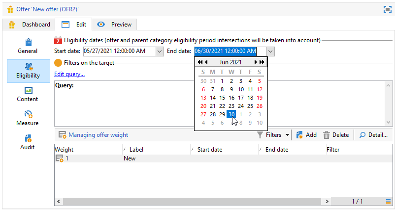
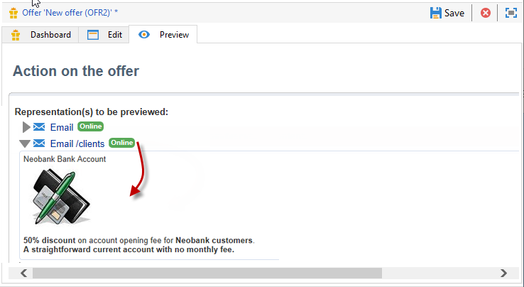

# 建立優惠優惠方案

若要建立選件，請遵循下列步驟：

1. 瀏覽至 **[!UICONTROL Campaigns]** 標籤並按一下 **[!UICONTROL Offers]** 連結。

1. 按一下 **[!UICONTROL Create]** 按鈕。

1. 變更標籤，並選取優惠方案應所屬的類別。

1. 按一下 **[!UICONTROL Save]** 以建立優惠方案。

   此選件可在平台中使用，且可設定其內容。

## 資格設定

您現在可以使用 **[!UICONTROL Eligibility]** 定位字元以定義：

* 優惠方案的適用期間。 [了解更多](#eligibility-period)
* 優惠目標母體上的篩選器。 [了解更多](#filters-on-the-target)
* 優惠方案權重。 [了解更多](#offer-weight)

### 優惠方案適用期間{#eligibility-period}

在 **[!UICONTROL Eligibility]** 索引標籤中，定義優惠方案的資格期間。 使用下拉式清單選取行事曆中的開始和結束日期。



在此期間以外，將不會選取選件。 如果您也設定了優惠方案類別的適用日期，則會套用最嚴格的期間。

### 在目標上新增篩選器 {#filters-on-the-target}

在 **[!UICONTROL Eligibility]** 索引標籤中，將篩選器套用至優惠方案目標。

若要這麼做，請按一下 **[!UICONTROL Edit query]** 連結並選取您要套用的篩選器。


如果已經建立預先定義的篩選器，您可以從使用者篩選器清單中選取它們。 [了解更多](interaction-predefined-filters.md)


### 設定優惠方案權重 {#offer-weight}

若要讓引擎在目標符合資格的多個優惠方案之間做出決定，您必須為優惠方案指派一或多個權重。 如有必要，您也可以將篩選器套用至目標，或限制權重將套用至的優惠方案空間。 權重較高的優惠方案會比權重較低的優惠方案更受青睞。

您可以為相同優惠方案設定多個權重，例如區分支援週期、特定目標或甚至優惠方案空間。

例如，選件對於18至25歲的連絡人，其權重可以是A，對於超過該範圍的連絡人，其權重可以是B。 如果優惠方案在整個夏天都符合資格，它在7月也可以有A的權重，在8月可以有B的權重。

>[!NOTE]
>
>指派的權重可以根據優惠方案所屬類別的引數暫時修改。 [了解更多](interaction-offer-catalog.md#creating-offer-categories)

若要在選件中建立權重，請套用下列步驟：

1. 在 **[!UICONTROL Eligibility]** 索引標籤中，按一下 **[!UICONTROL Add]**.

   

1. 變更標籤並指派權數。 預設值為 1。

   

   >[!CAUTION]
   >
   >如果未輸入權重(0)，則不會將目標視為符合優惠方案資格。

1. 如果您想要將加權套用至指定期間，請定義適用日期。

   

1. 如有必要，請將權重限制在特定優惠方案空間。

   

1. 將篩選器套用至目標。

   

1. 按一下 **[!UICONTROL OK]** 以節省重量。

   

   >[!NOTE]
   >
   >如果目標符合所選優惠方案的多個權重，則引擎會保留最佳（最高）權重。 呼叫優惠方案引擎時，每個連絡人最多會選取一次優惠方案。

### 優惠方案適用性規則的摘要 {#a-summary-of-offer-eligibility-rules}

完成設定後，優惠儀表板就會顯示適用性規則的摘要。

若要檢視，請按一下 **[!UICONTROL Schedule and eligibility rules]** 連結。


## 建立選件內容 {#creating-the-offer-content}

使用 **[!UICONTROL Content]** 索引標籤以定義選件內容。


1. 定義優惠方案內容的各種引數。

   * **[!UICONTROL Title]** ：指定您想要顯示在選件中的標題。 警告：這並非指優惠方案的標籤，其定義位於 **[!UICONTROL General]** 標籤。
   * **[!UICONTROL Destination URL]** ：指定您選件的URL。 開頭必須是&quot;http://&quot;或&quot;https://&quot;。
   * **[!UICONTROL Image URL]** ：指定選件影像的URL或存取路徑。
   * **[!UICONTROL HTML content]** / **[!UICONTROL Text content]** ：在想要的索引標籤中輸入優惠方案內文。 若要產生追蹤，請 **[!UICONTROL HTML content]** 必須由可以括在中的HTML元素組成 `<div>` 輸入元素。 例如，的結果 `<table>` HTML頁面中的元素如下所示：

   ```
      <div> 
       <table>
        <tr>
         <th>Month</th>
         <th>Savings</th>   
        </tr>   
        <tr>    
         <td>January</td>
         <td>$100</td>   
        </tr> 
       </table> 
      </div>
   ```

   瞭解如何在中定義接受URL [本節](interaction-offer-spaces.md#configuring-the-status-when-the-proposition-is-accepted).

   

   若要尋找優惠方案空間設定期間定義的必填欄位，請按一下 **[!UICONTROL Content definitions]** 顯示清單的連結。 [了解更多](interaction-offer-spaces.md)

   

   在此範例中，選件必須包含標題、影像、HTML內容和目的地URL。

## 預覽優惠方案 {#previewing-the-offer}

設定優惠方案內容後，您可以預覽其對收件者顯示的優惠方案。

操作步驟：

1. 按一下 **[!UICONTROL Preview]** 標籤。

   

1. 選取您要檢視之優惠方案的代表方式。

   

1. 如果您已將優惠方案內容個人化，請選取優惠方案目標以檢視個人化。

<!--

## Create a hypothesis on an offer {#creating-a-hypothesis-on-an-offer}

You can create hypotheses on your offer propositions. This lets you determine the impact of your offers on purchases carried out for the product concerned.

>[!NOTE]
>
>These hypotheses are carried out via Response Manager. Please check your license agreement.

Hypotheses carried out on an offer proposition are referenced in their **[!UICONTROL Measure]** tab.

Creating hypotheses is detailed in [this page](../../campaign/using/about-response-manager.md).

-->

## 核准並啟用優惠方案{#approve-offers}

您現在可以核准並啟動優惠方案，以便在以下位置提供： **即時** 環境。

 如需詳細資訊，請參閱 [Campaign Classic v7 文件](https://experienceleague.adobe.com/docs/campaign-classic/using/managing-offers/managing-an-offer-catalog/approving-and-activating-an-offer.html#approving-offer-content)

## 管理優惠方案簡報{#offer-presentation}

Campaign可讓您使用簡報規則控制優惠方案主張的流程。 這些專屬於Campaign互動的規則包括 **型別規則**. 它們可讓您根據已傳送給收件者的建議歷史記錄排除優惠方案。 環境會參照這些量度。

 如需詳細資訊，請參閱 [Campaign Classic v7 文件](https://experienceleague.adobe.com/docs/campaign-classic/using/managing-offers/managing-an-offer-catalog/managing-offer-presentation.html#managing-offers)

## 優惠方案模擬

此 **模擬** 模組可讓您在將您的主張傳送給收件者之前，測試屬於類別或環境的選件分佈。

模擬會考量先前套用至優惠方案及其呈現規則的前後關聯和適用性規則。 這可讓您測試和調整各種版本的優惠方案主張，而不需實際使用優惠方案或過度/過低請求目標，因為模擬對目標收件者沒有影響。

 如需優惠方案模擬的詳細資訊，請參閱 [Campaign Classic v7檔案](https://experienceleague.adobe.com/docs/campaign-classic/using/managing-offers/simulating-offers/about-offers-simulation.html)
