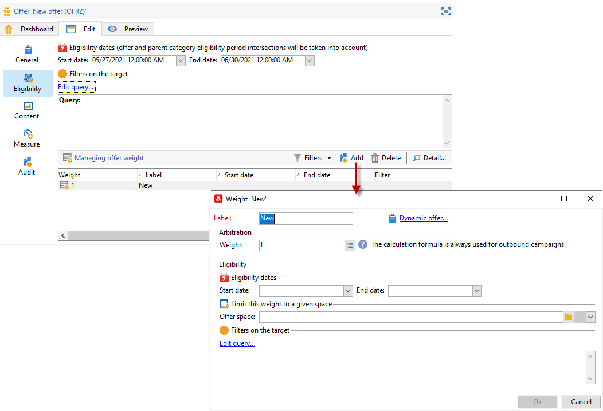
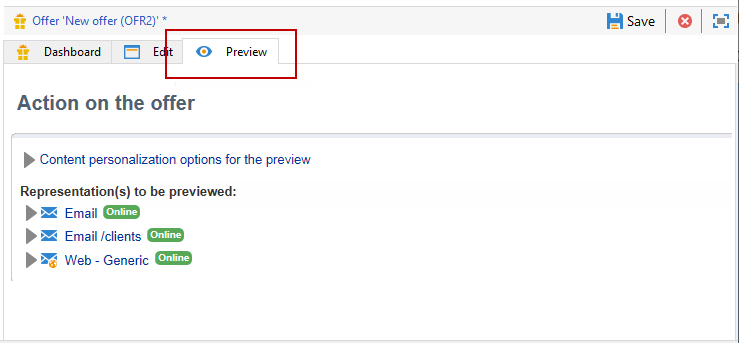

# 建立優惠優惠方案

要建立優惠，請執行以下步驟：

1. 瀏覽到 **[!UICONTROL Campaigns]** ，然後按一下 **[!UICONTROL Offers]** 的子菜單。

1. 按一下 **[!UICONTROL Create]** 按鈕。

1. 更改標籤並選擇優惠應屬於的類別。

1. 按一下 **[!UICONTROL Save]** 建立報價。

   該服務在平台中提供，其內容可以配置。

## 資格設定

您現在可以使用 **[!UICONTROL Eligibility]** 頁籤：

* 聘用的資格期。 [了解更多](#eligibility-period)
* 提供目標群的篩選器。 [了解更多](#filters-on-the-target)
* 報價的權重。 [了解更多](#offer-weight)

### 提供資格期{#eligibility-period}

在 **[!UICONTROL Eligibility]** 的子菜單。 使用下拉清單在日曆中選擇起始日期和終止日期。


在此期間之外，將不選擇要約。 如果您還配置了優惠類別的資格日期，則將應用限制最嚴格的期間。

### 在目標上添加篩選器 {#filters-on-the-target}

在 **[!UICONTROL Eligibility]** 頁籤。

要執行此操作，請按一下 **[!UICONTROL Edit query]** 連結，然後選擇要應用的篩選器。


如果已建立預定義的篩選器，則可以從用戶篩選器清單中選擇它們。 [了解更多](interaction-predefined-filters.md)


### 設定優惠權重 {#offer-weight}

要使引擎能夠在目標符合條件的多個優惠之間做出決定，您需要為優惠分配一個或多個權重。 如有必要，您還可以將篩選器應用於目標，或限制權重將應用於的聘用空間。 比較輕重的優先選擇權重較大的優惠。

您可以為同一優惠配置多個權重，例如，以區分優惠期、特定目標甚至優惠空間。

例如，對於年齡在18到25歲之間的接觸，提供可以具有A的重量，對於超過該範圍的接觸，可以具有B的重量。 如果整個夏天都符合條件，7月份也可以有A,8月份可以有B。

>[!NOTE]
>
>可根據要約所屬類別的參數臨時修改指定權重。 [了解更多](interaction-offer-catalog.md#creating-offer-categories)

要在優惠中建立重量，請應用以下步驟：

1. 在 **[!UICONTROL Eligibility]** 的子菜單。 **[!UICONTROL Add]**。

   

1. 更改標籤並分配權重。 預設值為 1。

   

   >[!CAUTION]
   >
   >如果未輸入重量(0)，則目標將不被視為有資格獲得要約。

1. 如果要將權重應用於指定期間，請定義資格日期。

   

1. 如有必要，將重量限制為特定的優惠空間。

   

1. 將篩選器應用於目標。

   

1. 按一下 **[!UICONTROL OK]** 來減輕體重。

   

   >[!NOTE]
   >
   >如果目標符合選定優惠的多個權重，引擎將保持最佳（最高）權重。 在調用聘用引擎時，每個聯繫人最多選擇一次聘用。

### 優惠資格規則摘要 {#a-summary-of-offer-eligibility-rules}

配置完成後，優惠控制面板上將提供資格規則的摘要。

要查看它，請按一下 **[!UICONTROL Schedule and eligibility rules]** 的子菜單。


## 建立優惠內容 {#creating-the-offer-content}

使用 **[!UICONTROL Content]** 頁籤


1. 定義服務內容的各種參數。

   * **[!UICONTROL Title]** :指定要在優惠中顯示的標題。 警告：這不是指在 **[!UICONTROL General]** 頁籤。
   * **[!UICONTROL Destination URL]** :指定您的聘用的URL。 它必須以&quot;http://&quot;或&quot;https://&quot;開頭。
   * **[!UICONTROL Image URL]** :指定URL或訪問服務映像的路徑。
   * **[!UICONTROL HTML content]** / **[!UICONTROL Text content]** :在您想要的頁籤中輸入您的報價正文。 要生成跟蹤， **[!UICONTROL HTML content]** 必須由HTML元素組成，這些元素可以包含在 `<div>` 類型元素。 例如， `<table>` 「HTML」頁中的元素如下所示：

   ```
      <div> 
       <table>
        <tr>
         <th>Month</th>
         <th>Savings</th>   
        </tr>   
        <tr>    
         <td>January</td>
         <td>$100</td>   
        </tr> 
       </table> 
      </div>
   ```

   瞭解如何在中定義接受URL [此部分](interaction-offer-spaces.md#configuring-the-status-when-the-proposition-is-accepted)。

   

   要查找在服務空間配置期間定義的必填欄位，請按一下 **[!UICONTROL Content definitions]** 連結以顯示清單。 [了解更多](interaction-offer-spaces.md)

   

   在此示例中，聘用必須包括標題、影像、HTML內容和目標URL。

## 預覽優惠 {#previewing-the-offer}

一旦配置了優惠內容，您就可以按接收方的顯示方式預覽優惠。

操作步驟：

1. 按一下 **[!UICONTROL Preview]** 頁籤。

   

1. 選擇要查看的優惠的表示形式。

   

1. 如果您已個性化了聘用內容，請選擇聘用目標以查看個性化。

<!--

## Create a hypothesis on an offer {#creating-a-hypothesis-on-an-offer}

You can create hypotheses on your offer propositions. This lets you determine the impact of your offers on purchases carried out for the product concerned.

>[!NOTE]
>
>These hypotheses are carried out via Response Manager. Please check your license agreement.

Hypotheses carried out on an offer proposition are referenced in their **[!UICONTROL Measure]** tab.

Creating hypotheses is detailed in [this page](../../campaign/using/about-response-manager.md).

-->

## 核准並啟用優惠方案{#approve-offers}

現在，您可以批准並激活聘用，以便在 **實況** 環境。

 如需詳細資訊，請參閱 [Campaign Classic v7 文件](https://experienceleague.adobe.com/docs/campaign-classic/using/managing-offers/managing-an-offer-catalog/approving-and-activating-an-offer.html#approving-offer-content)

## 管理優惠方案簡報{#offer-presentation}

市場活動允許您使用演示規則控制提供建議的流。 這些特定於市場活動交互的規則是 **類型規則**。 它們允許您根據已向收件人提出的建議的歷史來排除優惠。 在環境中引用它們。

 如需詳細資訊，請參閱 [Campaign Classic v7 文件](https://experienceleague.adobe.com/docs/campaign-classic/using/managing-offers/managing-an-offer-catalog/managing-offer-presentation.html#managing-offers)

## 提供模擬

的 **模擬** 模組允許您test屬於某個類別或環境的服務的分發，然後才將您的建議發送給收件人。

模擬將先前應用於優惠的上下文和資格規則及其演示規則考慮在內。 這樣，您就可以test和改進您的服務建議的各種版本，而無需實際使用服務或在徵集目標時過多或過少，因為模擬對目標收件人沒有影響。

 有關「Offer（提供）」模擬的詳細資訊，請參閱 [Campaign Classicv7文檔](https://experienceleague.adobe.com/docs/campaign-classic/using/managing-offers/simulating-offers/about-offers-simulation.html)
