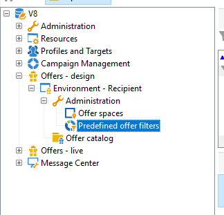
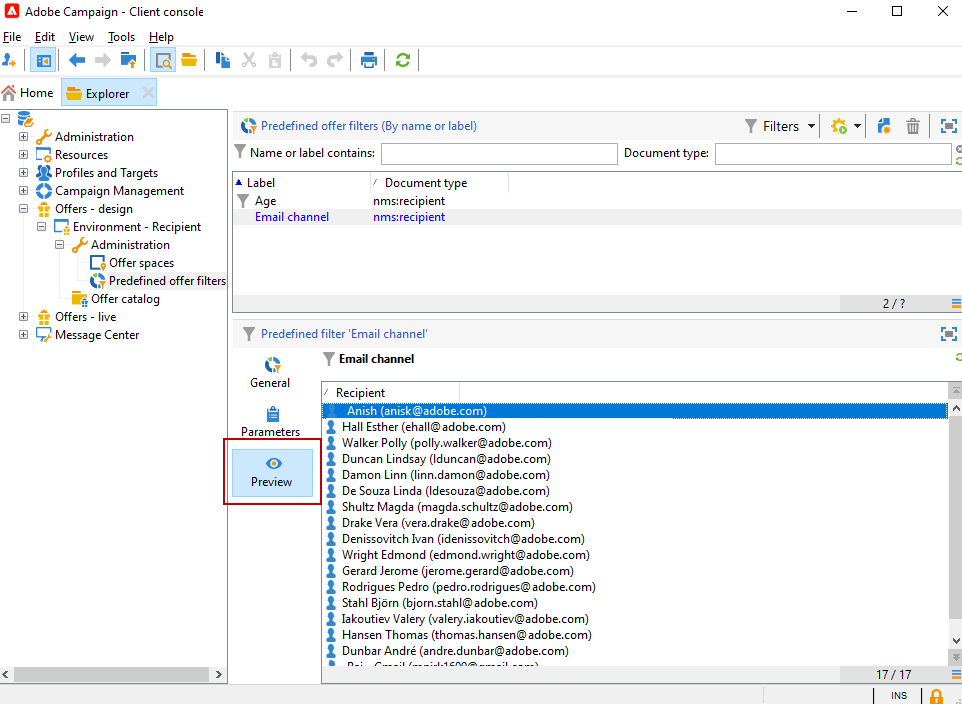

# 建立預先定義的篩選器{#creating-pre-defined-filters}

建立預先定義的篩選器，以定義目標群體的適用性規則，以便在建立優惠方案期間輕鬆重複使用。 它們是每個環境專屬的行為，並將優惠方案引數列入考量。

>[!NOTE]
>
>Adobe Campaign Web UI提供使用者易用的介面，讓您輕鬆管理和自訂預先定義的篩選器，以符合特定需求。 建立一次並儲存，即可供未來使用。 若要深入瞭解預先定義的Web UI篩選器，請參閱[Adobe Campaign Web UI檔案](https://experienceleague.adobe.com/zh-hant/docs/campaign-web/v8/start/predefined-filters){target=_blank}。

若要建立預先定義的篩選，請套用下列程式：

1. 瀏覽至&#x200B;**[!UICONTROL Administration]**&#x200B;資料夾並選取&#x200B;**[!UICONTROL Pre-defined offer filters]**。

   

1. 按一下 **[!UICONTROL New]**。

   

1. 變更標籤，以便稍後識別篩選器。

   

1. 選取篩選條件將關注的欄位。

   

1. 視需要選取運運算元和值，然後儲存查詢。

   

1. 按一下&#x200B;**[!UICONTROL Preview]**&#x200B;以檢視篩選結果。

   
