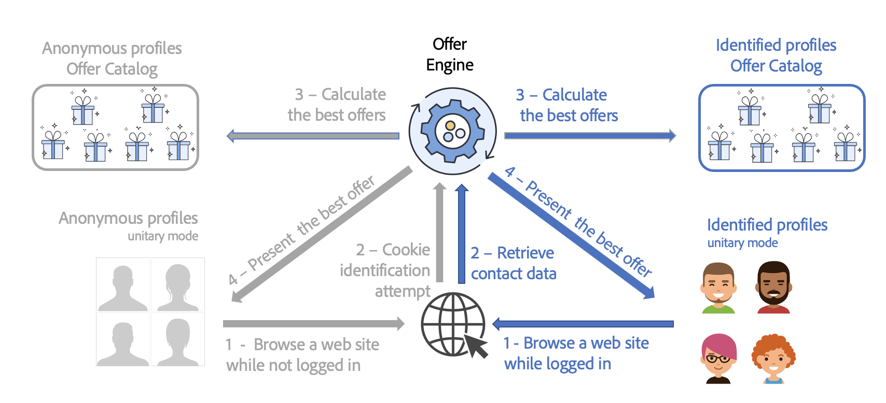

# 呈現最佳優惠方案{#interaction-present-offers}

可使用[傳入或傳出頻道](interaction-architecture.md#interaction-types)，將優惠方案顯示在各種優惠方案空間中。 本章詳細說明傳入頻道的一些特定功能。

為了讓優惠方案引擎選取優惠方案，優惠方案必須獲得核准並可在即時環境中使用。

如需詳細資訊，請參閱[Campaign Classicv7檔案](https://experienceleague.adobe.com/docs/campaign-classic/using/managing-offers/managing-an-offer-catalog/approving-and-activating-an-offer.html#approving-offer-content){target="_blank"}。

在連絡人的傳入連絡人內容中，瀏覽頁面的使用者是否可由網站識別。 優惠方案引擎為已識別的設定檔和匿名設定檔提供不同的優惠方案。

在傳入頻道上顯示優惠方案之前，您必須先設定優惠方案引擎呼叫，以便顯示優惠方案。 在大多數傳入互動中，這是網頁。

>[!NOTE]
>
>針對傳入互動，您必須特別設定優惠方案引擎以顯示和更新一或多個優惠方案。
>
>您也必須在優惠方案空間上啟用單一模式。 如需詳細資訊，請參閱[此頁面](interaction-offer-spaces.md)。
