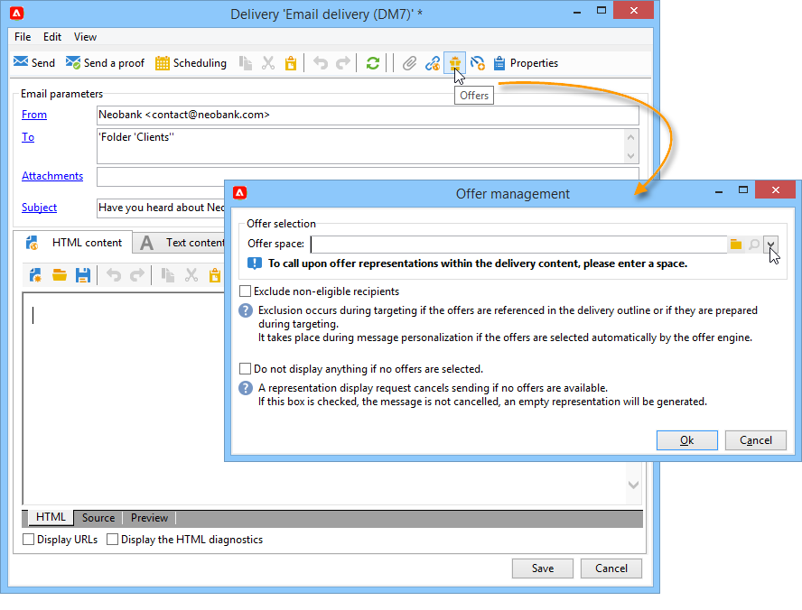
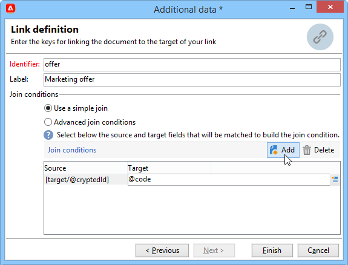
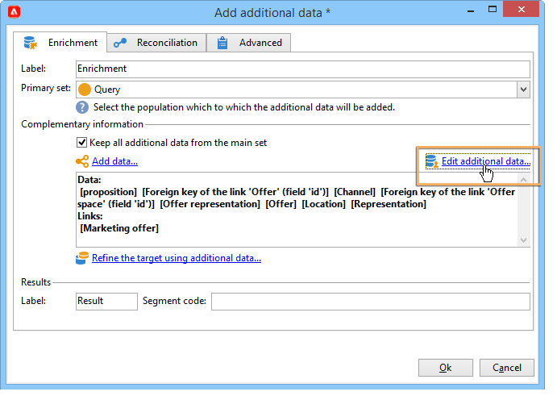

# 傳送優惠方案{#send}

為了讓優惠引擎選擇優惠，它已在 **實況** 環境。 [了解更多](interaction-offer.md#approve-offers)

通過出站通信通道提供演示通過直接郵件、電子郵件或移動遞送進行。 還可以將統一模式與事務性消息傳遞（消息中心）一起使用。

## 在交貨中插入報價 {#offer-into-a-delivery}

要在交付中插入提議，請執行以下步驟：

1. 在交貨窗口中，按一下 **優惠** 表徵圖

   

1. 選擇與您的服務環境匹配的空間。

   

1. 要優化引擎的優惠選擇，請選擇要提供的優惠是其中一部分的類別，或選擇一個/幾個主題。 我們建議一次只使用其中一個欄位，以避免超載限制。

   

   

1. 指定要插入到傳遞正文中的優惠數量。

   

1. 選擇 **[!UICONTROL Exclude non-eligible recipients]** 頁籤 [了解更多](#parameters-for-calling-offer-engine)

   

1. 如果需要，選擇 **[!UICONTROL Do not display anything if no offers are selected]** 的雙曲餘切值。 [了解更多](#parameters-for-calling-offer-engine)

   

1. 使用合併欄位將屬性插入傳遞內容。 可用的建議數取決於引擎調用的配置方式，其順序取決於優惠的優先順序。

   

1. 完成內容、test併發送您的交付。

   

### 提供引擎的參數 {#parameters-for-calling-offer-engine}

* **[!UICONTROL Space]** :激活聘用引擎時必須選擇的聘用環境的空間。
* **[!UICONTROL Category]** :對優惠排序的特定資料夾。 如果未指定任何類別，則除非選擇了主題，否則「優惠」引擎將考慮環境中包含的所有優惠。
* **[!UICONTROL Themes]** :鍵字在類別的上游定義。 這些選項用作篩選器，允許您通過在一組類別中選擇這些選項來細化要呈現的優惠數量。
* **[!UICONTROL Number of propositions]** :引擎返回的可插入到交貨主體中的報價數。 如果未將它們插入消息中，則仍將生成報價，但未顯示。
* **[!UICONTROL Exclude non-eligible recipients]** :此選項允許您激活或取消激活沒有足夠合格優惠的收件人的排除。 合格命題的數量可能低於請求的命題數量。 如果選中此框，則沒有足夠建議的收件人將從遞送中排除。 如果未選擇此選項，則不會排除這些收件人，但他們將沒有請求的建議數。
* **[!UICONTROL Do not display anything if no offer is selected]** :此選項允許您選擇在其中一個命題不存在時如何處理消息。 選中此框後，將不顯示缺少命題的表示，並且此命題的消息中不會顯示任何內容。 如果未選中該框，則在發送期間將取消消息本身，收件人將不再接收任何消息。

## 在工作流中發送優惠{#offer-via-wf}

通過幾個工作流活動，您可以定義提供服務的方式：

* 擴充
* 優惠引擎
* 依儲存格列出的優惠

### 擴充 {#enrichment}

的 **濃縮** 「活動」(Activity)，您可以為遞送收件人添加優惠或指向優惠的連結。

 有關濃縮活動的詳細資訊，請參閱 [Campaign Classicv7文檔](https://experienceleague.adobe.com/docs/campaign-classic/using/automating-with-workflows/targeting-activities/enrichment.html)

例如，您可以在傳遞之前為收件人查詢豐富資料。

指定提供建議有兩種方法。

* 指定聘用或聘用引擎調用。
* 引用與優惠的連結。

#### 指定聘用或對聘用引擎的呼叫 {#specifying-an-offer-or-a-call-to-the-offer-engine}

配置後 **查詢** 活動：

1. 添加並開啟 **濃縮** 的子菜單。
1. 在 **[!UICONTROL Enrichment]** 索引標籤中，選取 **[!UICONTROL Add data]**。
1. 選擇 **[!UICONTROL An offer proposition]** 中。

   

1. 為要添加的命題指定標識符和標籤。
1. 指定聘用選擇。 這有兩種可能的選擇：

   * **[!UICONTROL Search for the best offer in a category]** :選中此選項並指定聘用引擎呼叫參數（聘用空間、類別或主題、聯繫日期、要保留的聘用數）。 引擎將根據這些參數自動計算要添加的報價。 我們建議完成 **[!UICONTROL Category]** 或 **[!UICONTROL Theme]** 欄位，而不是同時執行。

      

   * **[!UICONTROL A pre-defined offer]** :選中此選項並指定聘用空間、特定聘用和聯繫日期，以直接配置您要添加的聘用，而無需調用聘用引擎。

      

1. 然後配置與所選渠道對應的傳遞活動。 [了解更多](#offer-into-a-delivery)

   >[!NOTE]
   >
   >用於預覽的建議數取決於在濃縮活動中執行的配置，而不是直接在遞送中執行的任何可能的配置。

#### 參考與優惠的連結 {#referencing-a-link-to-an-offer}

您還可以引用一個連結，指向 **濃縮** 的子菜單。

要執行此操作，請遵循下列步驟：

1. 選擇 **[!UICONTROL Add data]** 的 **[!UICONTROL Enrichment]** 頁籤。
1. 在選擇要添加的資料類型的窗口中，選擇 **[!UICONTROL A link]**。
1. 選擇要建立的連結類型及其目標。 在這種情況下，目標是提供方案。

   

1. 指定富集活動（此處為收件人表）中入站表資料與聘用表之間的聯接。 例如，您可以將聘用代碼連結到收件人。

   

1. 然後配置與所選渠道對應的傳遞活動。 [了解更多](#offer-into-a-delivery)

   >[!NOTE]
   >
   >可用於預覽的建議數取決於交付中執行的配置。

#### 商店服務排名和權重 {#storing-offer-rankings-and-weights}

預設情況下，當 **濃縮** 活動用於提供報價，其排名和權重不儲存在命題表中。

>[!NOTE]
>
>的 **[!UICONTROL Offer engine]** 預設情況下，活動會儲存此資訊。

但是，您可以按如下方式儲存此資訊：

1. 在查詢後和交貨活動前進行的富集活動中建立對供應引擎的調用。 [了解更多](#specifying-an-offer-or-a-call-to-the-offer-engine)
1. 在活動的主窗口中，選擇 **[!UICONTROL Edit additional data...]**。

   

1. 添加 **[!UICONTROL @rank]** 列 **[!UICONTROL @weight]** 來買份。

   

1. 確認添加並保存工作流。

遞送自動儲存優惠的等級和權重。 此資訊在交貨的 **[!UICONTROL Offers]** 頁籤。

### 優惠引擎 {#offer-engine}

的 **[!UICONTROL Offer engine]** 活動還允許您在交貨前指定對供應引擎的呼叫。

 有關 **提供引擎** 活動，請參閱 [Campaign Classicv7文檔](https://experienceleague.adobe.com/docs/campaign-classic/using/automating-with-workflows/targeting-activities/offer-engine.html)

本活動與 **濃縮** 通過在交貨前使用引擎計算的優惠來豐富入站人口資料，進行引擎呼叫的活動。

配置後 **查詢** 活動：

1. 添加並開啟 **[!UICONTROL Offer engine]** 的子菜單。
1. 填寫各個可用欄位，以指定對「提供」引擎參數（提供空間、類別或主題、聯繫日期、要保留的優惠數量）的呼叫。 引擎將根據這些參數自動計算要添加的報價。

   >[!CAUTION]
   >
   >如果您使用此活動，則只儲存交付中使用的優惠建議。

   

1. 然後配置與所選渠道對應的傳遞活動。 [了解更多](#inserting-an-offer-proposition-into-a-delivery)

### 依儲存格列出的優惠 {#offers-by-cell}

的 **[!UICONTROL Offers by cell]** 活動允許您將入站總量（例如從查詢）分配到多個段，並指定要為這些段中的每個段提供的優惠。

 有關 **按手機提供** 活動，請參閱 [Campaign Classicv7文檔](https://experienceleague.adobe.com/docs/campaign-classic/using/automating-with-workflows/targeting-activities/offers-by-cell.html)

要執行此操作，請使用以下過程：

1. 添加 **[!UICONTROL Offers by cell]** 在指定目標人口後開啟該活動。
1. 在 **[!UICONTROL General]** 頁籤，選擇要在其上顯示聘用的聘用空間。
1. 在 **[!UICONTROL Cells]** 頁籤，使用 **[!UICONTROL Add]** 按鈕：

   * 使用可用過濾和限制規則指定子集填充。
   * 然後選擇要向子集顯示的優惠。 可用的優惠是那些符合在上一步選擇的優惠環境中的優惠。

      

1. 然後配置與所選渠道對應的傳遞活動。

<!--

## Delivering with delivery outlines {#delivering-with-delivery-outlines}

You can also present offers in a delivery using delivery outlines.

For more information on delivery outlines, refer to the Campaign - MRM guide.

1. Create a new campaign or access an existing campaign.
1. Access the delivery outlines via the campaign's **[!UICONTROL Edit]** > **[!UICONTROL Documents]** tab.
1. Add an outline then insert as many offers as you like into it by right-clicking on the outline and selecting **[!UICONTROL New]** > **[!UICONTROL Offer]**, then save the campaign.

1. Create a delivery whose delivery outlines you have access to (for example, a direct mail delivery).
1. When editing the delivery, click **[!UICONTROL Select a delivery outline]**.

   >[!NOTE]
   >
   >Depending on the type of delivery, this option can be found in the **[!UICONTROL Properties]** > **[!UICONTROL Advanced]** menu (for email deliveries for example).

1. Using the **[!UICONTROL Offers]** button, you can then configure the offer space as well as the number of offers to present in the delivery.

1. Add the propositions into the delivery body using the personalization fields (for more on this, refer to the [Inserting an offer proposition into a delivery](#inserting-an-offer-proposition-into-a-delivery) section), or in the case of a direct mail delivery, by editing the extraction file format.

   Propositions will be selected from the offers referenced in the delivery outline.

   >[!NOTE]
   >
   >Information regarding the offer rankings and weights is only saved in the proposition table if the offers are generated directly in the delivery.
-->
