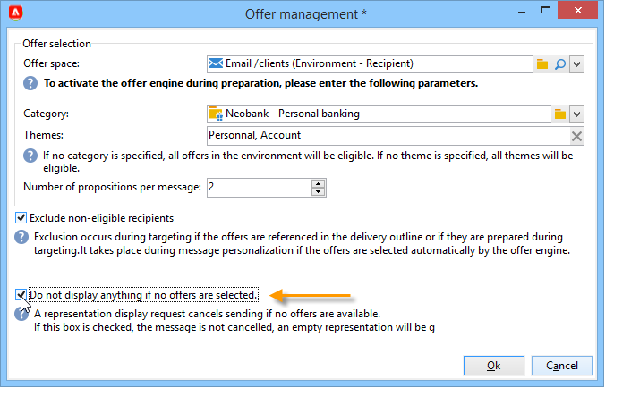

# 傳送優惠方案{#send}

為了讓優惠方案引擎選取優惠方案，此優惠方案已在 **即時** 環境。 [了解更多](interaction-offer.md#approve-offers)

透過傳出通訊頻道的優惠方案簡報，會透過直接郵件、電子郵件或行動傳送來執行。 您也可以對異動訊息（訊息中心）使用單一模式。

## 在傳遞中插入優惠方案 {#offer-into-a-delivery}

若要將優惠方案主張插入傳遞中，請遵循下列步驟：

1. 在傳送視窗中，按一下 **選件** 圖示。

   

1. 選取符合優惠方案環境的空間。

   

1. 若要調整引擎對優惠方案的選擇，請選取要呈現的優惠方案所屬類別，或選取一/數個主題。 我們建議一次只使用其中一個欄位，以避免多載限制。

   

   

1. 指定您要插入傳遞內文的選件數目。

   

1. 選取 **[!UICONTROL Exclude non-eligible recipients]** 選項（如有需要）。 [了解更多](#parameters-for-calling-offer-engine)

   

1. 如有需要，請選取 **[!UICONTROL Do not display anything if no offers are selected]** 選項。 [了解更多](#parameters-for-calling-offer-engine)

   

1. 使用合併欄位將屬性插入傳遞內容。 可用的主張數量取決於引擎呼叫的設定方式，而其順序則取決於優惠方案的優先順序。

   

1. 完成內容、測試並傳送您的傳遞。

   

### 優惠方案引擎的引數 {#parameters-for-calling-offer-engine}

* **[!UICONTROL Space]** ：必須選取優惠方案環境的空間，才能啟用優惠方案引擎。
* **[!UICONTROL Category]** ：排序選件時所在的特定資料夾。 如果未指定類別，則優惠方案引擎將會考慮環境中包含的所有優惠方案，除非選取了主題。
* **[!UICONTROL Themes]** ：類別中上游定義的關鍵字。 這些當作篩選，可讓您在一組類別中選取優惠方案，以縮小要呈現的優惠方案數量。
* **[!UICONTROL Number of propositions]** ：引擎傳回的可插入傳遞主體的選件數。 如果它們未插入訊息中，仍會產生，但不會顯示優惠方案。
* **[!UICONTROL Exclude non-eligible recipients]** ：此選項可讓您啟動或停用對沒有足夠的合格優惠的收件者的排除。 合格主張的數量可能低於要求的主張數量。 如果核取此方塊，則沒有足夠主張的收件者將會從傳遞中排除。 如果您未選取此選項，這些收件者將不會被排除，但他們不會擁有要求的建議數量。
* **[!UICONTROL Do not display anything if no offer is selected]** ：此選項可讓您選擇當其中一個主張不存在時，如何處理訊息。 核取此方塊時，不會顯示缺少主張的表示，且不會出現此主張的訊息內容。 如果未核取此方塊，則訊息本身會在傳送期間取消，收件者將不再接收任何訊息。

## 在工作流程中傳送優惠方案{#offer-via-wf}

數個工作流程活動可讓您定義優惠的顯示方式：

* 擴充
* 優惠引擎
* 依儲存格列出的優惠

### 擴充 {#enrichment}

此 **擴充** 活動可讓您將優惠或連結新增至傳遞收件者的優惠方案。[了解更多](https://experienceleague.adobe.com/docs/campaign/automation/workflows/wf-activities/targeting-activities/enrichment.html)

例如，您可以在傳遞前擴充收件者查詢的資料。

指定優惠方案主張有兩個方法。

* 指定優惠方案或優惠方案引擎呼叫。
* 參照優惠方案的連結。

#### 指定優惠或呼叫優惠引擎 {#specifying-an-offer-or-a-call-to-the-offer-engine}

設定您的 **查詢** 活動：

1. 新增並開啟 **擴充** 活動。
1. 在 **[!UICONTROL Enrichment]** 索引標籤中，選取 **[!UICONTROL Add data]**。
1. 選取 **[!UICONTROL An offer proposition]** 在要新增的資料型別中。

   

1. 指定要新增之主張的識別碼和標籤。
1. 指定優惠方案選取專案。 對此有兩種可能的選項：

   * **[!UICONTROL Search for the best offer in a category]** ：核取此選項，並指定優惠方案引擎呼叫引數（優惠方案空間、類別或主題、聯絡日期、要保留的優惠方案數量）。 引擎將根據這些引數自動計算要新增的選件。 我們建議您完成 **[!UICONTROL Category]** 或 **[!UICONTROL Theme]** 欄位，而非同時使用兩者。

     

   * **[!UICONTROL A pre-defined offer]** ：核取此選項，並指定優惠方案空間、特定優惠方案和聯絡日期，以直接設定您要新增的優惠方案，而不呼叫優惠方案引擎。

     

1. 然後，設定與您所選管道對應的傳送活動。 [了解更多](#offer-into-a-delivery)

   >[!NOTE]
   >
   >可供預覽的建議數量取決於擴充活動中執行的設定，而非直接在傳送中執行的任何可能設定。

#### 參考優惠方案的連結 {#referencing-a-link-to-an-offer}

您也可以參照中選件的連結 **擴充** 活動。

要執行此操作，請遵循下列步驟：

1. 選取 **[!UICONTROL Add data]** 在活動的 **[!UICONTROL Enrichment]** 標籤。
1. 在您選擇要新增的資料型別視窗中，選取 **[!UICONTROL A link]**.
1. 選取您要建立的連結型別及其目標。 在此案例中，目標是選件結構描述。

   

1. 指定擴充活動（此處為收件者表格）中傳入表格資料與優惠方案表格之間的聯結。 例如，您可以將優惠代碼連結至收件者。

   

1. 然後，設定與您所選管道對應的傳送活動。 [了解更多](#offer-into-a-delivery)

   >[!NOTE]
   >
   >可供預覽的建議數量取決於傳遞中執行的設定。

#### 商店優惠排名和權重 {#storing-offer-rankings-and-weights}

根據預設，當 **擴充** 活動用於傳遞優惠方案，其排名和權重不會儲存在主張表格中。

>[!NOTE]
>
>此 **[!UICONTROL Offer engine]** 活動預設會儲存此資訊。

不過，您可以依照以下方式儲存此資訊：

1. 在查詢之後及傳遞活動之前的擴充活動中，建立對優惠方案引擎的呼叫。 [了解更多](#specifying-an-offer-or-a-call-to-the-offer-engine)
1. 在活動的主視窗中，選取 **[!UICONTROL Edit additional data...]**.

   

1. 新增 **[!UICONTROL @rank]** 排名和的欄 **[!UICONTROL @weight]** 優惠權重。

   

1. 確認新增並儲存工作流程。

傳遞會自動儲存優惠方案的排名和權重。 此資訊會顯示在傳送的 **[!UICONTROL Offers]** 標籤。

### 優惠引擎 {#offer-engine}

此 **[!UICONTROL Offer engine]** 活動也可讓您指定在傳送前對優惠方案引擎的呼叫。

如需詳細資訊，請參閱 **優惠方案引擎** 活動，請參閱 [此頁面](https://experienceleague.adobe.com/docs/campaign/automation/workflows/wf-activities/targeting-activities/offer-engine.html)

此活動的運作原理與相同。 **擴充** 透過引擎呼叫的活動，在傳送前透過引擎計算的優惠來豐富入站母體資料。

設定您的 **查詢** 活動：

1. 新增並開啟 **[!UICONTROL Offer engine]** 活動。
1. 完成各種可用欄位，以指定呼叫優惠方案引擎引數（優惠方案空間、類別或主題、聯絡日期、要保留的優惠方案數量）。 引擎將根據這些引數自動計算要新增的選件。

   >[!CAUTION]
   >
   >如果您使用此活動，則只會儲存傳送中使用的優惠方案主張。

   

1. 然後，設定與您所選管道對應的傳送活動。 [了解更多](#inserting-an-offer-proposition-into-a-delivery)

### 依儲存格列出的優惠 {#offers-by-cell}

此 **[!UICONTROL Offers by cell]** 活動可讓您將入站母體（例如從查詢）分配至數個區段，並指定要針對每個區段呈現的選件。

如需詳細資訊，請參閱 **依儲存格列出的優惠** 活動，請參閱 [此頁面](https://experienceleague.adobe.com/docs/campaign/automation/workflows/wf-activities/targeting-activities/offers-by-cell.html)

要執行此操作，請使用下列程式：

1. 新增 **[!UICONTROL Offers by cell]** 指定目標母體後，請開啟該母體。
1. 在 **[!UICONTROL General]** 索引標籤中，選取您要顯示優惠方案的優惠方案空間。
1. 在 **[!UICONTROL Cells]** 標籤中，使用指定不同的子集 **[!UICONTROL Add]** 按鈕：

   * 使用可用的篩選和限制規則指定子集母體。
   * 然後選取您要呈現給子集的選件。 可用的優惠方案是在上一步驟中選取的優惠方案環境中符合條件的優惠方案。

     

1. 然後，設定與您所選管道對應的傳送活動。

<!--

## Delivering with delivery outlines {#delivering-with-delivery-outlines}

You can also present offers in a delivery using delivery outlines.

For more information on delivery outlines, refer to the Campaign - MRM guide.

1. Create a new campaign or access an existing campaign.
1. Access the delivery outlines via the campaign's **[!UICONTROL Edit]** > **[!UICONTROL Documents]** tab.
1. Add an outline then insert as many offers as you like into it by right-clicking on the outline and selecting **[!UICONTROL New]** > **[!UICONTROL Offer]**, then save the campaign.

1. Create a delivery whose delivery outlines you have access to (for example, a direct mail delivery).
1. When editing the delivery, click **[!UICONTROL Select a delivery outline]**.

   >[!NOTE]
   >
   >Depending on the type of delivery, this option can be found in the **[!UICONTROL Properties]** > **[!UICONTROL Advanced]** menu (for email deliveries for example).

1. Using the **[!UICONTROL Offers]** button, you can then configure the offer space as well as the number of offers to present in the delivery.

1. Add the propositions into the delivery body using the personalization fields (for more on this, refer to the [Inserting an offer proposition into a delivery](#inserting-an-offer-proposition-into-a-delivery) section), or in the case of a direct mail delivery, by editing the extraction file format.

   Propositions will be selected from the offers referenced in the delivery outline.

   >[!NOTE]
   >
   >Information regarding the offer rankings and weights is only saved in the proposition table if the offers are generated directly in the delivery.
-->
