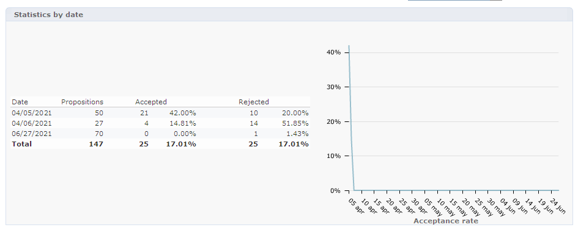

# 即時互動歷史記錄和報表

>[!NOTE]
>
>這些功能只會線上顯示，且 **傳送管理員**.

## 優惠主張歷史記錄{#offer-proposition-history}

一旦您的優惠方案提出後，您就可以查看演示文稿歷史記錄。

* 在選件層級，在 **[!UICONTROL Edit]** 按一下 **[!UICONTROL Propositions]**.

   

* 從收件者的設定檔，按一下 **[!UICONTROL Propositions]** 標籤。

   

* 在選件空間層級，按一下 **[!UICONTROL Propositions]** 標籤。

   

## 優惠分析報告{#offer-analysis-report}

此 **[!UICONTROL Offer analysis]** 報告為您提供了接受或拒絕的建議的數量概覽。

統計資料會根據下列三個條件排序：

* 依日期：

   

* 按空間：

   

* 依傳送：

   

您可以根據報表上方區段提供的各種條件來篩選資料。 選取所需的條件後，按一下 **[!UICONTROL Refresh]** 連結以將其套用至報表。
