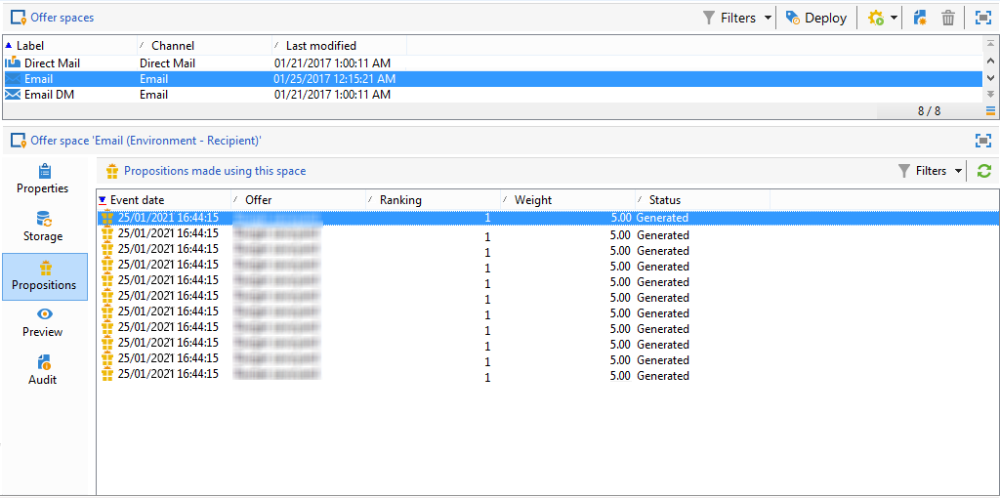

# 即時互動記錄和報表

>[!NOTE]
>
>這些功能僅可線上上顯示，並且僅可供 **傳遞管理員**.

## 優惠主張歷史記錄{#offer-proposition-history}

提出優惠方案主張後，您可以檢視簡報歷史記錄。

* 在選件層級的 **[!UICONTROL Edit]** 標籤，按一下 **[!UICONTROL Propositions]**.

   

* 在收件者的設定檔中，按一下 **[!UICONTROL Propositions]** 標籤。

   

* 在選件空間層級，按一下 **[!UICONTROL Propositions]** 標籤。

   

## 優惠分析報告{#offer-analysis-report}

此 **[!UICONTROL Offer analysis]** 報告提供已接受或已拒絕建議數目的概觀。

統計資料是根據三個條件來排序：

* 依日期：

   

* 依空間：

   

* 依傳遞：

   

您可以根據報表上方區段提供的各種條件來篩選資料。 選取所需條件後，按一下 **[!UICONTROL Refresh]** 連結以將其套用至報表。
