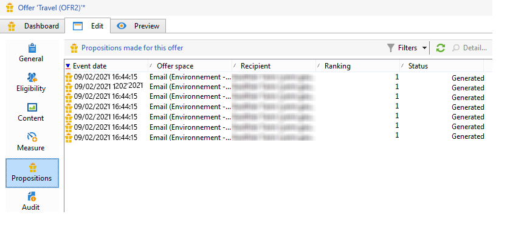
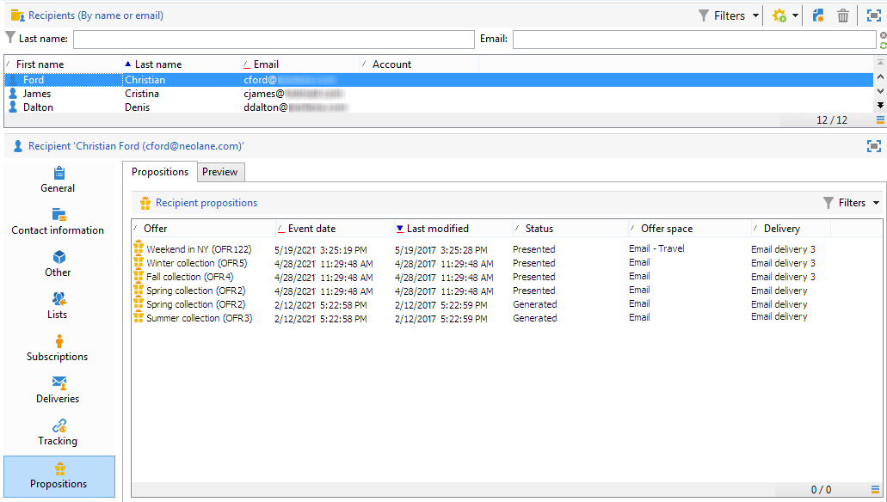

# 即時交互歷史記錄和報告

>[!NOTE]
>
>這些功能僅線上顯示，且僅對 **交付經理**。

## 優惠主張歷史記錄{#offer-proposition-history}

一旦您提出了您的建議，您就可以查看演示歷史記錄。

* 在優惠級別，在 **[!UICONTROL Edit]** 按鈕 **[!UICONTROL Propositions]**。

   

* 在收件人的個人資料中，按一下 **[!UICONTROL Propositions]** 頁籤。

   

* 在服務空間級別，按一下 **[!UICONTROL Propositions]** 頁籤。

   

## 優惠分析報告{#offer-analysis-report}

的 **[!UICONTROL Offer analysis]** 報告提供了接受或拒絕建議數的概覽。

統計資訊根據以下三個標準排序：

* 按日期：

   

* 按空間：

   

* 按交貨：

   

資料可以根據報告上半部分提供的各種標準進行篩選。 選擇所需條件後，按一下 **[!UICONTROL Refresh]** 連結，以將其應用於報表。
