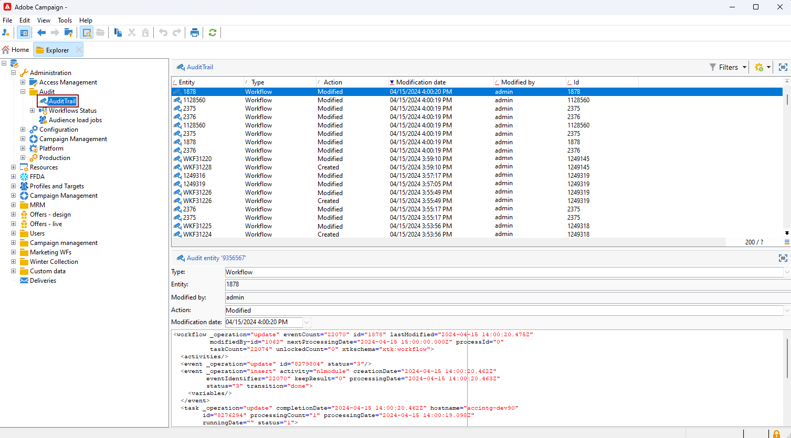

# 稽核軌跡{#audit-trail}

此 **[!UICONTROL Audit trail]** Adobe Campaign中的功能可針對執行個體內重要實體所做的所有修改提供詳細記錄，通常是對執行個體的順利作業產生重大影響的修改。 它可作為即時記錄，在發生動作和事件時擷取詳細的清單。

>[!NOTE]
>
>Adobe Campaign不會稽核使用者許可權、範本、個人化或行銷活動中所做的變更。\
>稽核軌跡只能由執行個體的管理員管理。

+++ 深入瞭解稽核軌跡可用實體

* **結構描述稽核軌跡**：可讓您探索對結構描述所做的變更，並識別誰進行了這些修改，以及這些修改何時發生。

  如需結構描述的詳細資訊，請參閱 [頁面](../dev/schemas.md).

* **工作流程稽核軌跡** 追蹤與工作流程相關的所有動作，包括：

   * 開始
   * 暫停
   * 停止
   * 重新啟動
   * 清除等於動作清除歷史記錄
   * 模擬在模擬模式下等於動作「開始」的專案
   * 立即喚醒等於動作執行擱置中的工作
   * 無條件停止

  如需工作流程的詳細資訊，請參閱本 [頁面](../../automation/workflow/about-workflows.md).

  如需如何監視工作流程的詳細資訊，請參閱 [專用區段](../../automation/workflow/monitor-workflow-execution.md).

* **選項稽核軌跡** 可讓您檢查活動和對選項進行的最後修改。

  如需選項的詳細資訊，請參閱本節 [頁面](https://experienceleague.adobe.com/en/docs/campaign-classic/using/installing-campaign-classic/appendices/configuring-campaign-options).

* **傳遞稽核軌跡** 可讓您檢查活動和對傳送進行的最後修改。

  如需傳送的詳細資訊，請參閱此 [頁面](../start/create-message.md).

* **外部帳戶** 可讓您檢查對外部帳戶所做的修改，這些修改由技術流程（如技術工作流程或行銷活動工作流程）使用。

  如需外部帳戶的詳細資訊，請參閱此 [頁面](../config/external-accounts.md).

* **傳遞對應** 可讓您監視活動以及傳送對應的最新修改。

  如需傳遞對應的詳細資訊，請參閱此 [頁面](../audiences/target-mappings.md).

* **網頁應用程式** 可讓您檢查Campaign V8中對Web表單所做的修改，該表單用於建立具有輸入和選擇欄位的頁面，並且可能包括來自資料庫的資料。

  如需網頁應用程式的詳細資訊，請參閱本節 [頁面](../dev/webapps.md).

* **選件** 可讓您檢查活動和對優惠方案進行的最後修改。

  如需選件的詳細資訊，請參閱本節 [頁面](../interaction/interaction.md).

* **運運算元** 可讓您監視活動以及操作員最近所做的修改。

  如需運運算元的詳細資訊，請參閱此 [頁面](../interaction/interaction-operators.md).

+++

## 存取稽核軌跡 {#accessing-audit-trail}

若要存取執行個體的 **[!UICONTROL Audit trail]**：

1. 存取 **[!UICONTROL Explorer]** 執行個體的功能表。

1. 在 **[!UICONTROL Administration]** 功能表，選取 **[!UICONTROL Audit]** 則 **[!UICONTROL Audit Trail]**.

   

1. 此 **[!UICONTROL Audit trail]** 視窗會開啟，其中含有您的實體清單。 Adobe Campaign將稽核其他實體的建立、編輯和刪除動作。

   選取其中一個實體以深入瞭解最後的修改。

1. 此 **[!UICONTROL Audit entity]** 視窗會提供所選實體的詳細資訊，例如：

   * **[!UICONTROL Type]**：工作流程、選項、傳送或結構描述。
   * **[!UICONTROL Entity]**：活動的內部名稱。
   * **[!UICONTROL Modified by]**：上次修改此實體之人員的使用者名稱。
   * **[!UICONTROL Action]**：此實體上執行的最後一個動作，已建立、已修改或已刪除。
   * **[!UICONTROL Modification date]**：此實體上個動作執行的日期。

   

>[!NOTE]
>
>根據預設，保留期間設為180天 **[!UICONTROL Audit logs]**. 您可以在部署精靈中修改此值。

## 啟用/停用稽核軌跡 {#enable-disable-audit-trail}

例如，如果您想在資料庫上節省一些空間，可以輕鬆地為特定活動啟用或停用稽核軌跡。

若要這麼做：

1. 存取 **[!UICONTROL Explorer]** 執行個體的功能表。

1. 在 **[!UICONTROL Administration]** 功能表，選取 **[!UICONTROL Platform]** 則 **[!UICONTROL Options]**.

1. 根據您想要啟動/取消啟動的實體，選取下列選項之一：

   * 針對工作流程： **[!UICONTROL XtkAudit_Workflows]**
   * 針對結構描述： **[!UICONTROL XtkAudit_DataSchema]**
   * 若為選項： **[!UICONTROL XtkAudit_Option]**
   * 對於傳遞： **[!UICONTROL XtkAudit_Delivery]**
   * 對於外部帳戶： **[!UICONTROL XtkAudit_ExtAccount]**
   * 對於傳遞對應： **[!UICONTROL XtkAudit_DeliveryMapping]**
   * 針對Web應用程式： **[!UICONTROL XtkAudit_WebApp]**
   * 針對選件： **[!UICONTROL XtkAudit_Offer]**
   * 針對運運算元： **[!UICONTROL XtkAudit_Operator]**
   * 對於每個實體： **[!UICONTROL XtkAudit_Enable_All]**

   

1. 變更 **[!UICONTROL Value]** 設為1 （如果要啟用實體）或0 （如果要停用）。

   

1. 按一下&#x200B;**[!UICONTROL Save]**。
