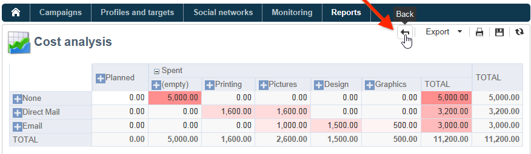

# Adobe Campaign內置報告{#ootb-reports}

本頁提供了Adobe Campaign內置報告、其內容及其上下文的清單。 Adobe Campaign提供一系列內置報告，可通過客戶端控制台或網際網路瀏覽器訪問。

以下報告類型可用：

* 整個平台的報告。 [了解更多](global-reports.md)。
* 傳遞報告. [了解更多](delivery-reports.md)。

您可以從「市場活動」首頁、專用報表控制面板或交付清單訪問內置報表。 報告在UI中的顯示方式取決於其上下文。

首頁上提供了關鍵報告清單，讓您能夠快速訪問傳遞資料。 可以根據需要更改此清單。 您還可以學習如何將自己的報告添加到 **[!UICONTROL Reports]** 頁籤。

有關這些自定義配置的詳細資訊，請參閱 [Campaign Classicv7文檔](https://experienceleague.adobe.com/docs/campaign-classic/using/reporting/creating-new-reports/configuring-access-to-the-report.html)。

## 存取內建報吿 {#access-ootb-reports}

要訪問市場活動內置報表，請執行以下操作：

1. 選擇 **[!UICONTROL Reports]** 的子菜單。

   

1. 使用搜索欄位篩選顯示的報告。

1. 然後按一下要顯示的報告。

   

1. 按一下 **[!UICONTROL Back]** 螢幕頂部的連結將您帶回報告清單。

   

特定於市場活動或交付的報告可通過各自的控制面板訪問。

清單、服務、優惠等的原則相同。 如下所示：

## 傳遞報表 {#reports-on-deliveries}

Adobe Campaign提供的內置報告見下表。

有關這些報告內容的詳細資訊，請參閱 [此部分](delivery-reports.md)。

<table> 
 <tbody> 
  <tr> 
   <td> <strong>標籤和內部名稱</strong>  </td> 
   <td> <strong>說明</strong>  </td> 
   <td> <strong>結構描述</strong>  </td> 
  </tr> 
  <tr> 
   <td> 用戶活動(recipientActivity)  </td> 
   <td> 按時段分析開啟、按一下和交易記錄。  </td> 
   <td> nms：交付  </td> 
  </tr> 
  <tr> 
   <td> 交付吞吐量（吞吐量）  </td> 
   <td> 以消息/小時和Mbit/s為單位的傳遞吞吐量圖表。  </td> 
   <td> nms：交付  </td> 
  </tr> 
  <tr> 
   <td> 故障和邊界（錯誤）  </td> 
   <td> 按原因和域列出的邊界和非交付項。  </td> 
   <td> nms：交付  </td> 
  </tr> 
  <tr> 
   <td> 跟蹤指標(deliveryFeedback)  </td> 
   <td> 用於跟蹤收件人行為的關鍵指標摘要。  </td> 
   <td> nms：交付  </td> 
  </tr> 
  <tr> 
   <td> 跟蹤指示器(mobileAppDeliveryFeedback)  </td> 
   <td> 跟蹤向移動應用傳送的指示符。  </td> 
   <td> nms：交付  </td> 
  </tr> 
  <tr> 
   <td> 瀏覽器（瀏覽器統計資訊）  </td> 
   <td> 按一下消息的收件人使用的瀏覽器的統計資訊。  </td> 
   <td> xtk：無  </td> 
  </tr> 
  <tr> 
   <td> 共用到社交網路(deliveryForward)  </td> 
   <td> 共用活動和郵件開啟統計資訊。  </td> 
   <td> nms：交付  </td> 
  </tr> 
  <tr> 
   <td> 熱點擊（滾動）  </td> 
   <td> 顯示消息和疊加的按一下率。  </td> 
   <td> nms：交付  </td> 
  </tr> 
  <tr> 
   <td> 假設報告(deliveryHesphoit)  </td> 
   <td> 顯示有關交付假設的度量摘要。  </td> 
   <td> nms：交付  </td> 
  </tr> 
  <tr> 
   <td> 傳遞統計資訊(statisticsPerDelivery)  </td> 
   <td> 每個電子郵件域的統計資訊（已處理的郵件、已傳遞的郵件、硬邊界、軟邊界、按一下、取消訂閱）。  </td> 
   <td> nms：交付  </td> 
  </tr> 
  <tr> 
   <td> 共用活動統計資訊(forwardActivities)  </td> 
   <td> 分析每個時間段的共用活動、開啟和訂閱。  </td> 
   <td> nms：交付  </td> 
  </tr> 
  <tr> 
   <td> 跟蹤統計資訊(trackingStatistics)  </td> 
   <td> 開啟，按一下並交易費率報表。  </td> 
   <td> nms：交付  </td> 
  </tr> 
  <tr> 
   <td> 交貨摘要（交貨發送）  </td> 
   <td> 交付指標摘要：目標、排除和發送的消息。  </td> 
   <td> nms：交付  </td> 
  </tr> 
  <tr> 
   <td> 交貨摘要(deliveryStatistics)  </td> 
   <td> 所選交貨的匯總表：目標、排除項和發送的消息。  </td> 
   <td> nms：交付  </td> 
  </tr> 
  <tr> 
   <td> 作業系統(osStatistics)  </td> 
   <td> 按一下消息的收件人使用的作業系統的統計資訊。  </td> 
   <td> xtk：無  </td> 
  </tr> 
  <tr> 
   <td> 反應性率(deliveryFeedbackSocial)  </td> 
   <td> 反應性率和反應破裂。  </td> 
   <td> nms：交付  </td> 
  </tr> 
  <tr> 
   <td> URL並按一下吞吐量(topUrlDelivery)  </td> 
   <td> 大多數被動URL和關聯的按一下流。  </td> 
   <td> nms：交付  </td> 
  </tr> 
 </tbody> 
</table>

## 市場活動報告 {#reports-on-campaigns}

有關市場活動的報告涉及 **nms：操作** 的子菜單。

<table> 
 <tbody> 
  <tr> 
   <td> <strong>標籤和內部名稱</strong>  </td> 
   <td> <strong>說明</strong>  </td> 
  </tr> 
  <tr> 
   <td> 用戶活動(operationRecipientActivity)  </td> 
   <td> 按時段分列的開啟、按一下和事務處理的細分取決於市場活動。  </td> 
  </tr> 
  <tr> 
   <td> 傳遞吞吐量(operationThroughput)  </td> 
   <td> 以郵件/小時和Mbit/s為單位的交付吞吐量圖表取決於市場活動。  </td> 
  </tr> 
  <tr> 
   <td> 市場活動費用(budgetOperationExpenses)  </td> 
   <td> 詳細顯示市場活動行項目，這取決於市場活動。  </td> 
  </tr> 
  <tr> 
   <td> 故障和邊界(operationErrors)  </td> 
   <td> 按原因和域列出的退貨和非交付項取決於市場活動。  </td> 
  </tr> 
  <tr> 
   <td> 正在查找成本行(budgetExplorerOperation)  </td> 
   <td> 成本行的描述性分析取決於MRM。  </td> 
  </tr> 
  <tr> 
   <td> 跟蹤指示器(operationFeedback)  </td> 
   <td> 主要跟蹤指標概述：開啟、按一下和事務處理取決於市場活動。  </td> 
  </tr> 
  <tr> 
   <td> 共用到社交網路（操作轉發）  </td> 
   <td> 共用活動和郵件開啟的統計資訊，取決於活動。  </td> 
  </tr> 
  <tr> 
   <td> 假設報告（操作假設）  </td> 
   <td> 顯示市場活動交付的假設度量匯總，取決於市場活動。  </td> 
  </tr> 
  <tr> 
   <td> 共用活動統計資訊(forwardActivityOpt)  </td> 
   <td> 每個時段的共用活動（開啟和訂閱）的分析取決於活動。  </td> 
  </tr> 
  <tr> 
   <td> 交貨摘要(operationStatistics)  </td> 
   <td> 市場活動交貨的匯總圖表：目標、排除項和發送的消息。  </td> 
  </tr> 
  <tr> 
   <td> URL並按一下吞吐量（操作TopUrlDelivery）  </td> 
   <td> 大多數被動URL和關聯的點擊流都取決於市場活動。  </td> 
  </tr> 
 </tbody> 
</table>

## 服務報告 {#reports-on-services}

有關服務的報告涉及 **nms：服務** 的子菜單。

<table> 
 <tbody> 
  <tr> 
   <td> <strong>標籤和內部名稱</strong>  </td> 
   <td> <strong>說明</strong>  </td> 
  </tr> 
  <tr> 
   <td> 風扇收購(socialUncipationsByWebapp)  </td> 
   <td> 哪些Web應用程式啟用了潛在客戶收購？ 取決於社交營銷附加項。  </td> 
  </tr> 
  <tr> 
   <td> 訂閱細目(mobileAppDistribution)  </td> 
   <td> 每個移動應用程式的活動訂閱的細分取決於移動應用通道載入項。  </td> 
  </tr> 
  <tr> 
   <td> 訂閱跟蹤（預訂Progress）  </td> 
   <td> 資訊服務訂閱的演變  </td> 
  </tr> 
  <tr> 
   <td> 反應性率(socialReactionRate)  </td> 
   <td> 最近交貨的反應性率是多少？ 取決於社交營銷附加項。  </td> 
  </tr> 
  <tr> 
   <td> 反應性率(mobileAppRicjyctRate)  </td> 
   <td> 最新交付的反應性率取決於移動應用通道附加項。  </td> 
  </tr> 
 </tbody> 
</table>

## 預算報表 {#budget-reports}

Adobe Campaign提供的內置報告見下表。

<table> 
 <tbody> 
  <tr> 
   <td> <strong>標籤和內部名稱</strong>  </td> 
   <td> <strong>說明</strong>  </td> 
   <td> <strong>結構描述</strong>  </td> 
  </tr> 
  <tr> 
   <td> 與方案相關的費用（預算方案費用）  </td> 
   <td> 方案費用細目。  </td> 
   <td> nms：程式  </td> 
  </tr> 
  <tr> 
   <td> 預算演變（預算演變）  </td> 
   <td> 按承付款額分列的預算費用變化。  </td> 
   <td> nms：預算  </td> 
  </tr> 
  <tr> 
   <td> 預算的累計演化(budgetCumulativeEvolution)  </td> 
   <td> 按預算細分的累計預算費用的演變  檔案。 </td> 
   <td> nms：預算  </td> 
  </tr> 
  <tr> 
   <td> 探索成本行(budgetExplorerBudget)  </td> 
   <td> 成本行的說明性分析。  </td> 
   <td> nms：預算  </td> 
  </tr> 
  <tr> 
   <td> 瀏覽成本行(budgetExplorer)  </td> 
   <td> 成本行的說明性分析。  </td> 
   <td> nms:costLine  </td> 
  </tr> 
  <tr> 
   <td> 探索成本行(budgetExplorerPlan)  </td> 
   <td> 成本行的說明性分析。  </td> 
   <td> nms：計畫  </td> 
  </tr> 
  <tr> 
   <td> 探索成本行(budgetExplorerProgram)  </td> 
   <td> 成本行的說明性分析。  </td> 
   <td> nms：程式  </td> 
  </tr> 
  <tr> 
   <td> 預算摘要（預算）  </td> 
   <td> 主要成本、支出類別和預算的快照。  </td> 
   <td> nms：預算  </td> 
  </tr> 
 </tbody> 
</table>

## 模擬報告 {#reports-on-simulations}

有關模擬的報告涉及 **nms：模擬** 的子菜單。

<table> 
 <tbody> 
  <tr> 
   <td> <strong>標籤和內部名稱</strong>  </td> 
   <td> <strong>說明</strong>  </td> 
  </tr> 
  <tr> 
   <td> 模擬排除的詳細資訊(dlvSimuLossDetail)  </td> 
   <td> 所有排除原因的詳細表。  </td> 
  </tr> 
  <tr> 
   <td> 按級別列出的優惠細目(offerSimulationRanking)  </td> 
   <td> 模擬中按級別列出的報價的細分。  </td> 
  </tr> 
  <tr> 
   <td> 模擬摘要(dlvSimuLossSummary)  </td> 
   <td> 模擬卷和排除的摘要。  </td> 
  </tr> 
  <tr> 
   <td> 重疊統計(dlvSimuOverlaping)  </td> 
   <td> 傳遞目標重疊卷。  </td> 
  </tr> 
  <tr> 
   <td> 因模擬(dlvSimuLossSimu)而排除的概要  </td> 
   <td> 因模擬而排除的表。  </td> 
  </tr> 
 </tbody> 
</table>

## Web應用程式報告 {#reports-on-web-applications}

有關Web應用程式的報告涉及 **nms:WebApp** 的子菜單。

<table> 
 <tbody> 
  <tr> 
   <td> <strong>標籤和內部名稱</strong>  </td> 
   <td> <strong>說明</strong>  </td> 
  </tr> 
  <tr> 
   <td> 文檔(surveyDictionary)  </td> 
   <td> 調查結構的說明取決於調查管理器載入項。  </td> 
  </tr> 
  <tr> 
   <td> 主要(surveyProperties)  </td> 
   <td> 調查屬性  </td> 
  </tr> 
  <tr> 
   <td> 答復分類（調查分佈）  </td> 
   <td> 對問題的答復的細目。  </td> 
  </tr> 
 </tbody> 
</table>

## 其他ootb報告 {#other-ootb-reports}

還提供了以下內置報告。 有關此內容的詳細資訊，請參閱有關其所關心功能的文檔。

<table> 
 <tbody> 
  <tr> 
   <td> <strong>標籤和內部名稱</strong>  </td> 
   <td> <strong>說明</strong>  </td> 
   <td> <strong>結構描述</strong>  </td> 
  </tr> 
  <tr> 
   <td> 優惠分析（優惠分析）  </td> 
   <td> 根據日期和渠道提供分析，這取決於「交互」附加項。  </td> 
   <td> nms：提供  </td> 
  </tr> 
  <tr> 
   <td> 再營銷效率（再營銷效果）  </td> 
   <td> 再營銷效率的度量  </td> 
   <td> nms:web事件  </td> 
  </tr> 
  <tr> 
   <td> 社會前景獲取歷史記錄(socialVisitorStatistics)  </td> 
   <td> twitter和Facebook的潛在收購歷史取決於社會營銷附加功能。  </td> 
   <td> nms：訪問者  </td> 
  </tr> 
  <tr> 
   <td> 最近的命題跟蹤（最近的命題）  </td> 
   <td> 即時命題跟蹤  </td> 
   <td> nms：命題Rcp  </td> 
  </tr> 
 </tbody> 
</table>
