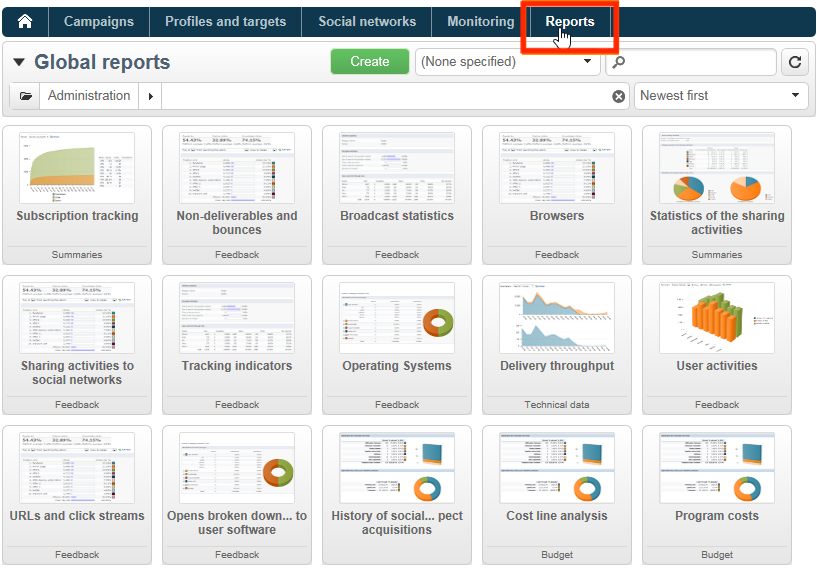

# Adobe Campaign內建報告 {#ootb-reports}

此頁面提供Adobe Campaign內建報告的清單、其內容與內容。 Adobe Campaign提供一系列內建報表，可從使用者端主控台或網際網路瀏覽器存取。

可用的報表型別如下：

* 整個平台的報告。 [了解更多](global-reports.md)。
* 傳遞報告。 [了解更多](delivery-reports.md)。

您可以從Campaign首頁、專用報告儀表板或傳遞清單存取內建報告。 報表在UI中的顯示方式取決於其內容。

首頁上提供主要報表的清單，可讓您快速存取傳遞資料。 您可以視需要變更此清單。 您也可以瞭解如何將自己的報告新增至 **[!UICONTROL Reports]** 標籤。

如需這些自訂設定的詳細資訊，請參閱此 [Campaign Classic v7檔案](https://experienceleague.adobe.com/docs/campaign-classic/using/reporting/creating-new-reports/configuring-access-to-the-report.html).

## 存取內建報吿 {#access-ootb-reports}

若要存取Campaign內建報表：

1. 選取 **[!UICONTROL Reports]** Adobe Campaign的「 」索引標籤。

   

1. 使用搜尋欄位來篩選顯示的報表。

1. 然後按一下您要顯示的報表。

   

1. 按一下 **[!UICONTROL Back]** 畫面頂端的連結會帶您回到報告清單。

   

行銷活動或傳送的特定報告可透過其各自的儀表板存取。

清單、服務、優惠方案等的原理相同。 如下所示：

## 傳遞報表 {#reports-on-deliveries}

下表提供Adobe Campaign提供的內建報表。

有關這些報告內容的詳細資訊，請參閱 [本節](delivery-reports.md).

<table> 
 <tbody> 
  <tr> 
   <td> <strong>標籤和內部名稱</strong>  </td> 
   <td> <strong>說明</strong>  </td> 
   <td> <strong>結構描述</strong>  </td> 
  </tr> 
  <tr> 
   <td> 使用者活動(recipientActivity)  </td> 
   <td> 依時段劃分開啟、點按及交易。  </td> 
   <td> nms：delivery  </td> 
  </tr> 
  <tr> 
   <td> 傳遞輸送量（輸送量）  </td> 
   <td> 傳遞輸送量圖表，以訊息/小時和Mbits/s為單位。  </td> 
   <td> nms：delivery  </td> 
  </tr> 
  <tr> 
   <td> 失敗和退回（錯誤）  </td> 
   <td> 依原因和網域區分的跳出和無法傳遞專案。  </td> 
   <td> nms：delivery  </td> 
  </tr> 
  <tr> 
   <td> 追蹤指標(deliveryFeedback)  </td> 
   <td> 追蹤收件者行為之關鍵指標的摘要。  </td> 
   <td> nms：delivery  </td> 
  </tr> 
  <tr> 
   <td> 追蹤指標(mobileAppDeliveryFeedback)  </td> 
   <td> 追蹤傳遞至行動應用程式的指標。  </td> 
   <td> nms：delivery  </td> 
  </tr> 
  <tr> 
   <td> 瀏覽器(browserStatistics)  </td> 
   <td> 收件者點選訊息後所使用瀏覽器的統計資料。  </td> 
   <td> xtk：none  </td> 
  </tr> 
  <tr> 
   <td> 分享至社交網路(deliveryForward)  </td> 
   <td> 共用活動和郵件開啟統計資料。  </td> 
   <td> nms：delivery  </td> 
  </tr> 
  <tr> 
   <td> 熱門點按（熱門）  </td> 
   <td> 顯示訊息和重疊的點按率。  </td> 
   <td> nms：delivery  </td> 
  </tr> 
  <tr> 
   <td> 假設報告(deliveryHypothesis)  </td> 
   <td> 顯示傳遞假設的測量摘要。  </td> 
   <td> nms：delivery  </td> 
  </tr> 
  <tr> 
   <td> 傳遞統計資料(statisticsPerDelivery)  </td> 
   <td> 每個電子郵件網域的統計資料（已處理的訊息、傳遞的訊息、硬退信、軟退信、點按、取消訂閱）。  </td> 
   <td> nms：delivery  </td> 
  </tr> 
  <tr> 
   <td> 共用活動統計資料(forwardActivities)  </td> 
   <td> 分析每個時段內的共用活動、開啟次數和訂閱。  </td> 
   <td> nms：delivery  </td> 
  </tr> 
  <tr> 
   <td> 追蹤統計資料(trackingStatistics)  </td> 
   <td> 開啟、按一下並產生交易匯率報表。  </td> 
   <td> nms：delivery  </td> 
  </tr> 
  <tr> 
   <td> 傳遞摘要(deliverySending)  </td> 
   <td> 傳遞指標摘要：目標、排除專案及傳送的訊息。  </td> 
   <td> nms：delivery  </td> 
  </tr> 
  <tr> 
   <td> 傳遞摘要(deliveryStatistics)  </td> 
   <td> 所選傳遞的摘要表格：目標、排除專案和傳送的訊息。  </td> 
   <td> nms：delivery  </td> 
  </tr> 
  <tr> 
   <td> 作業系統(osStatistics)  </td> 
   <td> 收件者點選訊息時所使用作業系統的統計資料。  </td> 
   <td> xtk：none  </td> 
  </tr> 
  <tr> 
   <td> 反應率(deliveryFeedbackSocial)  </td> 
   <td> 傳遞反應率和反應劃分。  </td> 
   <td> nms：delivery  </td> 
  </tr> 
  <tr> 
   <td> URL和點按輸送量(topUrlDelivery)  </td> 
   <td> 最被動的URL和相關聯的點按資料流。  </td> 
   <td> nms：delivery  </td> 
  </tr> 
 </tbody> 
</table>

## 行銷活動報表 {#reports-on-campaigns}

行銷活動的報表涉及 **nms：operation** 表格。

<table> 
 <tbody> 
  <tr> 
   <td> <strong>標籤和內部名稱</strong>  </td> 
   <td> <strong>說明</strong>  </td> 
  </tr> 
  <tr> 
   <td> 使用者活動(operationRecipientActivity)  </td> 
   <td> 依期間劃分的開啟、點按及交易，視促銷活動而定。  </td> 
  </tr> 
  <tr> 
   <td> 傳遞輸送量(operationThroughput)  </td> 
   <td> 以郵件/小時和Mbits/s表示的傳遞輸送量圖表取決於Campaign。  </td> 
  </tr> 
  <tr> 
   <td> 行銷活動費用(budgetOperationExpenses)  </td> 
   <td> 根據Campaign，顯示詳細的行銷活動條列專案。  </td> 
  </tr> 
  <tr> 
   <td> 失敗和退回(operationErrors)  </td> 
   <td> 依原因和網域區分的跳出和無法傳遞專案，視促銷活動而定。  </td> 
  </tr> 
  <tr> 
   <td> 探索成本行(budgetExplorerOperation)  </td> 
   <td> 成本明細行的描述性分析，取決於MRM。  </td> 
  </tr> 
  <tr> 
   <td> 追蹤指標(operationFeedback)  </td> 
   <td> 關鍵追蹤指標概要：開啟、點按及交易視促銷活動而定。  </td> 
  </tr> 
  <tr> 
   <td> 分享至社交網路(operationForward)  </td> 
   <td> 根據Campaign，共用活動和郵件開啟統計資料。  </td> 
  </tr> 
  <tr> 
   <td> 假設報告(operationHypothesis)  </td> 
   <td> 顯示行銷活動傳遞的假設測量摘要（視行銷活動而定）。  </td> 
  </tr> 
  <tr> 
   <td> 共用活動統計資料(forwardActivityOpt)  </td> 
   <td> 根據Campaign分析每個時段的共用活動、開啟和訂閱。  </td> 
  </tr> 
  <tr> 
   <td> 傳遞摘要(operationStatistics)  </td> 
   <td> 行銷活動傳遞的摘要圖表：目標、排除專案及傳送的訊息。  </td> 
  </tr> 
  <tr> 
   <td> URL和點按輸送量(operationTopUrlDelivery)  </td> 
   <td> 大部分的反應URL和相關聯的點按資料流取決於Campaign。  </td> 
  </tr> 
 </tbody> 
</table>

## 服務報表 {#reports-on-services}

服務的相關報表會涉及 **nms：service** 表格。

<table> 
 <tbody> 
  <tr> 
   <td> <strong>標籤和內部名稱</strong>  </td> 
   <td> <strong>說明</strong>  </td> 
  </tr> 
  <tr> 
   <td> 粉絲贏取(socialAcquisitionsByWebapp)  </td> 
   <td> 哪些Web應用程式促成潛在客戶贏取？ 取決於Social行銷附加元件。  </td> 
  </tr> 
  <tr> 
   <td> 訂閱劃分(mobileAppDistribution)  </td> 
   <td> 每個行動應用程式的作用中訂閱劃分，取決於行動應用程式頻道附加元件。  </td> 
  </tr> 
  <tr> 
   <td> 訂閱追蹤(subscriptionsProgress)  </td> 
   <td> 資訊服務訂閱的發展  </td> 
  </tr> 
  <tr> 
   <td> 反應率(socialReactionRate)  </td> 
   <td> 最新傳送的反應率為何？ 取決於Social行銷附加元件。  </td> 
  </tr> 
  <tr> 
   <td> 反應率(mobileAppReactivityRate)  </td> 
   <td> 最新傳遞的反應率取決於行動應用程式頻道附加元件。  </td> 
  </tr> 
 </tbody> 
</table>

## 預算報表 {#budget-reports}

下表提供Adobe Campaign提供的內建報表。

<table> 
 <tbody> 
  <tr> 
   <td> <strong>標籤和內部名稱</strong>  </td> 
   <td> <strong>說明</strong>  </td> 
   <td> <strong>結構描述</strong>  </td> 
  </tr> 
  <tr> 
   <td> 連結至方案的成本(budgetProgramCost)  </td> 
   <td> 方案成本明細。  </td> 
   <td> nms：program  </td> 
  </tr> 
  <tr> 
   <td> 預算演變(budgetEvolution)  </td> 
   <td> 依據承諾層次的預算成本演變。  </td> 
   <td> nms：budget  </td> 
  </tr> 
  <tr> 
   <td> 預算的累積演變(budgetCumulativeEvolution)  </td> 
   <td> 依命令劃分的累計預算成本的演變  時間層級。 </td> 
   <td> nms：budget  </td> 
  </tr> 
  <tr> 
   <td> 探索成本行(budgetExplorerBudget)  </td> 
   <td> 成本明細行的描述性分析。  </td> 
   <td> nms：budget  </td> 
  </tr> 
  <tr> 
   <td> 探索成本行(budgetExplorer)  </td> 
   <td> 成本明細行的描述性分析。  </td> 
   <td> nms：costLine  </td> 
  </tr> 
  <tr> 
   <td> 探索成本行(budgetExplorerPlan)  </td> 
   <td> 成本明細行的描述性分析。  </td> 
   <td> nms：plan  </td> 
  </tr> 
  <tr> 
   <td> 探索成本行(budgetExplorerProgram)  </td> 
   <td> 成本明細行的描述性分析。  </td> 
   <td> nms：program  </td> 
  </tr> 
  <tr> 
   <td> 預算摘要（預算）  </td> 
   <td> 主要成本、費用類別和預算的快照。  </td> 
   <td> nms：budget  </td> 
  </tr> 
 </tbody> 
</table>

## 模擬報表 {#reports-on-simulations}

模擬報表涉及 **nms：simulation** 表格。

<table> 
 <tbody> 
  <tr> 
   <td> <strong>標籤和內部名稱</strong>  </td> 
   <td> <strong>說明</strong>  </td> 
  </tr> 
  <tr> 
   <td> 模擬排除的詳細資料(dlvSimuLossDetail)  </td> 
   <td> 排除所有原因的詳細表格。  </td> 
  </tr> 
  <tr> 
   <td> 依等級(offerSimulationRanking)劃分優惠方案  </td> 
   <td> 依排名劃分模擬中的優惠方案。  </td> 
  </tr> 
  <tr> 
   <td> 模擬摘要(dlvSimuLossSummary)  </td> 
   <td> 模擬磁碟區和排除專案的摘要。  </td> 
  </tr> 
  <tr> 
   <td> 重疊統計資料(dlvSimuOverlaying)  </td> 
   <td> 傳遞目標重疊磁碟區。  </td> 
  </tr> 
  <tr> 
   <td> 模擬排除的摘要(dlvSimuLossSimu)  </td> 
   <td> 因模擬而排除的表格。  </td> 
  </tr> 
 </tbody> 
</table>

## 網頁應用程式報表 {#reports-on-web-applications}

有關Web應用程式的報告涉及 **nms：WebApp** 表格。

<table> 
 <tbody> 
  <tr> 
   <td> <strong>標籤和內部名稱</strong>  </td> 
   <td> <strong>說明</strong>  </td> 
  </tr> 
  <tr> 
   <td> 檔案（調查字典）  </td> 
   <td> 調查結構的說明，取決於Survey Manager附加元件。  </td> 
  </tr> 
  <tr> 
   <td> 主要(surveyProperties)  </td> 
   <td> 調查屬性  </td> 
  </tr> 
  <tr> 
   <td> 回覆的劃分(surveyDistribution)  </td> 
   <td> 問題的回覆劃分。  </td> 
  </tr> 
 </tbody> 
</table>

## 其他ootb報告 {#other-ootb-reports}

以下為內建報表。 如需詳細資訊，請參閱檔案，瞭解其相關的功能。

<table> 
 <tbody> 
  <tr> 
   <td> <strong>標籤和內部名稱</strong>  </td> 
   <td> <strong>說明</strong>  </td> 
   <td> <strong>結構描述</strong>  </td> 
  </tr> 
  <tr> 
   <td> 優惠分析(offerAnalysis)  </td> 
   <td> 每個日期和管道的優惠方案分析，取決於互動附加元件。  </td> 
   <td> nms：offer  </td> 
  </tr> 
  <tr> 
   <td> 再行銷效率(remarketingEffect)  </td> 
   <td> 再行銷效率的測量  </td> 
   <td> nms：webEvent  </td> 
  </tr> 
  <tr> 
   <td> 社交潛在客戶贏取的歷史記錄(socialVisitorStatistics)  </td> 
   <td> X (先前稱為Twitter)和Facebook潛在客戶收購的歷史記錄取決於社交行銷附加元件。  </td> 
   <td> nms：visitor  </td> 
  </tr> 
  <tr> 
   <td> 最近的主張追蹤(recentPropositions)  </td> 
   <td> 即時主張追蹤  </td> 
   <td> nms：propositionRcp  </td> 
  </tr> 
 </tbody> 
</table>
