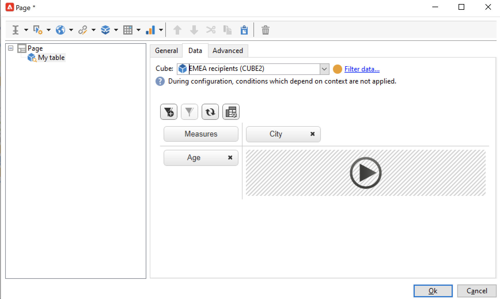
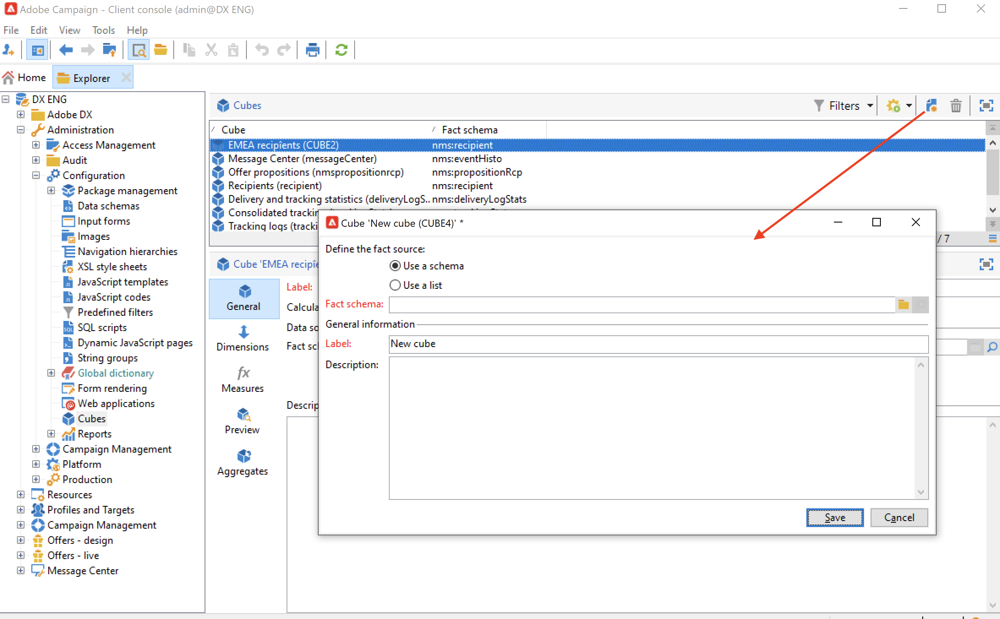

# 建立多維度資料集{#create-a-cube}

## Cube工作區 {#cube-workspace}

若要存取多維度資料集，請從Campaign檔案總管瀏覽至&#x200B;**[!UICONTROL Administration > Configuration > Cubes]**。

您可以使用立方體來：

* 直接在報表中匯出資料(在Adobe Campaign平台的&#x200B;**[!UICONTROL Reports]**&#x200B;索引標籤中設計)。

  要執行此操作，請建立新報表並選取您要使用的立方結構。

  

  立方結構看起來就像範本，根據建立的報表而定。 選擇範本後，按一下「**[!UICONTROL Create]**」以設定並檢視新報告。

  您可以調整測量、變更顯示模式或設定表格，然後使用主要按鈕顯示報表。

  

* 參照報告&#x200B;**[!UICONTROL Query]**&#x200B;方塊中的Cube以使用它的指標，如下所示：

  

* 在報表的任何頁面中插入以立方體為基礎的樞紐分析表。 若要這麼做，請在相關頁面上參考要在樞紐分析表&#x200B;**[!UICONTROL Data]**&#x200B;索引標籤中使用的Cube。

  

  如需詳細資訊，請參閱[探索報表中的資料](cube-tables.md#explore-the-data-in-a-report)。

>[!CAUTION]
>
>建立立方體需要管理員許可權。
>

## 建立多維度資料集{#cube-create}

開始建立立方結構報表之前，請先識別相關的維度和計量，然後在立方結構中建立它們。

若要建立立方結構，請套用下列步驟：

1. 選取工作表。 [了解更多](#select-the-work-table)。
1. 定義維度。 [了解更多](#define-dimensions)。
1. 定義測量。 [了解更多](#build-indicators)。
1. 建立彙總（選用）。 [了解更多](customize-cubes.md#calculate-and-use-aggregates)。

在下列範例中，瞭解如何在報告中快速建立簡單的立方結構以匯出其測量。

### 選取工作表 {#select-the-work-table}

若要建立多維度資料集，請遵循下列步驟：

1. 按一下立方結構清單上方的&#x200B;**[!UICONTROL New]**&#x200B;按鈕。

   

1. 選取包含您要探索之元素的結構描述（也稱為「事實結構描述」）。 在此範例中，選取預設的&#x200B;**收件者**&#x200B;資料表。
1. 按一下&#x200B;**[!UICONTROL Save]**&#x200B;以建立多維資料庫：已新增至多維資料庫清單。 您現在可以使用標籤進行設定。

1. 按一下&#x200B;**[!UICONTROL Filter the source data...]**&#x200B;連結，將此Cube的計算套用至資料庫中的資料。

   

### 定義維度 {#define-dimensions}

建立立方結構之後，請定義其維度。 維度是根據每個立方結構相關事實結構描述所定義的分析軸。 這些是在分析中探索的維度，例如時間（年、月、日）、產品或合約的分類（家庭、參考資料等）、人口區段（依城市、年齡群組、狀態等）。

若要建立維度，請遵循下列步驟：

1. 瀏覽至Cube的&#x200B;**[!UICONTROL Dimension]**&#x200B;標籤，然後按一下&#x200B;**[!UICONTROL Add]**&#x200B;按鈕以建立新的維度。
1. 在&#x200B;**[!UICONTROL Expression field]**&#x200B;中，按一下&#x200B;**[!UICONTROL Edit expression]**&#x200B;圖示以選取包含相關資料的欄位。

   

1. 在此範例中，我們選取的是收件者&#x200B;**年齡**。 對於此欄位，您可以定義量化以分組年齡，並讓資訊閱讀更容易。 當存在數個獨立值的可能性時，我們建議使用量化。

若要這麼做，請核取&#x200B;**[!UICONTROL Enable binning]**&#x200B;選項。 [了解更多](customize-cubes.md#data-binning)。

1. 新增&#x200B;**日期**&#x200B;型別維度。 在這裡，我們要顯示收件者設定檔建立日期。 若要這麼做，請按一下&#x200B;**[!UICONTROL Add]**&#x200B;並選取收件者表格中的&#x200B;**[!UICONTROL Creation date]**&#x200B;欄位。
您可以自訂日期顯示模式。 若要這麼做，請選取要使用的階層以及要產生的層次：

在我們的範例中，我們只想顯示年、月和日。 請注意，您不能同時使用周和半年/月：這些層級不相容。

1. 建立另一個維度以分析相對於收件者城市的資料。 若要這麼做，請新增維度，並在收件者結構描述的&#x200B;**[!UICONTROL Location]**&#x200B;節點中選取城市。

您可以啟用量化以使資訊讀取更容易，並將值連結至[分項清單](../config/enumerations.md)。

從下拉式清單中選取分項清單。 請注意，此列舉必須定義為&#x200B;**[!UICONTROL Reserved for binning]**。

只會顯示分項清單中的值。 其他則將在&#x200B;**[!UICONTROL Label of the other values]**&#x200B;欄位中定義的標籤下分組。

如需詳細資訊，請參閱[本章節](customize-cubes.md#dynamically-manage-bins)。

### 建立指標 {#build-indicators}

定義維度後，請指定要在儲存格中顯示的值的計算模式。

若要這麼做，請在&#x200B;**[!UICONTROL Measures]**&#x200B;索引標籤中建立指標。 根據此Cube建立要顯示在報表中的欄數。

若要建立指標，請遵循下列步驟：

1. 瀏覽至&#x200B;**[!UICONTROL Measures]**&#x200B;標籤，然後按一下&#x200B;**[!UICONTROL Add]**&#x200B;按鈕。
1. 選取要套用的測量型別和公式。 在此範例中，我們會計算收件者中女性的數量。 我們的量值是以事實結構描述為基礎，並使用&#x200B;**[!UICONTROL Count]**&#x200B;運運算元。

   

   使用&#x200B;**[!UICONTROL Filter the measure data...]**&#x200B;連結僅選取女性。 [了解更多](customize-cubes.md#define-measures)。

   

1. 輸入測量的標籤並儲存。

   

1. 儲存立方體。

您現在可以根據此多維度資料集建立報告。 [了解更多](cube-tables.md)。
