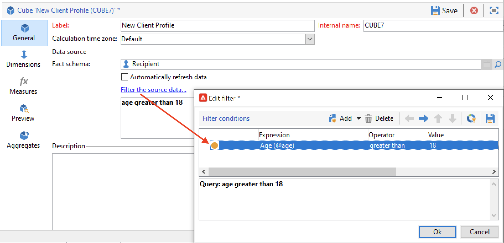

# 建立多維度資料集{#create-a-cube}

## Cube工作區 {#cube-workspace}

若要存取多維度資料集，請瀏覽至 **[!UICONTROL Administration > Configuration > Cubes]** 從Campaign檔案總管。

使用立方體時，您可以：

* 直接在報表中匯出資料(設計於 **[!UICONTROL Reports]** 標籤中的「Adobe Campaign平台」。

   要執行此操作，請建立新報告並選取您要使用的立方結構。

   

   多維度資料集看起來就像範本，根據建立的報表而定。 選擇範本後，按一下 **[!UICONTROL Create]** 以設定和檢視新報告。

   您可以調整測量、變更顯示模式或設定表格，然後使用主要按鈕顯示報表。

   

* 在中參照立方體 **[!UICONTROL Query]** 報告方塊以使用指標，如下所示：

   

* 在報表的任何頁面中插入以立方體為基礎的樞紐分析表。 要執行此操作，請參考要用於 **[!UICONTROL Data]** 相關頁面上的樞紐分析表索引標籤。

   

   有關詳細資訊，請參閱 [探索報告中的資料](cube-tables.md#explore-the-data-in-a-report).

>[!CAUTION]
>
>建立立方體需要管理員許可權。

## 建立立方體{#cube-create}

開始建立立方結構報表之前，請先識別相關的維度和計量，並在立方結構中建立它們。

若要建立立方結構，請套用下列步驟：

1. 選取工作表。 [了解更多](#select-the-work-table)。
1. 定義維度。 [了解更多](#define-dimensions)。
1. 定義量值。 [了解更多](#build-indicators)。
1. 建立彙總（選用）。 [了解更多](customize-cubes.md#calculate-and-use-aggregates)。

在以下範例中，瞭解如何在報告中快速建立簡單的多維資料庫以匯出其測量。

### 選取工作表 {#select-the-work-table}

若要建立立方體，請遵循下列步驟：

1. 按一下 **[!UICONTROL New]** 「立方體」清單上方的按鈕。

   

1. 選取包含您要探索之元素的結構描述（也稱為「事實結構描述」）。 在此範例中，選取預設值 **收件者** 表格。
1. 按一下 **[!UICONTROL Save]** 若要建立立方結構：它會新增至立方結構清單。 您現在可以使用標籤進行設定。

1. 按一下 **[!UICONTROL Filter the source data...]** 此連結可將此Cube的計算套用至資料庫中的資料。

   

### 定義維度 {#define-dimensions}

建立立方結構之後，請定義其維度。 Dimension是根據每個立方結構相關事實結構描述所定義的分析軸。 這些是在分析中探索的維度，例如時間（年、月、日）、產品或合約的分類（家庭、參考資料等）、人口區段（依城市、年齡群組、狀態等）。

若要建立維度，請遵循下列步驟：

1. 瀏覽至 **[!UICONTROL Dimension]** 立方結構的頁簽，然後按一下 **[!UICONTROL Add]** 按鈕來建立新維度。
1. 在 **[!UICONTROL Expression field]**，按一下 **[!UICONTROL Edit expression]** 圖示以選取包含相關資料的欄位。

   

1. 在此範例中，我們選取的是收件者 **年齡**. 對於此欄位，您可以定義量度歸組年齡，讓資訊閱讀更輕鬆。 當可能有數個單獨值時，我們建議使用量化。

若要這麼做，請核取 **[!UICONTROL Enable binning]** 選項。 [了解更多](customize-cubes.md#data-binning)。

1. 新增 **日期** 型別維度。 在這裡，我們要顯示收件者設定檔建立日期。 若要這麼做，請按一下 **[!UICONTROL Add]** 並選取 **[!UICONTROL Creation date]** 收件者表格中的欄位。
您可以自訂日期顯示模式。 若要這麼做，請選取要使用的階層以及要產生的層次：

在我們的範例中，我們只想顯示年、月和日。 請注意，您不能同時使用周和半年/月：這些層級不相容。

1. 建立另一個維度以分析相對於收件者城市的資料。 若要這麼做，請新增維度，並選取 **[!UICONTROL Location]** 收件者綱要的節點。

您可以啟用量化，讓資訊閱讀更輕鬆，並將值連結至分項清單。

從下拉式清單中選取分項清單。 請注意，此分項清單必須定義為 **[!UICONTROL Reserved for binning]**.

只會顯示分項清單中的值。 其他則會在中定義的標籤下分組。 **[!UICONTROL Label of the other values]** 欄位。

如需詳細資訊，請參閱[本章節](customize-cubes.md#dynamically-manage-bins)。

### 建置指標 {#build-indicators}

定義維度後，請為儲存格中顯示的值指定計算模式。

若要這麼做，請在 **[!UICONTROL Measures]** 標籤。 根據此立方結構，建立要顯示在報表中的欄數，數量不限。

若要建立指標，請遵循下列步驟：

1. 瀏覽至 **[!UICONTROL Measures]** 標籤並按一下 **[!UICONTROL Add]** 按鈕。
1. 選取要套用的測量型別和公式。 在此範例中，我們會計算收件者中女性的數量。 我們的測量以事實結構描述為基礎，並使用 **[!UICONTROL Count]** 運運算元。

   

   使用 **[!UICONTROL Filter the measure data...]** 僅選取女性的連結。 [了解更多](customize-cubes.md#define-measures)。

   

1. 輸入測量的標籤並儲存。

   

1. 儲存立方體。

您現在可以根據此多維度資料集建立報告。 [了解更多](cube-tables.md)。
