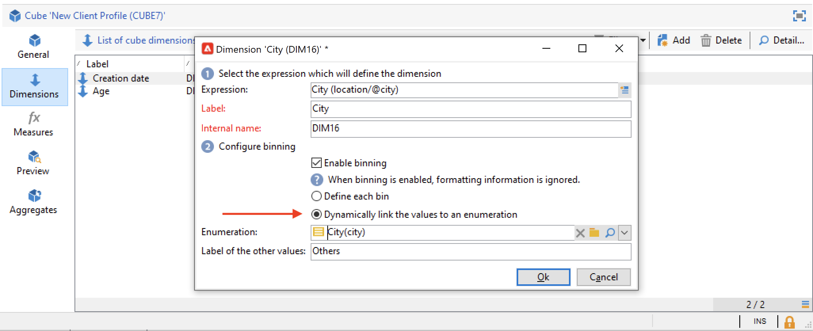

# 建立多維度資料集{#create-a-cube}

## 多維資料集工作區 {#cube-workspace}

要訪問多維資料集，請瀏覽 **[!UICONTROL Administration > Configuration > Cubes]** 從Campaign總管。

使用立方體，您可以：

* 直接在報表中匯出資料(設計於 **[!UICONTROL Reports]** 頁簽。

   要執行此操作，請建立新報告並選擇要使用的多維資料集。

   

   立方體的顯示方式與根據建立報表的範本類似。 選擇範本後，按一下 **[!UICONTROL Create]** 以設定及檢視新報表。

   您可以調整測量、變更顯示模式或設定表格，然後使用主按鈕顯示報表。

   

* 在 **[!UICONTROL Query]** 報表方塊以使用其指標，如下所示：

   

* 將基於多維資料集的資料透視表插入到報表的任何頁中。 要執行此操作，請參考要在 **[!UICONTROL Data]** 索引標籤（位於相關頁面上）。

   

   有關詳細資訊，請參閱 [探索報表中的資料](cube-tables.md#explore-the-data-in-a-report).

>[!CAUTION]
>
>建立多維資料集需要管理員權限。

## 建立多維資料集{#cube-create}

開始建立多維資料集報表之前，請確定相關的維和度量，並在多維資料集中建立它們。

要建立多維資料集，請應用以下步驟：

1. 選擇工作表。 [了解更多資訊](#select-the-work-table)。
1. 定義維度。 [了解更多資訊](#define-dimensions)。
1. 定義測量。 [了解更多資訊](#build-indicators)。
1. 建立匯總（選用）。 [了解更多資訊](customize-cubes.md#calculate-and-use-aggregates)。

在以下範例中，了解如何快速在報表中建立簡單多維資料集，以匯出其測量。

### 選擇工作表 {#select-the-work-table}

要建立多維資料集，請執行以下步驟：

1. 按一下 **[!UICONTROL New]** 按鈕。

   

1. 選擇包含要瀏覽的元素的架構（也稱為「事實架構」）。 在此範例中，選取預設值 **收件者** 表格。
1. 按一下 **[!UICONTROL Save]** 要建立多維資料集：它會新增至立方體清單。 您現在可以使用索引標籤加以設定。

1. 按一下 **[!UICONTROL Filter the source data...]** 連結，將此多維資料集的計算應用到資料庫中的資料。

   

### 定義維度 {#define-dimensions}

建立多維資料集後，定義其維。 Dimension是根據每個多維資料集的相關數值模式為每個多維資料集定義的分析軸。 這些是分析中探討的維度，例如時間（年、月、日）、產品或合約的分類（家庭、參考等）、人口區段（依城市、年齡組、狀態等）。

要建立維，請執行以下步驟：

1. 瀏覽至 **[!UICONTROL Dimension]** 索引標籤，然後按一下 **[!UICONTROL Add]** 按鈕以建立新維。
1. 在 **[!UICONTROL Expression field]**，按一下 **[!UICONTROL Edit expression]** 表徵圖，選擇包含相關資料的欄位。

   

1. 在此範例中，我們會選取收件者 **年齡**. 對於此欄位，您可以定義組合年齡，並讓資訊閱讀更輕鬆。 建議您在可能有數個個別值時使用捆綁。

若要這麼做，請檢查 **[!UICONTROL Enable binning]** 選項。 [了解更多資訊](customize-cubes.md#data-binning)。

1. 新增 **日期** 類型維度。 在此，我們要顯示收件者設定檔建立日期。 要執行此操作，請按一下 **[!UICONTROL Add]** ，然後選取 **[!UICONTROL Creation date]** 欄位。
您可以自訂日期顯示模式。 要執行此操作，請選取要使用的階層以及要產生的層級：

在我們的範例中，我們只想顯示年、月和日。 請注意，您無法同時處理周和寄件器/月：這些級別不相容。

1. 建立另一個維度，以分析與收件者城市相關的資料。 若要這麼做，請新增維度並選取 **[!UICONTROL Location]** 收件者架構的節點。

您可以啟用捆綁，讓資訊讀取更輕鬆，並將值連結至列舉。

從下拉式清單中選取分項清單。 請注意，此分項清單必須定義為 **[!UICONTROL Reserved for binning]**.

只會顯示分項清單中的值。 其他項目則會分組在 **[!UICONTROL Label of the other values]** 欄位。

如需詳細資訊，請參閱[本章節](customize-cubes.md#dynamically-manage-bins)。

### 建立指標 {#build-indicators}

定義維度後，指定要在儲存格中顯示之值的計算模式。

若要這麼做，請在 **[!UICONTROL Measures]** 標籤。 根據此多維資料集建立報表中要顯示的列數。

若要建立指標，請遵循下列步驟：

1. 瀏覽至 **[!UICONTROL Measures]** ，然後按一下 **[!UICONTROL Add]** 按鈕。
1. 選擇要應用的度量類型和公式。 在此範例中，我們計算受助者中的女性人數。 我們的測量以事實架構為基礎，並使用 **[!UICONTROL Count]** 運算元。

   

   使用 **[!UICONTROL Filter the measure data...]** 僅連結到選擇女性。 [了解更多資訊](customize-cubes.md#define-measures)。

   

1. 輸入度量的標籤並保存它。

   

1. 保存多維資料集。

您現在可以根據此多維資料集建立報表。 [了解更多資訊](cube-tables.md)。
