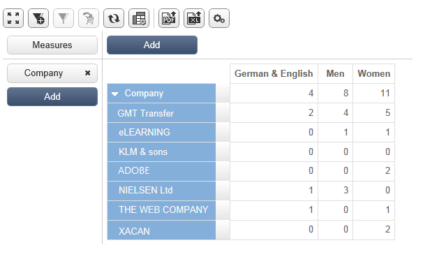

# 使用 cubes 來探索資料{#use-cubes-to-create-reports}

使用立方體來建立報表，以及識別和選取資料庫中的資料。 您可以：

* 根據立方體建立報表。 [了解更多資訊](#explore-the-data-in-a-report)。
* 收集資料庫中的資料，並將其分組為清單，例如識別和建立目標及傳送。 [了解更多資訊](#build-a-target-population)。
* 將透視表插入報表中，引用報表中的現有多維資料集。 [了解更多資訊](#insert-a-pivot-table-into-a-report)。

## 探索報表中的資料 {#explore-the-data-in-a-report}

### 步驟1 — 根據多維資料集建立報表 {#step-1---create-a-report-based-on-a-cube}

一旦 [多維資料集已配置](cube-indicators.md)，可作為建立新報表的範本。

要根據現有多維資料集建立報告，請執行以下步驟：

1. 按一下 **[!UICONTROL Create]** 按鈕 **[!UICONTROL Reports]** 頁簽，然後選擇剛建立的多維資料集。

   

1. 按一下 **[!UICONTROL Create]** 按鈕以確認：這會帶您前往報表設定和檢視頁面。

   依預設，前兩個可用維度以行和欄提供，但表格中未顯示任何值。 若要產生表格，請按一下主圖示：

   

1. 您可以切換尺寸的軸、刪除它們、添加新測量等。 要執行此操作，請使用適當的圖示。

   

   以下詳述這些操作。

### 步驟2 — 選擇行和列 {#step-2---select-lines-and-columns}

預設顯示會顯示多維資料集的前兩個維度（在此例中是年齡和城市）。

此 **[!UICONTROL Add]** 每個軸上的按鈕可讓您新增維度。

1. 選擇要在表格的行和列中顯示的尺寸。 若要這麼做，請拖放可用的維度。
1. 從清單中選擇要添加到表的維：
   

1. 然後選取此維度的參數。

   

   這些參數取決於所選維度的資料類型。

   例如，日期可以有數個層級可用。 有關詳細資訊，請參閱 [顯示度量](customize-cubes.md#display-measures).

   在這種情況下，可使用下列選項：

   

   您可以：

   * 在載入期間展開資料：每次更新報告時，預設都會顯示值(預設值：否)。
   * 在行尾顯示總計：當資料以欄顯示時，其他選項可讓您在行的結尾顯示總計：欄會新增至表格(預設值：是)。
   * 套用排序：列的值可以根據值、標籤或根據度量(預設值：值)。
   * 以遞增(a-z、0-9)或遞減(z-a、9-0)順序顯示值。
   * 變更載入時要顯示的欄數(預設為：200)。

1. 按一下 **[!UICONTROL Ok]** 若要確認：維度會新增至現有維度。

   表格上方的黃色橫幅顯示您已進行變更：按一下 **[!UICONTROL Save]** 按鈕來儲存。

   

### 步驟3 — 設定顯示的測量 {#step-3---configure-the-measures-to-display}

定義行和列後，選擇要顯示的度量。 預設情況下，只顯示一個度量。

要添加和配置測量，請執行以下步驟：

1. 按一下 **[!UICONTROL Measures]** 按鈕。

   

1. Withe **[!UICONTROL Use a measure]** 按鈕，選擇現有度量之一。

   

   選擇要顯示的資訊和格式選項。 選項清單取決於測量類型。

   

   也可透過 **[!UICONTROL Edit the configuration of the pivot table]** 圖示。

   

   然後，您可以選擇是否顯示度量標籤。 [了解更多資訊](customize-cubes.md#configure-the-display)。

1. 您可以根據現有測量建立新測量。 要執行此操作，請按一下 **[!UICONTROL Create a measure]** 並加以設定。

   

   可使用以下類型的測量：

   * 措施組合：此類型的測量允許您使用現有測量來構建新測量：

      可用的運算子為：和、差、乘和速率。

   * 比例：此類型的測量可讓您計算為指定維度測量的記錄數。 您可以根據維或子維計算比例。
   * 變化：此測量可讓您計算層級值的變化。
   * 標準差：這類測量可讓您計算每組儲存格內的偏差，而不是平均值。 例如，您可以比較所有現有區段的購買量。

   建立後，度量即會新增至報表。

   

   建立測量後，可以編輯它並更改其配置。 若要這麼做，請按一下 **[!UICONTROL Measures]** 按鈕，然後瀏覽到要編輯的度量的頁簽。

   然後按一下 **[!UICONTROL Edit the dynamic measure]** 來存取設定功能表。

## 建立目標人口 {#build-a-target-population}

使用立方體建立報表，可讓您從表格收集資料並儲存在清單中。

若要將母體分組到清單中，請遵循下列步驟：

1. 按一下包含要收集之母體的儲存格來選取母體，然後按一下 **[!UICONTROL Add to cart]** 表徵圖。

   

   收集各種設定檔時，請視需要多次執行此動作

1. 按一下 **[!UICONTROL Show cart]** 按鈕，在運行導出之前查看其內容。

   

1. 使用 **[!UICONTROL Export]** 按鈕，將購物車中的項目群組至清單。

   輸入清單的名稱，並選取要執行的匯出類型。

   

   按一下 **[!UICONTROL Start]** 執行匯出。

1. 匯出完成後，訊息會確認其執行，以及已處理的記錄數。

   

   您可以儲存購物車的內容或將其空白。

   新清單可透過 **[!UICONTROL Profiles and targets]** 標籤。

   

## 將樞紐表格插入報表 {#insert-a-pivot-table-into-a-report}

要建立表並瀏覽多維資料集中的資料，請執行以下步驟：

1. 使用單頁建立新報表，並插入樞紐表格。

   

1. 在 **[!UICONTROL Data]** 頁的頁簽中，選擇一個多維資料集以處理它包含的維，並顯示計算度量。

   

   這可讓您建立要顯示的報表。 有關詳細資訊，請參閱 [步驟2 — 選擇行和列](#step-2---select-lines-and-columns).
