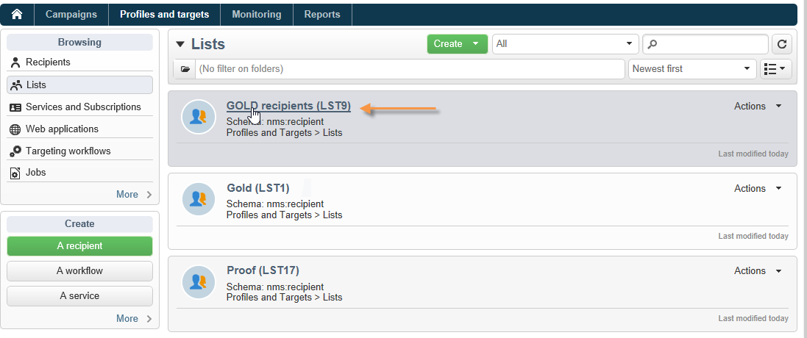

# 使用 cubes 來探索資料{#use-cubes-to-create-reports}

使用立方體來建立報表，以及識別及選取資料庫中的資料。 您可以：

* 根據立方體建立報告。 [了解更多](#explore-the-data-in-a-report)。
* 收集資料庫中的資料，並將其分組到清單中，例如識別及建立目標和傳遞。 [了解更多](#build-a-target-population)。
* 在報表中插入樞紐分析表，參照其中現有的立方結構。 [了解更多](#insert-a-pivot-table-into-a-report)。

## 探索報告中的資料 {#explore-the-data-in-a-report}

### 步驟1 — 根據立方體建立報表 {#step-1---create-a-report-based-on-a-cube}

一旦 [已設定多維度資料集](cube-indicators.md)，可作為建立新報告的範本。

若要根據現有的多維資料庫建立報告，請遵循下列步驟：

1. 按一下 **[!UICONTROL Create]** 的按鈕 **[!UICONTROL Reports]** 頁簽並選取您剛建立的cube。

   

1. 按一下 **[!UICONTROL Create]** 按鈕以確認：這會將您帶往報告設定和檢視頁面。

   依預設，前兩個可用尺寸以行和欄提供，但表格中未顯示任何值。 若要產生表格，請按一下主圖示：

   

1. 您可以切換尺寸的軸、刪除它們、新增測量等。 要執行此操作，請使用適當的圖示。

   

   這些操作詳見下文。

### 步驟2 — 選取行和欄 {#step-2---select-lines-and-columns}

預設顯示會顯示立方結構的前兩個維度（在本例中是年齡和城市）。

此 **[!UICONTROL Add]** 每個軸上的按鈕可讓您新增維度。

1. 選取要在表格行與欄中顯示的尺寸。 若要這麼做，請拖放可用的維度。
1. 從清單中選取要新增至表格的維度：
   

1. 然後選取此尺寸的引數。

   

   這些引數取決於所選維度的資料型別。

   例如，對於日期，可以使用多個層級。 有關詳細資訊，請參閱 [顯示量值](customize-cubes.md#display-measures).

   在這種情況下，可使用下列選項：

   

   您可以：

   * 載入時展開資料：每次更新報表時，預設都會顯示值（預設值：否）。
   * 在行尾顯示總計：當資料以欄顯示時，附加選項可讓您在行尾顯示總計：欄會新增至表格（預設值：是）。
   * 套用排序：欄的值可依值、標籤或量值（預設值：依值）排序。
   * 以遞增(a-z、0-9)或遞減(z-a、9-0)順序顯示值。
   * 變更載入時顯示的欄數（預設為： 200）。

1. 按一下 **[!UICONTROL Ok]** 確認：將維度新增至現有維度。

   表格上方的黃色橫幅顯示您已進行變更：按一下 **[!UICONTROL Save]** 按鈕以儲存它們。

   

### 步驟3 — 設定要顯示的測量 {#step-3---configure-the-measures-to-display}

定義直線和欄之後，請選取要顯示的測量。 依預設，只會顯示一個量值。

若要新增和設定測量，請遵循下列步驟：

1. 按一下 **[!UICONTROL Measures]** 按鈕。

   

1. 使用 **[!UICONTROL Use a measure]** 按鈕，選取其中一個現有的量值。

   

   選擇要顯示的資訊和格式選項。 選項清單視量測型別而定。

   

   整體測量組態也可透過 **[!UICONTROL Edit the configuration of the pivot table]** 圖示來識別。

   

   然後，您可以選擇是否要顯示測量標籤。 [了解更多](customize-cubes.md#configure-the-display)。

1. 您可以根據現有測量來建立新測量。 若要這麼做，請按一下 **[!UICONTROL Create a measure]** 並加以設定。

   

   可用的測量型別如下：

   * 測量組合：此型別的測量可讓您使用現有測量來建立新的測量：

      可用的運運算元包括：和、差、乘數和比率。

   * 比例：此測量型別可讓您計算針對指定維度測量的記錄數。 您可以根據維度或子維度來計算相稱性。
   * 變數：此測量可讓您計算某個層級值的變數。
   * 標準差：此測量型別可讓您計算每一儲存格群組內與平均值比較的偏差。 例如，您可以比較所有現有區段的購買量。

   建立之後，該量值即會新增至報表。

   

   建立測量後，即可編輯並變更其組態。 若要這麼做，請按一下 **[!UICONTROL Measures]** 按鈕，然後瀏覽至要編輯之測量的標籤。

   然後按一下 **[!UICONTROL Edit the dynamic measure]** 以存取「設定」功能表。

## 建立目標母體 {#build-a-target-population}

使用立方體建置的報表可讓您從表格中收集資料，並將其儲存在清單中。

若要將母體分組到清單中，請遵循下列步驟：

1. 按一下包含要收集之母體的儲存格加以選取，然後按一下 **[!UICONTROL Add to cart]** 圖示。

   

   收集各種設定檔所需的次數

1. 按一下 **[!UICONTROL Show cart]** 按鈕以在執行匯出之前檢視其內容。

   

1. 使用 **[!UICONTROL Export]** 按鈕以將購物車中的專案分組到清單中。

   輸入清單名稱，並選取要執行的匯出型別。

   

   按一下 **[!UICONTROL Start]** 以執行匯出。

1. 匯出完成後，訊息會確認其執行及已處理的記錄數。

   

   您可以儲存購物車的內容或將其清空。

   新清單可透過 **[!UICONTROL Profiles and targets]** 標籤。

   

## 在報表中插入樞紐分析表 {#insert-a-pivot-table-into-a-report}

若要建立表格並探索立方結構中的資料，請遵循下列步驟：

1. 使用單一頁面建立新報表，並在其中插入樞紐分析表。

   

1. 在 **[!UICONTROL Data]** 頁簽中，選取立方結構以處理其所包含的維度，並顯示計算的計量。

   

   這可讓您建立要顯示的報表。 有關詳細資訊，請參閱 [步驟2 — 選取行和欄](#step-2---select-lines-and-columns).
