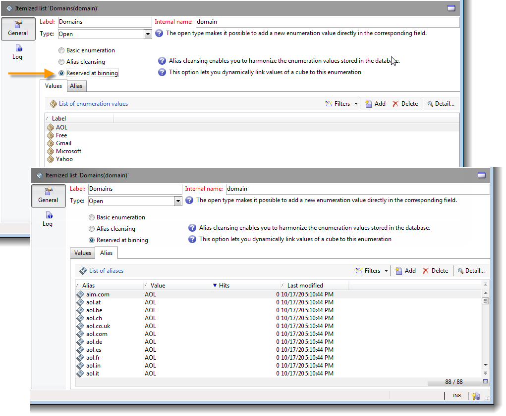

# 自訂多維度資料集{#cube-custom}

## 資料量化 {#data-binning}

使用資料量化，根據條件將值分組，以簡化資料顯示。 根據您可用的資訊，您可以定義年齡群組、將電子郵件網域群組在一起、限製為列舉值、明確限制資料在專用行或欄中顯示及群組所有其他資料等。

整體而言，有三種量化方式可供使用：

1. 使用手動定義的值範圍。 例如，年齡、平均購物車、開啟的傳送數量等)。 有關詳細資訊，請參閱 [定義每個資料匣](#defining-each-bin).
1. 動態地，根據分項清單的值：僅顯示分項清單中包含的值，其他所有值都會分組到「其他」中。 有關詳細資訊，請參閱 [動態管理回收筒](#dynamically-managing-bins).
1. 使用值範圍，將所有其他值分組在一起。 例如，18至25歲、26至59歲和其他人。 有關詳細資訊，請參閱 [建立值範圍](#creating-value-ranges).

若要啟用量化，請在建立維度時勾選適當的方塊。

您可以手動建立回收筒，或將回收筒連結至現有的分項清單。

Adobe Campaign也提供自動量化的輔助程式：值可以分為N個群組，或根據資料庫中最常見的值分組。

### 定義每個紙匣 {#define-each-bin}

若要個別建立每個間隔，請選取 **[!UICONTROL Define each bin]** 選項並使用表格來建立各種回收筒。

按一下 **[!UICONTROL Add]** 按鈕來建立新的bin並列出將分組到bin中的值。

在下列範例中，語言分為三類：英文/德文/荷蘭文、法文/義大利文/西班牙文和其他語言。

您可以使用SQL遮罩將數個值合併到一個篩選中。 若要這麼做，請核取 **[!UICONTROL Yes]** 在 **[!UICONTROL Use an SQL mask]** 欄並輸入要套用的SQL篩選器 **[!UICONTROL Value or expression]** 欄。

<!--In the example below, all email domains that start with **yahoo** (yahoo.fr, yahoo.com, yahoo.be, etc.), or with **ymail** (ymail.com, ymail.eu, etc.) will be grouped under the label **YAHOO!**, as well as addresses with the **rocketmail.com** domain.-->

### 動態管理資源回收筒 {#dynamically-manage-bins}

值可以透過列舉來動態管理。 這表示只會顯示列舉中包含的值。 當列舉值變更時，會自動調整Cube的內容。

若要建立此型別的值量化，請套用下列步驟：

1. 建立新維度並啟用量化。
1. 選取 **[!UICONTROL Dynamically link the values to an enumeration]** 選項並選取相符的列舉。

   

   每當列舉值更新時，就會自動調整相符的回收筒。

進一步瞭解中的分項清單 [此頁面](../../v8/config/ui-settings.md#enumerations).

### 建立值範圍 {#create-value-ranges}

您可以根據所需的間隔將值分組到範圍中。

若要手動定義範圍，請按一下 **[!UICONTROL Add]** 按鈕並選取 **[!UICONTROL Define a range]** ：

然後指定下限和上限，並按一下 **[!UICONTROL Ok]** 以確認。

### 自動產生回收筒 {#generate-bins-automatically}

您也可以自動產生回收筒。 若要這麼做，請按一下 **[!UICONTROL Generate bins...]** 連結。

您可以：

* **[!UICONTROL Recover the most frequently used values]**

   如果您產生4個回收筒，將會顯示4個最常用的值，而其他值將會計算並分組到「其他」類別中。

* **[!UICONTROL Generate bins in the form of slots]**

   對於相同的範例，Adobe Campaign會自動建立4個大小相同的值槽，以在資料庫中顯示值。

在此情況下，會忽略在事實結構描述中選取的篩選器。

### 分項清單 {#enumerations}

為了改善報表的相關性和可讀性，Adobe Campaign可讓您建立特定的分項清單，將不同的值重新分組到相同的資料匣中。 這些列舉（保留供量化）會在多維資料庫中參考，然後顯示在報表中。

Adobe Campaign也提供網域列舉，可讓您顯示資料庫中所有連絡人的電子郵件網域清單（由ISP重新分組），如下列範例所示：

它是使用下列範本建置：

若要使用此分項清單建立報表，請使用 **[!UICONTROL Email domain]** 維度。 選擇 **[!UICONTROL Enable binning]** option then **[!UICONTROL Dynamically link the values to an enumeration]**. 然後選取 **網域** 分項清單，如上所示。 所有未指定別名的值都會重新分組到 **其他** 標籤。

接下來，根據此Cube建立報表以顯示值。

您只需要修改分項清單即可更新相關報表。 例如，建立 **Adobe** 值並新增 **adobe.com** 別名與報表會自動以分項清單層級的Adobe值更新。

此 **[!UICONTROL Domains]** 列舉用於產生顯示網域清單的內建報告。 若要調整這些報表的內容，您可以編輯此清單。

您可以建立其他保留給量化使用的分項清單，並在其他立方結構中使用這些分項清單：所有別名值都會在第一個分項清單索引標籤中指定的分項清單中重新分組。

進一步瞭解中的分項清單 [此頁面](../../v8/config/ui-settings.md#enumerations).

## 立方體中的彙總 {#calculate-and-use-aggregates}

最大資料量可在彙總中計算。

彙總在處理大量資料時很有用。 它們會根據專用工作流程方塊中定義的設定自動更新，以將最近收集的資料整合到指標中

彙總會在每個立方體的相關索引標籤中定義。

>[!NOTE]
>
>您可以在彙總本身中設定更新彙總計算的工作流程，也可以透過連結至相關立方體的外部工作流程更新彙總。

若要建立新的彙總，請套用下列步驟：

1. 按一下 **[!UICONTROL Aggregates]** 定位字元，然後按一下 **[!UICONTROL Add]** 按鈕。
1. 輸入彙總的標籤，然後新增要計算的維度。
1. 選取維度和層級。 對每個維度和每個層級重複此程式。
1. 按一下 **[!UICONTROL Workflow]** 定位點，以建立彙總工作流程。

   * 此 **[!UICONTROL Scheduler]** 活動可讓您定義計算更新的頻率。 排程器的詳細資訊，請參閱 [本節](../../automation/workflow/scheduler.md).
   * 此 **[!UICONTROL Aggregate update]** 活動可讓您選取要套用的更新模式：完整或部分。

      依預設，每次計算期間都會執行完整更新。 若要啟用部分更新，請選取相關選項並定義更新條件。

## 定義測量 {#define-measures}

量測型別定義於 **[!UICONTROL Measures]** 立方結構的頁簽。 您可以計算總和、平均值、偏差等。

您可以視需要建立任意數量的量測：然後選取要在表格中顯示或隱藏的量測。 如需詳細資訊，請參閱[本章節](#displaying-measures)。

若要定義新測量，請套用下列步驟：

1. 按一下 **[!UICONTROL Add]** 按鈕，並選取要計算的測量型別和公式。

   

1. 如有需要，並根據運運算元，選擇作業所關注的運算式。

   此 **[!UICONTROL Advanced selection]** 按鈕可讓您建立複雜的計算公式。 如需詳細資訊，請參閱[本章節](../../automation/workflow/query.md)。

1. 此 **[!UICONTROL Filter the measure data...]** 連結可讓您限制計算欄位，並僅將其套用至資料庫中的特定資料。

   

1. 輸入測量的標籤並新增說明，然後按一下 **[!UICONTROL Finish]** 以建立它。

## 自訂量值 {#display-measures}

您可以視需要設定表格中測量的顯示：

* 測量的顯示順序。 [了解更多](#display-sequence)
* 要在報告中顯示/隱藏的資訊。 [了解更多](#configuring-the-display)
* 要顯示的測量：百分比、總計、小數點數等。 [了解更多](#changing-the-type-of-measure-displayed)

### 顯示順序 {#display-sequence}

立方結構中計算的計量是透過 **[!UICONTROL Measures]** 按鈕。

移動線條以變更顯示順序。 在以下範例中，法語資料會移至清單底部：這表示它將顯示在最後一欄。

### 設定顯示區 {#configuring-the-display}

可針對每個測量或整體個別執行測量、直線和欄的組態。 特定圖示可讓您存取顯示模式選擇視窗。

* 按一下 **[!UICONTROL Edit the configuration of the pivot table]** 圖示以存取設定視窗。

   您可以選擇是否顯示測量標籤，以及設定其版面（行或欄）。

色彩選項可讓您反白標示重要的值，以方便閱讀。

### 變更顯示的測量型別 {#changing-the-type-of-measure-displayed}

在每個測量中，您可以定義要套用的單位和格式。

## 共用您的報告 {#share-a-report}

設定報告後，您可以儲存報告並與其他運運算元共用。

若要這麼做，請按一下 **[!UICONTROL Show the report properties]** 圖示並啟用 **[!UICONTROL Share this report]** 選項。

指定報表所屬的類別及其相關性。 <!--For more on this, refer in [this page](../../reporting/using/configuring-access-to-the-report.md#report-display-context) to the **Display sequence** and **Defining the filtering options** sections.-->

若要確認這些變更，您必須儲存報表。

## 建立篩選器 {#create-filters}

您可以建立篩選條件來檢視資料的區段。

操作步驟：

1. 按一下 **[!UICONTROL Add a filter]** 圖示。

   

1. 選取篩選器關注的維度

1. 選取篩選型別及其精確度等級。

   

1. 建立篩選器後，篩選器會顯示在報表上方。

   按一下篩選器以進行編輯。 按一下十字以將其刪除。

   您可以視需要合併多個篩選器：所有篩選器都會顯示在此區域中。

   

每次修改篩選器時（新增、移除、變更），都必須重新計算報表。

您也可以根據選取專案建立篩選器。 若要這麼做，請選取來源儲存格、行與欄，然後按一下 **[!UICONTROL Add a filter]** 圖示。

若要選取行、欄或儲存格，請用滑鼠左鍵按一下該行、欄或儲存格。 若要取消選取，請再按一下「 」。

篩選器會自動套用，並新增至報表上方的篩選區域。

